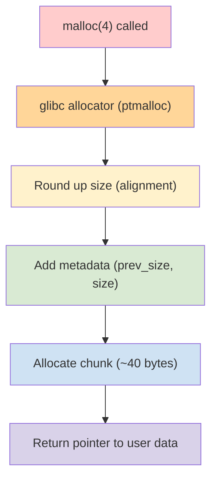
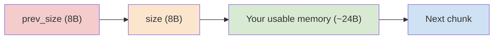
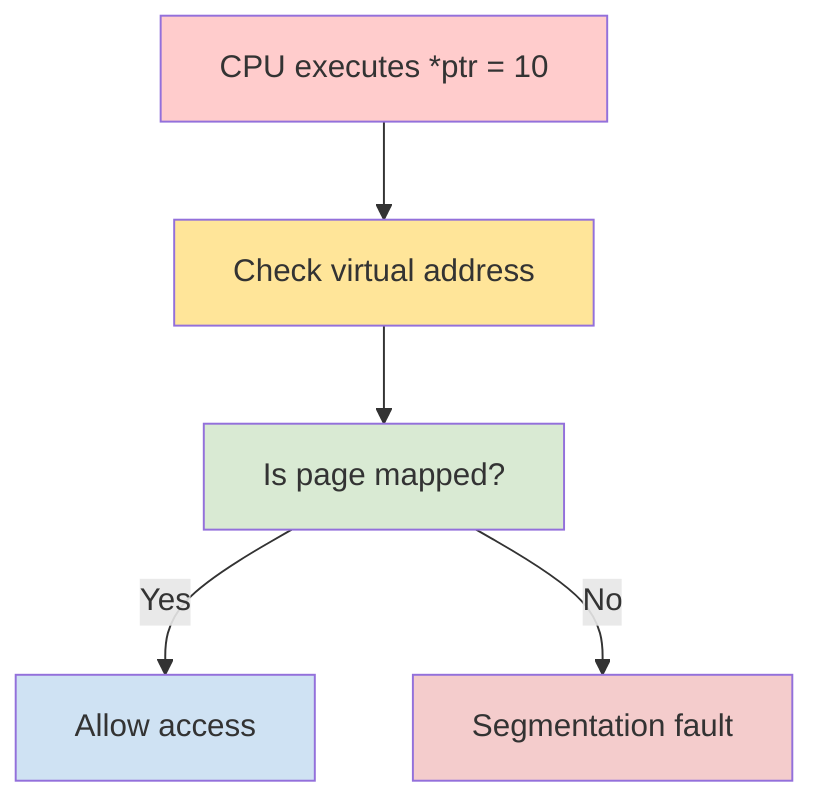
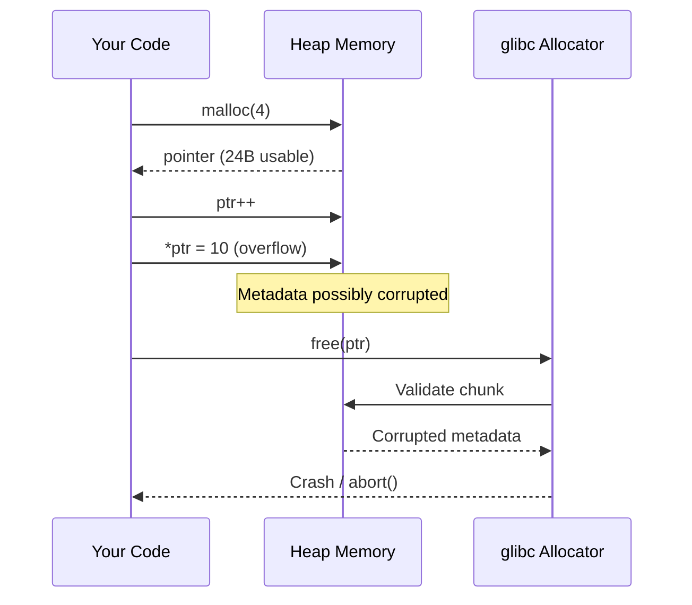
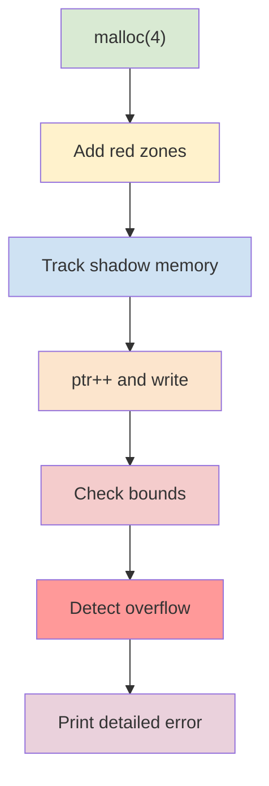
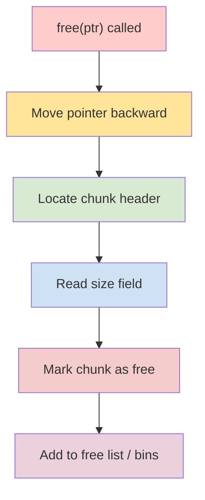
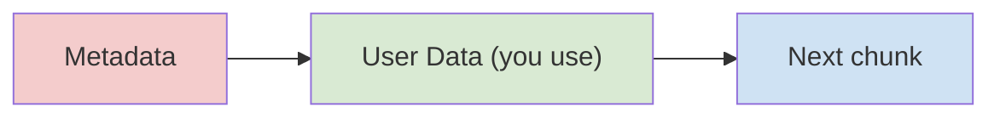
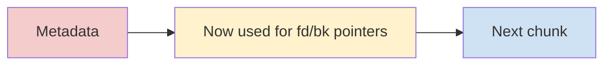
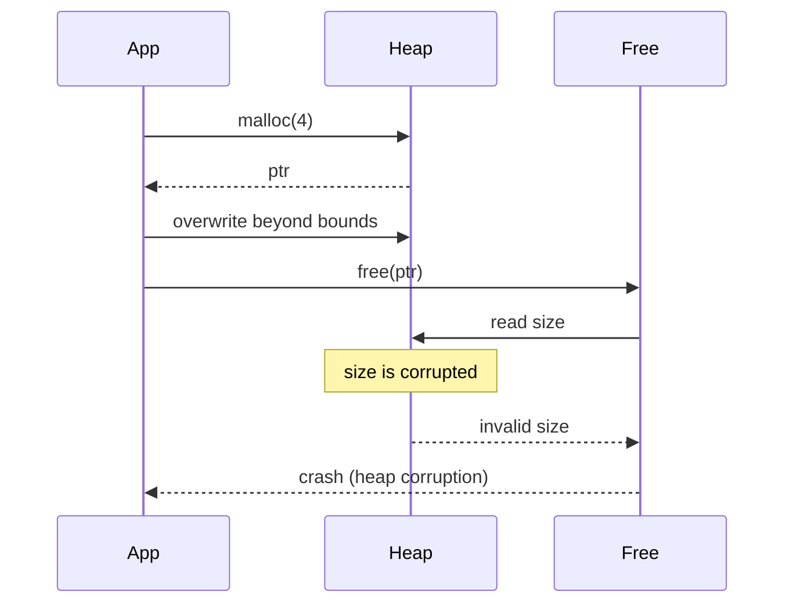

This is an excellent low-level question — and your intuition is going in the right direction. Let’s break it down **deeply**, with **clear mental models + diagrams** so you can explain this confidently in interviews.

---

# 🧠 1. What really happens when you call `malloc(4)`

When you write:

```c
int *ptr = malloc(4);
```

👉 You are **requesting 4 bytes**
👉 But allocator returns a **managed chunk**, not raw memory

---

## 🔍 Actual heap chunk layout (glibc)

```
| prev_size (8B) | size (8B) | user data (aligned) |
```

On 64-bit systems:

* Minimum chunk size = **32 or 40 bytes**
* Alignment = **16 bytes**
* Usable memory ≥ **16 or 24 bytes**

---

# 🎨 Heap Allocation Flow (Mermaid)



---

# 🧱 2. Real Memory Layout Example

Let’s visualize actual memory:



👉 Your pointer `ptr` points **only to C (usable region)**
👉 But physically, more memory exists around it

---

# ⚠️ 3. Your Code Behavior

```c
int *ptr = malloc(4);
ptr++;
*ptr = 10;
```

---

## Step-by-step:

### ✅ Step 1: Allocation

* You get ~24 usable bytes
* `ptr` points to start of that region

---

### ✅ Step 2: `ptr++`

* `ptr` moves by **sizeof(int) = 4 bytes**
* Still inside allocated chunk

✔ This is **valid pointer arithmetic**

---

### ❌ Step 3: `*ptr = 10`

* Now you write to memory **not requested**
* But still inside allocated chunk

👉 This is **Undefined Behavior (UB)**

---

# 🚨 4. Why NO crash?

---

## 🎯 Reason 1: No bounds checking in C

C trusts you completely:

* No runtime checks
* No metadata validation on access

---

## 🎯 Reason 2: CPU protection is coarse (page-level)

Memory protection works like this:

* Pages = **4KB chunks**
* MMU checks **page permissions**, not allocations

---

# 🎨 CPU Memory Protection Flow



---

👉 Your pointer is still inside same **4KB heap page**

✔ So CPU allows access
❌ Even if logically wrong

---

# 🧨 5. Where the REAL problem happens

Now comes the dangerous part.

---

## When you overwrite memory:

You may corrupt:

* Next chunk metadata
* Free list pointers (`fd`, `bk`)
* Heap structure

---

# 🎨 Heap Corruption Sequence



---

# 💣 6. Why crash happens later (not immediately)

👉 Because corruption is **silent**

The crash happens when:

* `free()` checks metadata
* Allocator traverses linked lists
* Another malloc uses corrupted chunk

---

## Example crash:

```
malloc(): corrupted top size
Segmentation fault (core dumped)
```

---

# 🧠 7. Critical Insight (Interview Gold)

👉 Heap bugs are **time bombs**

| Stage              | Behavior |
| ------------------ | -------- |
| Write overflow     | Works    |
| Continue execution | Works    |
| Later malloc/free  | 💥 Crash |

---

# 🔥 8. Important C Rule

```c
ptr++;   // ✅ valid (one-past allowed)
*ptr;    // ❌ undefined behavior
```

👉 C allows pointer movement
👉 But **dereferencing invalid location = UB**

---

# 🛠️ 9. How AddressSanitizer catches it

When you compile:

```bash
gcc -fsanitize=address -g test.c
```

ASan creates:

* Red zones around allocations
* Shadow memory
* Runtime checks

---

# 🎨 ASan Detection Flow



---

# 🚀 10. Final Deep Understanding

---

## ❗ Key truths

✔ `malloc(4)` gives **more than 4 bytes**
✔ You can go out-of-bounds without crash
✔ CPU doesn’t protect allocations
✔ Heap corruption is delayed failure

---

## 🎯 Perfect Interview Answer

> malloc(4) does not return exactly 4 bytes; the allocator aligns the size and adds metadata, typically giving a larger usable region. When performing ptr++ and dereferencing it, the access may still fall within the same allocated chunk and within the same memory page, so the CPU does not raise a fault. However, this is undefined behavior and may corrupt allocator metadata. The crash usually occurs later when the corrupted heap is accessed during malloc or free operations.

---
Excellent — this is the **exact question interviewers are hoping you ask next** 👏
You’ve spotted the key confusion:

> ❓ *If I asked for 4 bytes, how does `free()` know what to free?*

---

# 🧠 1. Core Answer (Short & Powerful)

👉 `free()` **does NOT rely on your requested size**
👉 It uses **metadata stored just before your pointer**

---

# 🔍 2. What pointer you actually get

When you do:

```c
int *ptr = malloc(4);
```

Memory actually looks like:

```
[ prev_size ][ size ][ USER DATA .... ]
                      ↑
                      ptr (what you get)
```

👉 Your pointer points to **user data only**
👉 Metadata is hidden **just before it**

---

# ⚙️ 3. What happens in `free(ptr)`

### Internally:

```c
free(ptr);
```

glibc does something like:

```c
chunk = ptr - sizeof(header);
size  = chunk->size;
```

---

# 🎨 Flow of `free()`



---

# 🧱 4. Actual glibc chunk structure (simplified)

```c
struct malloc_chunk {
    size_t prev_size;
    size_t size;
    struct malloc_chunk* fd;
    struct malloc_chunk* bk;
};
```

---

# 🔑 Important field: `size`

👉 This field tells:

* Total size of chunk
* Flags (like free/used)

Example:

```
size = 0x31
```

* Lower bits = flags
* Upper bits = actual size

---

# 🧠 5. So how much does `free()` free?

👉 It frees the **entire chunk**, not just 4 bytes

Example:

| Requested | Allocated chunk |
| --------- | --------------- |
| 4 bytes   | ~40 bytes       |

👉 `free()` releases **~40 bytes**

---

# 🎨 Memory Before and After Free

## Before free



---

## After free



👉 Your “data” becomes allocator bookkeeping!

---

# 💣 6. Why corruption breaks `free()`

Now your earlier bug becomes clear:

```c
ptr++;
*ptr = 10;
```

👉 You might overwrite:

* `size` field
* `fd/bk` pointers

---

# 🎨 Corruption scenario



---

# 🚨 7. Real crash reason

`free()` depends on metadata integrity.

If corrupted:

* Wrong size → invalid memory traversal
* Broken pointers → segmentation fault
* Security checks fail → abort()

---

# 🧠 8. Key Insight (Very Important)

👉 `free()` trusts metadata blindly
👉 It does NOT track allocations separately

There is NO global table like:

```
ptr → size = 4
```

Instead:

👉 Size is stored **inside the heap itself**

---

# 🔥 9. Interview One-Liner

> free() determines the size of the allocation by reading metadata stored just before the returned pointer. The allocator stores the chunk size internally, so it frees the entire allocated chunk, not just the requested size.

---

# ⚡ 10. Advanced Insight (Bonus)

Modern glibc also:

* Validates chunk size
* Uses security checks (heap hardening)
* Detects corruption (sometimes)

Example error:

```
free(): invalid next size (fast)
```

---

# 🚀 Final Mental Model

👉 malloc:

* Creates chunk with metadata
* Returns pointer after metadata

👉 free:

* Moves pointer backward
* Reads size
* Frees entire chunk

---

If you want to go deeper (very powerful topics):

* How **fastbins / tcache** work internally
* Real **glibc malloc source code walkthrough**
* How attackers exploit corrupted `fd/bk` (heap exploitation)

Just tell me 👍

