# ARMv8 Linux Memory Subsystem — Complete Code Walkthrough (Power-On → System Ready)

> **Architecture**: ARMv8-A (AArch64), 4KB pages, 48-bit VA, 4-level page tables
> **Kernel**: Linux 6.x mainline
> **Scope**: Every function in the memory init path, from CPU reset to `kmalloc()` being usable

---

## Master Call Chain (Quick Reference)

```
CPU RESET
 └─► _head                                          [arch/arm64/kernel/head.S]
      └─► primary_entry
           ├─► preserve_boot_args
           ├─► init_kernel_el                        [arch/arm64/kernel/head.S]
           ├─► __create_page_tables                  [arch/arm64/kernel/head.S]
           │    ├─► create_idmap (identity map)
           │    └─► create_kernel_map (TTBR1 map)
           ├─► __cpu_setup                           [arch/arm64/mm/proc.S]
           └─► __primary_switch                      [arch/arm64/kernel/head.S]
                ├─► __enable_mmu                     [arch/arm64/kernel/head.S]
                └─► __primary_switched               [arch/arm64/kernel/head.S]
                     ├─► set_cpu_boot_mode_flag
                     ├─► __pi_memset (zero BSS)
                     ├─► early_fdt_map                [arch/arm64/kernel/head.S]
                     └─► start_kernel                 [init/main.c]
                          ├─► setup_arch              [arch/arm64/kernel/setup.c]
                          │    ├─► early_fixmap_init   [arch/arm64/mm/fixmap.c]
                          │    ├─► setup_machine_fdt   [arch/arm64/kernel/setup.c]
                          │    │    └─► early_init_dt_scan_nodes [drivers/of/fdt.c]
                          │    │         ├─► early_init_dt_scan_memory
                          │    │         │    └─► memblock_add
                          │    │         └─► early_init_dt_scan_chosen
                          │    ├─► arm64_memblock_init [arch/arm64/mm/init.c]
                          │    │    ├─► memblock_remove (trim unusable)
                          │    │    ├─► memblock_reserve (kernel image)
                          │    │    ├─► memblock_reserve (initrd)
                          │    │    └─► fdt_enforce_memory_region
                          │    ├─► paging_init         [arch/arm64/mm/mmu.c]
                          │    │    ├─► map_kernel      [arch/arm64/mm/mmu.c]
                          │    │    ├─► map_mem         [arch/arm64/mm/mmu.c]
                          │    │    │    └─► __map_memblock
                          │    │    │         └─► __create_pgd_mapping
                          │    │    │              ├─► alloc_init_pud
                          │    │    │              │    ├─► alloc_init_cont_pmd
                          │    │    │              │    │    ├─► alloc_init_pmd
                          │    │    │              │    │    │    └─► alloc_init_cont_pte
                          │    │    │              │    │    │         └─► init_pte
                          │    │    │              │    │    └─► pmd_set_huge (if block map)
                          │    │    │              │    └─► pud_set_huge (if 1GB block)
                          │    │    │              └─► pgd_populate
                          │    │    └─► cpu_replace_ttbr1 (switch to swapper_pg_dir)
                          │    └─► bootmem_init        [arch/arm64/mm/init.c]
                          │         ├─► min/max_pfn calculation
                          │         ├─► zone_sizes_init [arch/arm64/mm/init.c]
                          │         │    └─► free_area_init [mm/page_alloc.c]
                          │         │         ├─► free_area_init_node
                          │         │         │    ├─► alloc_node_mem_map (struct page array)
                          │         │         │    └─► free_area_init_core
                          │         │         │         ├─► init_currently_empty_zone
                          │         │         │         └─► memmap_init
                          │         │         └─► memmap_init_zone
                          │         └─► sparse_init (if SPARSEMEM)
                          └─► mm_core_init             [init/main.c]
                               ├─► mem_init            [arch/arm64/mm/init.c]
                               │    └─► memblock_free_all [mm/memblock.c]
                               │         └─► free_low_memory_core_early
                               │              └─► __free_memory_core
                               │                   └─► __free_pages_memory
                               │                        └─► memblock_free_pages
                               │                             └─► __free_pages
                               │                                  └─► __free_pages_ok
                               │                                       └─► free_one_page
                               │                                            └─► __free_one_page
                               │                                                 [BUDDY ALLOCATOR NOW ACTIVE]
                               ├─► kmem_cache_init     [mm/slub.c]
                               │    ├─► create_boot_cache (kmem_cache self-cache)
                               │    ├─► create_boot_cache (kmem_cache_node cache)
                               │    ├─► register_hotmemory_notifier
                               │    └─► create_kmalloc_caches [mm/slab_common.c]
                               │         └─► create_kmalloc_cache (per-size)
                               │              └─► kmem_cache_create
                               │                   [SLAB/SLUB NOW ACTIVE — kmalloc() is usable]
                               └─► vmalloc_init        [mm/vmalloc.c]
                                    └─► [vmalloc NOW ACTIVE]
```

---

## Phase 1: CPU Reset → Assembly Bootstrap

### 1.1 `_head` — Reset Entry Point
- **File**: `arch/arm64/kernel/head.S`
- **Context**: CPU just powered on. MMU OFF. Caches OFF. Running at physical address.
- **What it does**:
  - Encodes a branch instruction to `primary_entry`
  - Contains the PE/COFF header for UEFI boot compatibility
  - This is address 0x0 of the kernel image

```
_head:
    b    primary_entry       // branch to real entry point
    .long    0               // reserved
    // ... PE/COFF header for UEFI
```

---

### 1.2 `primary_entry` — Kernel Entry
- **File**: `arch/arm64/kernel/head.S`
- **What it does**:
  1. Calls `preserve_boot_args` — saves x0-x3 (bootloader passes DTB address in x0)
  2. Calls `init_kernel_el` — detects exception level (EL2/EL1), drops to EL1 if needed
  3. Calls `__create_page_tables` — builds early page tables
  4. Calls `__cpu_setup` — configures CPU caches, alignment, TCR register
  5. Branches to `__primary_switch` — enables MMU

```
primary_entry:
    bl   preserve_boot_args         // save x0 (DTB phys addr)
    bl   init_kernel_el             // drop to EL1
    adrp x23, __PHYS_OFFSET         // load kernel physical base
    and  x23, x23, MIN_KIMG_ALIGN - 1
    bl   __create_page_tables       // build identity + kernel page tables
    bl   __cpu_setup                // configure MAIR, TCR, etc.
    b    __primary_switch           // enable MMU
```

---

### 1.3 `preserve_boot_args`
- **File**: `arch/arm64/kernel/head.S`
- **What it does**:
  - Saves registers x0–x3 into `boot_args[0..3]` (a static `.bss` array)
  - x0 = physical address of DTB (passed by bootloader / U-Boot / UEFI)
  - These are used later by `setup_machine_fdt()`

---

### 1.4 `init_kernel_el` — Exception Level Setup
- **File**: `arch/arm64/kernel/head.S`
- **What it does**:
  - Reads `CurrentEL` register to determine if running at EL1 or EL2
  - If EL2: configures HCR_EL2, then drops to EL1 via `eret`
  - If EL1: continues directly
  - Returns the boot mode in x0

---

### 1.5 `__create_page_tables` — Build Early Page Tables ⭐
- **File**: `arch/arm64/kernel/head.S`
- **What it does**: Creates TWO sets of page tables in statically allocated `.bss` arrays:
  1. **Identity Map** (TTBR0): Maps the physical address of the kernel 1:1 so code continues running after MMU is enabled
  2. **Kernel Map** (TTBR1): Maps kernel VA (0xFFFF...) → kernel PA

#### Step-by-step:
```
__create_page_tables:
    // 1. Zero out page table memory
    adrp  x0, idmap_pg_dir          // identity map page table base
    adrp  x1, idmap_pg_end
    bl    __pi_memset                // zero it

    adrp  x0, init_pg_dir           // kernel map page table base
    adrp  x1, init_pg_end
    bl    __pi_memset                // zero it

    // 2. Set up TCR_EL1 (Translation Control Register)
    //    - T0SZ/T1SZ: VA size for TTBR0/TTBR1
    //    - Granule size: 4KB

    // 3. Create identity map
    //    Maps: PA of __turn_mmu_on → PA of __turn_mmu_on
    //    So after MMU enable, the PC (which holds PA) still resolves
    adrp  x0, idmap_pg_dir
    adrp  x3, __idmap_text_start
    adrp  x6, __idmap_text_end
    // ... populates PGD → PUD → PMD → PTE entries

    // 4. Create kernel map
    //    Maps: KIMAGE_VADDR → __PHYS_OFFSET (kernel image physical base)
    adrp  x0, init_pg_dir
    mov_q x5, KIMAGE_VADDR
    // ... populates PGD → PUD → PMD → PTE entries

    ret
```

#### Key Data (all in `.bss`, statically sized):
| Symbol | Purpose | Size |
|--------|---------|------|
| `idmap_pg_dir` | Identity map page tables (TTBR0) | Page-aligned array |
| `init_pg_dir` | Initial kernel page tables (TTBR1) | Page-aligned array |
| `swapper_pg_dir` | Final kernel page tables (replaces init_pg_dir later) | Page-aligned array |

---

### 1.6 `__cpu_setup` — CPU Configuration
- **File**: `arch/arm64/mm/proc.S`
- **What it does**:
  - Configures **MAIR_EL1** (Memory Attribute Indirection Register) — defines memory types (normal, device, write-through, etc.)
  - Configures **TCR_EL1** (Translation Control Register) — VA size (48-bit), granule (4KB), ASID size
  - Prepares **SCTLR_EL1** value — will be written when MMU is enabled
  - Does NOT enable MMU yet — just prepares the value

```
__cpu_setup:
    // Configure MAIR
    mov_q  x5, MAIR_EL1_SET
    msr    mair_el1, x5

    // Configure TCR
    mov_q  x10, TCR_TxSZ(VA_BITS) | TCR_CACHE_FLAGS | ...
    msr    tcr_el1, x10

    // Prepare SCTLR value (returned in x0, written later)
    mov_q  x0, INIT_SCTLR_EL1_MMU_ON
    ret
```

---

### 1.7 `__primary_switch` — Enable MMU
- **File**: `arch/arm64/kernel/head.S`
- **What it does**:
  1. Loads `idmap_pg_dir` into **TTBR0_EL1** (identity map for low addresses)
  2. Loads `init_pg_dir` into **TTBR1_EL1** (kernel map for high addresses)
  3. Calls `__enable_mmu` — writes SCTLR_EL1 with M bit set
  4. After MMU is ON, branches to `__primary_switched` (now running at kernel VA)

```
__primary_switch:
    adrp   x1, init_pg_dir
    adrp   x2, idmap_pg_dir
    bl     __enable_mmu            // MMU ON after this
    // Now running at kernel virtual address
    ldr    x8, =__primary_switched
    br     x8                      // branch to kernel VA
```

---

### 1.8 `__enable_mmu`
- **File**: `arch/arm64/kernel/head.S`
- **What it does**:
  - Writes TTBR0_EL1 and TTBR1_EL1 with page table bases
  - Issues `isb` (instruction synchronization barrier)
  - Writes SCTLR_EL1 with MMU enable bit (`SCTLR_ELx_M`)
  - Issues `isb` again — CPU now translating all addresses through page tables

```
__enable_mmu:
    msr    ttbr0_el1, x2           // identity map
    msr    ttbr1_el1, x1           // kernel map
    isb
    msr    sctlr_el1, x0           // MMU ON (M bit set)
    isb
    ret
```

> **After this point**: All memory accesses go through the page tables. The identity map ensures the next few instructions (which the CPU fetches at physical addresses) still resolve correctly.

---

### 1.9 `__primary_switched` — Transition to C
- **File**: `arch/arm64/kernel/head.S`
- **What it does**:
  1. Sets the stack pointer to `init_task`'s stack (statically allocated)
  2. Zeroes the `.bss` section using `__pi_memset`
  3. Stores the physical DTB address for later use
  4. Initializes early FDT mapping via fixmap
  5. **Calls `start_kernel()`** — enters C code, never returns

```
__primary_switched:
    adr_l  x4, init_task            // use init_task's stack
    add    sp, x4, #THREAD_SIZE

    adr_l  x0, __bss_start          // zero BSS
    mov    x1, xzr
    adr_l  x2, __bss_stop
    sub    x2, x2, x0
    bl     __pi_memset

    str_l  x21, __fdt_pointer, x5   // save DTB phys address

    // Map DTB via fixmap so C code can read it
    bl     early_fdt_map

    b      start_kernel             // >>> ENTER C CODE <<<
```

---

## Phase 2: Early C — `start_kernel()` → `setup_arch()`

### 2.1 `start_kernel()` — Main Kernel Entry (C)
- **File**: `init/main.c`
- **What it does**: Orchestrates ALL kernel initialization. For memory, the key calls are:

```c
void start_kernel(void)
{
    // ... early init (lockdep, cgroups, etc.)
    setup_arch(&command_line);          // <<< architecture-specific init
    // ... scheduler, IRQs, timers, etc.
    mm_core_init();                     // <<< memory allocators finalized
    // ... rest of kernel init
    rest_init();                        // creates init process
}
```

---

### 2.2 `setup_arch()` — Architecture Init
- **File**: `arch/arm64/kernel/setup.c`
- **What it does**: Initializes all ARM64-specific subsystems. For memory:

```c
void __init setup_arch(char **cmdline_p)
{
    // 1. Set up fixmap for early mappings
    early_fixmap_init();

    // 2. Parse Device Tree → discover physical memory
    setup_machine_fdt(__fdt_pointer);

    // 3. Parse kernel command line (memmap=, mem=, etc.)
    parse_early_param();

    // 4. Initialize memblock allocator with discovered memory
    arm64_memblock_init();

    // 5. Create full page tables for all RAM
    paging_init();

    // 6. Prepare zones for buddy allocator
    bootmem_init();
}
```

---

### 2.3 `early_fixmap_init()` — Fixmap Setup
- **File**: `arch/arm64/mm/fixmap.c`
- **What it does**:
  - Creates **fixmap** entries — compile-time-known virtual addresses for early I/O
  - Needed to map DTB, early console (earlycon), and other hardware BEFORE full paging is up
  - Populates a few PGD/PUD/PMD entries in `init_pg_dir` for the fixmap region
  - After this, `set_fixmap_*()` can be used to temporarily map physical pages at fixed VAs

```c
void __init early_fixmap_init(void)
{
    pgd_t *pgdp = pgd_offset_k(FIXADDR_TOT_START);
    p4d_t *p4dp = p4d_offset(pgdp, FIXADDR_TOT_START);

    // Allocate PUD/PMD from static bm_pud/bm_pmd arrays (in .bss)
    pud_t *pudp = fixmap_pud(FIXADDR_TOT_START);
    pmd_t *pmdp = fixmap_pmd(FIXADDR_TOT_START);

    // These use statically allocated arrays — NO allocator needed
    pud_populate(&init_mm, pudp, bm_pmd);
    pmd_populate_kernel(&init_mm, pmdp, bm_pte);
}
```

> **Key insight**: Fixmap page tables use pre-allocated `.bss` arrays (`bm_pud`, `bm_pmd`, `bm_pte`), so no memory allocator is needed yet.

---

### 2.4 `setup_machine_fdt()` — Parse Device Tree (DTB)
- **File**: `arch/arm64/kernel/setup.c`
- **What it does**:
  - Maps the DTB via fixmap so it can be read
  - Calls DTB parsing functions to discover system memory
  - This is how the kernel learns "how much RAM exists and at what addresses"

```c
static void __init setup_machine_fdt(phys_addr_t dt_phys)
{
    // Map DTB physical address via fixmap
    void *dt_virt = fixmap_remap_fdt(dt_phys, &size, PAGE_KERNEL);

    // Validate DTB header
    if (!dt_virt || fdt_check_header(dt_virt))
        // ... panic or use built-in DTB

    // Scan DTB nodes
    early_init_dt_scan_nodes();

    // Unmap DTB fixmap
}
```

---

### 2.5 `early_init_dt_scan_nodes()` — Scan DTB Nodes
- **File**: `drivers/of/fdt.c`
- **What it does**: Walks the flattened device tree and calls handlers for specific nodes

```c
void __init early_init_dt_scan_nodes(void)
{
    // 1. Find /chosen node → kernel command line, initrd location
    of_scan_flat_dt(early_init_dt_scan_chosen, boot_command_line);

    // 2. Find root node → #address-cells, #size-cells
    of_scan_flat_dt(early_init_dt_scan_root, NULL);

    // 3. Find /memory nodes → register with memblock
    of_scan_flat_dt(early_init_dt_scan_memory, NULL);
}
```

---

### 2.6 `early_init_dt_scan_memory()` — Register RAM Regions
- **File**: `drivers/of/fdt.c`
- **What it does**: For each `/memory` node in the DTB, reads `reg` property (base + size pairs) and calls `memblock_add()`

```c
int __init early_init_dt_scan_memory(unsigned long node, ...)
{
    // Read "device_type" property — must be "memory"
    type = of_get_flat_dt_prop(node, "device_type", NULL);
    if (strcmp(type, "memory") != 0)
        return 0;

    // Read "reg" property — array of (base, size) pairs
    reg = of_get_flat_dt_prop(node, "reg", &l);

    while ((endp - reg) >= (dt_root_addr_cells + dt_root_size_cells)) {
        base = dt_mem_next_cell(dt_root_addr_cells, &reg);
        size = dt_mem_next_cell(dt_root_size_cells, &reg);

        // >>> Register this RAM region with memblock <<<
        early_init_dt_add_memory_arch(base, size);
        //   └─► memblock_add(base, size);
    }
}
```

**Example DTB memory node:**
```dts
memory@40000000 {
    device_type = "memory";
    reg = <0x0 0x40000000 0x0 0x80000000>;  // 2GB at 0x4000_0000
};
```

---

### 2.7 `memblock_add()` — Register a Memory Region
- **File**: `mm/memblock.c`
- **What it does**: Adds a region to the `memblock.memory` array

```c
int __init_memblock memblock_add(phys_addr_t base, phys_addr_t size)
{
    return memblock_add_range(&memblock.memory, base, size,
                              MAX_NUMNODES, 0);
}
```

- Internally calls `memblock_add_range()` which:
  1. Checks for overlapping regions
  2. Merges adjacent regions
  3. Inserts new region into sorted array
  4. Grows the array if needed (using `memblock_double_array()`)

---

### 2.8 `arm64_memblock_init()` — ARM64 Memblock Setup
- **File**: `arch/arm64/mm/init.c`
- **What it does**: After DTB parsing populated `memblock.memory`, this function trims and reserves regions

```c
void __init arm64_memblock_init(void)
{
    // 1. Limit memory to what the VA space can address
    //    (remove anything above the addressable limit)
    memblock_remove(1ULL << PHYS_MASK_SHIFT, ULLONG_MAX);

    // 2. Enforce linear region size limit
    memblock_remove(linear_region_size, ULLONG_MAX);

    // 3. Handle 'mem=' kernel command line parameter
    if (memory_limit != PHYS_ADDR_MAX)
        memblock_mem_limit_remove_map(memory_limit);

    // 4. Reserve the kernel image itself
    memblock_reserve(__pa_symbol(_stext), _end - _stext);

    // 5. Reserve the initrd (initial ramdisk) if present
    if (IS_ENABLED(CONFIG_BLK_DEV_INITRD) && phys_initrd_size) {
        memblock_reserve(phys_initrd_start, phys_initrd_size);
    }

    // 6. Reserve the DTB
    early_init_fdt_reserve_self();

    // 7. Reserve any /reserved-memory nodes from DTB
    early_init_fdt_scan_reserved_mem();

    // 8. Mark high memory (if any)
    high_memory = __va(memblock_end_of_DRAM() - 1) + 1;
}
```

#### After `arm64_memblock_init()`, memblock state looks like:
```
memblock.memory:    [0x4000_0000 — 0xBFFF_FFFF]  (2GB RAM)

memblock.reserved:  [0x4008_0000 — 0x41FF_FFFF]  (kernel image)
                    [0x4200_0000 — 0x420F_FFFF]  (DTB)
                    [0x4800_0000 — 0x4FFF_FFFF]  (initrd)
```

---

### 2.9 `memblock_reserve()` — Mark Memory as Reserved
- **File**: `mm/memblock.c`
- **What it does**: Adds a region to `memblock.reserved` array — prevents it from being allocated

```c
int __init_memblock memblock_reserve(phys_addr_t base, phys_addr_t size)
{
    return memblock_add_range(&memblock.reserved, base, size,
                              MAX_NUMNODES, 0);
}
```

---

### 2.10 `memblock_alloc()` — Early Memory Allocation
- **File**: `mm/memblock.c`
- **What it does**: Finds a free gap (in `memory` but not in `reserved`), marks it reserved, returns VA

```c
void * __init memblock_alloc(phys_addr_t size, phys_addr_t align)
{
    return memblock_alloc_try_nid(size, align, MEMBLOCK_LOW_LIMIT,
                                  MEMBLOCK_ALLOC_ACCESSIBLE,
                                  NUMA_NO_NODE);
}
```

**Internal flow:**
```
memblock_alloc()
 └─► memblock_alloc_try_nid()
      └─► memblock_alloc_range_nid()
           ├─► memblock_find_in_range_node()  // scan for free gap
           │    └─► for_each_free_mem_range_reverse()
           │         // iterates memory regions, skipping reserved ones
           │         // returns first gap that fits (size, align)
           ├─► memblock_reserve(found, size)   // mark as reserved
           └─► phys_to_virt(found)             // return virtual address
```

> **Key**: This is O(N) per allocation — fine for boot, terrible for runtime. That's why buddy takes over later.

---

## Phase 3: Full Paging — `paging_init()`

### 3.1 `paging_init()` — Create Full Page Tables
- **File**: `arch/arm64/mm/mmu.c`
- **What it does**: Replaces the minimal `init_pg_dir` with full `swapper_pg_dir` mapping ALL of RAM

```c
void __init paging_init(void)
{
    // 1. Set up page table allocation from memblock
    pgd_set_fixmap(FIXADDR_TOP);

    // 2. Map the kernel image (text, rodata, data, bss)
    map_kernel(swapper_pg_dir);

    // 3. Map all physical memory into the kernel linear region
    map_mem(swapper_pg_dir);

    // 4. Switch TTBR1 from init_pg_dir → swapper_pg_dir
    cpu_replace_ttbr1(lm_alias(swapper_pg_dir), init_idmap_pg_dir);

    // init_pg_dir is no longer used
    memblock_free(init_pg_dir, ...);
}
```

---

### 3.2 `map_kernel()` — Map Kernel Image
- **File**: `arch/arm64/mm/mmu.c`
- **What it does**: Creates page table entries for each kernel section with appropriate permissions

```c
static void __init map_kernel(pgd_t *pgdp)
{
    // Map text as read-only + executable
    map_kernel_segment(pgdp, _stext, _etext, PAGE_KERNEL_ROX, ...);

    // Map rodata as read-only
    map_kernel_segment(pgdp, __start_rodata, __inittext_begin, PAGE_KERNEL_RO, ...);

    // Map init section (freed later)
    map_kernel_segment(pgdp, __inittext_begin, __inittext_end, PAGE_KERNEL_ROX, ...);
    map_kernel_segment(pgdp, __initdata_begin, __initdata_end, PAGE_KERNEL, ...);

    // Map data + bss as read-write
    map_kernel_segment(pgdp, _sdata, _end, PAGE_KERNEL, ...);
}
```

---

### 3.3 `map_mem()` — Map All Physical Memory
- **File**: `arch/arm64/mm/mmu.c`
- **What it does**: Creates the **kernel linear map** — maps ALL physical RAM at `PAGE_OFFSET`

```c
static void __init map_mem(pgd_t *pgdp)
{
    // Iterate every memblock.memory region
    for_each_mem_range(i, &start, &end) {
        if (start >= end)
            continue;

        // Map this physical range into kernel VA space
        __map_memblock(pgdp, start, end, PAGE_KERNEL, flags);
    }
}
```

---

### 3.4 `__map_memblock()` — Map One Memory Region
- **File**: `arch/arm64/mm/mmu.c`
- **What it does**: Calls the page table creation machinery for one physical range

```c
static void __init __map_memblock(pgd_t *pgdp,
    phys_addr_t start, phys_addr_t end,
    pgprot_t prot, int flags)
{
    __create_pgd_mapping(pgdp,
        start,                       // physical address
        __phys_to_virt(start),       // virtual address (PAGE_OFFSET + start)
        end - start,                 // size
        prot, flags);
}
```

---

### 3.5 `__create_pgd_mapping()` → Page Table Walk
- **File**: `arch/arm64/mm/mmu.c`
- **What it does**: Walks/creates all 4 levels of page tables

```c
static void __create_pgd_mapping(pgd_t *pgdir, phys_addr_t phys,
    unsigned long virt, phys_addr_t size, pgprot_t prot, int flags)
{
    // Get PGD entry for this VA
    pgd_t *pgdp = pgd_offset_pgd(pgdir, virt);

    do {
        // Allocate/init PUD level
        alloc_init_pud(pgdp, virt, next, phys, prot, flags);

        phys += next - virt;
    } while (pgdp++, virt = next, virt != end);
}
```

#### 4-Level Walk:
```
__create_pgd_mapping()
 └─► alloc_init_pud()              // Level 1: PGD → PUD
      └─► alloc_init_cont_pmd()    // Level 2: PUD → PMD
           └─► alloc_init_pmd()    // Level 2 (continued)
                └─► alloc_init_cont_pte()  // Level 3: PMD → PTE
                     └─► init_pte()         // Level 4: PTE → Physical Page
```

#### VA Breakdown (48-bit, 4KB pages):
```
 63       48 47      39 38      30 29      21 20      12 11       0
┌──────────┬──────────┬──────────┬──────────┬──────────┬──────────┐
│  1s or 0s│  PGD idx │  PUD idx │  PMD idx │  PTE idx │  Offset  │
│  (TTBR)  │  9 bits  │  9 bits  │  9 bits  │  9 bits  │  12 bits │
└──────────┴──────────┴──────────┴──────────┴──────────┴──────────┘
    16 bits     512       512       512       512        4096
               entries   entries   entries   entries    bytes/page
```

---

### 3.6 `cpu_replace_ttbr1()` — Switch to Final Page Tables
- **File**: `arch/arm64/mm/proc.S`
- **What it does**: Atomically replaces `init_pg_dir` (TTBR1) with `swapper_pg_dir`
  - After this, the kernel is running on its final page tables
  - `init_pg_dir` memory is freed back to memblock

---

## Phase 4: Buddy Allocator Initialization

### 4.1 `bootmem_init()` — Prepare Buddy System
- **File**: `arch/arm64/mm/init.c`
- **What it does**: Calculates memory bounds, sets up zones

```c
void __init bootmem_init(void)
{
    // 1. Find the lowest and highest PFN (Page Frame Number)
    min_pfn = PFN_UP(memblock_start_of_DRAM());
    max_pfn = PFN_DOWN(memblock_end_of_DRAM());
    max_low_pfn = max_pfn;   // ARM64 has no highmem

    // 2. Initialize memory model (sparse or flat)
    early_memtest(min_pfn << PAGE_SHIFT, max_pfn << PAGE_SHIFT);

    // 3. Set up memory zones
    zone_sizes_init();

    // 4. If SPARSEMEM, initialize sparse sections
    sparse_init();
}
```

---

### 4.2 `zone_sizes_init()` — Define Memory Zones
- **File**: `arch/arm64/mm/init.c`
- **What it does**: Calculates the size of each zone and calls `free_area_init()`

```c
static void __init zone_sizes_init(void)
{
    unsigned long max_zone_pfns[MAX_NR_ZONES];

    memset(max_zone_pfns, 0, sizeof(max_zone_pfns));

    // ZONE_DMA: first 1GB (for 32-bit DMA-capable devices)
    max_zone_pfns[ZONE_DMA]    = PFN_DOWN(arm64_dma_phys_limit);

    // ZONE_DMA32: first 4GB
    max_zone_pfns[ZONE_DMA32]  = PFN_DOWN(arm64_dma32_phys_limit);

    // ZONE_NORMAL: everything else
    max_zone_pfns[ZONE_NORMAL] = max_pfn;

    free_area_init(max_zone_pfns);
}
```

**ARM64 Zone Layout (example 4GB system @ 0x4000_0000):**
```
0x4000_0000 ─────── ZONE_DMA (up to 1GB)
0x8000_0000 ─────── ZONE_DMA32 (up to 4GB)
0xC000_0000 ─────── ZONE_NORMAL (rest)
```

---

### 4.3 `free_area_init()` — Initialize All Zones
- **File**: `mm/page_alloc.c`
- **What it does**: For each NUMA node, creates zone structures and `struct page` array

```c
void __init free_area_init(unsigned long *max_zone_pfn)
{
    // Calculate zone boundaries
    // ...

    for_each_online_node(nid) {
        free_area_init_node(nid);
    }
}
```

---

### 4.4 `free_area_init_node()` → `free_area_init_core()`
- **File**: `mm/page_alloc.c`
- **What it does**:
  1. `alloc_node_mem_map()` — allocates the `struct page` array for this node (from memblock)
  2. `free_area_init_core()` — initializes each zone's free lists and page descriptors

```c
// For each zone:
static void __init free_area_init_core(struct pglist_data *pgdat)
{
    for (j = 0; j < MAX_NR_ZONES; j++) {
        struct zone *zone = pgdat->node_zones + j;

        // Initialize zone lock, free_area lists, watermarks
        zone_init_internals(zone, j, nid, 0);

        // Initialize per-page descriptors
        if (zone->spanned_pages) {
            memmap_init_zone(zone);
        }
    }
}
```

---

### 4.5 `memmap_init_zone()` — Initialize `struct page` Array
- **File**: `mm/page_alloc.c`
- **What it does**: Sets initial state for every `struct page` in the zone

```c
void __init memmap_init_zone(struct zone *zone)
{
    for (pfn = start_pfn; pfn < end_pfn; pfn++) {
        struct page *page = pfn_to_page(pfn);

        __init_single_page(page, pfn, zone_idx, nid);
        // Sets:
        //   page->flags = zone | node | section
        //   page->_refcount = 1
        //   INIT_LIST_HEAD(&page->lru)
        //   page->_mapcount = -1

        // Mark as reserved (buddy will free them later)
        if (context == MEMINIT_EARLY)
            __SetPageReserved(page);
    }
}
```

> **At this point**: Zone structures and `struct page` arrays exist, but all pages are marked Reserved. The buddy free lists are EMPTY. No allocation is possible yet.

---

### 4.6 `mm_core_init()` — Finalize Memory Allocators
- **File**: `init/main.c`
- **What it does**: Called after `setup_arch()` returns. Activates buddy + slab.

```c
static void __init mm_core_init(void)
{
    // ... report kernel layout

    // >>> ACTIVATE BUDDY ALLOCATOR <<<
    mem_init();

    // >>> ACTIVATE SLAB ALLOCATOR <<<
    kmem_cache_init();

    // >>> ACTIVATE VMALLOC <<<
    vmalloc_init();
}
```

---

### 4.7 `mem_init()` — Buddy Allocator Activation ⭐
- **File**: `arch/arm64/mm/init.c`
- **What it does**: Hands all free memblock memory to the buddy allocator

```c
void __init mem_init(void)
{
    // This is THE moment — memblock hands off to buddy
    memblock_free_all();

    // After this, page allocator is functional
    mem_init_print_info(NULL);
}
```

---

### 4.8 `memblock_free_all()` — The Great Handoff ⭐
- **File**: `mm/memblock.c`
- **What it does**: Iterates ALL memblock memory regions, frees non-reserved pages to buddy

```c
void __init memblock_free_all(void)
{
    unsigned long pages;

    // Reset struct page fields for reserved pages
    reset_all_zones_managed_pages();

    // Free all non-reserved memory to buddy
    pages = free_low_memory_core_early();

    // Count total free pages
    totalram_pages_add(pages);
}
```

---

### 4.9 `free_low_memory_core_early()` — Free Pages to Buddy
- **File**: `mm/memblock.c`
- **What it does**: Walks memblock, finds all free (non-reserved) ranges, frees them

```c
static unsigned long __init free_low_memory_core_early(void)
{
    unsigned long count = 0;

    // For each free range (memory minus reserved)
    for_each_free_mem_range(i, NUMA_NO_NODE, flags, &start, &end, NULL) {
        // Free these pages to buddy
        count += __free_memory_core(start, end);
    }
    return count;
}
```

---

### 4.10 `__free_memory_core()` → `__free_pages()` → `__free_one_page()` — Into Buddy
- **File**: `mm/memblock.c` → `mm/page_alloc.c`
- **What it does**: The actual insertion into buddy free lists

```
__free_memory_core(start, end)
 └─► __free_pages_memory(start_pfn, nr_pages)
      └─► memblock_free_pages(pfn_to_page(pfn), pfn, order)
           └─► __free_pages_core(page, order)
                └─► __free_pages_ok(page, order)
                     └─► free_one_page(zone, page, pfn, order)
                          └─► __free_one_page(page, pfn, order, zone)
```

### 4.11 `__free_one_page()` — Buddy Merge Algorithm ⭐
- **File**: `mm/page_alloc.c`
- **What it does**: Adds a page block to the free list, merging with buddies

```c
static void __free_one_page(struct page *page,
    unsigned long pfn, unsigned int order, struct zone *zone)
{
    while (order < MAX_ORDER) {
        // Find buddy page
        unsigned long buddy_pfn = pfn ^ (1 << order);
        struct page *buddy = page + (buddy_pfn - pfn);

        // Can we merge with buddy?
        if (!page_is_buddy(page, buddy, order))
            break;  // buddy not free or different order, stop

        // Remove buddy from its current free list
        del_page_from_free_list(buddy, zone, order);

        // Merge: use lower pfn as combined block
        pfn = pfn & ~(1 << order);
        page = pfn_to_page(pfn);
        order++;    // combined block is one order higher
    }

    // Add merged block to free list
    add_to_free_list(page, zone, order);
    zone->free_area[order].nr_free++;
}
```

> **After `memblock_free_all()`**: `alloc_pages()` and `free_pages()` work. The buddy allocator is LIVE.

---

## Phase 5: Slab/SLUB Allocator Initialization

### 5.1 `kmem_cache_init()` — Bootstrap Slab ⭐
- **File**: `mm/slub.c`
- **What it does**: Solves the chicken-and-egg problem: slab needs `kmem_cache` objects, but `kmem_cache` objects need slab to allocate them

```c
void __init kmem_cache_init(void)
{
    // Phase 1: Use static (boot) caches to bootstrap
    // kmem_cache_node and kmem_cache are statically allocated

    // 1. Create the cache for kmem_cache_node objects
    static struct kmem_cache boot_kmem_cache_node;
    kmem_cache_node = create_boot_cache(&boot_kmem_cache_node,
        "kmem_cache_node", sizeof(struct kmem_cache_node), ...);

    // 2. Create the cache for kmem_cache objects (self-referential!)
    static struct kmem_cache boot_kmem_cache;
    kmem_cache = create_boot_cache(&boot_kmem_cache,
        "kmem_cache", sizeof(struct kmem_cache), ...);

    // Phase 2: Create all kmalloc caches
    create_kmalloc_caches(KMALLOC_RECLAIM);

    // Phase 3: Replace boot caches with real slab-allocated ones
    // (the static boot caches are now replaced by dynamically allocated ones)

    // >>> kmalloc() / kfree() are now fully functional <<<
}
```

---

### 5.2 `create_boot_cache()` — Static Cache Init
- **File**: `mm/slub.c`
- **What it does**: Initializes a `kmem_cache` struct that was statically allocated (in `.bss`)

```c
static struct kmem_cache * __init create_boot_cache(
    struct kmem_cache *s, const char *name,
    unsigned int size, slab_flags_t flags)
{
    s->name  = name;
    s->size  = ALIGN(size, sizeof(void *));
    s->object_size = size;

    // Calculate slab layout: objects per slab, etc.
    __kmem_cache_create(s, flags);

    // Add to global slab cache list
    list_add(&s->list, &slab_caches);

    return s;
}
```

---

### 5.3 `create_kmalloc_caches()` — Size Caches
- **File**: `mm/slab_common.c`
- **What it does**: Creates one `kmem_cache` per power-of-2 size

```c
void __init create_kmalloc_caches(slab_flags_t flags)
{
    // Create caches: kmalloc-8, kmalloc-16, kmalloc-32, ...
    //                kmalloc-64, kmalloc-128, ... kmalloc-8192
    for (i = KMALLOC_SHIFT_LOW; i <= KMALLOC_SHIFT_HIGH; i++) {
        if (!kmalloc_caches[KMALLOC_NORMAL][i]) {
            kmalloc_caches[KMALLOC_NORMAL][i] =
                create_kmalloc_cache(
                    kmalloc_info[i].name,
                    kmalloc_info[i].size, flags);
        }
    }

    // Also create DMA and reclaim variants
    // kmalloc-cg-* for cgroup accounting
}
```

---

### 5.4 `kmalloc()` — The End-User API (Now Working!)
- **File**: `include/linux/slab.h` → `mm/slub.c`
- **Call flow** (after init):

```
kmalloc(size, GFP_KERNEL)
 └─► __kmalloc()
      └─► slab_alloc_node()
           ├─► [FAST PATH] try cpu freelist → return object pointer
           ├─► [SLOW PATH] try page freelist → return object pointer
           └─► [SLOWEST]   allocate new slab page from buddy
                └─► allocate_slab()
                     └─► alloc_pages(gfp, order)
                          └─► [buddy allocator]
```

---

### 5.5 `vmalloc_init()` — Virtual Memory Allocator
- **File**: `mm/vmalloc.c`
- **What it does**: Initializes the vmalloc subsystem for virtually-contiguous but physically-scattered allocations
- After this, `vmalloc()` / `vfree()` are usable

---

## Complete Allocator Availability Timeline

```mermaid
gantt
    title Memory Allocator Availability During Boot
    dateFormat X
    axisFormat %s

    section Phase 1 (ASM)
    Static .bss only               :a1, 0, 1

    section Phase 2 (Early C)
    Fixmap available               :a2, 1, 2
    memblock_alloc() available     :a3, 2, 5

    section Phase 3 (Paging)
    Full page tables + memblock    :a4, 3, 5

    section Phase 4 (Buddy)
    alloc_pages() / free_pages()   :a5, 5, 8

    section Phase 5 (Slab)
    kmalloc() / kfree()            :a6, 6, 8
    vmalloc() / vfree()            :a7, 7, 8
```



---

## Summary: What Each Key Function Does

| # | Function | File | Purpose |
|---|----------|------|---------|
| 1 | `_head` | head.S | Reset vector, branch to entry |
| 2 | `primary_entry` | head.S | Save boot args, detect EL, create page tables |
| 3 | `preserve_boot_args` | head.S | Save DTB address from bootloader |
| 4 | `init_kernel_el` | head.S | Detect/drop exception level |
| 5 | `__create_page_tables` | head.S | Build identity + kernel page tables |
| 6 | `__cpu_setup` | proc.S | Configure MAIR, TCR, prepare SCTLR |
| 7 | `__primary_switch` | head.S | Load TTBRs, enable MMU |
| 8 | `__enable_mmu` | head.S | Write SCTLR_EL1 M-bit |
| 9 | `__primary_switched` | head.S | Set stack, zero BSS, jump to C |
| 10 | `start_kernel` | init/main.c | Main kernel init orchestrator |
| 11 | `setup_arch` | setup.c | ARM64 arch-specific init |
| 12 | `early_fixmap_init` | fixmap.c | Static fixmap page table entries |
| 13 | `setup_machine_fdt` | setup.c | Map + parse DTB |
| 14 | `early_init_dt_scan_nodes` | fdt.c | Walk DTB nodes |
| 15 | `early_init_dt_scan_memory` | fdt.c | Find /memory nodes → memblock_add |
| 16 | `memblock_add` | memblock.c | Register RAM region |
| 17 | `arm64_memblock_init` | init.c | Trim + reserve kernel/initrd/DTB |
| 18 | `memblock_reserve` | memblock.c | Mark region as reserved |
| 19 | `memblock_alloc` | memblock.c | Early allocation (linear scan) |
| 20 | `paging_init` | mmu.c | Create full swapper_pg_dir |
| 21 | `map_kernel` | mmu.c | Map kernel text/data/bss |
| 22 | `map_mem` | mmu.c | Map all RAM (linear map) |
| 23 | `__map_memblock` | mmu.c | Map one memblock region |
| 24 | `__create_pgd_mapping` | mmu.c | 4-level page table walk/create |
| 25 | `alloc_init_pud` | mmu.c | Create PUD entries |
| 26 | `alloc_init_pmd` | mmu.c | Create PMD entries |
| 27 | `init_pte` | mmu.c | Create PTE entries (leaf) |
| 28 | `cpu_replace_ttbr1` | proc.S | Switch to swapper_pg_dir |
| 29 | `bootmem_init` | init.c | Calculate PFN bounds, init zones |
| 30 | `zone_sizes_init` | init.c | Define DMA/NORMAL/MOVABLE zones |
| 31 | `free_area_init` | page_alloc.c | Create zone structs + page arrays |
| 32 | `free_area_init_core` | page_alloc.c | Init free lists + page descriptors |
| 33 | `memmap_init_zone` | page_alloc.c | Init every struct page |
| 34 | `mm_core_init` | init/main.c | Activate buddy + slab + vmalloc |
| 35 | `mem_init` | init.c | Call memblock_free_all |
| 36 | `memblock_free_all` | memblock.c | Free all non-reserved to buddy |
| 37 | `free_low_memory_core_early` | memblock.c | Walk free ranges, free pages |
| 38 | `__free_one_page` | page_alloc.c | Insert into buddy free list + merge |
| 39 | `kmem_cache_init` | slub.c | Bootstrap slab caches |
| 40 | `create_boot_cache` | slub.c | Init static kmem_cache |
| 41 | `create_kmalloc_caches` | slab_common.c | Create kmalloc-8..kmalloc-8192 |
| 42 | `vmalloc_init` | vmalloc.c | Enable vmalloc subsystem |

---

## End State
After all 42 functions complete:
- **`alloc_pages()` / `free_pages()`** — working (buddy)
- **`kmalloc()` / `kfree()`** — working (slab)
- **`vmalloc()` / `vfree()`** — working (vmalloc)
- **`ioremap()`** — working (via vmalloc + page tables)
- The kernel can allocate and free memory of any size, at any time.
