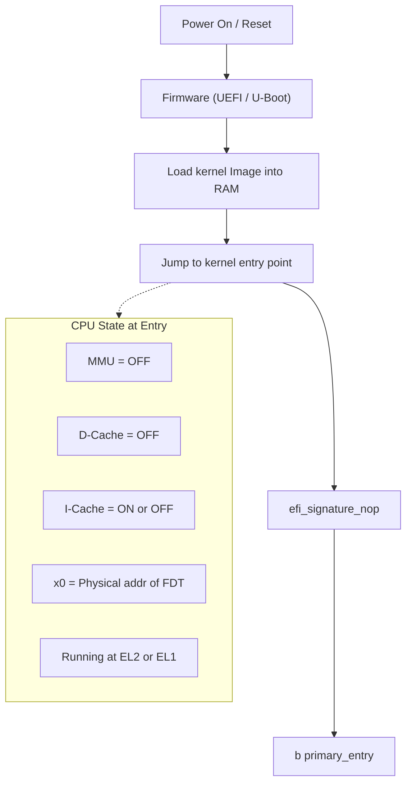
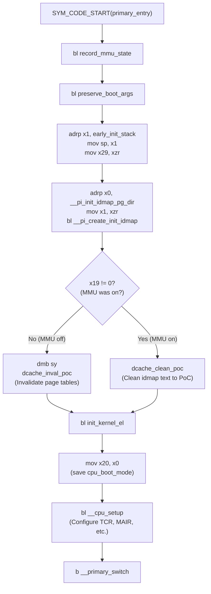
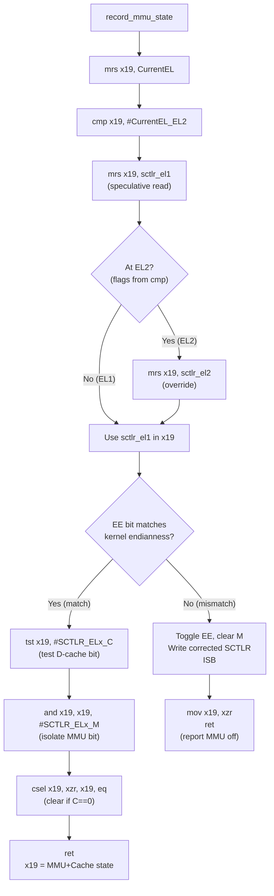
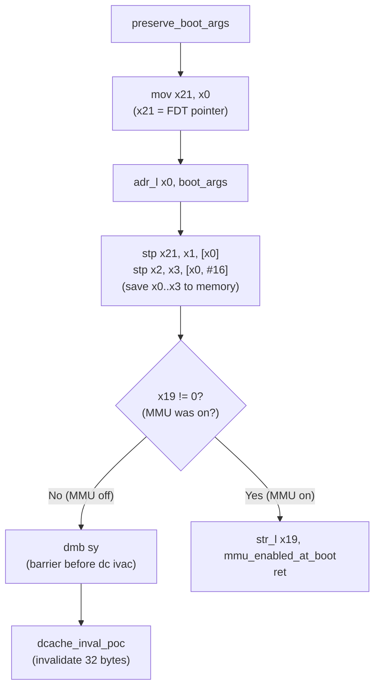
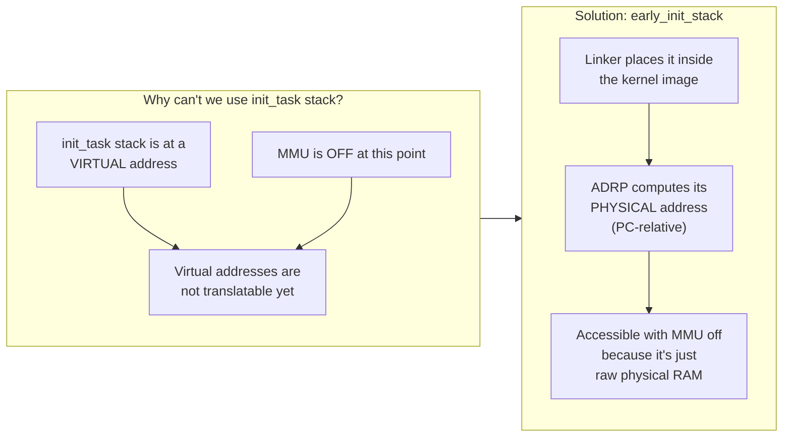
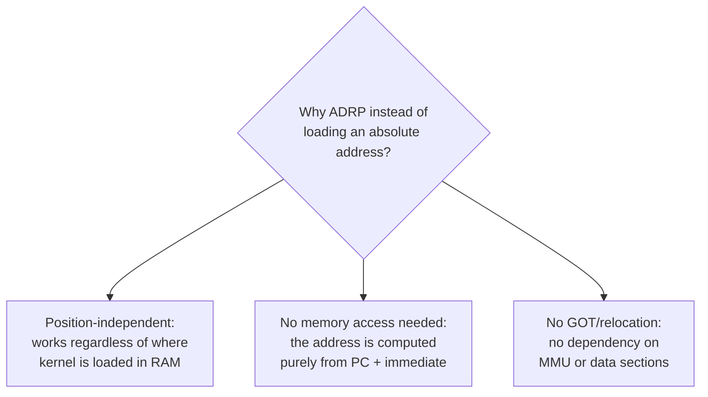
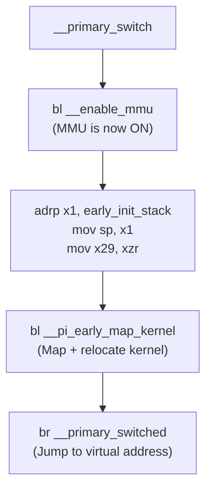
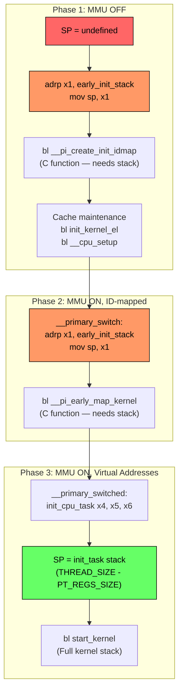
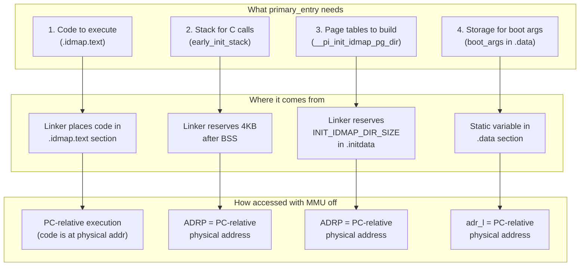

# ARM64 Linux Kernel — `primary_entry` Boot Flow

## Reference
- **Source**: `arch/arm64/kernel/head.S`
- **Linker Script**: `arch/arm64/kernel/vmlinux.lds.S`
- **Architecture**: ARMv8-A (AArch64)

---

## 1. High-Level Boot Flow (Bootloader → `primary_entry`)



### Entry Conditions
| Register / State | Value | Source |
|---|---|---|
| `x0` | Physical address of Device Tree Blob (FDT) | Bootloader |
| `x1 - x3` | Bootloader-specific (saved for debug) | Bootloader |
| `MMU` | OFF (normal boot) or ON (EFI boot) | Firmware |
| `D-cache` | OFF (normal boot) or ON (EFI boot) | Firmware |
| `CurrentEL` | EL2 (hypervisor) or EL1 (bare metal) | Firmware |

---

## 2. `primary_entry` — Complete Execution Flow



---

## 3. Register Allocation Through Boot Path

| Register | Scope | Purpose |
|---|---|---|
| `x19` | `primary_entry()` → `start_kernel()` | MMU state at entry: `0` = MMU off, nonzero = MMU+caches on |
| `x20` | `primary_entry()` → `__primary_switch()` | CPU boot mode (EL1 or EL2 + flags) |
| `x21` | `primary_entry()` → `start_kernel()` | FDT physical address (originally in `x0`) |
| `x30` (LR) | Each `bl` call | Return address |
| `SP` | After stack setup | Points to `early_init_stack` |
| `x29` (FP) | After stack setup | Zero (null frame record — bottom of call chain) |

---

## 4. `record_mmu_state` — Detailed Flow



### What x19 encodes after return

| MMU (M) | D-Cache (C) | x19 | Meaning |
|---|---|---|---|
| 0 | 0 | `0` | Normal boot — MMU off |
| 1 | 0 | `0` | MMU on but caches off — treat as MMU off |
| 1 | 1 | `1` | EFI boot — MMU and caches on |
| 0 | 1 | `0` | Impossible in practice |

---

## 5. `preserve_boot_args` — Detailed Flow



---

## 6. The Early Stack — Memory Origin and Allocation

### 6.1 Where `early_init_stack` Comes From

The stack is **NOT dynamically allocated**. It is a **statically reserved region inside the kernel binary image**, defined by the linker script.

From `arch/arm64/kernel/vmlinux.lds.S`:

```
/* start of zero-init region */
BSS_SECTION(SBSS_ALIGN, 0, 0)           ← BSS starts here
__pi___bss_start = __bss_start;

. = ALIGN(PAGE_SIZE);
__pi_init_pg_dir = .;                    ← init page tables
. += INIT_DIR_SIZE;
__pi_init_pg_end = .;
/* end of zero-init region */

. += SZ_4K;                              ← 4096 bytes reserved for stack
early_init_stack = .;                    ← symbol at TOP of that 4KB

. = ALIGN(SEGMENT_ALIGN);
_end = .;                               ← end of kernel image
```

### 6.2 Memory Layout Diagram


### 6.3 Key Facts About the Stack Memory

| Property | Detail |
|---|---|
| **Source** | Linker script — part of the kernel binary image itself |
| **Type of memory** | Physical RAM, within the kernel's loaded footprint |
| **Size** | `SZ_4K` = 4096 bytes (one page) |
| **Location** | After BSS, after `init_pg_dir`, just before `_end` |
| **Allocation method** | Static — the linker advances `.` by 4KB, creating a gap |
| **Initialized?** | No — sits beyond BSS but is not explicitly zeroed. The bootloader/decompressor may zero it, but it doesn't matter since the stack grows downward and only written-then-read |
| **Virtual or Physical?** | Accessed via **physical address** (MMU is off at this point). `ADRP` computes a PC-relative physical address |
| **Lifetime** | Temporary — used only during early boot. Replaced by `init_task` stack in `__primary_switched` |
| **Reuse** | The same stack is reused in `__primary_switch` (line 513) after MMU is enabled, for calling `__pi_early_map_kernel` |

### 6.4 Why Not Use a "Real" Stack?



---

## 7. `ADRP` Instruction — Hardware-Level Detail

### 7.1 Encoding and Execution

```
ADRP x1, early_init_stack
```

**What the CPU does internally:**

```
Step 1: immhi:immlo = 21-bit signed immediate from instruction encoding
Step 2: offset = sign_extend(immhi:immlo) << 12       // page-granular offset
Step 3: base   = PC & ~0xFFF                           // current PC, page-aligned
Step 4: x1     = base + offset                         // result = physical address
```

$$\texttt{x1} = (\texttt{PC} \mathbin{\&} \mathtt{\sim 0xFFF}) + (\text{imm21} \ll 12)$$

| Property | Value |
|---|---|
| Addressing mode | PC-relative, page-granular |
| Reach | ±4 GB from current PC |
| Granularity | 4 KB (bottom 12 bits are zero) |
| Result | Physical address (MMU off) or Virtual address (MMU on) |

### 7.2 Why ADRP and not LDR?



---

## 8. Stack Setup Instructions — Step by Step

```asm
adrp    x1, early_init_stack       // (1)
mov     sp, x1                     // (2)
mov     x29, xzr                   // (3)
```

### Step-by-step Hardware Actions

| Step | Instruction | Hardware Action | Result |
|---|---|---|---|
| 1 | `adrp x1, early_init_stack` | CPU computes `(PC & ~0xFFF) + (imm21 << 12)` | `x1` = physical address of stack top (4KB-aligned) |
| 2 | `mov sp, x1` | CPU writes `x1` into the Stack Pointer register (`SP_ELx`) | SP now points to valid RAM |
| 3 | `mov x29, xzr` | CPU writes zero into x29 (Frame Pointer) | Null frame — marks bottom of call chain for stack unwinder |

### After These Instructions

```
Physical Memory:

          ┌──────────────────────┐
          │                      │  ← early_init_stack (SP points here)
          │   4KB Stack Space    │     Stack grows DOWNWARD ↓
          │   (grows downward)   │
          │                      │
          ├──────────────────────┤  ← early_init_stack - SZ_4K
          │  __pi_init_pg_end    │
          │  init page tables    │
          └──────────────────────┘
```

---

## 9. `__primary_switch` — Second Use of `early_init_stack`



The same `early_init_stack` is reused **after** the MMU is enabled:
- `ADRP` now computes the **identity-mapped address** (VA == PA in the ID map).
- The ID map page tables set up by `__pi_create_init_idmap` include this region.
- `__pi_early_map_kernel` is a C function that needs a stack.

---

## 10. Stack Lifecycle — From Boot to `start_kernel`



| Phase | Stack Used | Address Type | Size | Purpose |
|---|---|---|---|---|
| Phase 1 | `early_init_stack` | Physical (PA) | 4 KB | Create identity map page tables |
| Phase 2 | `early_init_stack` | Identity-mapped (VA=PA) | 4 KB | Map + relocate kernel |
| Phase 3 | `init_task.stack` | Virtual (VA) | `THREAD_SIZE` (typically 16 KB) | Full kernel execution |

---

## 11. Complete Memory Map — What Comes From Where

```
┌─────────────────────────────────────────────────────────────────────┐
│                    KERNEL IMAGE IN PHYSICAL RAM                     │
│                    (loaded by bootloader at some PA)                │
├─────────────────────────────────────────────────────────────────────┤
│ KIMAGE_VADDR  →  _text          .head.text (Image header, branch) │
│                   _stext         .text (kernel code)               │
│                   _etext                                           │
│                                  .rodata (read-only data)          │
│                                  .rodata.text:                     │
│                                    __idmap_text_start              │
│                                    primary_entry code ← WE ARE HERE│
│                                    record_mmu_state                │
│                                    __enable_mmu                    │
│                                    __primary_switch                │
│                                    __idmap_text_end                │
│                                                                    │
│                   idmap_pg_dir   (1 page — runtime ID map)         │
│                   reserved_pg_dir(1 page)                          │
│                   swapper_pg_dir (1 page — final TTBR1 page table) │
│                                                                    │
│ __init_begin  →                  .init.text (discarded after boot) │
│                                  .init.data                        │
│                                                                    │
│                   __pi_init_idmap_pg_dir                            │
│                   (INIT_IDMAP_DIR_SIZE — early ID map tables)      │
│                   __pi_init_idmap_pg_end                            │
│                                                                    │
│                                  .data (read-write data)           │
│                                  .mmuoff.data (MMU-off data)       │
│                   _edata                                           │
│                                                                    │
│ __bss_start   →                  BSS (zero-initialized)            │
│                                                                    │
│                   __pi_init_pg_dir                                  │
│                   (INIT_DIR_SIZE — initial kernel page tables)     │
│                   __pi_init_pg_end                                  │
│                                                                    │
│                   ┌────────────────────────────────────┐            │
│                   │      4 KB early_init_stack          │  ← STACK  │
│                   │      (grows downward from top)      │            │
│                   └────────────────────────────────────┘            │
│                   early_init_stack (symbol = TOP)                   │
│                                                                    │
│ _end          →   End of kernel image                              │
└─────────────────────────────────────────────────────────────────────┘
```

### Memory Origin Summary

| Memory Region | Defined In | How Allocated | Type | Accessible With MMU Off? |
|---|---|---|---|---|
| `.head.text` (image header) | `head.S` | Linker — `HEAD_TEXT` | Code | Yes (physical) |
| `.idmap.text` (identity-mapped code) | `head.S`, placed by `vmlinux.lds.S` | Linker — `IDMAP_TEXT` | Code | Yes (physical, also ID-mapped) |
| `idmap_pg_dir` | `vmlinux.lds.S` line ~244 | Linker — `. += PAGE_SIZE` | Data (page tables) | Yes |
| `reserved_pg_dir` | `vmlinux.lds.S` line ~250 | Linker — `. += PAGE_SIZE` | Data (page tables) | Yes |
| `swapper_pg_dir` | `vmlinux.lds.S` line ~253 | Linker — `. += PAGE_SIZE` | Data (page tables) | Yes |
| `__pi_init_idmap_pg_dir` | `vmlinux.lds.S` line ~282 | Linker — `. += INIT_IDMAP_DIR_SIZE` | Data (page tables) | Yes |
| `__pi_init_pg_dir` | `vmlinux.lds.S` line ~357 | Linker — `. += INIT_DIR_SIZE` | BSS (zero-init) | Yes |
| **`early_init_stack`** | **`vmlinux.lds.S` line ~362** | **Linker — `. += SZ_4K`** | **Stack (uninitialized)** | **Yes** |
| `init_task.stack` | `init/init_task.c` / allocator | Kernel allocator at compile time | Stack | No — virtual address only |
| `boot_args` | `head.S` / `.data` section | Linker — static variable | Data | Yes (via `adr_l`) |

---

## 12. Why Each Memory Region Exists



---

## 13. Summary

1. **The kernel image is one contiguous blob loaded into physical RAM** by the bootloader. Everything — code, data, page tables, and the early stack — lives inside this blob.

2. **`early_init_stack` is a 4KB region reserved by the linker script** at the very end of the kernel image (after BSS, after init page tables, just before `_end`). The symbol points to its **top** (stacks grow downward on ARM64).

3. **`ADRP` computes its physical address** using PC-relative arithmetic, requiring no MMU, no data loads, and no relocations. This makes it position-independent — the kernel works regardless of where in RAM it was loaded.

4. **The stack is needed because `__pi_create_init_idmap` is a C function** that requires a stack for local variables, saved registers, and nested function calls. Pure assembly leaf functions (like `record_mmu_state`) don't need a stack.

5. **The stack is used twice**: first with MMU off (physical addresses), then reused in `__primary_switch` with MMU on (identity-mapped addresses). It is finally **replaced** by `init_task`'s proper kernel stack in `__primary_switched`.


=====================================================================
Great question — this is digging right into how ARM64 boots at the **hardware + instruction level**.

---

## 🔧 The instruction

```
ADRP x1, early_init_stack
```

This is an **AArch64 (ARM64)** instruction used for **address calculation**.

---

# 🧠 What ADRP does (core idea)

`ADRP` = **Address of 4KB Page**

It **does NOT load the full address directly**. Instead, it:

👉 Loads the **page-aligned base address** of a symbol into a register
👉 Relative to the **current PC (Program Counter)**

---

# ⚙️ What happens step-by-step (hardware level)

### 1. Current PC is used

At boot, CPU is executing from some address (e.g. ROM, flash, or RAM):

```
PC = 0x400800
```

---

### 2. CPU extracts page of PC

ARM works in **4KB pages**:

```
PC_page = PC & ~0xFFF
        = 0x400800 → 0x400000
```

---

### 3. Immediate offset from instruction

The assembler encodes:

```
early_init_stack - PC_page
```

But only at **page granularity (4KB)**

Example:

```
early_init_stack = 0x402000
```

Then:

```
offset_pages = (0x402000 - 0x400000) / 0x1000 = 2
```

---

### 4. Hardware execution

The CPU does internally:

```
x1 = PC_page + (offset_pages << 12)
```

So:

```
x1 = 0x400000 + (2 << 12)
   = 0x400000 + 0x2000
   = 0x402000
```

---

# 📦 Register-level result

After execution:

```
x1 = 0x402000   // page base of early_init_stack
```

Important:

❗ Lower 12 bits are **zeroed**
❗ This is NOT the full symbol address if it has an offset inside the page

---

# 🧱 Memory is NOT accessed

This is critical:

👉 `ADRP` does **NOT touch memory at all**

It is purely:

* PC-relative arithmetic
* Immediate decoding
* Register write

So:

| Component | Action                                           |
| --------- | ------------------------------------------------ |
| Registers | x1 updated                                       |
| Memory    | ❌ no read/write                                  |
| MMU       | ❌ not involved (unless PC fetch already uses it) |

---

# 🧩 Why boot code uses ADRP

At boot:

* Absolute addresses are unknown (position-independent code)
* MMU may be OFF
* Code may run from different locations

So ADRP allows:

✅ Position-independent address calculation
✅ No relocation needed
✅ Works before full memory setup

---

# 🔗 Typical pattern (very important)

You almost always see:

```
ADRP x1, early_init_stack
ADD  x1, x1, :lo12:early_init_stack
```

---

### What happens here:

1. `ADRP` → loads page base
2. `ADD` → adds lower 12 bits

---

### Full address reconstruction:

If:

```
early_init_stack = 0x402123
```

Then:

```
ADRP → x1 = 0x402000
ADD  → x1 = 0x402000 + 0x123 = 0x402123
```

---

# 🔬 Micro-architecture view

Inside the CPU pipeline:

1. **Fetch stage**

   * Instruction fetched from memory using PC

2. **Decode stage**

   * Immediate split into:

     * immhi
     * immlo
   * Combined → 21-bit signed page offset

3. **Execute stage**

   * PC aligned to 4KB
   * Offset shifted left by 12
   * Addition performed

4. **Writeback**

   ```
   x1 ← result
   ```

---

# 🧠 Key takeaway

👉 `ADRP x1, early_init_stack` means:

> "Put the **page address** of `early_init_stack`, relative to current PC, into register x1"

---

# ⚡ In one line

```
x1 = (PC & ~0xFFF) + (page_offset << 12)
```

---

If you want, I can also show:

* Exact **binary encoding of ADRP**
Let’s go all the way down to the **bit-level encoding of `ADRP`** in AArch64.

---

# 🔧 ADRP Instruction Format (32-bit)

`ADRP` is a **fixed 32-bit instruction**.

### 🧩 Bit layout

```text
|31|30 29|28 27 26 25 24|23........5|4.....0|
| 1| immlo | 1 0 0 0 0  |   immhi   |  Rd   |
```

---

## 📌 Field breakdown

| Field            | Bits  | Description                               |
| ---------------- | ----- | ----------------------------------------- |
| **op**           | 31    | Must be `1` → distinguishes ADRP from ADR |
| **immlo**        | 30–29 | Lower 2 bits of immediate                 |
| **fixed opcode** | 28–24 | Always `10000` for ADRP                   |
| **immhi**        | 23–5  | Upper 19 bits of immediate                |
| **Rd**           | 4–0   | Destination register                      |

---

# 🧠 Immediate construction

The immediate is split:

```text
imm = SignExtend(immhi:immlo) << 12
```

So:

* `immhi` = 19 bits
* `immlo` = 2 bits
* Combined = **21-bit signed value**
* Then shifted left by **12 bits (page size)**

---

# ⚙️ Final operation in hardware

```text
X[d] = (PC & ~0xFFF) + (SignExtend(immhi:immlo) << 12)
```

---

# 🔬 Example encoding

Let’s encode:

```asm
ADRP x1, early_init_stack
```

Assume:

```text
PC        = 0x400800
PC_page   = 0x400000
target    = 0x402000
```

---

## Step 1: Compute page offset

```text
offset = target - PC_page = 0x2000
```

Divide by 4KB:

```text
offset_pages = 0x2000 / 0x1000 = 2
```

---

## Step 2: Encode immediate

```text
imm = 2
```

Split:

```text
immlo = imm & 0b11 = 2 → 10
immhi = imm >> 2   = 0
```

---

## Step 3: Fill instruction fields

| Field  | Value               |
| ------ | ------------------- |
| op     | 1                   |
| immlo  | 10                  |
| opcode | 10000               |
| immhi  | 0000000000000000000 |
| Rd     | 00001 (x1)          |

---

## Step 4: Final binary

```text
1 10 10000 0000000000000000000 00001
```

Group into 32 bits:

```text
1101 0000 0000 0000 0000 0000 0000 0001
```

---

## 🧾 Hex encoding

```text
0xD0000001
```

---

# ⚠️ Important notes

### 1. Signed offset

* Range: ±1MB in pages → actually:

  ```
  ±(2^20 pages * 4KB) = ±4GB
  ```

---

### 2. Difference from ADR

| Instruction | Range | Use           |
| ----------- | ----- | ------------- |
| `ADR`       | ±1MB  | exact address |
| `ADRP`      | ±4GB  | page-based    |

---

### 3. Why split immhi/immlo?

Because ARM encodes immediates compactly:

* Keeps instruction fixed at 32 bits
* Still allows large address range

---

# 🧠 Mental model

Think of encoding like this:

```text
imm21 = (target_page - PC_page)
immhi = imm21 >> 2
immlo = imm21 & 3
```

---

# ⚡ Summary

👉 Binary structure:

```text
[1][immlo][10000][immhi][Rd]
```

👉 Execution:

```text
X[d] = PC_page + (imm21 << 12)
```

---
