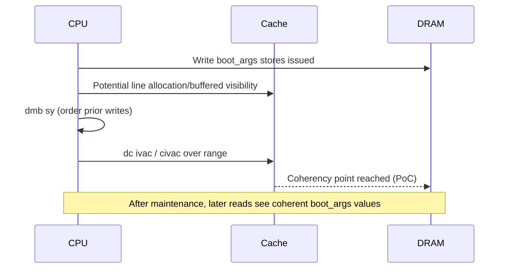

# ARM64 preserve_boot_args Deep Dive (ARMv8-A)

## 1) Why this function exists

During very early arm64 boot, Linux enters at [arch/arm64/kernel/head.S](../../../../../../../KernelRepo/linux/arch/arm64/kernel/head.S) in `primary_entry` with strict assumptions from [Documentation/arch/arm64/booting.rst](../../../../../../../KernelRepo/linux/Documentation/arch/arm64/booting.rst):

- `x0` contains the physical address of the FDT (Device Tree Blob)
- MMU is expected off
- D-cache is expected off (or bootloader must have done safe cache maintenance)
- CPU may enter at EL1 or EL2

The kernel must preserve entry registers before they are clobbered by setup code. That is exactly what `preserve_boot_args` does:

- Save boot args (`x0..x3`) into memory (`boot_args[4]`)
- Preserve FDT pointer in `x21` for later handoff
- If boot happened with MMU off, invalidate cache lines for those saved args so later reads are coherent
- If boot happened with MMU on, record that in `mmu_enabled_at_boot` for later diagnostics

---

## 2) The code we are analyzing

```asm
SYM_CODE_START_LOCAL(preserve_boot_args)
    mov x21, x0                 // x21 = FDT pointer

    adr_l x0, boot_args         // x0 = &boot_args[0]
    stp x21, x1, [x0]           // boot_args[0]=orig_x0, boot_args[1]=orig_x1
    stp x2, x3, [x0, #16]       // boot_args[2]=orig_x2, boot_args[3]=orig_x3

    cbnz x19, 0f                // if MMU was on, skip invalidation
    dmb sy                      // order stores before cache invalidate with MMU off

    add x1, x0, #0x20           // x1 = end = start + 32 bytes (4 * 8)
    b dcache_inval_poc          // tail-call: invalidate [x0, x1)
0:  str_l x19, mmu_enabled_at_boot, x0
    ret
SYM_CODE_END(preserve_boot_args)
```

---

## 3) Boot context from scratch (EL, registers, and flow)

### 3.1 Exception level (EL1 vs EL2)

ARMv8-A has privilege levels:

- EL3: secure monitor/firmware (not Linux runtime)
- EL2: hypervisor level
- EL1: kernel level
- EL0: user

Linux arm64 kernel entry can arrive at EL1 or EL2. In [arch/arm64/kernel/head.S](../../../../../../../KernelRepo/linux/arch/arm64/kernel/head.S), `record_mmu_state` inspects `CurrentEL` and reads `SCTLR_EL1` or `SCTLR_EL2` to infer initial MMU/cache state. That result is carried in `x19` and used by `preserve_boot_args`.

### 3.2 Registers used in this early path

- `x0` on entry: physical FDT pointer
- `x1..x3` on entry: reserved boot args (should be zero per boot protocol)
- `x19`: derived by `record_mmu_state`, indicates whether we entered with MMU enabled and if cache-related assumptions require alternate maintenance
- `x20`: later stores boot mode result from `init_kernel_el`
- `x21`: chosen as callee-saved carrier for FDT pointer until it is stored into `__fdt_pointer` later in `__primary_switched`

So in this phase:

- `x21` is long-lived payload (FDT pointer)
- `x19` is policy/control payload (cache/MMU branch control)

---

## 4) Instruction-by-instruction CPU-level behavior

### 4.1 `mov x21, x0`

- Copies bootloader-provided FDT physical pointer from `x0` to `x21`
- Why: upcoming instructions reuse `x0` as a normal scratch/address register
- Architectural effect: register rename/writeback only, no memory access

### 4.2 `adr_l x0, boot_args`

- Materializes address of global `boot_args` into `x0`
- `boot_args` is defined in [arch/arm64/kernel/setup.c](../../../../../../../KernelRepo/linux/arch/arm64/kernel/setup.c) as a cacheline-aligned `u64 boot_args[4]`
- Now `x0` is a pointer to storage location, not the original FDT

### 4.3 `stp x21, x1, [x0]`

- Store pair writes two 64-bit values:
  - `[x0 + 0]`  <- `x21` (original `x0` FDT pointer)
  - `[x0 + 8]`  <- `x1`
- At microarchitectural level: writes can sit in store buffer before globally visible

### 4.4 `stp x2, x3, [x0, #16]`

- Store pair writes:
  - `[x0 + 16]` <- `x2`
  - `[x0 + 24]` <- `x3`
- Total region written: 32 bytes from `x0` to `x0 + 31`

### 4.5 `cbnz x19, 0f`

- Branch if `x19 != 0`
- Here `x19 != 0` means boot path detected MMU/caching-on style entry state that should skip this invalidate path
- If branch taken:
  - control jumps to label `0`
  - kernel records this condition in `mmu_enabled_at_boot`

### 4.6 `dmb sy` (only if `x19 == 0`)

- Full-system data memory barrier
- Orders prior stores (`stp`s above) before subsequent explicit cache maintenance (`dc ivac` path)
- This is critical in MMU-off stage where ordering/coherency assumptions are weaker and explicit maintenance is required

### 4.7 `add x1, x0, #0x20`

- Computes end address of region: `x1 = start + 32`
- Convention used by cache helpers: interval is `[start, end)`

### 4.8 `b dcache_inval_poc` (tail call)

- Branch, not `bl`, so it is a tail call
- No extra return frame; function returns through callee's `ret`
- `dcache_inval_poc(start=x0, end=x1)` invalidates D-cache lines covering saved args to Point of Coherency (PoC)

### 4.9 Label `0`: `str_l x19, mmu_enabled_at_boot, x0`

- Runs only when branch was taken (`x19 != 0`)
- Stores diagnostic state for later warning path in setup

### 4.10 `ret`

- Return to caller (`primary_entry`)

---

## 5) What is happening in memory exactly

After the two `stp` instructions:

- `boot_args[0]` = original FDT pointer from bootloader
- `boot_args[1]` = original `x1`
- `boot_args[2]` = original `x2`
- `boot_args[3]` = original `x3`

Memory block size is exactly 32 bytes:

- start = `&boot_args[0]`
- end = `&boot_args[0] + 0x20`

If MMU-off path is taken (`x19==0`):

1. `dmb sy` ensures stores are ordered/observable before invalidate ops
2. `dcache_inval_poc` invalidates cache lines covering this range
3. This prevents later stale-cache observations when execution mode and mappings change

If MMU-on path is taken (`x19!=0`):

- Skip invalidation
- Record the condition in `mmu_enabled_at_boot`

---

## 6) Why barrier + invalidate are needed (hardware perspective)

When MMU is off in early boot:

- Addressing is physical and simplistic
- Cacheability and sharing attributes may not yet be fully controlled by final page-table attributes
- Stores can remain temporarily buffered
- Cache maintenance instructions must be correctly ordered against prior stores

`dmb sy` provides strict ordering, and invalidate-to-PoC ensures later consumers are not reading stale lines populated under early uncertain cache state.

In short:

- Barrier handles ordering
- Invalidate handles visibility/staleness risk

---

## 7) Where saved values are consumed later

- `x21` survives until `__primary_switched`, then is stored into `__fdt_pointer`
- `boot_args` is checked in setup path for protocol violations (for example nonzero x1-x3)
- `mmu_enabled_at_boot` is used by warning/diagnostic logic about firmware boot behavior

Key source files:

- [arch/arm64/kernel/head.S](../../../../../../../KernelRepo/linux/arch/arm64/kernel/head.S)
- [arch/arm64/kernel/setup.c](../../../../../../../KernelRepo/linux/arch/arm64/kernel/setup.c)
- [arch/arm64/mm/cache.S](../../../../../../../KernelRepo/linux/arch/arm64/mm/cache.S)

---

## 8) Register-state timeline snapshot

### Entry to `preserve_boot_args`

- `x0` = FDT physical address
- `x1..x3` = boot protocol args
- `x19` = MMU/cache state indicator from `record_mmu_state`

### Mid-function

- `x21` = preserved FDT pointer
- `x0` = `&boot_args[0]`
- memory at `boot_args[0..3]` populated

### Exit cases

- Case A (`x19==0`): barrier + invalidate range, return via callee
- Case B (`x19!=0`): store `mmu_enabled_at_boot`, direct `ret`

---

## 9) Corrected Mermaid sequence diagram

```mermaid
sequenceDiagram
    autonumber
    participant BL as Bootloader
    participant PE as primary_entry
    participant RMS as record_mmu_state
    participant PBA as preserve_boot_args
    participant MEM as boot_args memory
    participant DC as dcache_inval_poc
    participant SW as __primary_switched
    participant SK as setup_arch and start_kernel

    BL->>PE: Enter kernel (x0=FDT, MMU expected off)
    PE->>RMS: Detect EL + SCTLR state
    RMS-->>PE: x19 = MMU/cache policy signal

    PE->>PBA: Save boot args phase
    PBA->>PBA: mov x21, x0 (preserve FDT)
    PBA->>MEM: stp x21,x1 and stp x2,x3

    alt x19 == 0 (MMU off path)
        PBA->>PBA: dmb sy
        PBA->>DC: invalidate boot_args range
        DC-->>PE: ret (tail-call return path)
    else x19 != 0 (MMU on detected)
        PBA->>MEM: store mmu_enabled_at_boot = x19
        PBA-->>PE: ret
    end

    PE->>SW: continue early boot and switch path
    SW->>SK: persist x21 into __fdt_pointer; continue setup

    Note over PBA,MEM: 32-byte save window = 4 x 64-bit registers
    Note over PBA,DC: Barrier + invalidate protects visibility in MMU-off early state
```



---

## 10) Corrected Mermaid memory flow

```mermaid
flowchart TB
    subgraph PHYS[Physical Address Space During Early Boot]
        FDT[FDT Blob\nphys addr passed in x0]
        BA[boot_args[4]\n32 bytes\nsetup.c global]
        MMUFLAG[mmu_enabled_at_boot\nsetup.c global]
        IDMAP[Idmap text/tables]
    end

    X0[x0 at entry] --> FDT
    X0 --> X21[x21 saves FDT pointer]
    X21 --> BA
    X1[x1] --> BA
    X2[x2] --> BA
    X3[x3] --> BA

    X19[x19 from record_mmu_state] --> BR{MMU was on?}
    BR -- No --> DMB[dmb sy]
    DMB --> INV[dcache_inval_poc\nrange start to start+0x20)
    BR -- Yes --> MMUFLAG

    INV --> COH[PoC-coherent boot args]
    COH --> NEXT[Later setup reads stable values]

    classDef reg fill:#f9d976,stroke:#7a5f00,color:#1f1f1f,stroke-width:1px;
    classDef mem fill:#9ad1ff,stroke:#1c4f80,color:#0f2538,stroke-width:1px;
    classDef ctrl fill:#ffb3ba,stroke:#9a2e3a,color:#3f0d14,stroke-width:1px;
    classDef op fill:#b9f6ca,stroke:#1d6b39,color:#0f2e1c,stroke-width:1px;

    class X0,X1,X2,X3,X19,X21 reg;
    class FDT,BA,MMUFLAG,IDMAP mem;
    class BR ctrl;
    class DMB,INV,COH,NEXT op;
```

---

## 11) Common misconceptions

1. `preserve_boot_args` does not "enable MMU" or change EL. It only snapshots arguments and handles early cache safety.
2. `x19` is not payload data from bootloader. It is kernel-derived state from `record_mmu_state`.
3. The invalidate path is not unconditional. It intentionally runs only for MMU-off branch.
4. Tail call to `dcache_inval_poc` is intentional for minimal early-boot control flow overhead.

---

## 12) Practical debug checklist

1. Confirm bootloader passes valid physical FDT in `x0`.
2. Confirm `boot_args[1..3]` are zero as expected by boot protocol.
3. If warnings indicate MMU enabled at boot, inspect firmware handoff and cache cleaning behavior.
4. If DT parsing fails, trace:
   - `x0` at entry
   - `x21` after `mov x21, x0`
   - `__fdt_pointer` store in `__primary_switched`
5. If early random failures occur on some platforms, re-check barrier and cache maintenance assumptions for MMU-off boot path.

---

## 13) One-line mental model

`preserve_boot_args` is the earliest safe checkpoint that captures bootloader register inputs, preserves the FDT pointer across volatile setup code, and normalizes cache visibility so later kernel stages read coherent boot metadata.
