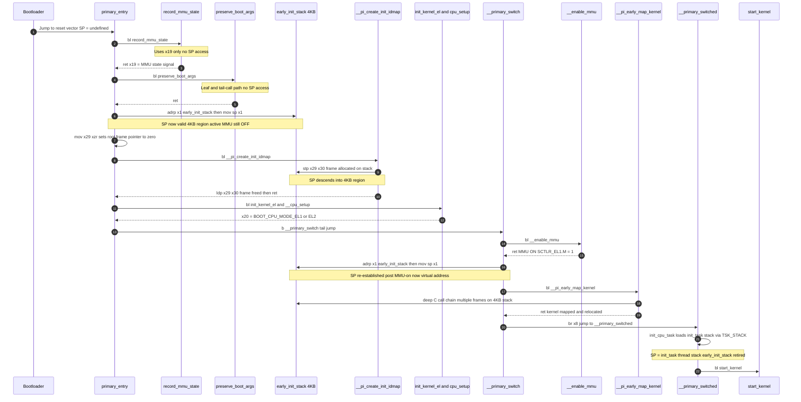
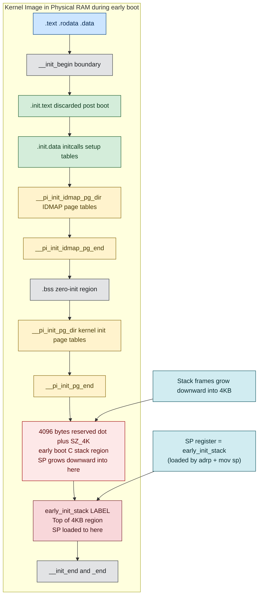
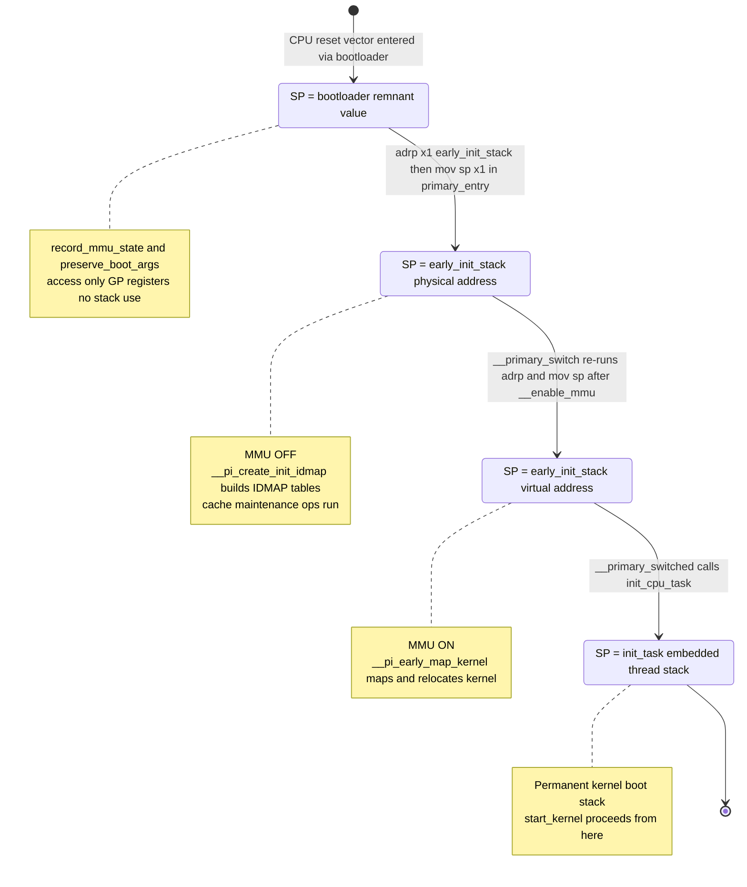
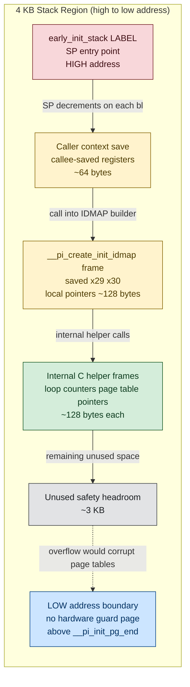

# ARM64 `early_init_stack` — Deep Dive Design Document (ARMv8-A)

> **Scope:** Memory perspective · CPU/register perspective · OS/boot-path perspective
> **Source base:** `arch/arm64/kernel/head.S`, `arch/arm64/kernel/vmlinux.lds.S`
> **Architecture:** ARMv8-A (AArch64 execution state)

---

## 1. The 15-second mental model

> `early_init_stack` is a 4 KB region carved at **link time**, placed immediately after
> the kernel's initial page tables in the BSS-adjacent init-data area. The **label marks
> the top** (highest address) of this region. Loading `sp` from it gives the first valid
> C-callable stack before any OS memory allocator exists.

---

## 2. Why a dedicated early stack is needed

When the bootloader hands control to `primary_entry`, the CPU is running with:

| Constraint | Detail |
|---|---|
| MMU | **OFF** — physical addressing only |
| D-cache | OFF or in unknown state |
| Page tables | Not yet built |
| `init_task` stack | Not yet mapped (virtual address) |
| SP register | Points at whatever bootloader left — **untrusted** |

The kernel must immediately call C-runtime helpers:
- `__pi_create_init_idmap` — build identity-map page tables
- `__pi_early_map_kernel` — map and relocate the kernel

Both functions need a valid stack for:
1. Saving the Link Register (LR / `x30`)
2. Building activation frames (`x29` frame pointer chain)
3. Local variable allocation and callee-saved register saves

Without a valid SP, the very first `bl` would corrupt memory or hard-fault.
`early_init_stack` solves this with a known, statically-allocated, BSS-zeroed 4 KB region.

---

## 3. Where it is defined — linker script anatomy

**File:** `arch/arm64/kernel/vmlinux.lds.S` (lines 358–364)

```ld
. = ALIGN(PAGE_SIZE);
__pi_init_pg_dir = .;
. += INIT_DIR_SIZE;
__pi_init_pg_end = .;
/* end of zero-init region */

. += SZ_4K;            /* stack for the early C runtime */
early_init_stack = .;
```

### What each linker line means

| Construct | Effect |
|---|---|
| `. += SZ_4K` | Advance location counter by **4096 bytes**, reserving a 4 KB gap in the image |
| `early_init_stack = .` | Bind symbol to the **current location counter** — the byte **just past** the gap |
| Preceding `BSS_SECTION` | Zero-initialized backing for the entire region |
| `ALIGN(PAGE_SIZE)` before page tables | Ensures preceding table starts at a page boundary |

### Critical insight: the symbol is at the TOP of the stack

ARM64 stacks grow **downward** (high → low addresses). The label is placed *after*
the 4 KB reservation:

```
Physical Address Space (simplified)
─────────────────────────────────────────────────────────
  __pi_init_pg_end       ← top of kernel init page tables
  ┌─────────────────────────────────────────────────────┐
  │  4096 bytes  (. += SZ_4K)                           │
  │  ← SP descends INTO this space on each call         │
  │  Backed by BSS zero-init                            │
  └─────────────────────────────────────────────────────┘
  early_init_stack       ← LABEL here = TOP of 4 KB
─────────────────────────────────────────────────────────
```

Loading `sp = early_init_stack` places SP at the **top**. Every subsequent function call
**subtracts** from SP, allocating frames inside the 4 KB region.

---

## 4. CPU register mechanics — instruction by instruction

### 4.1 First use in `primary_entry` (head.S line 89)

```asm
SYM_CODE_START(primary_entry)
    bl    record_mmu_state          // x19 = MMU/cache state signal
    bl    preserve_boot_args        // save x0..x3 to memory, x21=FDT

    adrp  x1, early_init_stack     // [A] compute stack top address into x1
    mov   sp, x1                   // [B] SP = top of early 4 KB stack
    mov   x29, xzr                 // [C] FP = 0  (root / outermost frame)
    adrp  x0, __pi_init_idmap_pg_dir
    mov   x1, xzr
    bl    __pi_create_init_idmap   // first C call with valid SP
```

### 4.2 `adrp x1, early_init_stack` — what happens inside the CPU

`adrp xN, <sym>` is a PC-relative address computation:

```
x1 = (PC & ~0xFFF) + page_offset(early_init_stack)
```

Steps:
1. Take current Program Counter
2. **Clear bottom 12 bits** (round down to 4 KB page)
3. Add the linker-time page offset to the symbol
4. Write 64-bit result to `x1`

**No memory access** — purely arithmetic. Works correctly whether MMU is off (physical)
or on (virtual), because `adrp` is always PC-relative.

### 4.3 `mov sp, x1` — writing the Stack Pointer

| EL | SP register |
|---|---|
| EL1 | `SP_EL1` |
| EL2 | `SP_EL2` |

- Direct register-to-register move, no memory access
- After this single instruction: **stack is live and safe**

### 4.4 `mov x29, xzr` — zero the Frame Pointer

`x29` is the **Frame Pointer (FP)** per the AArch64 Procedure Call Standard (PCS).

- `xzr` is the architecturally-defined **always-zero** register
- Setting FP=0 marks this as the **bottom of the call chain**
- Stack unwinders (KGDB, perf, ftrace, `backtrace()`) stop at FP=0
- Correct: nothing called `primary_entry`; it is the CPU reset vector target

### 4.5 Stack alignment guarantee

ARM64 ABI mandates **SP must be 16-byte aligned** at any public call boundary.

Since:
- `early_init_stack` follows a `PAGE_SIZE`-aligned region in the linker script
- `PAGE_SIZE` ≥ 4096 = 0x1000, which is divisible by 16
- `adrp` preserves alignment

The constraint is **automatically satisfied**.

### 4.6 Second use in `__primary_switch` (head.S line 513)

```asm
SYM_FUNC_START_LOCAL(__primary_switch)
    adrp  x1, reserved_pg_dir
    adrp  x2, __pi_init_idmap_pg_dir
    bl    __enable_mmu              // ← MMU turns ON here

    adrp  x1, early_init_stack     // re-establish SP after MMU on
    mov   sp, x1                   // same symbol, now virtual address
    mov   x29, xzr
    mov   x0, x20                  // boot status
    mov   x1, x21                  // FDT pointer
    bl    __pi_early_map_kernel    // map + relocate kernel
```

**Why SP must be re-established after `__enable_mmu`:**

| Before `__enable_mmu` | After `__enable_mmu` |
|---|---|
| MMU off, physical addresses | MMU on, virtual addresses |
| SP = physical `early_init_stack` | SP must reference a **virtual** address |
| `adrp` returns physical address | `adrp` returns virtual address (same symbol, new context) |

Both `adrp` calls emit the same instruction; they resolve correctly in their
respective address spaces because `adrp` is always PC-relative.

---

## 5. Complete register state timeline

```
[CPU reset vector]
  SP  = bootloader-owned (unknown)
  x29 = unknown
  x0  = FDT physical address
  x19 = undefined

primary_entry:
  bl record_mmu_state         → x19 = MMU state; NO SP use
  bl preserve_boot_args       → saves x0..x3; NO SP use (leaf/tail-call)

  adrp x1, early_init_stack
  mov  sp, x1                 → SP = early_init_stack (PHYSICAL, 4K top)
  mov  x29, xzr               → FP = 0x0 (root frame)

  bl __pi_create_init_idmap   → stp x29,x30 on stack; SP decrements into 4K
                                ... builds IDMAP page tables ...
                                ldp x29,x30; SP restored; ret

  [cache maintenance based on x19]
  bl init_kernel_el           → x20 = BOOT_CPU_MODE (EL1 or EL2)
  bl __cpu_setup              → TCR, cache policy
  b  __primary_switch

  __primary_switch:
    bl __enable_mmu           → SCTLR_EL1.M = 1; MMU ON

    adrp x1, early_init_stack
    mov  sp, x1               → SP = early_init_stack (VIRTUAL, 4K top)
    mov  x29, xzr

    bl __pi_early_map_kernel  → deep C call chain; all frames on 4K stack
                                kernel mapped and relocated
    br x8 → __primary_switched

  __primary_switched:
    adr_l x4, init_task
    init_cpu_task x4, x5, x6
      ldr x5, [x4, #TSK_STACK]
      add sp, x5, #THREAD_SIZE
      sub sp, sp, #PT_REGS_SIZE  → SP = init_task thread stack
                                    EARLY STACK RETIRED ←
    bl start_kernel
```

---

## 6. Memory perspective — full physical layout at boot

```
Physical RAM — Kernel Image (MMU OFF view)
════════════════════════════════════════════════════════════════════

  _stext / KERNEL_START
  ┌──────────────────────────────────────────────────────────────┐
  │ .text        — executable kernel code                        │
  │ .rodata      — read-only data, string tables                 │
  │ .data        — initialized global variables                  │
  ├── __init_begin ──────────────────────────────────────────────┤
  │ .init.text   — initialization functions (freed post-boot)    │
  │ .altinstructions — CPU feature alternatives                  │
  ├── __inittext_end / __initdata_begin ────────────────────────┤
  │ __pi_init_idmap_pg_dir  IDMAP page tables                    │
  │ __pi_init_idmap_pg_end                                       │
  │ .init.data   — initcalls, setup tables, RAMFS                │
  │ .bss         — BSS_SECTION (zero-initialized)                │
  │ __pi_init_pg_dir  kernel init page tables                    │
  │ __pi_init_pg_end                                             │
  │ ┌────────────────────────────────────────────────────────┐   │
  │ │  4096 bytes  (. += SZ_4K)                              │   │
  │ │  early_init_stack REGION                               │   │
  │ │  SP grows DOWNWARD ↓ from top into this space          │   │
  │ └────────────────────────────────────────────────────────┘   │
  │ early_init_stack  ← SYMBOL = TOP of 4 KB region             │
  ├── __init_end ────────────────────────────────────────────────┤
  _end / __pi__end
  └──────────────────────────────────────────────────────────────┘

  [FDT blob — physical address from bootloader]
  [Remaining RAM — available to page allocator]

════════════════════════════════════════════════════════════════════
```

### Memory region properties

| Property | Value |
|---|---|
| Section | Embedded in `__initdata` region |
| Initialization | Zero-filled (BSS contract from ELF bootloader) |
| Protections (MMU off) | None — no MMU protection possible |
| Protections (MMU on) | Read-Write via kernel init page tables |
| Freed | `free_initmem()` during `start_kernel()` late sequence |
| Size | Exactly **4096 bytes** (SZ_4K = 1 page) |
| Guard page | **None** — no hardware guard page exists |

---

## 7. OS perspective — role in the boot state machine

### 7.1 The stack gap problem — why a bridge is needed

```
primary_entry runs with SP = unknown bootloader value
    │
    ├── record_mmu_state     → register-only, no stack access
    ├── preserve_boot_args   → leaf/tail-call, no stack access
    │
    ▼
    __pi_create_init_idmap   → NEEDS VALID STACK ← PROBLEM
    │
    └── BRIDGE: SP = early_init_stack → PROBLEM SOLVED
```

### 7.2 Why `init_task` stack cannot be used here

| Reason | Explanation |
|---|---|
| Virtual address only | `init_task` stack lives at a virtual address |
| MMU not yet enabled | Virtual addresses are unreachable with MMU off |
| Chicken-and-egg | We need a stack to **build the page tables** that would map `init_task` |
| Physical access only | `early_init_stack` is in physical address space — accessible from reset |

### 7.3 Stack transition: early → `init_task`

```asm
__primary_switched (MMU ON, kernel relocated):

    adr_l  x4, init_task
    init_cpu_task x4, x5, x6:
        msr   sp_el0, x4                      // store task ptr
        ldr   x5, [x4, #TSK_STACK]            // load stack base
        add   sp, x5, #THREAD_SIZE            // top of thread stack
        sub   sp, sp, #PT_REGS_SIZE           // ← SP = init_task stack
        ...

    // From here: early_init_stack is NO LONGER SP
    bl start_kernel
```

### 7.4 Stack depth and risk assessment

| Metric | Value |
|---|---|
| Reserved size | 4096 bytes |
| Typical function frame | 32–128 bytes |
| Typical call depth during use | 3–8 levels |
| Recursion | None in these early functions |
| Maximum theoretical safe depth at 128 B/frame | ~32 levels |
| Overflow consequence | Silent corruption of `__pi_init_pg_end` data below |
| Mitigation | Functions are small, non-recursive, depth-bounded |

---

## 8. Sequence diagram — full boot path with SP state changes



---

## 9. Memory layout flowchart



---

## 10. SP register state machine



---

## 11. Stack frame depth visualization



---

## 12. Summary reference table

| Property | Detail |
|---|---|
| **Symbol name** | `early_init_stack` |
| **Defined in** | `arch/arm64/kernel/vmlinux.lds.S` line 362 |
| **Definition mechanism** | `early_init_stack = .` — pure linker address constant |
| **Stack region size** | **4096 bytes** (SZ_4K), reserved by `. += SZ_4K` |
| **Symbol position** | **Top** (highest address) of the 4 KB region |
| **Stack growth direction** | Downward — high → low address (ARM64 ABI) |
| **SP alignment** | 16-byte aligned (page-aligned linker placement) |
| **FP on first use** | `x29 = 0` via `mov x29, xzr` (root frame sentinel) |
| **First use (head.S line 89)** | `primary_entry` — before `__pi_create_init_idmap` |
| **Second use (head.S line 513)** | `__primary_switch` — after `__enable_mmu`, before `__pi_early_map_kernel` |
| **Backing memory** | Zero-initialized BSS / `__initdata` region in kernel image |
| **Guard page** | None — hardware protection unavailable with MMU off |
| **Stack lifetime** | Until `init_cpu_task` in `__primary_switched` |
| **Memory freed** | With all `__init` data during `free_initmem()` |
| **Superseded by** | `init_task` embedded thread stack (`THREAD_SIZE` bytes) |

---

## 13. Common misconceptions

1. **`early_init_stack` is not a C array or variable** — it is a pure linker address
   constant. No `.c` file declares it. Only assembly code and the linker script reference it.

2. **The label is at the TOP, not the base** — the 4 KB usable region extends *below*
   the label address. Loading `sp = early_init_stack` places SP at the highest point;
   usage descends downward.

3. **`adrp` does not access memory** — it is a PC-relative arithmetic instruction.
   It computes an address from the PC and link-time offset; it does NOT load from it.

4. **`x29 = 0` does not mean the stack is broken** — it is the unwinder sentinel for
   the outermost frame. SP and the stack region are fully valid.

5. **The stack is used twice in different MMU states** — same symbol, but `adrp` resolves
   to different physical vs. virtual addresses in each context. Both are correct because
   `adrp` is always PC-relative.

6. **It is completely separate from `init_task` stack** — `init_task` has its own
   `THREAD_SIZE` (typically 8–16 KB) embedded stack inside its `task_struct`. The early
   stack is a separate, smaller, temporary bootstrap region.

---

## 14. Debug and bring-up checklist

1. **Symbol overlap check** — confirm `early_init_stack` address in `System.map` is
   strictly above `__pi_init_pg_end`. If they overlap, the linker layout is broken.

2. **Fault on first `bl`** — if `__pi_create_init_idmap` faults on entry, SP may be
   invalid. Check `adrp` decoded physical address against `System.map` symbol value.

3. **`x29 = 0x0` in stack trace** — this is expected behavior at the outermost boot
   frame. It is not stack corruption.

4. **Post-MMU alignment fault** — if `__pi_early_map_kernel` faults immediately, verify
   that `__primary_switch` re-runs `adrp x1, early_init_stack; mov sp, x1` **after**
   `bl __enable_mmu`. Both setup steps are mandatory.

5. **Stack depth measurement** — in a debugger, compare SP at the deepest point inside
   `__pi_early_map_kernel` against `early_init_stack`. At least 256 bytes should remain.

6. **BSS zero guarantee** — if the bootloader does not zero BSS before jumping to kernel,
   `early_init_stack` itself will not malfunction (write-before-read), but adjacent
   globals may be corrupted. Ensure your bootloader honours the ELF BSS zero contract.
