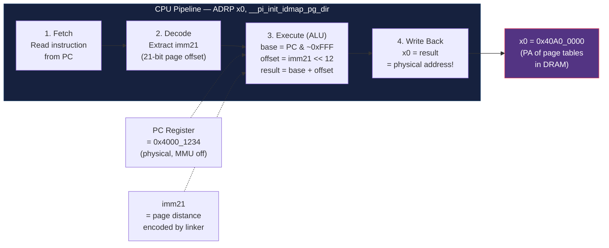
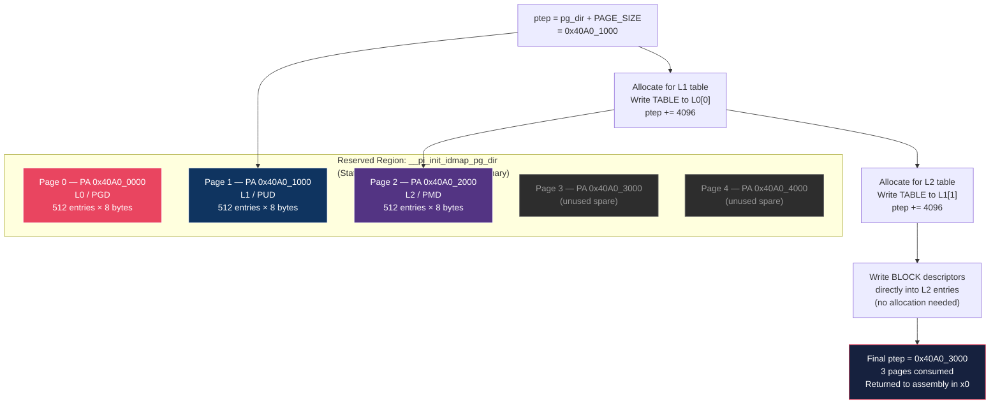
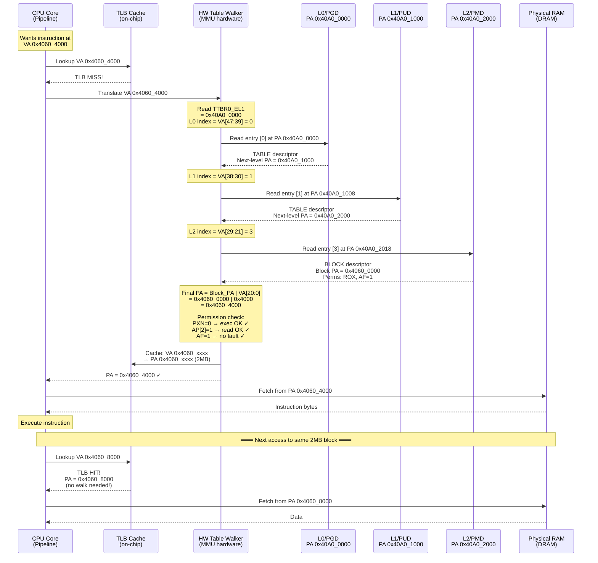
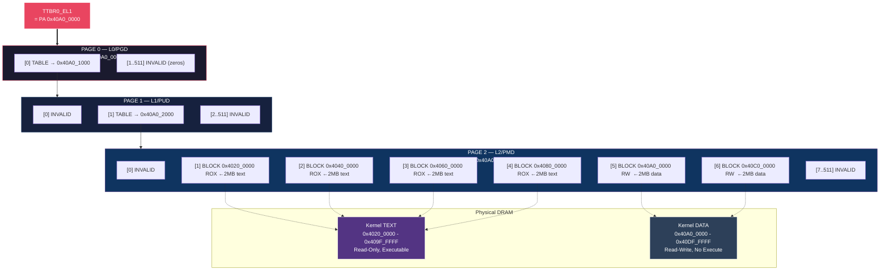
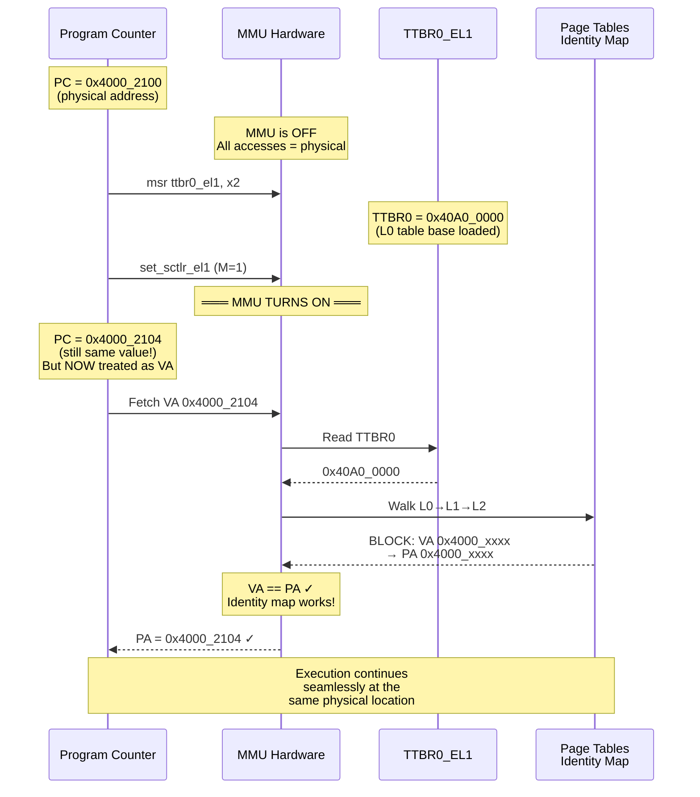

# CPU Address Flow & Page Table Construction — Complete Deep Dive

## Table of Contents
- [Phase 1: Where Does the Kernel Live in Physical Memory?](#phase-1-where-does-the-kernel-live-in-physical-memory)
- [Phase 2: How the CPU Computes the Physical Address of Page Table Memory](#phase-2-how-the-cpu-computes-the-physical-address-of-page-table-memory)
- [Phase 3: Memory Layout in Physical RAM](#phase-3-memory-layout-in-physical-ram)
- [Phase 4: How create_init_idmap() Knows What Addresses to Use](#phase-4-how-create_init_idmap-knows-what-addresses-to-use)
- [Phase 5: Page Table Construction — Address by Address](#phase-5-page-table-construction--address-by-address)
- [Phase 6: How the CPU MMU Uses These Tables](#phase-6-how-the-cpu-mmu-uses-these-tables)
- [Phase 7: Why Identity Map Survives MMU Turn-On](#phase-7-why-identity-map-survives-mmu-turn-on)
- [Phase 8: Complete Address Trace Summary](#phase-8-complete-address-trace-summary)
- [Mermaid Diagrams](#mermaid-diagrams)

---

## Source Files Referenced

| File | Purpose |
|---|---|
| `arch/arm64/kernel/head.S` | Assembly call site — `primary_entry`, `__primary_switch` |
| `arch/arm64/kernel/vmlinux.lds.S` | Linker script — memory layout, symbol placement |
| `arch/arm64/kernel/pi/map_range.c` | C code — `create_init_idmap()`, `map_range()` |
| `arch/arm64/include/asm/kernel-pgtable.h` | Size macros — `INIT_IDMAP_DIR_SIZE`, `EARLY_PAGES()` |
| `arch/arm64/include/asm/pgtable-hwdef.h` | Hardware definitions — descriptor types, bit fields |
| `arch/arm64/include/asm/pgtable-prot.h` | Protection attributes — `PAGE_KERNEL_ROX`, `PAGE_KERNEL` |

---

## Phase 1: Where Does the Kernel Live in Physical Memory?

The bootloader (U-Boot, UEFI, etc.) loads the kernel `Image` file into DRAM at some **physical address** — e.g., `0x4000_0000`. This address is arbitrary but must be **2MB-aligned** per the ARM64 boot protocol.

At this point:
- **MMU is OFF** — the CPU sees raw physical addresses
- **D-cache is OFF** — stores go directly to DRAM
- **I-cache may be ON or OFF**
- **x0 = physical address of the FDT (Flattened Device Tree)**

### Linker vs. Runtime Addresses

From `vmlinux.lds.S`:
```lds
. = KIMAGE_VADDR;          // linker assigns virtual address 0xFFFF_8000_1000_0000

.head.text : {
    _text = .;               // _text = KIMAGE_VADDR
    HEAD_TEXT
}
.text : ALIGN(SEGMENT_ALIGN) {
    _stext = .;              // start of text
}
```

The linker assigns **virtual addresses** to all symbols (`_stext`, `__initdata_begin`, `_end`). But at runtime with MMU OFF, the CPU is executing at **physical addresses**. The kernel is position-independent (`__pi_` prefix), and because `va_offset = 0` is passed to `map_range()`, the linker symbols are used **as if they were physical addresses** — the identity map makes VA = PA.

---

## Phase 2: How the CPU Computes the Physical Address of Page Table Memory

```asm
adrp    x0, __pi_init_idmap_pg_dir
```

### What the CPU Hardware Does at This Instruction

```
Step 1: Fetch the instruction from current PC
        (e.g., PC = 0x4000_1234 — a physical address because MMU is OFF)

Step 2: Decode the instruction:
        ADRP x0, #imm21
        (imm21 is the page-granular offset encoded by the linker/relocator)

Step 3: CPU ALU computes:
        base   = PC & ~0xFFF           = 0x4000_1000
        offset = imm21 << 12           = (distance to __pi_init_idmap_pg_dir in pages)
        x0     = base + offset         = e.g., 0x40A0_0000

Step 4: Write result to register x0
```

### Key Insight
The `imm21` value was computed by the **linker** (and possibly adjusted by the relocator at load time). It encodes the page-granular distance between the instruction's location and `__pi_init_idmap_pg_dir` in the binary layout. Since MMU is off, PC contains a physical address, so the result in x0 is also a **raw physical address** pointing to DRAM.

### How ADRP Gives Position-Independent Physical Addresses

```
ADRP formula: Xd = (PC & ~0xFFF) + (imm21 << 12)

- PC is physical (MMU off)
- imm21 is the distance within the binary (fixed at link/load time)
- Result is always physical, regardless of WHERE in DRAM the kernel was loaded
- Works at 0x4000_0000, 0x8000_0000, or any 2MB-aligned load address
```

---

## Phase 3: Memory Layout in Physical RAM

After the bootloader loads the kernel Image at PA `0x4000_0000`:

```
Physical RAM Layout:
────────────────────────────────────────────────────────────────
0x4000_0000 ┌──────────────────────────────┐ ← _text (kernel image start)
            │ .head.text                    │   PE/COFF header + branch
            │                              │   to primary_entry
            ├──────────────────────────────┤
0x4002_0000 │ .text (SEGMENT_ALIGN'd)      │ ← _stext (2MB aligned)
            │   IRQENTRY_TEXT              │
            │   SOFTIRQENTRY_TEXT          │
            │   kernel code...             │
            │   all executable functions   │
            ├──────────────────────────────┤
            │ _etext                       │ ← end of text
            │ .rodata (read-only data)     │
            │   RO_DATA(PAGE_SIZE)         │
            ├──────────────────────────────┤
            │ .rodata.text                 │
            │   TRAMP_TEXT                 │   trampoline code
            │   HIBERNATE_TEXT             │   hibernate code
            │   IDMAP_TEXT                 │   identity-map code
            ├──────────────────────────────┤
            │ idmap_pg_dir     (1 page)    │ ← for later use (NOT init_idmap)
            │ reserved_pg_dir  (1 page)    │
            │ swapper_pg_dir   (1 page)    │
            ├──────────────────────────────┤
            │ __init_begin                 │
            │ .init.text                   │   __inittext_begin
            │   initialization code        │
            │ __inittext_end               │
            ├══════════════════════════════┤
            │ __initdata_begin             │ ← TEXT↔DATA BOUNDARY
            ├──────────────────────────────┤
0x40A0_0000 │ ┌────────────────────────┐   │
(example)   │ │ __pi_init_idmap_pg_dir │   │ ← PAGE TABLE MEMORY
            │ │ Page 0 (L0/PGD) 4KB   │   │   PA = 0x40A0_0000
            │ │ Page 1 (L1/PUD) 4KB   │   │   PA = 0x40A0_1000
            │ │ Page 2 (L2/PMD) 4KB   │   │   PA = 0x40A0_2000
            │ │ Page 3 (spare)  4KB   │   │   PA = 0x40A0_3000
            │ │ Page 4 (spare)  4KB   │   │   PA = 0x40A0_4000
            │ └────────────────────────┘   │
            │ __pi_init_idmap_pg_end       │
            ├──────────────────────────────┤
            │ .init.data                   │   init data, setup tables
            │ .data (RW data)              │
            │ .mmuoff.data.write           │
            │ .mmuoff.data.read            │
            ├──────────────────────────────┤
            │ .bss (zero-initialized)      │
            │ __bss_start ... __bss_stop   │
            ├──────────────────────────────┤
            │ init_pg_dir (N pages)        │ ← for later use by map_kernel
            │ __pi_init_pg_end             │
            ├──────────────────────────────┤
            │ ···(4KB gap)···              │   early C runtime stack space
            │ early_init_stack             │ ← TOP of 4K stack (symbol at top!)
            ├──────────────────────────────┤
0x40C0_0000 │ _end                         │ ← end of kernel image
(example)   └──────────────────────────────┘
────────────────────────────────────────────────────────────────
```

### How This Layout Is Created

1. **At build time**: The linker script (`vmlinux.lds.S`) assigns virtual addresses and computes sizes
2. **At build time**: `. += INIT_IDMAP_DIR_SIZE` reserves the page table region (just advances the position counter — no code runs)
3. **At load time**: Bootloader copies the entire Image file into DRAM at a 2MB-aligned physical address
4. **At runtime**: The `.bss` and page table region are already zero (part of the zero-init region in the binary)

---

## Phase 4: How `create_init_idmap()` Knows What Addresses to Use

### The Assembly Setup

```asm
adrp    x0, __pi_init_idmap_pg_dir    // x0 = PA of page table base (e.g., 0x40A0_0000)
mov     x1, xzr                        // x1 = 0 (clrmask — no bits to clear)
bl      __pi_create_init_idmap         // call C function
```

### The C Entry Point

```c
asmlinkage phys_addr_t create_init_idmap(pgd_t *pg_dir, ptdesc_t clrmask)
{
    // pg_dir received from x0 = 0x40A0_0000 (physical address)

    phys_addr_t ptep = (phys_addr_t)pg_dir + PAGE_SIZE;
    // ptep = 0x40A0_0000 + 0x1000 = 0x40A0_1000
    // This is the BUMP ALLOCATOR — always points to the next free page
```

### Where Every Address Comes From

| Address | Source | How CPU Gets It |
|---|---|---|
| `pg_dir` (PA of page table base) | `adrp x0, __pi_init_idmap_pg_dir` in head.S | CPU ALU: PC-relative computation |
| `ptep` (next free page) | `pg_dir + PAGE_SIZE` (C arithmetic) | CPU ALU: add 0x1000 to pg_dir |
| `_stext` (start of kernel text) | Linker symbol, relocated at load | Position-independent reference in binary |
| `__initdata_begin` (text/data boundary) | Linker symbol | Position-independent reference in binary |
| `_end` (end of kernel image) | Linker symbol | Position-independent reference in binary |

### The Two Mapping Calls

```c
    pgprot_t text_prot = PAGE_KERNEL_ROX;   // Read-Only, Executable
    pgprot_t data_prot = PAGE_KERNEL;       // Read-Write, No Execute

    // CALL 1: Map kernel TEXT (code) — identity mapped
    map_range(&ptep,
              (u64)_stext,              // VA start  = 0x4002_0000
              (u64)__initdata_begin,    // VA end    = 0x40A0_0000
              (phys_addr_t)_stext,      // PA start  = 0x4002_0000 (SAME = identity!)
              text_prot,                // ROX permissions
              IDMAP_ROOT_LEVEL,         // level = 0 (start at L0/PGD)
              (pte_t *)pg_dir,          // root table at 0x40A0_0000
              false,                    // no contiguous hint
              0);                       // va_offset = 0 (identity map)

    // CALL 2: Map kernel DATA — identity mapped
    map_range(&ptep,
              (u64)__initdata_begin,    // VA start  = 0x40A0_0000
              (u64)_end,                // VA end    = 0x40C0_0000
              (phys_addr_t)__initdata_begin,  // PA = 0x40A0_0000 (SAME!)
              data_prot,                // RW permissions
              IDMAP_ROOT_LEVEL,         // level = 0
              (pte_t *)pg_dir,          // same root table
              false, 0);

    return ptep;  // returned to assembly in x0 — marks end of used region
```

---

## Phase 5: Page Table Construction — Address by Address

### Concrete Example Addresses

```
Kernel loaded at PA 0x4000_0000
_stext              = 0x4020_0000  (2MB aligned, after header)
__initdata_begin    = 0x40A0_0000  (~8MB of text)
_end                = 0x40C0_0000  (~2MB of data)
__pi_init_idmap_pg_dir = 0x40A0_0000  (at __initdata_begin)

Page table pages:
  Page 0 (L0/PGD): PA 0x40A0_0000 — 0x40A0_0FFF
  Page 1 (L1/PUD): PA 0x40A0_1000 — 0x40A0_1FFF
  Page 2 (L2/PMD): PA 0x40A0_2000 — 0x40A0_2FFF
  Page 3 (spare):  PA 0x40A0_3000 — 0x40A0_3FFF
```

### Call 1: Map TEXT Region (0x4020_0000 → 0x40A0_0000, ROX)

#### Level 0 (PGD) — Each entry covers 512 GB

```
ENTRY STATE:
  ptep  = 0x40A0_1000 (Page 1 — first free page)
  start = 0x4020_0000
  end   = 0x40A0_0000
  pa    = 0x4020_0000
  level = 0
  tbl   = 0x40A0_0000 (Page 0 — root L0 table)

CALCULATIONS:
  lshift = (3 - 0) * 9 = 27
  Each L0 entry covers: 2^(27+12) = 2^39 = 512 GB
  lmask = (4096 << 27) - 1 = 0x7F_FFFF_FFFF

  Index into L0:
    tbl += (0x4020_0000 >> 39) % 512
    tbl += 0 % 512
    tbl += 0
    → L0[0] at physical address 0x40A0_0000 + 0*8 = PA 0x40A0_0000

DECISION:
  level=0 < 2 → TRUE → must create a sub-table (L0 entries are ALWAYS table descriptors)

ACTION — Allocate L1 table:
  L0[0] is pte_none (currently zero/invalid)
  → Write TABLE descriptor:

  *tbl = __phys_to_pte_val(ptep) | PMD_TYPE_TABLE | PMD_TABLE_UXN
       = 0x40A0_1000 | 0b11 | (1 << 60)

  CPU STORE instruction writes 8 bytes to physical memory:
  ┌─────────────────────────────────────────────────────┐
  │ MEMORY[0x40A0_0000] = 0x10000040A01003              │
  │   bits [47:12] = 0x40A0_1 (PA of L1 table page)    │
  │   bits [1:0]   = 0b11    (TABLE descriptor type)    │
  │   bit  [60]    = 1       (UXN — user no-execute)    │
  └─────────────────────────────────────────────────────┘

  Advance bump allocator:
  ptep += 512 * 8 = 4096
  ptep = 0x40A0_2000 (now points to Page 2)

RECURSE: map_range(pte, start, next, pa, prot, level=1, tbl=L1_at_0x40A0_1000)
```

#### Level 1 (PUD) — Each entry covers 1 GB

```
ENTRY STATE:
  ptep  = 0x40A0_2000 (Page 2 — next free page)
  start = 0x4020_0000
  level = 1
  tbl   = 0x40A0_1000 (Page 1 — the L1 table we just allocated)

CALCULATIONS:
  lshift = (3 - 1) * 9 = 18
  Each L1 entry covers: 2^(18+12) = 2^30 = 1 GB
  lmask = (4096 << 18) - 1 = 0x3FFF_FFFF

  Index into L1:
    tbl += (0x4020_0000 >> 30) % 512
    tbl += 1 % 512
    tbl += 1
    → L1[1] at PA 0x40A0_1000 + 1*8 = PA 0x40A0_1008

DECISION:
  level=1 < 2 → TRUE → must create a sub-table

ACTION — Allocate L2 table:
  L1[1] is pte_none (zero)
  → Write TABLE descriptor:

  CPU STORE:
  ┌─────────────────────────────────────────────────────┐
  │ MEMORY[0x40A0_1008] = 0x10000040A02003              │
  │   bits [47:12] = 0x40A0_2 (PA of L2 table page)    │
  │   bits [1:0]   = 0b11    (TABLE descriptor type)    │
  │   bit  [60]    = 1       (UXN)                      │
  └─────────────────────────────────────────────────────┘

  ptep += 4096
  ptep = 0x40A0_3000 (now points to Page 3)

RECURSE: map_range(pte, start, next, pa, prot, level=2, tbl=L2_at_0x40A0_2000)
```

#### Level 2 (PMD) — Each entry covers 2 MB — BLOCK DESCRIPTORS WRITTEN HERE

```
ENTRY STATE:
  ptep  = 0x40A0_3000 (Page 3 — but we won't need it if aligned)
  start = 0x4020_0000
  end   = 0x40A0_0000
  pa    = 0x4020_0000
  level = 2
  tbl   = 0x40A0_2000 (Page 2 — the L2 table)

CALCULATIONS:
  lshift = (3 - 2) * 9 = 9
  Each L2 entry covers: 2^(9+12) = 2^21 = 2 MB
  lmask = (4096 << 9) - 1 = 0x1F_FFFF (2MB - 1)

  Index into L2:
    tbl += (0x4020_0000 >> 21) % 512
    tbl += 513 % 512            (0x4020_0000 >> 21 = 0x201 = 513)
    tbl += 1
    → L2[1] at PA 0x40A0_2000 + 1*8 = PA 0x40A0_2008

DECISION:
  level=2, NOT < 2
  Check: (start | next | pa) & lmask
  0x4020_0000 & 0x1F_FFFF = 0 → 2MB aligned!
  → FALSE → Can write BLOCK descriptor directly!
```

##### Loop Iteration 1: First 2MB block

```
  protval = PAGE_KERNEL_ROX attributes | PMD_TYPE_SECT(0b01)

  CPU STORE:
  ┌──────────────────────────────────────────────────────────────┐
  │ MEMORY[0x40A0_2008] = 0x4020_0000 | protval                 │
  │                                                              │
  │ 8-byte Block Descriptor bit layout:                          │
  │  63  54 53 52 51 50      21 20:12 11 10  9:8  7  6  4:2 1:0 │
  │ ┌────┬──┬──┬──┬──┬────────┬──────┬──┬──┬────┬──┬──┬───┬───┐ │
  │ │    │PX│UX│CT│DB│  PA    │ res  │nG│AF│ SH │RO│US│Att│Typ│ │
  │ │    │ 0│ 1│ 0│ 1│4020000│      │ 0│ 1│ 11 │ 1│ 0│100│ 01│ │
  │ └────┴──┴──┴──┴──┴────────┴──────┴──┴──┴────┴──┴──┴───┴───┘ │
  │                                                              │
  │ PXN=0: Privileged Execute → ALLOWED (this is code!)          │
  │ UXN=1: User Execute → BLOCKED                               │
  │ AF=1:  Access Flag set → no fault on first access            │
  │ SH=11: Inner Shareable → coherent across CPUs                │
  │ AP[2]=1 (RO): Read-Only                                     │
  │ AttrIndx=100: MT_NORMAL (Write-Back cacheable)               │
  │ Type=01: BLOCK/SECTION descriptor                            │
  │ PA[47:21]: 0x4020_0000 → maps 2MB starting at this PA       │
  └──────────────────────────────────────────────────────────────┘

  pa    += 2MB → pa = 0x4040_0000
  start += 2MB → start = 0x4040_0000
  tbl++ → next L2 entry (L2[2])
```

##### Loop Iteration 2: Second 2MB block

```
  CPU STORE:
  ┌──────────────────────────────────────────────────────┐
  │ MEMORY[0x40A0_2010] = 0x4040_0000 | ROX_protval     │
  │   L2[2] → maps PA 0x4040_0000 - 0x405F_FFFF (2MB)  │
  └──────────────────────────────────────────────────────┘

  pa = 0x4060_0000, start = 0x4060_0000, tbl → L2[3]
```

##### Loop Iteration 3: Third 2MB block

```
  CPU STORE:
  ┌──────────────────────────────────────────────────────┐
  │ MEMORY[0x40A0_2018] = 0x4060_0000 | ROX_protval     │
  │   L2[3] → maps PA 0x4060_0000 - 0x407F_FFFF (2MB)  │
  └──────────────────────────────────────────────────────┘

  pa = 0x4080_0000, start = 0x4080_0000, tbl → L2[4]
```

##### Loop Iteration 4: Fourth 2MB block

```
  CPU STORE:
  ┌──────────────────────────────────────────────────────┐
  │ MEMORY[0x40A0_2020] = 0x4080_0000 | ROX_protval     │
  │   L2[4] → maps PA 0x4080_0000 - 0x409F_FFFF (2MB)  │
  └──────────────────────────────────────────────────────┘

  pa = 0x40A0_0000, start = 0x40A0_0000
  start >= end (0x40A0_0000) → LOOP ENDS
  Return to create_init_idmap()
```

### Call 2: Map DATA Region (0x40A0_0000 → 0x40C0_0000, RW)

```
ENTRY STATE:
  ptep  = 0x40A0_3000 (unchanged — no new tables were allocated in L2 loop)
  start = 0x40A0_0000
  end   = 0x40C0_0000
  pa    = 0x40A0_0000
  level = 0
  tbl   = 0x40A0_0000 (same root L0 table)

LEVEL 0 — L0[0]:
  Already has a valid TABLE descriptor (from Call 1) → NOT pte_none
  → Reuse existing L1 table, no new allocation needed
  → Recurse into L1 at 0x40A0_1000

LEVEL 1 — L1[1]:
  Already has a valid TABLE descriptor (from Call 1) → NOT pte_none
  → Reuse existing L2 table, no new allocation needed
  → Recurse into L2 at 0x40A0_2000

LEVEL 2 — Continue where text mapping left off:
  Index: (0x40A0_0000 >> 21) % 512 = 0x205 % 512 = 5 → L2[5]
```

##### Data Block Iteration 1:

```
  protval = PAGE_KERNEL attributes | PMD_TYPE_SECT(0b01)

  CPU STORE:
  ┌──────────────────────────────────────────────────────────────┐
  │ MEMORY[0x40A0_2028] = 0x40A0_0000 | RW_protval              │
  │                                                              │
  │ Block Descriptor for DATA:                                   │
  │ PXN=1: Privileged Execute → BLOCKED (this is data!)          │
  │ UXN=1: User Execute → BLOCKED                               │
  │ AP[2]=0: Read-Write                                          │
  │ DBM=1 (PTE_WRITE): Dirty Bit Management / writable           │
  │ Type=01: BLOCK descriptor                                    │
  │ PA[47:21]: 0x40A0_0000                                       │
  └──────────────────────────────────────────────────────────────┘
```

##### Data Block Iteration 2:

```
  CPU STORE:
  ┌──────────────────────────────────────────────────────┐
  │ MEMORY[0x40A0_2030] = 0x40C0_0000 | RW_protval      │
  │   L2[6] → maps PA 0x40C0_0000 - 0x40DF_FFFF (2MB)   │
  └──────────────────────────────────────────────────────┘

  (continues until start >= _end = 0x40C0_0000)
```

### Final Page Table State in Physical Memory

```
═══════════════════════════════════════════════════════════════════
PAGE 0 — L0/PGD at PA 0x40A0_0000 (4096 bytes = 512 entries × 8)
═══════════════════════════════════════════════════════════════════
Offset   Entry   Content                              Meaning
──────   ─────   ──────────────────────────────────   ──────────────────
0x000    [0]     PA_0x40A0_1000 | TABLE | UXN         → points to L1 (Page 1)
0x008    [1]     0x0000_0000_0000_0000                 INVALID
0x010    [2]     0x0000_0000_0000_0000                 INVALID
  ...    ...     ... (all zeros) ...
0xFF8    [511]   0x0000_0000_0000_0000                 INVALID

═══════════════════════════════════════════════════════════════════
PAGE 1 — L1/PUD at PA 0x40A0_1000 (4096 bytes = 512 entries × 8)
═══════════════════════════════════════════════════════════════════
Offset   Entry   Content                              Meaning
──────   ─────   ──────────────────────────────────   ──────────────────
0x000    [0]     0x0000_0000_0000_0000                 INVALID
0x008    [1]     PA_0x40A0_2000 | TABLE | UXN         → points to L2 (Page 2)
0x010    [2]     0x0000_0000_0000_0000                 INVALID
  ...    ...     ... (all zeros) ...
0xFF8    [511]   0x0000_0000_0000_0000                 INVALID

═══════════════════════════════════════════════════════════════════
PAGE 2 — L2/PMD at PA 0x40A0_2000 (4096 bytes = 512 entries × 8)
═══════════════════════════════════════════════════════════════════
Offset   Entry   Content                              Meaning
──────   ─────   ──────────────────────────────────   ──────────────────
0x000    [0]     0x0000_0000_0000_0000                 INVALID
0x008    [1]     0x4020_0000 | SECT | ROX | AF | SH   2MB text block
0x010    [2]     0x4040_0000 | SECT | ROX | AF | SH   2MB text block
0x018    [3]     0x4060_0000 | SECT | ROX | AF | SH   2MB text block
0x020    [4]     0x4080_0000 | SECT | ROX | AF | SH   2MB text block
0x028    [5]     0x40A0_0000 | SECT | RW  | AF | SH   2MB data block
0x030    [6]     0x40C0_0000 | SECT | RW  | AF | SH   2MB data block
  ...    ...     ... (remaining entries = 0, INVALID)
0xFF8    [511]   0x0000_0000_0000_0000                 INVALID

═══════════════════════════════════════════════════════════════════

Bump Allocator Final State:
  ptep = 0x40A0_3000 (3 pages consumed: PGD + PUD + PMD)
  This value is returned to assembly in x0
```

---

## Phase 6: How the CPU MMU Uses These Tables

### Loading the Tables into Hardware

In `__primary_switch` (head.S):

```asm
adrp    x2, __pi_init_idmap_pg_dir    // x2 = 0x40A0_0000
bl      __enable_mmu

// Inside __enable_mmu:
phys_to_ttbr x2, x2                   // format PA for TTBR register
msr     ttbr0_el1, x2                 // TTBR0_EL1 = 0x40A0_0000
                                       // (tells MMU: "L0 table is at this PA")
load_ttbr1 x1, x1, x3                 // TTBR1 for kernel VA space (reserved_pg_dir)

set_sctlr_el1  x0                     // SCTLR_EL1.M = 1 → MMU ON!
```

### Hardware Translation Walk — Step by Step

When the CPU fetches the next instruction after MMU is turned on:

```
CPU wants instruction at VA 0x4060_4000:

VA bit decomposition (48-bit, 4K granule, 4 levels):
┌────────────┬──────────┬──────────┬──────────┬─────────────┐
│ bits 63:48 │ bits 47:39│ bits 38:30│ bits 29:21│ bits 20:0   │
│ sign ext   │ L0 index │ L1 index │ L2 index │ block offset│
│ (all 0s)   │ = 0      │ = 1      │ = 3      │ = 0x4000    │
└────────────┴──────────┴──────────┴──────────┴─────────────┘

Calculation:
  L0 index = (0x4060_4000 >> 39) & 0x1FF = 0
  L1 index = (0x4060_4000 >> 30) & 0x1FF = 1
  L2 index = (0x4060_4000 >> 21) & 0x1FF = 3
  Offset   = 0x4060_4000 & 0x1F_FFFF    = 0x4000

HARDWARE WALK:

Step 1: Read TTBR0_EL1 → 0x40A0_0000 (base of L0 table)

Step 2: L0 lookup
   Address = TTBR0 + L0_index * 8
           = 0x40A0_0000 + 0 * 8
           = 0x40A0_0000
   CPU reads 8 bytes from PA 0x40A0_0000
   → Gets TABLE descriptor
   → Extract bits [47:12] → PA of L1 table = 0x40A0_1000

Step 3: L1 lookup
   Address = L1_base + L1_index * 8
           = 0x40A0_1000 + 1 * 8
           = 0x40A0_1008
   CPU reads 8 bytes from PA 0x40A0_1008
   → Gets TABLE descriptor
   → Extract bits [47:12] → PA of L2 table = 0x40A0_2000

Step 4: L2 lookup
   Address = L2_base + L2_index * 8
           = 0x40A0_2000 + 3 * 8
           = 0x40A0_2018
   CPU reads 8 bytes from PA 0x40A0_2018
   → Gets BLOCK descriptor (type bits [1:0] = 0b01)
   → Extract bits [47:21] → block base PA = 0x4060_0000

Step 5: Form final physical address
   Final PA = block_base | offset_within_block
            = 0x4060_0000 | 0x4000
            = 0x4060_4000

Step 6: Hardware permission checks
   ✓ PXN=0    → Privileged Execute allowed (this is text)
   ✓ AP[2]=1  → Read access allowed
   ✓ AF=1     → Access flag set, no access flag fault
   ✓ UXN=1    → User execute blocked (we're in EL1, irrelevant)
   ✓ AttrIndx → MT_NORMAL: cacheable, write-back

Step 7: Cache result in TLB
   TLB entry: VA 0x4060_0000 (2MB range) → PA 0x4060_0000, ROX

Step 8: Deliver instruction/data to CPU pipeline
   CPU fetches from PA 0x4060_4000 → gets the instruction bytes

RESULT: VA 0x4060_4000 → PA 0x4060_4000
        VA == PA → Identity map works!

SUBSEQUENT ACCESSES to same 2MB block:
   TLB HIT → No walk needed → Direct translation in 1 cycle
```

---

## Phase 7: Why Identity Map Survives MMU Turn-On

This is the most critical insight in the entire boot flow.

### The Problem

The instruction that turns on the MMU is:

```asm
set_sctlr_el1  x0    // writes SCTLR_EL1.M = 1
```

**Before** this instruction: PC = physical address (e.g., `0x4000_2100`)
**After** this instruction: CPU fetches next instruction using **VA translation**

The PC doesn't magically change — it still holds `0x4000_2104` (next instruction). But now the CPU treats this as a **virtual address** and passes it through the MMU.

### The Solution

The identity map ensures: `VA 0x4000_2104 → PA 0x4000_2104`

So the CPU successfully finds the next instruction at the same physical location. Without this mapping, the MMU would not find a valid translation and would generate a **synchronous abort (page fault)** — crashing immediately.

### Why `.idmap.text` Section Matters

The code that performs `set_sctlr_el1` is in the `.idmap.text` section. The linker places this section within the identity-mapped range. This guarantees:

1. The physical address of the MMU-enabling code falls within the identity map range
2. After MMU turns on, the same physical address is reachable via the identity VA
3. Execution continues seamlessly

```
BEFORE MMU ON:                          AFTER MMU ON:
PC = 0x4000_2100 (physical)            PC = 0x4000_2104 (now treated as VA)
CPU reads PA 0x4000_2100 directly      CPU translates VA 0x4000_2104 →
                                         L0[0] → L1[1] → L2[1] →
                                         PA 0x4000_2104 (SAME!)
                                        → Instruction fetched successfully
```

---

## Phase 8: Complete Address Trace Summary

```
TIME    EVENT                              ADDRESSES                    MMU
─────   ──────────────────────────────    ──────────────────────────   ──────
T0      Bootloader loads kernel           Image → PA 0x4000_0000       OFF
        into DRAM

T1      CPU jumps to primary_entry        PC = 0x4000_xxxx (physical)  OFF

T2      ADRP x0, __pi_init_idmap_pg_dir  x0 = 0x40A0_0000 (physical)  OFF
        CPU ALU: (PC & ~FFF) + (imm<<12)

T3      BL __pi_create_init_idmap         Call C function               OFF
        x0 = pg_dir = 0x40A0_0000
        ptep = 0x40A0_1000

T4      STORE L0[0] TABLE descriptor      MEMORY[0x40A0_0000] =        OFF
        (allocate L1 page)                 PA_of_L1 | TABLE | UXN
                                           ptep → 0x40A0_2000

T5      STORE L1[1] TABLE descriptor      MEMORY[0x40A0_1008] =        OFF
        (allocate L2 page)                 PA_of_L2 | TABLE | UXN
                                           ptep → 0x40A0_3000

T6      STORE L2[1] BLOCK descriptor      MEMORY[0x40A0_2008] =        OFF
        (2MB text, ROX)                    0x4020_0000 | SECT | ROX

T7      STORE L2[2] BLOCK descriptor      MEMORY[0x40A0_2010] =        OFF
        (2MB text, ROX)                    0x4040_0000 | SECT | ROX

T8      STORE L2[3] BLOCK descriptor      MEMORY[0x40A0_2018] =        OFF
        (2MB text, ROX)                    0x4060_0000 | SECT | ROX

T9      STORE L2[4] BLOCK descriptor      MEMORY[0x40A0_2020] =        OFF
        (2MB text, ROX)                    0x4080_0000 | SECT | ROX

T10     STORE L2[5] BLOCK descriptor      MEMORY[0x40A0_2028] =        OFF
        (2MB data, RW)                     0x40A0_0000 | SECT | RW

T11     create_init_idmap returns          x0 = 0x40A0_3000 (ptep)     OFF

T12     DC IVAC: invalidate cache          Range: 0x40A0_0000 →        OFF
        over page tables                   0x40A0_3000

T13     init_kernel_el, __cpu_setup        Configure TCR, MAIR, etc.   OFF

T14     MSR TTBR0_EL1, 0x40A0_0000       Tell MMU where L0 table is   OFF

T15     SET SCTLR_EL1.M = 1               ═══ MMU TURNS ON ═══        ON!

T16     CPU fetches next instruction       VA 0x4000_xxxx →             ON
        PC is now treated as VA            L0→L1→L2→PA 0x4000_xxxx
                                           VA == PA → SUCCESS!

T17     All subsequent memory accesses     Every VA goes through        ON
        go through page table walk         the identity map tables
        (cached in TLB after first walk)
```

---

## Mermaid Diagrams

### End-to-End Flow: Bootloader → Page Tables → MMU ON

```mermaid
flowchart TD
    BOOT["Bootloader<br/>Loads kernel Image to<br/>PA 0x4000_0000 in DRAM"]
    --> JUMP["CPU jumps to primary_entry<br/>PC = 0x4000_xxxx (physical)<br/>MMU OFF, D-cache OFF"]

    JUMP --> REC["record_mmu_state<br/>x19 = MMU/cache state"]
    REC --> PRES["preserve_boot_args<br/>x21 = FDT pointer"]

    PRES --> ADRP["adrp x0, __pi_init_idmap_pg_dir<br/>CPU ALU: x0 = (PC & ~FFF) + (imm<<12)<br/>x0 = 0x40A0_0000 (physical)"]

    ADRP --> CALL["bl __pi_create_init_idmap<br/>Enter C code with:<br/>pg_dir=0x40A0_0000, clrmask=0"]

    CALL --> BUMP["Initialize bump allocator<br/>ptep = pg_dir + PAGE_SIZE<br/>= 0x40A0_1000"]

    BUMP --> MAP1["map_range: TEXT<br/>_stext → __initdata_begin<br/>prot = ROX"]
    MAP1 --> MAP2["map_range: DATA<br/>__initdata_begin → _end<br/>prot = RW"]

    MAP2 --> RET["Return ptep = 0x40A0_3000<br/>Back to assembly"]

    RET --> CACHE{"x19 != 0?<br/>MMU was on<br/>at entry?"}
    CACHE -- "No<br/>(normal boot)" --> INVAL["DC IVAC<br/>Invalidate stale cache<br/>lines over page tables"]
    CACHE -- "Yes<br/>(EFI boot)" --> CLEAN["DC CVAC<br/>Clean cache to PoC<br/>for idmap text"]

    INVAL --> SETUP["init_kernel_el<br/>__cpu_setup<br/>Configure TCR, MAIR"]
    CLEAN --> SETUP

    SETUP --> SWITCH["__primary_switch<br/>adrp x2, __pi_init_idmap_pg_dir"]
    SWITCH --> TTBR["msr ttbr0_el1, x2<br/>Hardware register ←<br/>PA of L0 table"]

    TTBR --> MMUEN["set_sctlr_el1<br/>SCTLR.M = 1<br/>══ MMU TURNS ON ══"]

    MMUEN --> LIVE["CPU now translating<br/>VA → PA through<br/>identity map tables<br/>VA == PA everywhere"]

    LIVE --> KERNEL["__pi_early_map_kernel<br/>Build proper kernel<br/>page tables with<br/>virtual addresses"]

    style BOOT fill:#1a1a2e,stroke:#e94560,color:#fff
    style ADRP fill:#16213e,stroke:#0f3460,color:#fff
    style CALL fill:#16213e,stroke:#0f3460,color:#fff
    style MMUEN fill:#e94560,stroke:#fff,color:#fff
    style LIVE fill:#533483,stroke:#e94560,color:#fff
    style KERNEL fill:#0f3460,stroke:#e94560,color:#fff
```



### How CPU Computes Physical Addresses (ADRP Instruction)



### Bump Allocator — Page-by-Page Consumption



### map_range() Recursive Descent with Address Tracing

```mermaid
flowchart TD
    START["map_range(level=0)<br/>tbl = PA 0x40A0_0000 (L0 root)"]

    START --> CALC0["lshift = 27<br/>Each L0 entry = 512 GB<br/>L0 index = (0x4020_0000>>39)%512 = 0"]

    CALC0 --> DEC0{"level < 2?"}
    DEC0 -- "YES (level=0)" --> ALLOC0["L0[0] at PA 0x40A0_0000<br/>STORE: TABLE desc → PA 0x40A0_1000<br/>Consume Page 1, ptep = 0x40A0_2000"]

    ALLOC0 --> REC1["RECURSE: map_range(level=1)<br/>tbl = PA 0x40A0_1000 (L1)"]

    REC1 --> CALC1["lshift = 18<br/>Each L1 entry = 1 GB<br/>L1 index = (0x4020_0000>>30)%512 = 1"]

    CALC1 --> DEC1{"level < 2?"}
    DEC1 -- "YES (level=1)" --> ALLOC1["L1[1] at PA 0x40A0_1008<br/>STORE: TABLE desc → PA 0x40A0_2000<br/>Consume Page 2, ptep = 0x40A0_3000"]

    ALLOC1 --> REC2["RECURSE: map_range(level=2)<br/>tbl = PA 0x40A0_2000 (L2)"]

    REC2 --> CALC2["lshift = 9<br/>Each L2 entry = 2 MB<br/>L2 index = (0x4020_0000>>21)%512 = 1"]

    CALC2 --> DEC2{"level < 2?<br/>OR misaligned?"}
    DEC2 -- "NO (2MB aligned)" --> BLK1["L2[1] at PA 0x40A0_2008<br/>STORE: BLOCK 0x4020_0000 | ROX"]

    BLK1 --> ADV1["pa += 2MB, start += 2MB, tbl++"]
    ADV1 --> BLK2["L2[2] at PA 0x40A0_2010<br/>STORE: BLOCK 0x4040_0000 | ROX"]

    BLK2 --> ADV2["pa += 2MB, start += 2MB, tbl++"]
    ADV2 --> BLK3["L2[3] at PA 0x40A0_2018<br/>STORE: BLOCK 0x4060_0000 | ROX"]

    BLK3 --> ADV3["...continue until start >= end..."]
    ADV3 --> DONE["Return — all text mapped"]

    style START fill:#1a1a2e,stroke:#e94560,color:#fff
    style ALLOC0 fill:#e94560,stroke:#fff,color:#fff
    style ALLOC1 fill:#0f3460,stroke:#fff,color:#fff
    style BLK1 fill:#533483,stroke:#e94560,color:#fff
    style BLK2 fill:#533483,stroke:#e94560,color:#fff
    style BLK3 fill:#533483,stroke:#e94560,color:#fff
    style DONE fill:#16213e,stroke:#e94560,color:#fff
```



### Hardware MMU Translation Walk — Sequence Diagram



### Page Table Memory Map — Visual



### MMU Turn-On Critical Moment



### Complete Timeline: From Power-On to MMU-On

```mermaid
gantt
    title ARM64 Boot: Address Flow Timeline
    dateFormat X
    axisFormat %s

    section Bootloader
    Load kernel Image to PA 0x4000_0000          :done, b1, 0, 1

    section Assembly (MMU OFF)
    record_mmu_state                              :done, a1, 1, 2
    preserve_boot_args (save FDT)                 :done, a2, 2, 3
    Setup stack (adrp early_init_stack)            :done, a3, 3, 4
    ADRP x0 — get PA of page tables               :crit, a4, 4, 5

    section C Code (MMU OFF)
    create_init_idmap entry                       :done, c1, 5, 6
    Write L0[0] TABLE → L1 (alloc page)          :active, c2, 6, 7
    Write L1[1] TABLE → L2 (alloc page)          :active, c3, 7, 8
    Write L2 BLOCK entries (2MB each, text ROX)   :active, c4, 8, 10
    Write L2 BLOCK entries (2MB each, data RW)    :active, c5, 10, 11
    Return ptep to assembly                       :done, c6, 11, 12

    section Cache Maintenance
    DC IVAC invalidate page table cache lines     :done, d1, 12, 13

    section CPU Setup (MMU OFF)
    init_kernel_el (configure EL)                 :done, e1, 13, 14
    __cpu_setup (TCR, MAIR, etc.)                 :done, e2, 14, 15

    section MMU Transition
    MSR TTBR0_EL1 (load table base)              :crit, f1, 15, 16
    SET SCTLR.M=1 — MMU ON                       :crit, f2, 16, 17

    section Running with MMU ON
    CPU translates VA→PA via identity map          :active, g1, 17, 18
    __pi_early_map_kernel (build proper tables)   :active, g2, 18, 20
```



---

## Key Takeaways

### Where Addresses Come From

| Question | Answer |
|---|---|
| **Where does the kernel live?** | Wherever the bootloader loaded it (e.g., PA 0x4000_0000). The kernel doesn't choose. |
| **How does the CPU find the page tables?** | `ADRP` instruction — PC-relative computation. The CPU ALU calculates the physical offset from the current instruction to the page table symbol. |
| **How does `map_range()` know what to map?** | Linker symbols `_stext`, `__initdata_begin`, `_end` — these are positions within the binary, used as physical addresses when MMU is off. |
| **Where do new table pages come from?** | Bump allocator: `ptep` starts at `pg_dir + PAGE_SIZE` and advances by 4096 for each new table. The memory was reserved by the linker. |
| **How does the MMU find the root table?** | `TTBR0_EL1` register is loaded with the physical address of Page 0 (the L0/PGD table). |

### The Base Addresses for Conversion

| Base | Address | Set By | Used For |
|---|---|---|---|
| L0 table base | PA of `__pi_init_idmap_pg_dir` | `ADRP` instruction | Root of translation walk |
| L1 table base | First page from bump allocator | `map_range()` at level 0 | Second level of walk |
| L2 table base | Second page from bump allocator | `map_range()` at level 1 | Block descriptors (final) |
| Block base PA | `_stext`, `_stext+2MB`, etc. | Linker symbols | Physical addresses in DRAM |
| TTBR0_EL1 | Same as L0 table base | `msr ttbr0_el1, x2` | Hardware reads this first |

### How Each Address Gets Assigned in Descriptors

| Descriptor | Written To | Contains | Purpose |
|---|---|---|---|
| L0[0] TABLE | PA 0x40A0_0000 | PA of L1 page (0x40A0_1000) | "Next table is here" |
| L1[1] TABLE | PA 0x40A0_1008 | PA of L2 page (0x40A0_2000) | "Next table is here" |
| L2[1] BLOCK | PA 0x40A0_2008 | PA 0x4020_0000 + ROX flags | "2MB of code is here" |
| L2[2] BLOCK | PA 0x40A0_2010 | PA 0x4040_0000 + ROX flags | "2MB of code is here" |
| L2[5] BLOCK | PA 0x40A0_2028 | PA 0x40A0_0000 + RW flags | "2MB of data is here" |
