# `__pi_init_idmap_pg_dir` — Identity Map Page Tables Deep Dive

## Reference
- **Source**: `arch/arm64/kernel/head.S`, `arch/arm64/kernel/pi/map_range.c`
- **Linker Script**: `arch/arm64/kernel/vmlinux.lds.S`
- **Page Table Definitions**: `arch/arm64/include/asm/kernel-pgtable.h`, `arch/arm64/include/asm/pgtable-hwdef.h`
- **Architecture**: ARMv8-A (AArch64)

---

## 1. What Is `__pi_init_idmap_pg_dir`?

`__pi_init_idmap_pg_dir` is a **statically reserved block of physical memory** inside the kernel image that holds the **identity map page tables** — the very first page tables the kernel builds so it can safely turn the MMU on.

- **`__pi_`** prefix = position-independent symbol, usable before relocations are applied
- **`init_`** = used only during initialization (discarded after boot)
- **`idmap_`** = identity map (Virtual Address == Physical Address)
- **`pg_dir`** = page directory (root of a page table tree)

---

## 2. Why Identity Map Is Needed

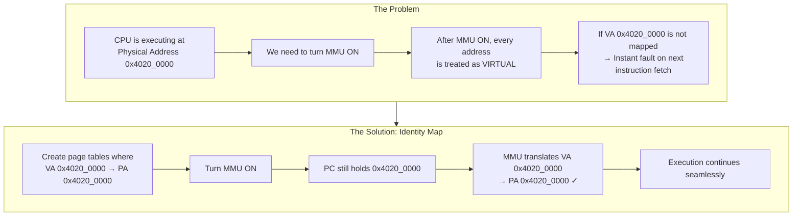

**Identity Map** means: for any address `A` in the mapped range, the MMU translates `VA = A` to `PA = A`. The CPU doesn't notice the MMU was turned on because the addresses don't change.

---

## 3. Where the Memory Comes From

### 3.1 Linker Script Reservation

From `arch/arm64/kernel/vmlinux.lds.S` (line ~274):

```lds
. = ALIGN(SEGMENT_ALIGN);
__inittext_end = .;
__initdata_begin = .;

__pi_init_idmap_pg_dir = .;          ← symbol = start of reserved region
. += INIT_IDMAP_DIR_SIZE;            ← advance by N pages
__pi_init_idmap_pg_end = .;          ← symbol = end of reserved region
```

### 3.2 Size Calculation

From `arch/arm64/include/asm/kernel-pgtable.h`:

```c
#define IDMAP_VA_BITS           48
#define IDMAP_LEVELS            ARM64_HW_PGTABLE_LEVELS(48)     // = 4 for 4K pages
#define IDMAP_ROOT_LEVEL        (4 - IDMAP_LEVELS)              // = 0
#define INIT_IDMAP_PGTABLE_LEVELS  (IDMAP_LEVELS - SWAPPER_SKIP_LEVEL)

#define INIT_IDMAP_DIR_PAGES    (EARLY_PAGES(INIT_IDMAP_PGTABLE_LEVELS,
                                             KIMAGE_VADDR, kimage_limit, 1))
#define INIT_IDMAP_DIR_SIZE     ((INIT_IDMAP_DIR_PAGES + EARLY_IDMAP_EXTRA_PAGES) * PAGE_SIZE)
```

For a typical **4K page, 48-bit VA** configuration:
- 4 levels of translation (L0 → L1 → L2 → L3)
- But kernel uses **2MB block mappings** at L2, so only 3 levels are walked
- Typically **5-8 pages** (20-32 KB) reserved

### 3.3 Memory Origin Chain

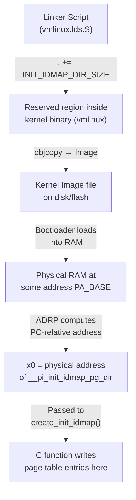

| Property | Detail |
|---|---|
| **Defined in** | Linker script `vmlinux.lds.S` |
| **Allocation method** | Static — linker advances `.` cursor |
| **Memory type** | Physical RAM, inside kernel image footprint |
| **Section** | `.initdata` (between `__initdata_begin` and `__initdata_end`) |
| **Initialized?** | Zero (part of init data, cleared by bootloader/decompressor) |
| **Lifetime** | Boot only — freed after `start_kernel()` completes init |
| **Size** | `INIT_IDMAP_DIR_SIZE` (~5-8 pages for typical config) |

---

## 4. Position in Kernel Memory Layout

```
Kernel Image in Physical RAM
┌─────────────────────────────────────────────────────┐
│ _text              .head.text (Image header)        │
│ _stext             .text (kernel code)              │
│ _etext                                              │
│                    .rodata (read-only data)          │
│                    .rodata.text:                     │
│                      __idmap_text_start              │
│                        primary_entry                 │
│                        __enable_mmu                  │
│                        __primary_switch              │
│                      __idmap_text_end                │
│                    idmap_pg_dir    (1 page)          │
│                    reserved_pg_dir (1 page)          │
│                    swapper_pg_dir  (1 page)          │
│                                                     │
│ __init_begin       .init.text                       │
│ __inittext_end                                      │
│ __initdata_begin                                    │
│                                                     │
│  ┌─────────────────────────────────────────────┐    │
│  │  __pi_init_idmap_pg_dir  ◄── HERE           │    │
│  │                                             │    │
│  │  Page 0: L0 (PGD) root table               │    │
│  │  Page 1: L1 (PUD) table                    │    │
│  │  Page 2: L2 (PMD) table (text mapping)     │    │
│  │  Page 3: L2 (PMD) table (data mapping)     │    │
│  │  Page 4+: additional tables if needed       │    │
│  │                                             │    │
│  │  __pi_init_idmap_pg_end                     │    │
│  └─────────────────────────────────────────────┘    │
│                                                     │
│                    .init.data                       │
│ __initdata_end                                      │
│                    .data (read-write data)           │
│ _edata                                              │
│ __bss_start        BSS (zero-init)                  │
│                    __pi_init_pg_dir (kernel PTs)    │
│                    4KB stack region                  │
│                    early_init_stack (TOP)            │
│ _end                                                │
└─────────────────────────────────────────────────────┘
```

---

## 5. ARMv8 MMU Hardware — How Page Tables Work

### 5.1 Translation Table Walk (4K granule, 48-bit VA)

When the MMU is enabled, the CPU hardware **automatically** walks the page tables on every memory access (if TLB misses). No software involvement per access.

```
  Virtual Address (48 bits used):
  ┌──────────┬──────────┬──────────┬──────────┬──────────┐
  │  L0 idx  │  L1 idx  │  L2 idx  │  L3 idx  │  offset  │
  │ [47:39]  │ [38:30]  │ [29:21]  │ [20:12]  │ [11:0]   │
  │  9 bits  │  9 bits  │  9 bits  │  9 bits  │ 12 bits  │
  └────┬─────┴────┬─────┴────┬─────┴────┬─────┴──────────┘
       │          │          │          │
       ▼          ▼          ▼          ▼
    TTBR0 ──→ L0 Table ──→ L1 Table ──→ L2 Table ──→ Physical Address
    (register)  (PGD)       (PUD)       (PMD)
                512×8B      512×8B      512×8B
                = 4KB       = 4KB       = 4KB
```

Each level:
- One 4KB page containing **512 entries** ($2^9 = 512$)
- Each entry is **8 bytes** ($512 \times 8 = 4096$ bytes = 1 page)
- Bits [47:12] of the VA are split into four 9-bit indices, one per level

### 5.2 Address Sizes at Each Level

| Level | Index Bits | Each Entry Maps | Block Size |
|---|---|---|---|
| L0 (PGD) | [47:39] | 512 GB | No block mapping allowed |
| L1 (PUD) | [38:30] | 1 GB | 1 GB block (if supported) |
| L2 (PMD) | [29:21] | 2 MB | **2 MB block** (commonly used) |
| L3 (PTE) | [20:12] | 4 KB | 4 KB page (finest granularity) |

The identity map typically uses **2MB block descriptors at L2** for the kernel image, so the walk is: L0 → L1 → L2 (stops here, no L3).

### 5.3 Page Table Descriptor Format

Each 8-byte entry in a page table has this format:

```
 63  54 53    48 47                  12 11  2  1  0
┌──────┬───────┬──────────────────────┬──────┬─────┐
│Upper │  Res  │  Output Address      │Lower │Type │
│attrs │       │  [47:12]             │attrs │     │
└──────┴───────┴──────────────────────┴──────┴─────┘
```

**Type field (bits [1:0]):**

| Bits | Meaning |
|---|---|
| `0b00` | Invalid (fault on access) |
| `0b01` | Block descriptor (L1: 1GB, L2: 2MB) |
| `0b11` | Table descriptor (L0/L1/L2) or Page descriptor (L3) |

**Key attribute bits:**

| Bit | Name | Purpose |
|---|---|---|
| [1:0] | Type | Table / Block / Page / Invalid |
| [4:2] | AttrIndx | Index into MAIR_EL1 (cacheability) |
| [6] | AP[1] | Access Permission: 0=RW, 1=RO |
| [7] | AP[2] | 0=EL1 only, 1=EL0+EL1 |
| [9:8] | SH | Shareability: 0b10=Outer, 0b11=Inner |
| [10] | AF | Access Flag (must be 1 or hardware fault) |
| [52] | Contiguous | Hint that adjacent entries map contiguous PA |
| [53] | PXN | Privileged Execute Never |
| [54] | UXN/XN | Unprivileged/Execute Never |

---

## 6. What Happens Step-by-Step in `primary_entry`

### 6.1 Assembly Code (lines 89-94 of head.S)

```asm
adrp    x0, __pi_init_idmap_pg_dir   // x0 = PA of page table memory
mov     x1, xzr                       // x1 = 0 (no attribute clear mask)
bl      __pi_create_init_idmap        // call C function
```

### 6.2 Flow Diagram

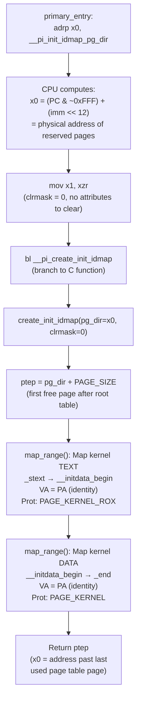

---

## 7. `create_init_idmap()` — The C Function

From `arch/arm64/kernel/pi/map_range.c`:

```c
asmlinkage phys_addr_t __init create_init_idmap(pgd_t *pg_dir, ptdesc_t clrmask)
{
    // First free page for sub-tables starts right after root table
    phys_addr_t ptep = (phys_addr_t)pg_dir + PAGE_SIZE;

    pgprot_t text_prot = PAGE_KERNEL_ROX;   // Read-Only + Executable
    pgprot_t data_prot = PAGE_KERNEL;        // Read-Write + No Execute

    pgprot_val(text_prot) &= ~clrmask;
    pgprot_val(data_prot) &= ~clrmask;

    // Map kernel text: VA == PA (identity)
    map_range(&ptep, (u64)_stext, (u64)__initdata_begin,
              (phys_addr_t)_stext, text_prot, IDMAP_ROOT_LEVEL,
              (pte_t *)pg_dir, false, 0);

    // Map kernel data+BSS: VA == PA (identity)
    map_range(&ptep, (u64)__initdata_begin, (u64)_end,
              (phys_addr_t)__initdata_begin, data_prot, IDMAP_ROOT_LEVEL,
              (pte_t *)pg_dir, false, 0);

    return ptep;
}
```

### 7.1 Two Regions Mapped

| Region | Start | End | Protection | Why |
|---|---|---|---|---|
| **Text** | `_stext` | `__initdata_begin` | `PAGE_KERNEL_ROX` | Executable code — should not be writable |
| **Data** | `__initdata_begin` | `_end` | `PAGE_KERNEL` | Data, BSS, page tables, stack — writable, not executable |

### 7.2 The Linear Bump Allocator

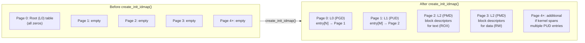

`ptep` acts as a simple bump allocator:
1. Starts at `pg_dir + PAGE_SIZE` (Page 1)
2. Each time `map_range()` needs a new sub-level table, it uses memory at `*ptep` and advances `ptep` by one page worth of entries
3. No `malloc`, no free list — just a pointer moving forward through pre-reserved memory

---

## 8. `map_range()` — Building the Translation Tree

From `arch/arm64/kernel/pi/map_range.c`:

```c
void __init map_range(phys_addr_t *pte, u64 start, u64 end, phys_addr_t pa,
                      pgprot_t prot, int level, pte_t *tbl,
                      bool may_use_cont, u64 va_offset)
{
    while (start < end) {
        u64 next = min((start | lmask) + 1, PAGE_ALIGN(end));

        if (level < 2 || needs_finer_grained_mapping) {
            // Create TABLE DESCRIPTOR → points to next level
            if (pte_none(*tbl)) {
                *tbl = __pte(__phys_to_pte_val(*pte) | PMD_TYPE_TABLE);
                *pte += PTRS_PER_PTE * sizeof(pte_t);  // consume one page
            }
            // Recurse into next level
            map_range(pte, start, next, pa, prot, level + 1, ...);
        } else {
            // Create BLOCK DESCRIPTOR → maps 2MB directly to PA
            *tbl = __pte(__phys_to_pte_val(pa) | protval);
        }
        pa += next - start;
        start = next;
        tbl++;
    }
}
```

### 8.1 Recursive Table Building

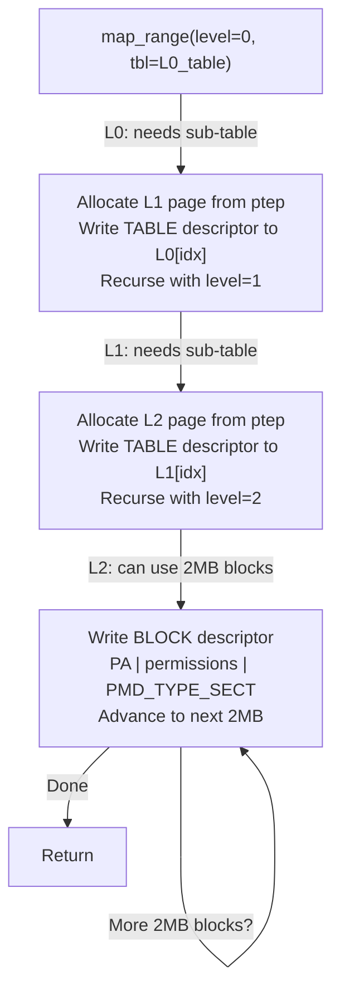

---

## 9. Concrete Example: What Gets Written to Memory

Suppose the kernel is loaded at physical address `0x4020_0000` and is 20MB in size.

### 9.1 Address Decomposition

```
PA = 0x0000_0000_4020_0000

L0 index = [47:39] = 0x000 = 0       → L0 table entry [0]
L1 index = [38:30] = 0x001 = 1       → L1 table entry [1]
L2 index = [29:21] = 0x001 = 1       → L2 table entry [1] (first 2MB block)
                                        entry [2] (second 2MB block)
                                        ... up to entry [10] (10 × 2MB = 20MB)
```

### 9.2 Descriptors Written

```
L0 Table (Page 0 of __pi_init_idmap_pg_dir):
┌────────┬──────────────────────────────────────────────────────┐
│ Entry  │ Value                                                │
├────────┼──────────────────────────────────────────────────────┤
│ [0]    │ PA_of_L1_page | PMD_TYPE_TABLE | PMD_TABLE_UXN      │
│ [1-511]│ 0x0000_0000_0000_0000  (invalid)                    │
└────────┴──────────────────────────────────────────────────────┘

L1 Table (Page 1):
┌────────┬──────────────────────────────────────────────────────┐
│ Entry  │ Value                                                │
├────────┼──────────────────────────────────────────────────────┤
│ [0]    │ 0x0000_0000_0000_0000  (invalid)                    │
│ [1]    │ PA_of_L2_page | PMD_TYPE_TABLE | PMD_TABLE_UXN      │
│ [2-511]│ 0x0000_0000_0000_0000  (invalid)                    │
└────────┴──────────────────────────────────────────────────────┘

L2 Table (Page 2) — TEXT region (ROX):
┌────────┬──────────────────────────────────────────────────────┐
│ Entry  │ Value                                                │
├────────┼──────────────────────────────────────────────────────┤
│ [1]    │ 0x4020_0000 | AP_RO | PXN=0 | UXN=1 | AF | SH |   │
│        │ AttrIndx(WB) | PMD_TYPE_SECT    → 2MB block: ROX    │
│ [2]    │ 0x4040_0000 | ... same flags ... → next 2MB         │
│ [3]    │ 0x4060_0000 | ... → text continues                  │
│ ...    │ ...                                                  │
└────────┴──────────────────────────────────────────────────────┘

L2 Table (Page 2 or 3) — DATA region (RW):
┌────────┬──────────────────────────────────────────────────────┐
│ Entry  │ Value                                                │
├────────┼──────────────────────────────────────────────────────┤
│ [K]    │ PA | AP_RW | PXN=1 | UXN=1 | AF | SH |             │
│        │ AttrIndx(WB) | PMD_TYPE_SECT    → 2MB block: RW+NX  │
│ [K+1]  │ next 2MB block ...                                  │
│ ...    │ ... until _end is covered                            │
└────────┴──────────────────────────────────────────────────────┘
```

---

## 10. Hardware Walk — What the CPU Does per Memory Access

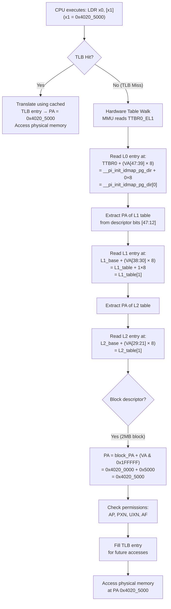

### 10.1 Hardware Actions at Each Step

| Step | What Hardware Does | Registers/Units Involved |
|---|---|---|
| 1 | Read `TTBR0_EL1` to get L0 table base | MMU Translation Control |
| 2 | Compute L0 entry address: `TTBR0 + VA[47:39] × 8` | Address generation unit |
| 3 | **Read 8 bytes from physical memory** (L0 descriptor) | Memory bus, cache hierarchy |
| 4 | Extract next-level PA from descriptor bits [47:12] | MMU logic |
| 5 | Compute L1 entry address: `L1_PA + VA[38:30] × 8` | Address generation |
| 6 | **Read 8 bytes from physical memory** (L1 descriptor) | Memory bus |
| 7 | Compute L2 entry address: `L2_PA + VA[29:21] × 8` | Address generation |
| 8 | **Read 8 bytes from physical memory** (L2 descriptor) | Memory bus |
| 9 | Detect Block descriptor (type = 0b01) | MMU logic |
| 10 | Combine: `Block_PA[47:21] : VA[20:0]` → final PA | Concatenation logic |
| 11 | Check AP, PXN, UXN bits against access type | Permission check unit |
| 12 | Store in TLB for future reuse | TLB fill logic |

**Total: 3 memory reads** for a TLB miss with 3-level walk (L0→L1→L2 block). All done in silicon — no software trap or exception.

---

## 11. System Registers Involved

### 11.1 Registers Set Before/During MMU Enable

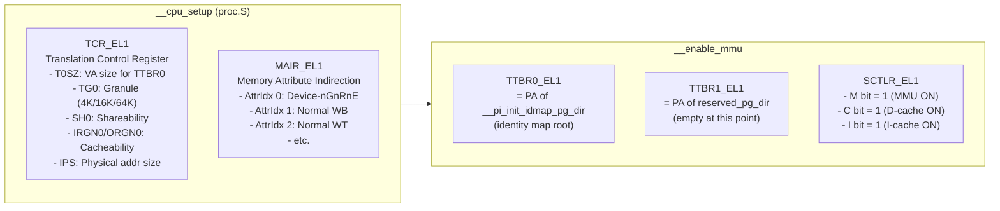

### 11.2 How TCR_EL1 Controls the Walk

```
TCR_EL1:
┌───────┬──────┬──────┬───────┬────────┬────────┬──────────┐
│  IPS  │  TG0 │ SH0  │ORGN0  │ IRGN0  │  T0SZ  │  ...     │
│[34:32]│[15:14│[13:12│[11:10] │ [9:8]  │ [5:0]  │          │
└───────┴──────┴──────┴───────┴────────┴────────┴──────────┘

T0SZ = 16 → TTBR0 covers 48-bit VA range (64 - 16 = 48)
TG0  = 0b00 → 4KB granule
IPS  = 0b101 → 48-bit physical address space
SH0  = 0b11 → Inner Shareable
IRGN0 = 0b01 → Inner Write-Back Cacheable
ORGN0 = 0b01 → Outer Write-Back Cacheable
```

These tell the MMU hardware:
- How many bits of VA to translate (T0SZ)
- What page size to use (TG0)
- How to cache the page table walks (SH, IRGN, ORGN)
- Maximum physical address width (IPS)

---

## 12. TTBR0 vs TTBR1 — Two Worlds

ARM64 uses the **top bit of the VA** to select which TTBR to use:

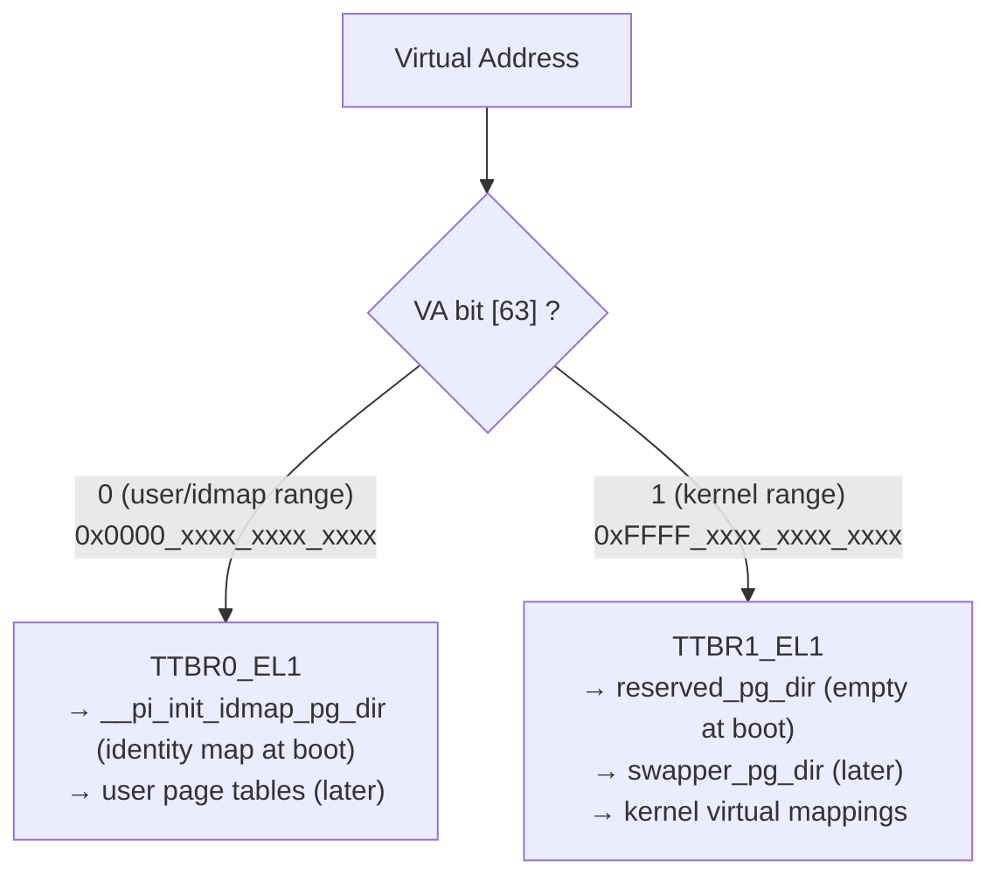

| Register | VA Range | Boot Usage | Runtime Usage |
|---|---|---|---|
| `TTBR0_EL1` | `0x0000_0000_0000_0000` – `0x0000_FFFF_FFFF_FFFF` | Identity map (VA=PA) | User-space page tables |
| `TTBR1_EL1` | `0xFFFF_0000_0000_0000` – `0xFFFF_FFFF_FFFF_FFFF` | Empty (reserved_pg_dir) | Kernel virtual map (swapper_pg_dir) |

The identity map uses TTBR0 because physical addresses (e.g., `0x4020_0000`) fall in the lower half of the VA space.

---

## 13. Cache Maintenance After Page Table Creation

After `create_init_idmap()` returns, `primary_entry` performs cache maintenance:

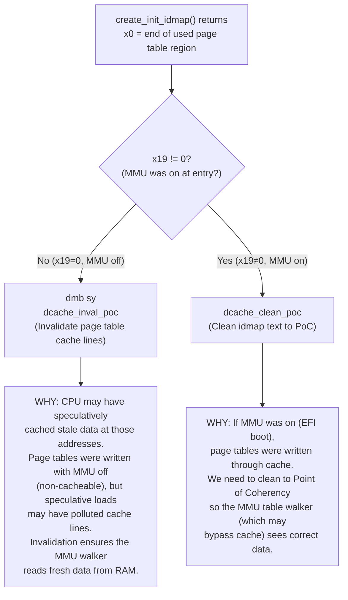

### Why This Matters at Hardware Level

The ARM64 MMU table walker can be configured to access page tables through the cache hierarchy or bypass it, controlled by TCR_EL1.IRGN0/ORGN0. The cache maintenance ensures consistency between:

1. **What the CPU cores wrote** (through their cache hierarchy)
2. **What the MMU walker will read** (may or may not go through the same cache path)

---

## 14. The Complete `__enable_mmu` Path

From `head.S` (`__primary_switch` calls this):

```asm
__primary_switch:
    adrp    x1, reserved_pg_dir          // TTBR1 = empty page dir
    adrp    x2, __pi_init_idmap_pg_dir   // TTBR0 = identity map
    bl      __enable_mmu                 // TURN MMU ON

__enable_mmu:
    // Check granule support
    mrs     x3, ID_AA64MMFR0_EL1
    // ... validate granule ...

    phys_to_ttbr x2, x2
    msr     ttbr0_el1, x2              // Load identity map into TTBR0
    load_ttbr1 x1, x1, x3             // Load reserved_pg_dir into TTBR1

    set_sctlr_el1 x0                  // Set SCTLR_EL1.M=1 → MMU ON!

    ret                                // ← This RET works because
                                       //    the return address (in LR) is
                                       //    identity-mapped: VA == PA
```

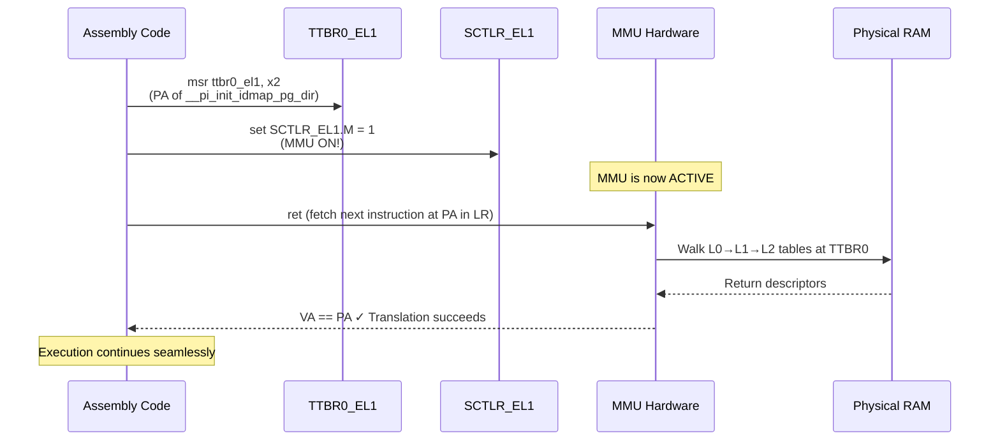

---

## 15. Lifecycle of `__pi_init_idmap_pg_dir`

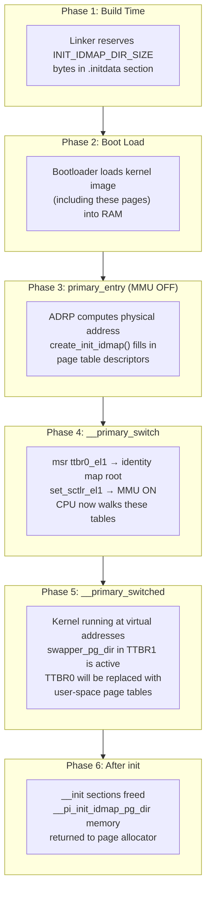

---

## 16. Summary

| Aspect | Detail |
|---|---|
| **What** | Pre-allocated memory region holding the first-ever page tables |
| **Where** | Inside kernel image, in `.initdata` section, between `__initdata_begin` and `.init.data` |
| **How allocated** | Linker script: `. += INIT_IDMAP_DIR_SIZE` (static, no runtime allocator) |
| **How populated** | C function `create_init_idmap()` writes 8-byte descriptors using a bump allocator |
| **What it maps** | Entire kernel image: `_stext` → `_end`, VA == PA (identity) |
| **Permissions** | Text: Read-Only + Executable; Data: Read-Write + No-Execute |
| **Used by hardware** | MMU reads these tables via `TTBR0_EL1` on every TLB miss |
| **Walk depth** | Typically 3 levels: L0 → L1 → L2 (2MB blocks) |
| **Lifetime** | Boot only — replaced by `swapper_pg_dir` (TTBR1) and user page tables (TTBR0) |
| **Why identity map** | PC doesn't change when MMU turns on; VA must equal PA at that instant |
