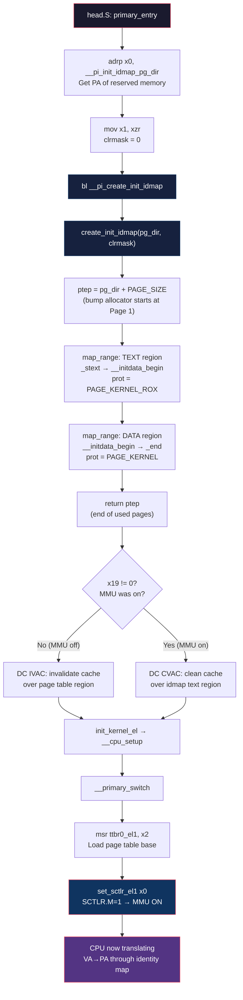
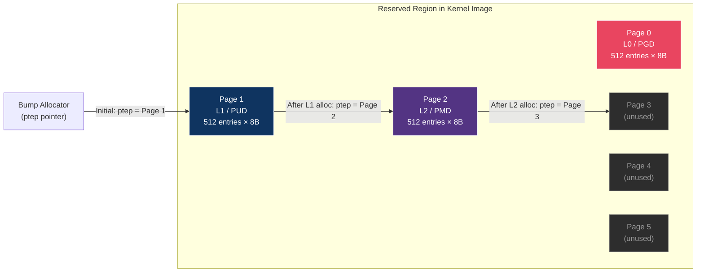
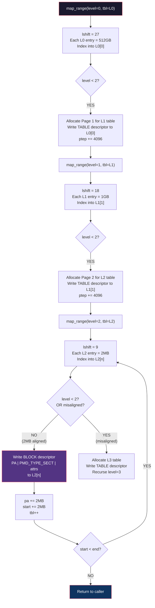
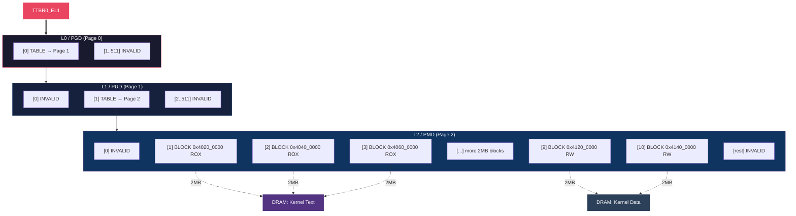
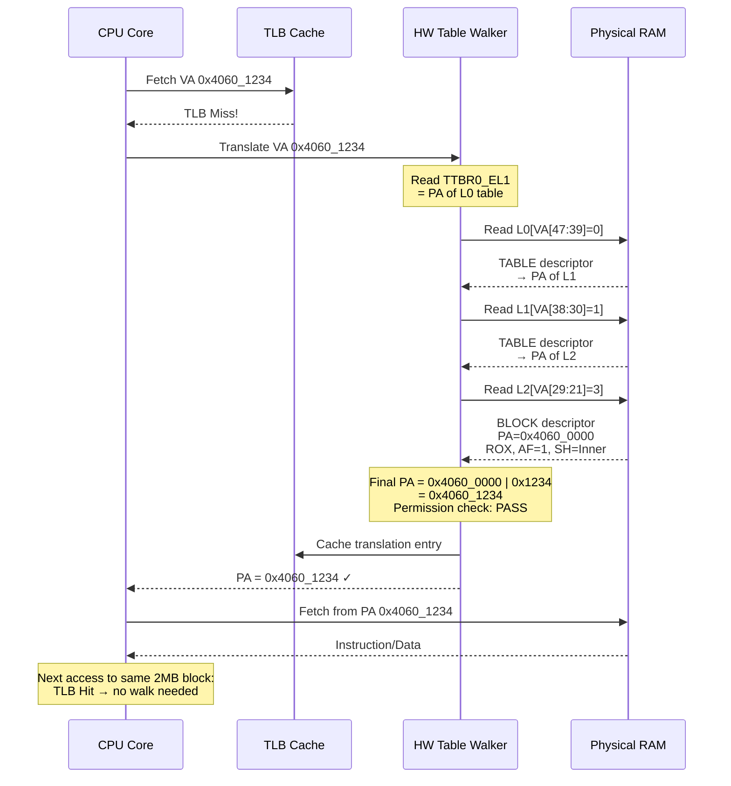
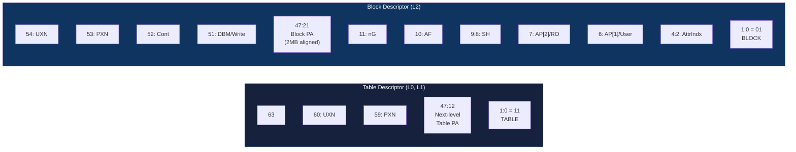

# `__pi_init_idmap_pg_dir` — Complete Internals Deep Dive

## Table of Contents
- [Overview](#overview)
- [Step 0: The Assembly Call Site](#step-0-the-assembly-call-site)
- [Step 1: Memory Reserved at Build Time (Linker Script)](#step-1-memory-reserved-at-build-time-linker-script)
- [Step 2: Size Calculation Macros](#step-2-size-calculation-macros)
- [Step 3: create_init_idmap() — The Entry Point](#step-3-create_init_idmap--the-entry-point)
- [Step 4: map_range() — Line-by-Line Walkthrough](#step-4-map_range--line-by-line-walkthrough)
- [Step 5: Complete Memory State After create_init_idmap()](#step-5-complete-memory-state-after-create_init_idmap)
- [Step 6: What the CPU MMU Hardware Does with This](#step-6-what-the-cpu-mmu-hardware-does-with-this)
- [Step 7: Cache Maintenance](#step-7-cache-maintenance)
- [Summary](#summary)
- [Mermaid Diagrams](#mermaid-diagrams)

---

## Overview

`__pi_init_idmap_pg_dir` is the **identity map page directory** — a set of ARM64 page tables where **VA == PA** (virtual address equals physical address). It is the first page table the kernel builds, used to safely turn on the MMU during early boot.

**Source files involved:**
- `arch/arm64/kernel/head.S` — assembly call site
- `arch/arm64/kernel/vmlinux.lds.S` — linker script (memory reservation)
- `arch/arm64/kernel/pi/map_range.c` — `create_init_idmap()` and `map_range()`
- `arch/arm64/include/asm/kernel-pgtable.h` — size calculation macros
- `arch/arm64/include/asm/pgtable-hwdef.h` — hardware page table definitions
- `arch/arm64/include/asm/pgtable-prot.h` — protection attribute definitions

---

## Step 0: The Assembly Call Site

```asm
adrp    x0, __pi_init_idmap_pg_dir   // x0 = physical address of reserved memory
mov     x1, xzr                       // x1 = 0 (no attribute bits to clear)
bl      __pi_create_init_idmap        // call into C
```

### How `ADRP` works at hardware level:
- **Instruction**: `ADRP Xd, label`
- **Computation**: `Xd = (PC & ~0xFFF) + (imm21 << 12)`
- **Result**: A PC-relative, 4KB-aligned physical address
- **Why it works**: MMU is OFF, so PC contains the physical address of the currently executing instruction. The `ADRP` result is therefore a raw physical address pointing into DRAM.

---

## Step 1: Memory Reserved at Build Time (Linker Script)

In `arch/arm64/kernel/vmlinux.lds.S` (line ~274):

```lds
__pi_init_idmap_pg_dir = .;       // symbol = current position counter
. += INIT_IDMAP_DIR_SIZE;         // advance by N pages
__pi_init_idmap_pg_end = .;
```

### What actually happens:
1. **No code runs.** The linker simply moves its position counter (`.`) forward.
2. This creates a **"hole"** — a reserved region inside the kernel binary.
3. This region is in the `.initdata` section (zero-initialized by the bootloader).
4. When the bootloader loads the kernel Image into RAM, this region becomes **real physical memory filled with zeros**.

### Key insight:
> **The memory for identity map page tables is NOT dynamically allocated. It is statically reserved at build/link time.** There is no heap, no `malloc`, no free list — just a pre-sized chunk of the kernel image.

---

## Step 2: Size Calculation Macros

From `arch/arm64/include/asm/kernel-pgtable.h` and `arch/arm64/include/asm/pgtable-hwdef.h`:

### Fundamental Constants (4K pages):

| Constant | Formula | Value | Meaning |
|---|---|---|---|
| `PAGE_SHIFT` | — | 12 | log2(4096) |
| `PAGE_SIZE` | `1 << 12` | 4096 | 4KB pages |
| `PTDESC_ORDER` | — | 3 | log2(sizeof(pte_t)) = log2(8) |
| `PTDESC_TABLE_SHIFT` | `PAGE_SHIFT - PTDESC_ORDER` | 9 | 9 index bits per level → 512 entries |
| `PTRS_PER_PTE` | `1 << 9` | 512 | Entries per page table page |
| `IDMAP_VA_BITS` | — | 48 | Virtual address space for identity map |

### Level Calculation:

```
IDMAP_LEVELS = ARM64_HW_PGTABLE_LEVELS(48)
             = ((48) - 3 - 1) / 9
             = 44 / 9
             = 4                           // 4 levels of page tables

IDMAP_ROOT_LEVEL = 4 - IDMAP_LEVELS
                 = 4 - 4
                 = 0                       // walk starts at level 0 (PGD)
```

### What each level covers:

| Level | Shift | Each entry maps | Name |
|---|---|---|---|
| L0 (PGD) | `(4-0)*9 + 3 = 39` | 2^39 = 512 GB | Page Global Directory |
| L1 (PUD) | `(4-1)*9 + 3 = 30` | 2^30 = 1 GB | Page Upper Directory |
| L2 (PMD) | `(4-2)*9 + 3 = 21` | 2^21 = 2 MB | Page Middle Directory |
| L3 (PTE) | `(4-3)*9 + 3 = 12` | 2^12 = 4 KB | Page Table Entry |

### Size of reserved region:

```c
// We use 2MB block mappings (PMD_SIZE), so only 3 levels needed (L0→L1→L2 blocks):
SWAPPER_SKIP_LEVEL = 1   // because PMD_SIZE=2MB ≤ MIN_KIMG_ALIGN=2MB
INIT_IDMAP_PGTABLE_LEVELS = 4 - 1 = 3

// Number of pages needed:
EARLY_PAGES(3, KIMAGE_VADDR, kimage_limit, 1) =
    1                           // root PGD page (L0)
    + EARLY_LEVEL(3, ...)       // = 0 (no L3 — using block mappings)
    + EARLY_LEVEL(2, ...)       // L2 tables spanning kernel + 1 extra
    + EARLY_LEVEL(1, ...)       // L1 tables spanning kernel + 1 extra

// Typical result: ~5-6 pages (20-24 KB)
INIT_IDMAP_DIR_SIZE = (INIT_IDMAP_DIR_PAGES + EARLY_IDMAP_EXTRA_PAGES) * PAGE_SIZE
```

---

## Step 3: `create_init_idmap()` — The Entry Point

From `arch/arm64/kernel/pi/map_range.c`:

```c
asmlinkage phys_addr_t __init create_init_idmap(pgd_t *pg_dir, ptdesc_t clrmask)
{
    phys_addr_t ptep = (phys_addr_t)pg_dir + PAGE_SIZE;
```

### The Bump Allocator:
- `ptep` is the **bump allocator pointer** — the simplest possible memory allocator.
- It starts at `pg_dir + PAGE_SIZE` (Page 0 is the root PGD; Page 1+ are available for sub-tables).
- Each time a new table page is needed, `ptep` is advanced by `PTRS_PER_PTE * sizeof(pte_t)` = `512 * 8` = `4096` bytes (one page).
- **No free operation.** Memory is consumed linearly and never returned.

### Protection attributes:

```c
    pgprot_t text_prot = PAGE_KERNEL_ROX;
    pgprot_t data_prot = PAGE_KERNEL;
```

These expand to (from `pgtable-prot.h`):

#### `PAGE_KERNEL_ROX` (for kernel text — read-only, executable):
```
= (PROT_NORMAL & ~(PTE_WRITE | PTE_PXN)) | PTE_RDONLY | PTE_DIRTY
= PTE_TYPE_PAGE | PTE_AF | PTE_SHARED | PTE_ATTRINDX(MT_NORMAL)
  | PTE_UXN | PTE_RDONLY | PTE_DIRTY
  (PTE_PXN=0 → privileged code CAN execute)
  (PTE_UXN=1 → user code CANNOT execute)
```

#### `PAGE_KERNEL` (for kernel data — read-write, non-executable):
```
= PROT_NORMAL | PTE_DIRTY
= PTE_TYPE_PAGE | PTE_AF | PTE_SHARED | PTE_ATTRINDX(MT_NORMAL)
  | PTE_PXN | PTE_UXN | PTE_WRITE | PTE_DIRTY
  (PTE_PXN=1 → NO execute)
  (PTE_UXN=1 → NO execute)
```

### Two `map_range()` calls create two identity-mapped regions:

```c
    // TEXT: _stext → __initdata_begin (code — read-only, executable)
    map_range(&ptep, (u64)_stext, (u64)__initdata_begin,
              (phys_addr_t)_stext,     // PA = VA (identity mapping!)
              text_prot, IDMAP_ROOT_LEVEL,
              (pte_t *)pg_dir, false, 0);

    // DATA: __initdata_begin → _end (data — read-write, non-executable)
    map_range(&ptep, (u64)__initdata_begin, (u64)_end,
              (phys_addr_t)__initdata_begin,  // PA = VA (identity mapping!)
              data_prot, IDMAP_ROOT_LEVEL,
              (pte_t *)pg_dir, false, 0);

    return ptep;  // address past the last used page (returned to assembly in x0)
```

**Critical detail**: `start` (VA) == `pa` (PA). That's what makes this an identity map — the MMU will translate `VA → PA` where both addresses are identical.

---

## Step 4: `map_range()` — Line-by-Line Walkthrough

```c
void __init map_range(phys_addr_t *pte, u64 start, u64 end, phys_addr_t pa,
                      pgprot_t prot, int level, pte_t *tbl,
                      bool may_use_cont, u64 va_offset)
```

### Parameters for first call (text mapping):

| Parameter | Value | Meaning |
|---|---|---|
| `*pte` | `pg_dir + 4096` | Bump allocator — next free page |
| `start` | `_stext` (e.g., `0x4020_0000`) | Virtual address start |
| `end` | `__initdata_begin` (e.g., `0x4120_0000`) | Virtual address end |
| `pa` | `_stext` (e.g., `0x4020_0000`) | Physical address = same (identity) |
| `prot` | `PAGE_KERNEL_ROX` | Read-only, executable |
| `level` | `0` (IDMAP_ROOT_LEVEL) | Start at L0 |
| `tbl` | `pg_dir` | Root page table (L0) |
| `may_use_cont` | `false` | No contiguous hint |
| `va_offset` | `0` | No VA/PA offset (MMU off) |

### Step-by-step execution:

#### 1. Contiguous mask setup:
```c
u64 cmask = (level == 3) ? CONT_PTE_SIZE - 1 : U64_MAX;
// At level 0: cmask = U64_MAX (contiguous hint not applicable)
```

#### 2. Strip type bits from protection value:
```c
ptdesc_t protval = pgprot_val(prot) & ~PTE_TYPE_MASK;
// Strips bits [1:0]. The type (TABLE/BLOCK/PAGE) is set separately.
```

#### 3. Calculate shift and mask for this level:
```c
int lshift = (3 - level) * PTDESC_TABLE_SHIFT;
// At L0: (3-0) * 9 = 27

u64 lmask = (PAGE_SIZE << lshift) - 1;
// At L0: (4096 << 27) - 1 = 0x7F_FFFF_FFFF (512GB - 1)
```

#### 4. Index into the correct entry:
```c
start &= PAGE_MASK;     // align down to page boundary
pa    &= PAGE_MASK;

tbl += (start >> (lshift + PAGE_SHIFT)) % PTRS_PER_PTE;
// At L0: (0x4020_0000 >> 39) % 512 = 0 → L0[0]
```

#### 5. Set descriptor type for leaf entries:
```c
if (protval)
    protval |= (level == 2) ? PMD_TYPE_SECT : PTE_TYPE_PAGE;
// At L0: adds PTE_TYPE_PAGE (bits = 0b11)
// But at L0 we recurse, so this won't be used as a leaf descriptor
```

#### 6. The Main Loop — Creating Table and Block Descriptors:

```c
while (start < end) {
    u64 next = min((start | lmask) + 1, PAGE_ALIGN(end));
    // At L0: next = min(0x80_0000_0000, end) = end (kernel < 512GB)
```

##### Decision: Table descriptor or block descriptor?

```c
    if (level < 2 || (level == 2 && (start | next | pa) & lmask)) {
        // At level 0: level < 2 → TRUE → must create a sub-table
```

##### Allocating a new sub-table page:

```c
        if (pte_none(*tbl)) {
            // tbl points to L0[0], which is zero (invalid entry)

            // Write a TABLE descriptor pointing to the newly allocated page:
            *tbl = __pte(__phys_to_pte_val(*pte) | PMD_TYPE_TABLE | PMD_TABLE_UXN);
            //     ↑ descriptor = PA_of_next_free_page | type=TABLE(0b11) | UXN(bit 60)

            // Advance the bump allocator by one page:
            *pte += PTRS_PER_PTE * sizeof(pte_t);
            //    += 512 * 8 = 4096
        }
```

**What was just written to memory (8-byte Table Descriptor):**

```
Bit layout:
 63      60  59      12 11  2  1:0
┌────────┬───┬─────────┬─────┬────┐
│ attrs  │PXN│  PA of   │ ign │Type│
│ UXN=1  │   │ L1 table │     │ 11 │
│ bit 60 │   │ [47:12]  │     │    │
└────────┴───┴─────────┴─────┴────┘
Type = 0b11 → Table descriptor (points to next level)
UXN  = 1    → User execute never (inherited to lower levels)
PA   = physical address of the allocated L1 table page
```

##### Recurse into the newly allocated sub-table:

```c
        map_range(pte, start, next, pa, prot, level + 1,
                  (pte_t *)(__pte_to_phys(*tbl) + va_offset),
                  may_use_cont, va_offset);
        // Recurse with level+1 = 1, tbl = PA of L1 table
```

### Recursion Level 1 (L1/PUD):

Same flow with `level=1`:
- `lshift = (3-1) * 9 = 18` → each L1 entry covers 2^30 = **1 GB**
- Index: `(0x4020_0000 >> 30) % 512 = 1` → **L1[1]**
- `level < 2` → TRUE → creates another sub-table
- Allocates next free page as L2 table
- Writes table descriptor into L1[1]
- Bumps allocator forward
- Recurses with `level=2`

### Recursion Level 2 (L2/PMD) — Block Descriptors Written:

With `level=2`:
- `lshift = (3-2) * 9 = 9` → each L2 entry covers 2^21 = **2 MB**
- `lmask = (4096 << 9) - 1 = 0x1F_FFFF` (2MB - 1)

```c
    if (level < 2 || (level == 2 && (start | next | pa) & lmask)) {
        // level=2, NOT < 2
        // check: (start | next | pa) & lmask
        // If start is 2MB-aligned: 0x4020_0000 & 0x1F_FFFF = 0 → FALSE
        // → Falls through to BLOCK mapping!
```

##### Writing a Block (Section) Descriptor:

```c
    } else {
        /* Put down a block or page mapping */
        *tbl = __pte(__phys_to_pte_val(pa) | protval);
        // protval includes PMD_TYPE_SECT (0b01) + all permission/attribute bits
```

**What gets written — the 8-byte Block Descriptor:**

```
For kernel TEXT (ROX):
 63  54 53 52 51 50    21 20  12 11 10  9:8  7   6  4:2   1:0
┌─────┬──┬──┬──┬──┬──────┬──────┬──┬──┬────┬──┬──┬─────┬─────┐
│     │PXN│UXN│CT│DB│  PA  │ res  │nG│AF│ SH │RO│US│Attr │Type │
│     │ 0│ 1│ 0│ 1│[47:21│      │ 0│ 1│ 11 │ 1│ 0│ 100 │ 01  │
└─────┴──┴──┴──┴──┴──────┴──────┴──┴──┴────┴──┴──┴─────┴─────┘
 │         │              │           │  │    │     │      │
 │       No user        Physical     │Inner│ Normal   Block
 │       execute        Address      │Share│  WB     descriptor
 │                                   │able │ cache
 Privileged                         Access
 CAN execute                        Flag=1
 (PXN=0 for text)

For kernel DATA (RW):
  PXN=1 (no execute), UXN=1 (no user execute)
  AP[2]=0 (read-write), PTE_WRITE=1
  Type=01 (block/section descriptor)
```

##### Loop advances by 2MB each iteration:

```c
        pa += next - start;    // pa += 2MB
        start = next;          // start += 2MB
        tbl++;                 // move to next L2 entry
```

---

## Step 5: Complete Memory State After `create_init_idmap()`

Assuming kernel loaded at PA `0x4020_0000`, ~16MB text, ~16MB data:

```
__pi_init_idmap_pg_dir (Page 0 — L0/PGD, 4096 bytes):
┌─────────┬────────────────────────────────────────────┐
│ [0]     │ PA_of_Page1 | TABLE(0b11) | UXN            │ → points to L1
│ [1-511] │ 0x0 (invalid — no mapping)                  │
└─────────┴────────────────────────────────────────────┘

Page 1 (L1/PUD, 4096 bytes):
┌─────────┬────────────────────────────────────────────┐
│ [0]     │ 0x0 (invalid)                               │
│ [1]     │ PA_of_Page2 | TABLE(0b11) | UXN            │ → points to L2
│ [2-511] │ 0x0 (invalid)                               │
└─────────┴────────────────────────────────────────────┘

Page 2 (L2/PMD, 4096 bytes):
┌─────────┬────────────────────────────────────────────┐
│ [0]     │ 0x0 (invalid)                               │
│ [1]     │ 0x4020_0000 | SECT | AF | SH | ROX | WB    │ ← 2MB text block
│ [2]     │ 0x4040_0000 | SECT | AF | SH | ROX | WB    │ ← 2MB text block
│ [3]     │ 0x4060_0000 | SECT | AF | SH | ROX | WB    │ ← 2MB text block
│  ...    │ ... (more 2MB text blocks)                  │
│ [9]     │ 0x4120_0000 | SECT | AF | SH | RW  | WB    │ ← 2MB data block
│ [10]    │ 0x4140_0000 | SECT | AF | SH | RW  | WB    │ ← 2MB data block
│  ...    │ ... (more 2MB data blocks until _end)       │
│ [rest]  │ 0x0 (invalid)                               │
└─────────┴────────────────────────────────────────────┘
```

**Bump allocator final state**: `ptep` = `__pi_init_idmap_pg_dir + 3 * PAGE_SIZE` (3 pages consumed: PGD + PUD + PMD).

---

## Step 6: What the CPU MMU Hardware Does with This

Later in `__primary_switch`:

```asm
adrp    x2, __pi_init_idmap_pg_dir
bl      __enable_mmu

// Inside __enable_mmu:
msr     ttbr0_el1, x2      // TTBR0 = PA of __pi_init_idmap_pg_dir
set_sctlr_el1 x0           // SCTLR.M = 1 → MMU ON
```

### Hardware Translation Walk Example:

```
CPU wants to fetch instruction at VA 0x4060_1234:

Step 1: Read TTBR0_EL1 → PA of L0 table (base of __pi_init_idmap_pg_dir)

Step 2: L0 lookup
   Index = VA[47:39] = 0
   Read L0[0] from physical memory → TABLE descriptor
   Extract bits [47:12] → PA of L1 table (Page 1)

Step 3: L1 lookup
   Index = VA[38:30] = 1
   Read L1[1] from physical memory → TABLE descriptor
   Extract bits [47:12] → PA of L2 table (Page 2)

Step 4: L2 lookup
   Index = VA[29:21] = 3   (0x4060_0000 >> 21 = 3)
   Read L2[3] from physical memory → BLOCK descriptor (type=0b01)
   Extract bits [47:21] → block base PA = 0x4060_0000

Step 5: Form final physical address
   Final PA = block_PA | VA[20:0]
            = 0x4060_0000 | 0x1234
            = 0x4060_1234

Step 6: Permission checks (hardware):
   - PXN=0 → privileged execute allowed ✓
   - AP[2]=1 (RDONLY) → read allowed ✓
   - AF=1 → access flag set, no fault ✓
   - AttrIndx=MT_NORMAL → normal cacheable memory

Step 7: Cache the result in TLB (Translation Lookaside Buffer)

Step 8: Deliver data/instruction to CPU core
```

**Result**: VA `0x4060_1234` → PA `0x4060_1234`. Identity map confirmed.

---

## Step 7: Cache Maintenance

After `create_init_idmap()` returns to assembly:

### MMU was OFF path (normal boot):

```asm
cbnz    x19, 0f             // was MMU on at entry? No → fall through

dmb     sy                   // Data Memory Barrier — ensure all stores are ordered
mov     x1, x0              // x0 = ptep (end of used region)
adrp    x0, __pi_init_idmap_pg_dir  // start of page tables
adr_l   x2, dcache_inval_poc
blr     x2                   // DC IVAC — invalidate cache lines over page tables
```

**Why invalidation is needed:**
- With MMU off, the `STR` instructions that wrote descriptors went **directly to RAM** (bypassing data caches).
- But the CPU may have **speculatively loaded** those addresses into cache before the writes happened (stale zeros from when the region was uninitialized).
- The MMU hardware table walker might read those stale cached zeros instead of the fresh descriptors in RAM.
- `DC IVAC` (Data Cache Invalidate by VA to Point of Coherency) forces those cache lines to be discarded, so the next read (by the table walker) fetches fresh data from RAM.

### MMU was ON path (EFI boot):

```asm
0:  adrp    x0, __idmap_text_start
    adr_l   x1, __idmap_text_end
    adr_l   x2, dcache_clean_poc
    blr     x2                   // DC CVAC — clean cache to Point of Coherency
```

**Why cleaning is needed:**
- With MMU on, writes went through the cache hierarchy (data is in cache, may not be in RAM yet).
- The table walker needs to see the data, so we **clean** (flush) dirty cache lines to the Point of Coherency where the walker can observe them.

---

## Summary

| Aspect | How It Works |
|---|---|
| **Memory reservation** | Linker script advances `.` by `INIT_IDMAP_DIR_SIZE` — static, at build time |
| **Memory initialization** | Zeros (part of init data segment, zeroed by bootloader) |
| **Sub-table allocation** | Linear bump allocator: `ptep` starts at Page 1, advances by 4096 per table |
| **No `malloc`** | No heap, no free list, no allocator data structures |
| **No runtime sizing** | Size computed at compile time from `EARLY_PAGES()` macro |
| **Descriptor writes** | Simple pointer stores: `*tbl = __pte(physical_addr \| flags)` |
| **Physical memory only** | MMU is off — all pointers are raw physical addresses, stores go to DRAM |
| **Page table format** | ARM64 4-level: L0→L1 (table), L2 (2MB block descriptors) |
| **Identity mapping** | VA == PA everywhere — needed to survive MMU turn-on |
| **Two regions mapped** | Text (ROX: read-only, executable) + Data (RW: read-write, no-execute) |
| **Total pages consumed** | Typically 3 (PGD + PUD + PMD) for a contiguous kernel |
| **Used by** | `__enable_mmu` loads into `TTBR0_EL1` for the initial MMU-on transition |

---

## Mermaid Diagrams

### Overall Flow: Assembly → C → Hardware



### Bump Allocator — Page Consumption



### map_range() Recursive Descent



### Page Table Structure in Memory



### Hardware MMU Translation Walk



### Descriptor Bit Layout



---

## Source File References

| File | Key Content |
|---|---|
| `arch/arm64/kernel/head.S` | Assembly call site: `adrp x0, __pi_init_idmap_pg_dir` → `bl __pi_create_init_idmap` |
| `arch/arm64/kernel/vmlinux.lds.S` | Linker script: `. += INIT_IDMAP_DIR_SIZE` reserves memory statically |
| `arch/arm64/kernel/pi/map_range.c` | C code: `create_init_idmap()` entry + `map_range()` recursive builder |
| `arch/arm64/kernel/pi/pi.h` | Function declarations, `extern pgd_t init_idmap_pg_dir[]` |
| `arch/arm64/include/asm/kernel-pgtable.h` | Size macros: `INIT_IDMAP_DIR_SIZE`, `EARLY_PAGES()`, `IDMAP_LEVELS` |
| `arch/arm64/include/asm/pgtable-hwdef.h` | Hardware definitions: `PMD_TYPE_SECT`, `PMD_TYPE_TABLE`, `PTE_TYPE_PAGE`, `PTRS_PER_PTE` |
| `arch/arm64/include/asm/pgtable-prot.h` | Protection attributes: `PAGE_KERNEL_ROX`, `PAGE_KERNEL`, `PROT_NORMAL` |
