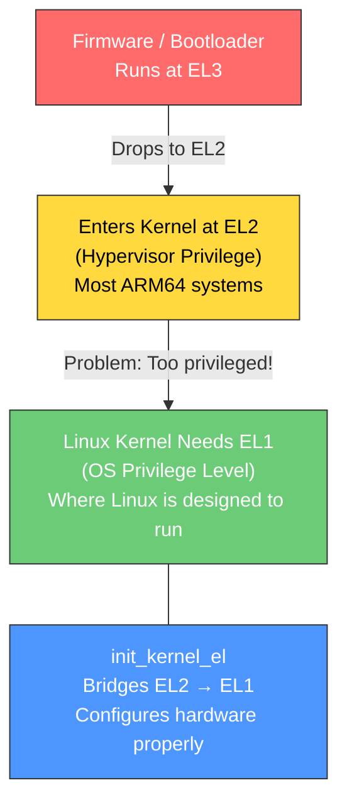
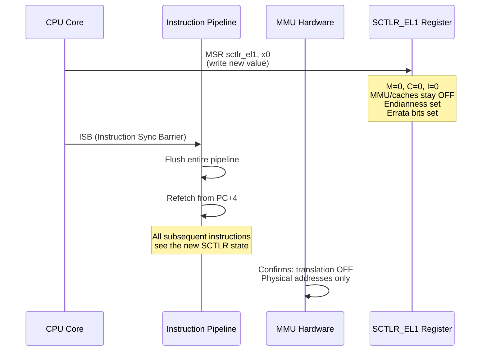
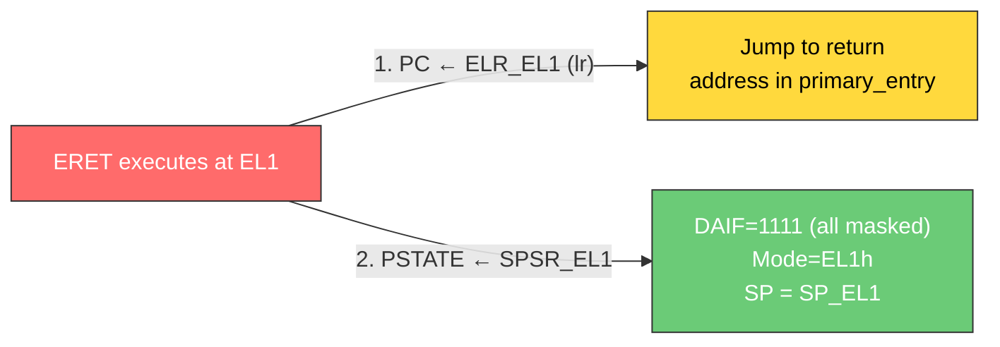
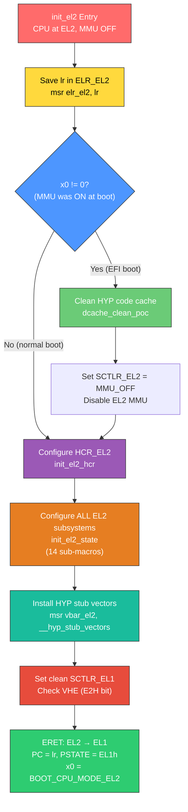
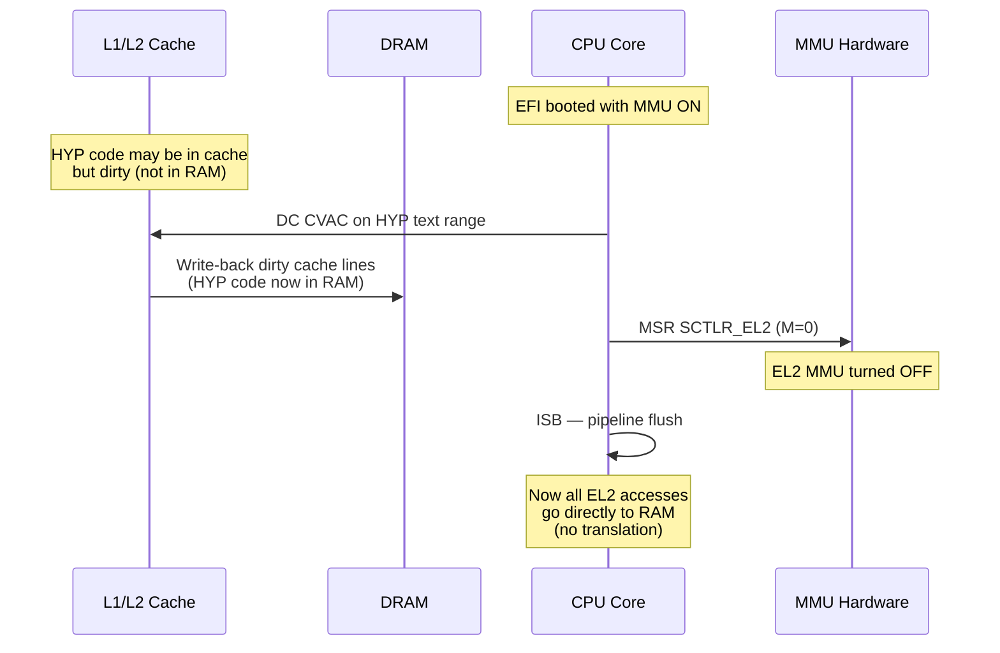
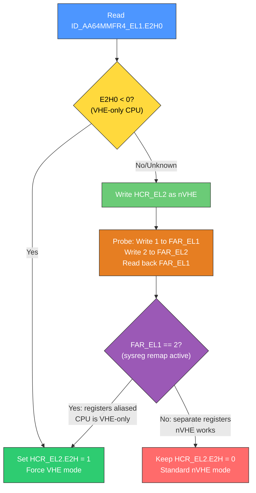
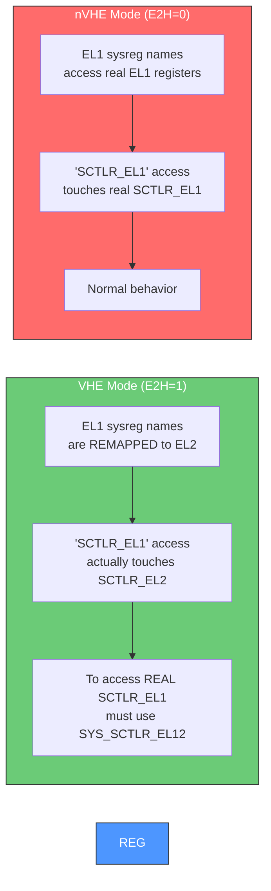
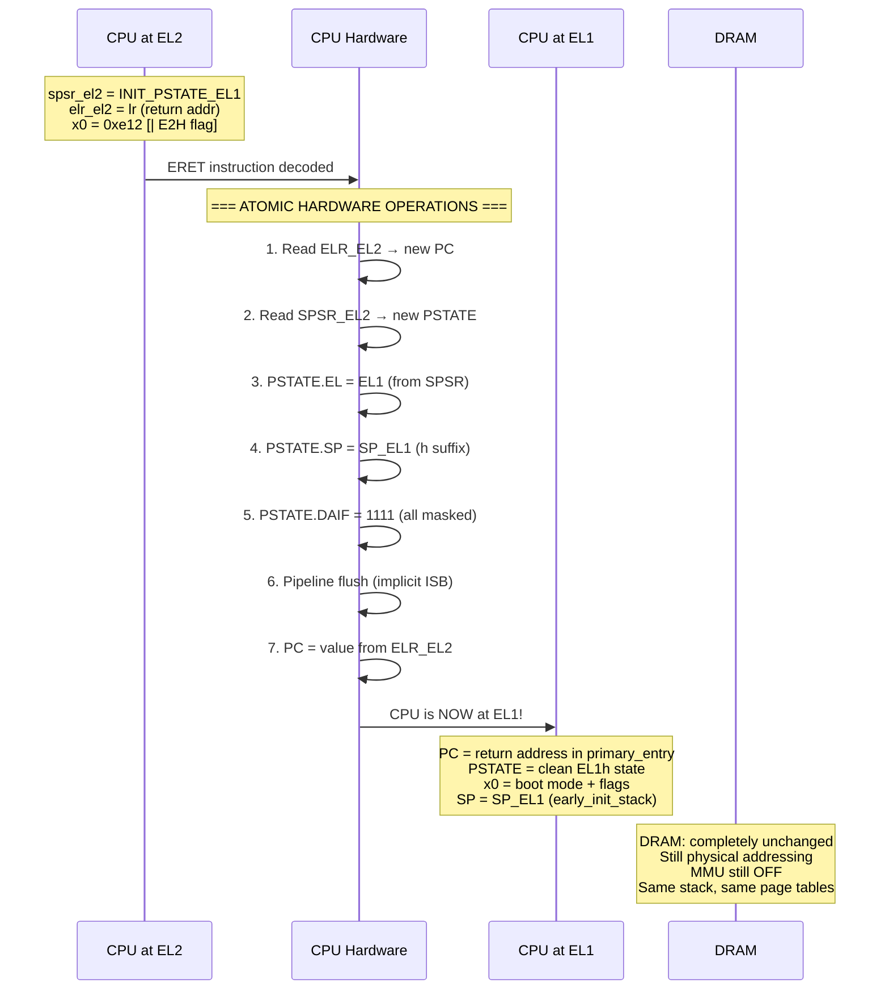

# `init_kernel_el` — Exception Level Initialization Deep Dive

## Document Info

| Item | Detail |
|---|---|
| **Source File** | `arch/arm64/kernel/head.S` |
| **Header File** | `arch/arm64/include/asm/el2_setup.h` |
| **Section** | `.idmap.text` (identity-mapped, survives MMU on/off transitions) |
| **Called From** | `primary_entry` (label `1:`) |
| **CPU State at Entry** | MMU OFF, D-cache OFF, running at EL2 (typically), physical addresses |
| **CPU State at Exit** | MMU OFF, D-cache OFF, running at EL1, physical addresses, all interrupts masked |

---

## 1. Context — Where Are We in the Boot?

```
primary_entry:
    bl   record_mmu_state          ← Step 1: x19 = MMU/cache state
    bl   preserve_boot_args        ← Step 2: save FDT pointer in x21
    ...build identity map...       ← Steps 3-5: page tables ready in DRAM

1:  mov  x0, x19                  ← Step 6: THIS FUNCTION
    bl   init_kernel_el            ←   configure exception level
    mov  x20, x0                  ←   save boot mode for later

    bl   __cpu_setup               ← Step 7: next (configure MMU params)
    b    __primary_switch          ← Step 8: enable MMU
```

### What Has Already Happened

| Component | State |
|---|---|
| **x19** | MMU state (0 = MMU was off, non-zero = MMU was on) |
| **x21** | Physical address of FDT (Device Tree) |
| **SP** | `early_init_stack` (4KB stack in `.initdata` section) |
| **Identity Map** | Built in `init_idmap_pg_dir`, sitting in DRAM |
| **MMU** | OFF — all addresses are physical |
| **Caches** | Identity map cache-maintained (invalidated or cleaned) |
| **CurrentEL** | EL2 (typical — bootloader/firmware enters kernel at EL2) |

---

## 2. Why Does `init_kernel_el` Exist?

### The Problem



### ARMv8 Exception Level Architecture

```
┌──────────────────────────────────────────────────────────────┐
│                    ARMv8 Exception Levels                      │
├──────────────────────────────────────────────────────────────┤
│                                                                │
│  EL3 ─── Secure Monitor (ARM Trusted Firmware / TF-A)         │
│  │       • Highest privilege                                   │
│  │       • Controls secure/non-secure world switching           │
│  │       • Has its own SCTLR_EL3, VBAR_EL3, etc.              │
│  │                                                             │
│  EL2 ─── Hypervisor (KVM / Xen / bare-metal entry)            │
│  │       • Controls Stage-2 translation (VTTBR_EL2)           │
│  │       • Controls what EL1 can access (HCR_EL2)             │
│  │       • Can trap EL1 instructions (HCR, CPTR, HSTR)        │
│  │       • Has its own SCTLR_EL2, TTBR0_EL2, etc.            │
│  │       ┌─── VHE Mode (HCR_EL2.E2H=1): Kernel runs AT EL2   │
│  │       └─── nVHE Mode (HCR_EL2.E2H=0): Kernel drops to EL1 │
│  │                                                             │
│  EL1 ─── OS Kernel (Linux)                                     │
│  │       • Page tables (TTBR0_EL1, TTBR1_EL1)                 │
│  │       • Exception handling (VBAR_EL1)                       │
│  │       • System control (SCTLR_EL1)                          │
│  │       • Timer, GIC, PMU access (if EL2 permits)             │
│  │                                                             │
│  EL0 ─── User Applications                                     │
│           • Unprivileged                                        │
│           • Traps to EL1 for syscalls                           │
└──────────────────────────────────────────────────────────────┘
```

**Key Insight**: Linux is designed to run at EL1. But the bootloader enters the kernel at EL2. Before the kernel can proceed, it must:
1. Configure EL2 hardware so EL1 can function properly
2. Set up a minimal hypervisor stub for later KVM use
3. Drop the CPU privilege from EL2 down to EL1

---

## 3. The Calling Code — Register Setup

```asm
1:  mov     x0, x19              // x0 = MMU state from record_mmu_state
    bl      init_kernel_el       // configure exception level, returns boot mode
    mov     x20, x0              // x20 = boot mode (saved for __primary_switch)
```

### Register Usage

| Register | Before Call | After Return | Purpose |
|---|---|---|---|
| **x0** (input) | x19 = MMU state | Boot mode + flags | Tells function if MMU was on at entry |
| **x0** (output) | — | `0xe11` or `0xe12 [| (1<<32)]` | Boot mode returned |
| **x20** | — | Copies x0 | Preserved through `__cpu_setup` and `__primary_switch` |
| **x1** | — | Clobbered | Used internally for CurrentEL read |
| **x30 (lr)** | Return addr | Used by ERET | Return address saved in ELR for ERET |

---

## 4. Function Entry — Detect Current Exception Level

```asm
SYM_FUNC_START(init_kernel_el)
    mrs     x1, CurrentEL          // Read CurrentEL system register
    cmp     x1, #CurrentEL_EL2    // Compare with EL2 value (0x8)
    b.eq    init_el2               // If EL2 → complex path
                                   // If EL1 → fall through to init_el1
```

### Hardware: The `CurrentEL` Register

```
┌─────────────────────────────────────────┐
│         CurrentEL System Register        │
│         (Read-Only, all ELs)             │
├─────────────────────────────────────────┤
│  Bits [63:4] — Reserved (read as 0)      │
│  Bits [3:2]  — Current Exception Level   │
│  Bits [1:0]  — Reserved (read as 0)      │
├─────────────────────────────────────────┤
│  Value   Bits[3:2]   Meaning             │
│  0x04    01          EL1                  │
│  0x08    10          EL2                  │
│  0x0C    11          EL3                  │
└─────────────────────────────────────────┘
```

**CPU Hardware Action for `MRS x1, CurrentEL`**:
1. CPU reads the internal privilege level from the processor state
2. Encodes it into bits [3:2] of x1
3. All other bits are zero
4. This is a **zero-cycle read** — the information is part of the CPU's current state, not fetched from memory

**`CurrentEL_EL2 = (2 << 2) = 0x8`** — defined in `arch/arm64/include/asm/ptrace.h`

---

## 5. Path A — Booted at EL1 (Simple Path)

This path is taken when firmware already dropped to EL1 before entering the kernel (rare, but possible).

```asm
SYM_INNER_LABEL(init_el1, SYM_L_LOCAL)
    mov_q   x0, INIT_SCTLR_EL1_MMU_OFF      // Load clean SCTLR value
    pre_disable_mmu_workaround                // Errata workaround (ISB on Qualcomm)
    msr     sctlr_el1, x0                    // Write to SCTLR_EL1
    isb                                       // Synchronize — new SCTLR effective NOW

    mov_q   x0, INIT_PSTATE_EL1              // Load clean PSTATE
    msr     spsr_el1, x0                      // Save in SPSR_EL1
    msr     elr_el1, lr                       // Save return address in ELR_EL1
    mov     w0, #BOOT_CPU_MODE_EL1            // Return value = 0xe11
    eret                                       // Exception return (atomically sets PC + PSTATE)
```

### 5.1 SCTLR_EL1 — System Control Register for EL1

**What `INIT_SCTLR_EL1_MMU_OFF` contains** (from `arch/arm64/include/asm/sysreg.h`):

```c
#define INIT_SCTLR_EL1_MMU_OFF \
    (ENDIAN_SET_EL1 | SCTLR_EL1_LSMAOE | SCTLR_EL1_nTLSMD | \
     SCTLR_EL1_EIS  | SCTLR_EL1_TSCXT  | SCTLR_EL1_EOS)
```

```
┌──────────────────────────────────────────────────────────────────┐
│                    SCTLR_EL1 Bit Layout                           │
│              (System Control Register for EL1)                     │
├───────┬────────────┬───────┬──────────────────────────────────────┤
│ Bit   │ Name       │ Value │ Hardware Effect                       │
├───────┼────────────┼───────┼──────────────────────────────────────┤
│  0    │ M (MMU)    │   0   │ MMU is OFF — all addresses physical  │
│  2    │ C (Cache)  │   0   │ Data cache OFF                        │
│ 12    │ I (ICache) │   0   │ Instruction cache OFF                 │
│ 25    │ EE         │ 0/1   │ Endianness (match kernel config)      │
│ 29    │ LSMAOE     │   1   │ Load/Store Multiple Atomicity/Order   │
│ 28    │ nTLSMD     │   1   │ No Trap LDM/STM to Device memory      │
│ 22    │ EIS        │   1   │ Exception entry is context-sync       │
│ 20    │ TSCXT      │   1   │ Trap EL0 SCXTNUM access               │
│ 11    │ EOS        │   1   │ Exception exit is context-sync        │
└───────┴────────────┴───────┴──────────────────────────────────────┘
```

**Hardware Effect of `MSR SCTLR_EL1, x0` + `ISB`**:



**Why write SCTLR when MMU is already off?**
The bootloader may have left SCTLR in an unpredictable state. Linux needs a **known, clean configuration**:
- Ensures endianness is correct for the kernel build
- Sets exception entry/exit synchronization bits for correct behavior
- Clears any cache enable bits the bootloader might have set
- Enables errata workarounds (`LSMAOE`, `nTLSMD`)

### 5.2 INIT_PSTATE_EL1 — Setting Clean Processor State

**Defined in `arch/arm64/include/asm/ptrace.h`:**

```c
#define INIT_PSTATE_EL1 \
    (PSR_D_BIT | PSR_A_BIT | PSR_I_BIT | PSR_F_BIT | PSR_MODE_EL1h)
```

```
┌──────────────────────────────────────────────────────────────┐
│              PSTATE / SPSR Bit Layout                         │
│         (Processor State / Saved Program Status Register)     │
├───────┬──────────┬───────┬────────────────────────────────────┤
│ Bit   │ Name     │ Value │ Meaning                             │
├───────┼──────────┼───────┼────────────────────────────────────┤
│  9    │ D (Debug)│   1   │ Debug exceptions MASKED (disabled)  │
│  8    │ A (Abort)│   1   │ SError/Async abort MASKED           │
│  7    │ I (IRQ)  │   1   │ IRQ interrupts MASKED (disabled)    │
│  6    │ F (FIQ)  │   1   │ FIQ interrupts MASKED (disabled)    │
│ [3:0] │ Mode     │ 0101  │ EL1h — EL1 using SP_EL1 stack      │
└───────┴──────────┴───────┴────────────────────────────────────┘
```

**Why all DAIF bits masked?**
During early boot, there are:
- No interrupt handlers installed (VBAR_EL1 not set yet)
- No IRQ controller configured
- No exception handlers ready

If an interrupt arrived now, the CPU would jump to an undefined address → crash. Masking all exceptions is a safety requirement.

### 5.3 The ERET Instruction — Exception Return from EL1

```asm
    msr     spsr_el1, x0          // SPSR_EL1 = INIT_PSTATE_EL1
    msr     elr_el1, lr           // ELR_EL1 = return address (lr)
    mov     w0, #BOOT_CPU_MODE_EL1  // Return value in x0
    eret                          // Exception Return
```

**Why ERET instead of RET?**

`RET` (normal return) just sets `PC = LR`. It **cannot change PSTATE**.

`ERET` (exception return) does **two things atomically**:
1. `PC ← ELR_ELx` (set program counter)
2. `PSTATE ← SPSR_ELx` (set processor state)

This is the only way to atomically set both PC and PSTATE in one instruction.



**Hardware Pipeline Effect**:
- ERET acts as an implicit **ISB** — flushes the pipeline
- The next instruction fetched is at the new PC with the new PSTATE
- The CPU is now in a clean, known state

---

## 6. Path B — Booted at EL2 (The Common Path)

This is what happens on most ARM64 systems. The bootloader/firmware drops from EL3 to EL2, then enters the kernel at EL2.

### 6.1 Overview Flow



### 6.2 Save Return Address

```asm
SYM_INNER_LABEL(init_el2, SYM_L_LOCAL)
    msr     elr_el2, lr           // Save return address in ELR_EL2
```

**Why save lr in ELR_EL2?**
At the end of this function, we'll use `ERET` from EL2 to drop to EL1. `ERET` loads PC from `ELR_EL2`. So we save the return address now — it will be the `ERET` target.

```
Before: lr = address of "mov x20, x0" in primary_entry
After:  ELR_EL2 = same address
        When ERET executes → CPU jumps back to primary_entry at EL1
```

### 6.3 Clean HYP Code (If MMU Was On at Boot)

```asm
    cbz     x0, 0f                // Skip if MMU was off (x0=0 from record_mmu_state)
    
    // Only executed for EFI boot (MMU was on):
    adrp    x0, __hyp_idmap_text_start
    adr_l   x1, __hyp_text_end
    adr_l   x2, dcache_clean_poc
    blr     x2                    // Clean HYP code from cache to Point of Coherency

    mov_q   x0, INIT_SCTLR_EL2_MMU_OFF
    pre_disable_mmu_workaround
    msr     sctlr_el2, x0        // Turn OFF EL2 MMU
    isb                           // Pipeline flush — MMU off takes effect
```

**Memory perspective**:



**Why clean before disabling MMU?**
If HYP code is dirty in cache and we turn off the MMU, the CPU might re-fetch instructions from DRAM where the old (un-updated) version lives. The cache clean ensures DRAM has the latest version.

**`INIT_SCTLR_EL2_MMU_OFF`** = `SCTLR_EL2_RES1 | ENDIAN_SET_EL2`
- Only RES1 (required by architecture) and endianness bits
- Everything else is zero: MMU off, caches off, no WXN, etc.

### 6.4 Configure HCR_EL2 — The Hypervisor Control Register

```asm
0:  init_el2_hcr    HCR_HOST_NVHE_FLAGS | HCR_ATA
```

**What is HCR_EL2?**

`HCR_EL2` (Hypervisor Configuration Register) is the **most powerful register in EL2**. It controls **everything** that EL1 can and cannot do.

```
┌──────────────────────────────────────────────────────────────────┐
│                       HCR_EL2 Register                            │
│              (Hypervisor Configuration Register)                   │
│                                                                    │
│  This register is the "master switch panel" for EL1               │
│  Every bit controls a trap, feature, or behavior                  │
│  If misconfigured → EL1 operations trap to EL2 → CRASH           │
├───────┬──────────┬──────────────────────────────────────────────┤
│ Bit   │ Name     │ Purpose                                       │
├───────┼──────────┼──────────────────────────────────────────────┤
│ 31    │ RW       │ 1 = EL1 is AArch64 (not AArch32)             │
│ 41    │ API      │ Pointer Auth access from EL1 (no trap)        │
│ 40    │ APK      │ Pointer Auth key regs from EL1 (no trap)      │
│ 25    │ ATA      │ Allocation Tag access from EL1 (MTE)          │
│ 34    │ E2H      │ VHE: Kernel runs AT EL2 with sysreg remap    │
│ 27    │ TGE      │ Trap General Exceptions to EL2 (VHE)          │
│ 13    │ TSC      │ Trap SMC instructions to EL2                  │
│  3    │ FMO      │ Route FIQ to EL2                               │
│  4    │ IMO      │ Route IRQ to EL2                               │
│  5    │ AMO      │ Route SError to EL2                             │
└───────┴──────────┴──────────────────────────────────────────────┘
```

**`HCR_HOST_NVHE_FLAGS`** = `HCR_RW | HCR_API | HCR_APK` (from `kvm_arm.h`):
- **RW=1**: EL1 executes in AArch64 mode (absolutely required)
- **API=1**: Allow Pointer Authentication instructions at EL1 without trap
- **APK=1**: Allow Pointer Authentication key register access from EL1

**`HCR_ATA`**: Allow Allocation Tag Access (MTE) from EL1

#### VHE Detection (Inside `init_el2_hcr` macro)

This macro also performs a critical hardware probe — **VHE detection**:



**Why this probe?** Some CPUs (notably Apple Silicon) have `HCR_EL2.E2H` as **RAO/WI** (Read-As-One, Write-Ignored) — they ONLY support VHE. The kernel must detect this at runtime because:
- If VHE-only: system registers are remapped (SCTLR_EL1 actually accesses SCTLR_EL2)
- If nVHE: system registers are separate and normal

### 6.5 `init_el2_state` — Configure ALL EL2 Hardware Subsystems

```asm
    init_el2_state
```

This single macro expands to **14 sub-macros**, each configuring a different EL2 hardware subsystem. Every `MSR` writes to an EL2 system register that controls what EL1 can access:

```mermaid
flowchart TD
    style MAIN fill:#e74c3c,stroke:#333,color:#fff
    style S1 fill:#3498db,stroke:#333,color:#fff
    style S2 fill:#3498db,stroke:#333,color:#fff
    style S3 fill:#2ecc71,stroke:#333,color:#fff
    style S4 fill:#2ecc71,stroke:#333,color:#fff
    style S5 fill:#2ecc71,stroke:#333,color:#fff
    style S6 fill:#f39c12,stroke:#333,color:#fff
    style S7 fill:#f39c12,stroke:#333,color:#fff
    style S8 fill:#9b59b6,stroke:#333,color:#fff
    style S9 fill:#9b59b6,stroke:#333,color:#fff
    style S10 fill:#1abc9c,stroke:#333,color:#fff
    style S11 fill:#1abc9c,stroke:#333,color:#fff
    style S12 fill:#e67e22,stroke:#333,color:#fff
    style S13 fill:#e67e22,stroke:#333,color:#fff
    style S14 fill:#e67e22,stroke:#333,color:#fff

    MAIN["init_el2_state<br/>(master macro)"]
    
    MAIN --> S1["__init_el2_sctlr<br/>SCTLR_EL2 = MMU_OFF"]
    MAIN --> S2["__init_el2_hcrx<br/>HCRX_EL2: TCR2, GCS, LS64"]
    MAIN --> S3["__init_el2_timers<br/>CNTHCTL_EL2: Allow EL1 timers"]
    MAIN --> S4["__init_el2_debug<br/>MDCR_EL2: PMU, SPE, TRBE access"]
    MAIN --> S5["__init_el2_brbe<br/>BRBCR_EL2: Branch records"]
    MAIN --> S6["__init_el2_lor<br/>LORC_EL1: Clear LOR"]
    MAIN --> S7["__init_el2_stage2<br/>VTTBR_EL2 = 0 (no Stage-2)"]
    MAIN --> S8["__init_el2_gicv3<br/>ICC_SRE_EL2: GIC sysreg access"]
    MAIN --> S9["__init_el2_gicv5<br/>ICH_*_EL2: GICv5 trap disable"]
    MAIN --> S10["__init_el2_hstr<br/>HSTR_EL2 = 0 (no coproc traps)"]
    MAIN --> S11["__init_el2_nvhe_idregs<br/>VPIDR/VMPIDR: CPU ID for EL1"]
    MAIN --> S12["__init_el2_cptr<br/>CPTR_EL2: Allow FP/SIMD/SVE"]
    MAIN --> S13["__init_el2_fgt<br/>HFGRTR/HFGWTR: Fine-grained traps"]
    MAIN --> S14["__init_el2_fgt2<br/>HFGITR2/HFGRTR2: Extended FGT"]
```



#### Detailed Sub-Macro Breakdown

| # | Macro | Register(s) Modified | What It Configures | Why EL1 Needs It |
|---|---|---|---|---|
| 1 | `__init_el2_sctlr` | SCTLR_EL2 | Clean EL2 control state | Prevents stale bootloader settings |
| 2 | `__init_el2_hcrx` | HCRX_EL2 | Extended HCR features | TCR2 access, GCS, LS64 from EL1 |
| 3 | `__init_el2_timers` | CNTHCTL_EL2, CNTVOFF_EL2 | Physical timer access, zero virtual offset | EL1 needs timers for scheduling |
| 4 | `__init_el2_debug` | MDCR_EL2, PMSCR_EL2 | PMU counters, SPE profiling, Trace Buffer | EL1 perf subsystem needs PMU |
| 5 | `__init_el2_brbe` | BRBCR_EL2 | Branch Record cycle counts + mispredicts | EL1 profiling needs branch records |
| 6 | `__init_el2_lor` | LORC_EL1 | Clear Limited Ordering Regions | Clean state for EL1 memory ordering |
| 7 | `__init_el2_stage2` | VTTBR_EL2 | Stage-2 translation base = 0 | No VM running — disable Stage-2 |
| 8 | `__init_el2_gicv3` | ICC_SRE_EL2, ICH_HCR_EL2 | GICv3 system register interface | EL1 needs interrupt controller access |
| 9 | `__init_el2_gicv5` | ICH_HFGITR_EL2, ICH_HFGRTR/HFGWTR_EL2 | Disable GICv5 instruction/register traps | EL1 GICv5 driver needs unrestricted access |
| 10 | `__init_el2_hstr` | HSTR_EL2 = 0 | Disable all coprocessor traps | EL1 must access CP15 freely |
| 11 | `__init_el2_nvhe_idregs` | VPIDR_EL2, VMPIDR_EL2 | Copy real MIDR/MPIDR to virtual regs | EL1 reads MIDR for CPU identification |
| 12 | `__init_el2_cptr` | CPTR_EL2 / CPACR_EL1 | Allow FP/SIMD/SVE | Any FP instruction at EL1 would trap without this |
| 13 | `__init_el2_fgt` | HFGRTR/HFGWTR/HDFGRTR/HDFGWTR_EL2 | Disable fine-grained traps for SPE, BRBE, TRBE | Individual register traps disabled |
| 14 | `__init_el2_fgt2` | HFGITR2/HFGRTR2/HFGWTR2_EL2 | Extended fine-grained trap disable | Additional feature-gate traps disabled |

**Critical Point**: If ANY of these configurations is wrong:
- EL1 access to that resource → triggers trap to EL2
- Trap goes to `__hyp_stub_vectors`
- Stub doesn't handle it → **system crash / hang**

#### Memory Impact of These Configurations

```
┌────────────────────────────────────────────────────────────────┐
│              Memory During init_el2_state                       │
├────────────────────────────────────────────────────────────────┤
│                                                                  │
│  DRAM is not affected — all changes are to CPU SYSTEM REGISTERS  │
│                                                                  │
│  System registers are ON-CHIP storage, not in DRAM:              │
│                                                                  │
│  ┌─── CPU Core ──────────────────────────────────┐              │
│  │                                                │              │
│  │  ┌── EL2 System Registers (silicon flip-flops) │              │
│  │  │  SCTLR_EL2  ← written                      │              │
│  │  │  HCR_EL2    ← written (earlier)             │              │
│  │  │  HCRX_EL2   ← written                      │              │
│  │  │  CNTHCTL_EL2 ← written                     │              │
│  │  │  MDCR_EL2   ← written                      │              │
│  │  │  VTTBR_EL2  ← written (= 0)                │              │
│  │  │  ICC_SRE_EL2 ← written                     │              │
│  │  │  CPTR_EL2   ← written                      │              │
│  │  │  HSTR_EL2   ← written (= 0)                │              │
│  │  │  VPIDR_EL2  ← written                      │              │
│  │  │  VMPIDR_EL2 ← written                      │              │
│  │  │  HFGRTR_EL2 ← written                      │              │
│  │  │  ...14+ registers total                     │              │
│  │  └─────────────────────────────────────────────│              │
│  │                                                │              │
│  │  DRAM: unchanged. Stack: unchanged.            │              │
│  │  Page tables: unchanged. Cache: unchanged.     │              │
│  └────────────────────────────────────────────────┘              │
│                                                                  │
│  All MSR instructions write to on-chip register storage.        │
│  No memory bus transactions occur for system register writes.    │
└────────────────────────────────────────────────────────────────┘
```

### 6.6 Install the Hypervisor Stub Vector Table

```asm
    adr_l   x0, __hyp_stub_vectors   // Get PA of hyp stub vectors
    msr     vbar_el2, x0              // Set EL2 exception vector base
    isb                                // Ensure VBAR is effective
```

**What is VBAR_EL2?**

`VBAR_EL2` (Vector Base Address Register for EL2) tells the CPU hardware **where to jump** when an exception is taken to EL2.

```
┌──────────────────────────────────────────────────────────────┐
│             Exception Vector Table Layout                     │
│             (VBAR_EL2 points here)                            │
├──────────────────────────────────────────────────────────────┤
│  Offset    Exception Type                                     │
│  0x000     Synchronous, Current EL, SP_EL0                    │
│  0x080     IRQ, Current EL, SP_EL0                            │
│  0x100     FIQ, Current EL, SP_EL0                            │
│  0x180     SError, Current EL, SP_EL0                         │
│  0x200     Synchronous, Current EL, SP_ELx   ← HVC lands here│
│  0x280     IRQ, Current EL, SP_ELx                            │
│  0x300     FIQ, Current EL, SP_ELx                            │
│  0x380     SError, Current EL, SP_ELx                         │
│  0x400     Synchronous, Lower EL, AArch64                     │
│  0x480     IRQ, Lower EL, AArch64                             │
│  0x500     FIQ, Lower EL, AArch64                             │
│  0x580     SError, Lower EL, AArch64                          │
│  ...                                                          │
└──────────────────────────────────────────────────────────────┘
```

**`__hyp_stub_vectors`** is a minimal vector table that handles only:
- **HVC (Hypervisor Call)** instructions — used later by KVM to install its own hypervisor
- Everything else → hang/crash (WFE/WFI loop)

**Memory**: The vector table lives in the kernel's `.hyp.text` section. Since MMU is OFF, `adr_l` computes its **physical address**. The CPU will access it at that PA when exceptions occur.

### 6.7 Configure SCTLR_EL1 and Detect VHE

```asm
    mov_q   x1, INIT_SCTLR_EL1_MMU_OFF    // Clean SCTLR for EL1

    mrs     x0, hcr_el2                     // Read back HCR_EL2
    and     x0, x0, #HCR_E2H               // Isolate E2H bit
    cbz     x0, 2f                          // E2H=0 → nVHE path
```

#### VHE vs nVHE — The System Register Remapping Problem



```asm
    // VHE path (E2H=1):
    msr_s   SYS_SCTLR_EL12, x1        // Write to REAL SCTLR_EL1
                                        // (bypassing VHE remap)
    mov     x2, #BOOT_CPU_FLAG_E2H     // Flag = bit 32 set
    b       3f

2:  // nVHE path (E2H=0):
    msr     sctlr_el1, x1              // Write to SCTLR_EL1 directly
    mov     x2, xzr                     // No VHE flag
```

**`SYS_SCTLR_EL12`**: The `_EL12` suffix is a special ARMv8.1-VHE encoding that says "access the EL1 version of this register, even though I'm at EL2 with E2H=1". Without this suffix, writing to `sctlr_el1` at EL2 with VHE would actually write to `sctlr_el2`.

### 6.8 The ERET — Dropping from EL2 to EL1

```asm
3:  mov     x0, #INIT_PSTATE_EL1       // PSTATE for EL1: DAIF masked, EL1h
    msr     spsr_el2, x0               // Save in SPSR_EL2

    mov     w0, #BOOT_CPU_MODE_EL2     // Return value = 0xe12
    orr     x0, x0, x2                 // OR in E2H flag (bit 32) if VHE
    eret                               // Exception Return: EL2 → EL1
```

**This is the most critical moment — the CPU changes privilege level:**



**What changes after ERET:**

| Component | Before ERET | After ERET |
|---|---|---|
| **CurrentEL** | EL2 (0x8) | **EL1 (0x4)** |
| **PSTATE.DAIF** | Unknown | **1111** (all masked) |
| **PSTATE.M** | EL2h | **EL1h** (SP_EL1 selected) |
| **PC** | In init_el2 code | **Back in primary_entry** |
| **SP** | `early_init_stack` | Same — **unchanged** |
| **MMU** | OFF | **Still OFF** |
| **Memory view** | Physical | **Still physical** |
| **x0** | boot mode + flags | Same — **passed through** |

**What can the CPU NO LONGER do:**
- Access EL2-only registers (HCR_EL2, VTTBR_EL2, etc.) → would cause undefined instruction exception
- Execute `ERET` to drop privilege further (only EL0 below, done via different mechanism)
- Modify EL2 trap configuration
- Access EL2 stack pointer (SP_EL2)

**What the CPU CAN now do:**
- All EL1 operations: page table management, exception handling, etc.
- Access EL1 system registers: SCTLR_EL1, TTBR0/1_EL1, VBAR_EL1, etc.
- Use `HVC` instruction to call into the hyp stub (for KVM later)
- Access timers, GIC, PMU, FP/SIMD (because EL2 was configured to allow it)

---

## 7. Return Value in x20

After `init_kernel_el` returns, `primary_entry` saves the boot mode:

```asm
    mov     x20, x0              // x20 = boot mode for later use
```

### Possible Return Values

```
┌────────────────────────────────────────────────────────────────┐
│                x0 / x20 Return Values                          │
├──────────────────────────────┬─────────────────────────────────┤
│ Value                        │ Meaning                          │
├──────────────────────────────┼─────────────────────────────────┤
│ 0x0000_0000_0000_0E11       │ Booted at EL1 (no hypervisor)    │
│                              │ Rare — some embedded systems     │
├──────────────────────────────┼─────────────────────────────────┤
│ 0x0000_0000_0000_0E12       │ Booted at EL2, nVHE mode         │
│                              │ Classic: kernel at EL1,          │
│                              │ KVM hypervisor at EL2            │
├──────────────────────────────┼─────────────────────────────────┤
│ 0x0000_0001_0000_0E12       │ Booted at EL2, VHE mode          │
│                              │ Kernel runs AT EL2               │
│                              │ (BOOT_CPU_FLAG_E2H = bit 32)    │
│                              │ Apple Silicon, newer ARM         │
└──────────────────────────────┴─────────────────────────────────┘
```

**Where x20 is used later:**

| Location | Code | Purpose |
|---|---|---|
| `__primary_switch` | `mov x0, x20` | Passed to `__pi_early_map_kernel` |
| `__primary_switched` | `mov x0, x20` + `bl set_cpu_boot_mode_flag` | Saved to `__boot_cpu_mode[]` array |
| `__primary_switched` | `mov x0, x20` + `bl finalise_el2` | Final EL2 configuration (KVM init) |

---

## 8. Complete Hardware State Transition Summary

```mermaid
flowchart TD
    style BEFORE fill:#ff6b6b,stroke:#333,color:#fff
    style DURING fill:#ffd93d,stroke:#333,color:#000
    style AFTER fill:#6bcb77,stroke:#333,color:#fff
    style MEM fill:#4d96ff,stroke:#333,color:#fff

    subgraph BEFORE["BEFORE init_kernel_el"]
        B1["CurrentEL = EL2"]
        B2["SCTLR_EL2 = unknown (bootloader)"]
        B3["SCTLR_EL1 = unknown"]
        B4["HCR_EL2 = unknown"]
        B5["VBAR_EL2 = unknown"]
        B6["Timer/GIC/PMU = potentially trapped"]
        B7["CPTR_EL2 = FP/SIMD may be trapped"]
        B8["PSTATE = unknown DAIF state"]
    end

    subgraph DURING["DURING init_kernel_el (14+ MSR writes)"]
        D1["Write SCTLR_EL2 = clean MMU-off"]
        D2["Write HCR_EL2 = RW|API|APK|ATA [|E2H]"]
        D3["Write CNTHCTL_EL2 = timers enabled"]
        D4["Write MDCR_EL2 = PMU/SPE enabled"]
        D5["Write VTTBR_EL2 = 0 (no Stage-2)"]
        D6["Write ICC_SRE_EL2 = GIC enabled"]
        D7["Write CPTR_EL2 = FP/SIMD allowed"]
        D8["Write HSTR_EL2 = 0 (no coproc traps)"]
        D9["Write VBAR_EL2 = __hyp_stub_vectors"]
        D10["Write SCTLR_EL1 = clean MMU-off"]
        D11["Write SPSR_EL2 = DAIF masked, EL1h"]
        D12["ERET → drop to EL1"]
    end

    subgraph AFTER["AFTER init_kernel_el"]
        A1["CurrentEL = EL1 ✓"]
        A2["SCTLR_EL1 = clean, MMU off ✓"]
        A3["HCR_EL2 = properly configured ✓"]
        A4["VBAR_EL2 = hyp stub ✓"]
        A5["All EL2 traps = disabled ✓"]
        A6["PSTATE.DAIF = 1111 (all masked) ✓"]
        A7["x0/x20 = boot mode ✓"]
    end

    subgraph MEM["MEMORY STATE"]
        M1["DRAM: completely unchanged"]
        M2["Identity map: still in DRAM, unused"]
        M3["Stack: early_init_stack, unchanged"]
        M4["Cache: same as before"]
        M5["All changes were CPU-internal<br/>(system register writes only)"]
    end

    BEFORE --> DURING --> AFTER
    AFTER --> MEM
```



---

## 9. What Happens Next?

After `init_kernel_el` returns:

```asm
    mov     x20, x0              // Save boot mode in x20

    bl      __cpu_setup           // Step 7: Configure TCR, MAIR, SCTLR
                                  //   → Set up translation control register
                                  //   → Set up memory attributes
                                  //   → Prepare SCTLR value for MMU-ON
                                  //   → x0 = SCTLR value to enable MMU

    b       __primary_switch      // Step 8: Enable MMU, map kernel, jump to virtual
```

The CPU is now at EL1 with a clean state, all EL2 traps disabled, and ready for `__cpu_setup` to prepare the MMU parameters (TCR_EL1, MAIR_EL1) before `__primary_switch` turns on the MMU.

---

## 10. Key Takeaways for Beginners

### Why Is This So Complex?

1. **Bootloader can leave EL2 in ANY state** — Linux can't trust any EL2 register value
2. **EL2 controls EL1** — if EL2 traps aren't disabled, EL1 code crashes
3. **VHE adds another dimension** — system register remapping changes how EL1 registers work
4. **Multiple hardware subsystems** — timers, GIC, PMU, FP/SIMD each have their own EL2 trap bits
5. **ERET is the only safe way** — to atomically change both privilege level and processor state

### Memory vs CPU Registers

```
┌──────────────────────────────────────────────────────────┐
│                                                           │
│  init_kernel_el modifies ZERO bytes of DRAM               │
│                                                           │
│  ALL changes are to CPU-internal system registers:        │
│  - Silicon flip-flops inside the CPU core                 │
│  - Accessed via MSR/MRS instructions                      │
│  - No memory bus traffic                                  │
│  - No cache involvement                                   │
│  - Invisible to other CPUs (per-core state)               │
│                                                           │
│  The only DRAM access is reading the code itself          │
│  (instruction fetch from physical addresses)              │
│                                                           │
└──────────────────────────────────────────────────────────┘
```

### Analogy

Think of `init_kernel_el` as **configuring a building's security system before the tenant moves in**:

- **EL2** = Building manager's office (top floor, master controls)
- **EL1** = Tenant's floor (where Linux will live)
- **init_el2_state** = Setting every door lock, camera, and alarm to "allow tenant access"
- **VBAR_EL2** = Emergency phone that connects to a minimal security desk
- **ERET** = Manager handing the keys to the tenant and going back to the desk
- **x20** = A badge that says which floor the tenant came from
