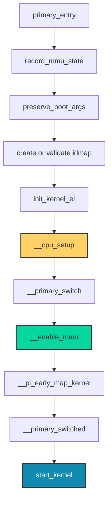
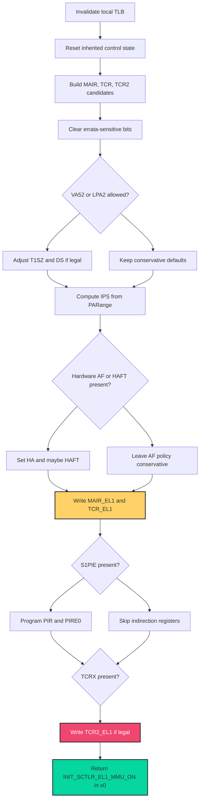
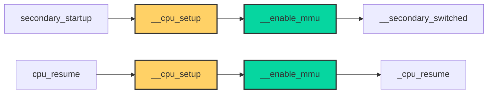

# 23 Mermaid Diagrams

This chapter collects visual summaries of the boot and MMU-setup flow.

## Primary Boot Sequence

```mermaid
flowchart TD
    A[primary_entry] --> B[record_mmu_state]
    B --> C[preserve_boot_args]
    C --> D[create or validate idmap]
    D --> E[init_kernel_el]
    E --> F[__cpu_setup]
    F --> G[__primary_switch]
    G --> H[__enable_mmu]
    H --> I[__pi_early_map_kernel]
    I --> J[__primary_switched]
    J --> K[start_kernel]

    style F fill:#ffd166,stroke:#333,stroke-width:2px
    style H fill:#06d6a0,stroke:#333,stroke-width:2px
    style K fill:#118ab2,stroke:#333,stroke-width:2px,color:#fff
```

## `__cpu_setup` Internal Flow

```mermaid
flowchart TD
    A[Invalidate local TLB] --> B[Reset inherited control state]
    B --> C[Build MAIR, TCR, TCR2 candidates]
    C --> D[Clear errata-sensitive bits]
    D --> E{VA52 or LPA2 allowed?}
    E --> F[Adjust T1SZ and DS if legal]
    E --> G[Keep conservative defaults]
    F --> H[Compute IPS from PARange]
    G --> H
    H --> I{Hardware AF or HAFT present?}
    I --> J[Set HA and maybe HAFT]
    I --> K[Leave AF policy conservative]
    J --> L[Write MAIR_EL1 and TCR_EL1]
    K --> L
    L --> M{S1PIE present?}
    M --> N[Program PIR and PIRE0]
    M --> O[Skip indirection registers]
    N --> P{TCRX present?}
    O --> P
    P --> Q[Write TCR2_EL1 if legal]
    Q --> R[Return INIT_SCTLR_EL1_MMU_ON in x0]

    style L fill:#ffd166,stroke:#222,stroke-width:2px
    style Q fill:#ef476f,stroke:#222,stroke-width:2px,color:#fff
    style R fill:#06d6a0,stroke:#222,stroke-width:2px
```

## Resume And Secondary Reuse

```mermaid
flowchart LR
    A[secondary_startup] --> B[__cpu_setup]
    B --> C[__enable_mmu]
    C --> D[__secondary_switched]

    E[cpu_resume] --> F[__cpu_setup]
    F --> G[__enable_mmu]
    G --> H[_cpu_resume]

    style B fill:#ffd166,stroke:#333,stroke-width:2px
    style F fill:#ffd166,stroke:#333,stroke-width:2px
    style C fill:#06d6a0,stroke:#333,stroke-width:2px
    style G fill:#06d6a0,stroke:#333,stroke-width:2px
```