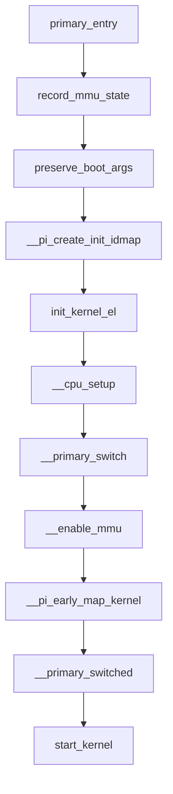

# Boot Flow Overview

This document shows where `__cpu_setup` sits in the ARM64 Linux boot path.

## Primary CPU path

High-level sequence:

1. `primary_entry`
2. `record_mmu_state`
3. `preserve_boot_args`
4. `__pi_create_init_idmap`
5. `init_kernel_el`
6. `__cpu_setup`
7. `__primary_switch`
8. `__enable_mmu`
9. `__pi_early_map_kernel`
10. `__primary_switched`
11. `start_kernel`

## Secondary CPU path

1. `secondary_entry`
2. `init_kernel_el`
3. optional VA52 check
4. `__cpu_setup`
5. `__enable_mmu`
6. `__secondary_switched`
7. `secondary_start_kernel`

## Why this matters

`__cpu_setup` is close to the MMU enable point, but it is not itself the MMU enable instruction path. It is the preparation stage that programs:

- memory attributes
- translation controls
- optional architectural features
- final `SCTLR_EL1` value returned to the caller

## Boot-flow diagram

## What exists before `__cpu_setup`

Before entering `__cpu_setup`:

- the CPU boot level has been normalized
- early page tables already exist
- the code is still in the early pre-fully-mapped stage
- the MMU enable value has not yet been written into `SCTLR_EL1`

## What exists after `__cpu_setup`

After returning from `__cpu_setup`:

- `MAIR_EL1` is programmed
- `TCR_EL1` is programmed
- `TCR2_EL1` may be programmed
- `x0` holds the desired `SCTLR_EL1` value for MMU-on behavior
- the next stage is ready to install table bases and enable translation
