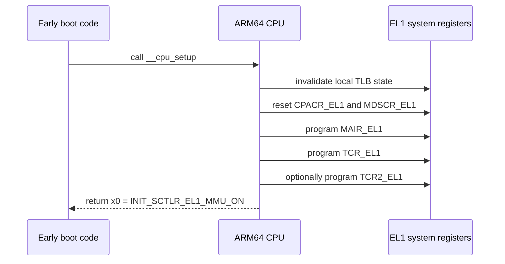

# `__cpu_setup` Phase

This phase is the transition from early boot scaffolding to a CPU that is ready to enable translation.

## Input assumptions

When `__cpu_setup` starts:

- Linux is already executing in early boot assembly.
- Early page tables exist.
- The caller is preparing to enable the MMU soon.
- The code is still in the `.idmap.text` section.

## Output contract

When `__cpu_setup` returns:

- `MAIR_EL1` is loaded with the kernel's chosen memory attribute encodings.
- `TCR_EL1` is loaded with translation controls.
- `TCR2_EL1` may be loaded if a newer CPU feature requires it.
- `x0` contains `INIT_SCTLR_EL1_MMU_ON`.

## Main operations

1. Invalidate stale TLB state.
2. Reset selected control and debug access registers.
3. Build default `MAIR_EL1`, `TCR_EL1`, and `TCR2_EL1` values.
4. Adjust for errata and CPU feature support.
5. Commit the translation policy into system registers.
6. Return the final MMU-on control value.

## Important non-operation

`__cpu_setup` does not write `SCTLR_EL1` itself. It only prepares the value that will be written later.

## Sequence diagram

