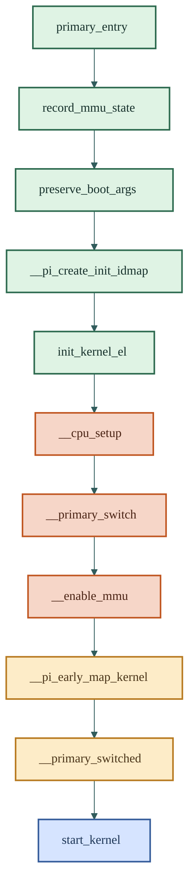

# Boot Sequence Diagram

```mermaid
%%{init: {'theme': 'base', 'themeVariables': {
    'primaryColor': '#dff3e4',
    'primaryTextColor': '#16302b',
    'primaryBorderColor': '#2d6a4f',
    'lineColor': '#315c5c',
    'secondaryColor': '#fdecc8',
    'tertiaryColor': '#f6d6c8',
    'fontFamily': 'Trebuchet MS, Segoe UI, sans-serif'
}}}%%
flowchart TD
    A[primary_entry] --> B[record_mmu_state]
    B --> C[preserve_boot_args]
    C --> D[__pi_create_init_idmap]
    D --> E[init_kernel_el]
    E --> F[__cpu_setup]
    F --> G[__primary_switch]
    G --> H[__enable_mmu]
    H --> I[__pi_early_map_kernel]
    I --> J[__primary_switched]
    J --> K[start_kernel]

    classDef boot fill:#dff3e4,stroke:#2d6a4f,color:#16302b,stroke-width:2px;
    classDef prep fill:#fdecc8,stroke:#b7791f,color:#4a3418,stroke-width:2px;
    classDef critical fill:#f6d6c8,stroke:#c05621,color:#4a2314,stroke-width:2px;
    classDef finish fill:#d6e4ff,stroke:#355c9a,color:#1d3557,stroke-width:2px;

    class A,B,C,D,E boot;
    class F,G,H critical;
    class I,J prep;
    class K finish;
```
