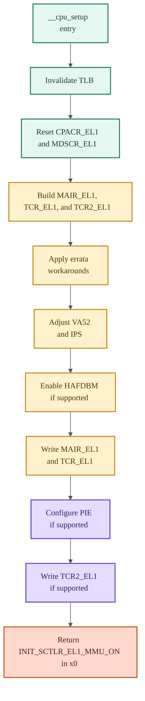

# MMU Control Flow

```mermaid
%%{init: {'theme': 'base', 'themeVariables': {
    'primaryColor': '#e4f7f1',
    'primaryTextColor': '#183b35',
    'primaryBorderColor': '#2a7f62',
    'lineColor': '#3c5f66',
    'secondaryColor': '#fff1cc',
    'tertiaryColor': '#ffd9cc',
    'fontFamily': 'Trebuchet MS, Segoe UI, sans-serif'
}}}%%
%% MMU control flow during __cpu_setup
flowchart TD
    entry[__cpu_setup<br/>entry] --> tlb[Invalidate TLB]
    tlb --> reset[Reset CPACR_EL1<br/>and MDSCR_EL1]
    reset --> build[Build MAIR_EL1,<br/>TCR_EL1, and TCR2_EL1]
    build --> errata[Apply errata<br/>workarounds]
    errata --> va[Adjust VA52<br/>and IPS]
    va --> hafdbm[Enable HAFDBM<br/>if supported]
    hafdbm --> write_core[Write MAIR_EL1<br/>and TCR_EL1]
    write_core --> pie[Configure PIE<br/>if supported]
    pie --> write_tcr2[Write TCR2_EL1<br/>if supported]
    write_tcr2 --> ret[Return INIT_SCTLR_EL1_MMU_ON<br/>in x0]

    classDef start fill:#e4f7f1,stroke:#2a7f62,color:#183b35,stroke-width:2px;
    classDef work fill:#fff1cc,stroke:#c58b1b,color:#4e3608,stroke-width:2px;
    classDef optional fill:#e5dcff,stroke:#6b46c1,color:#2d1b69,stroke-width:2px;
    classDef result fill:#ffd9cc,stroke:#c05621,color:#4a2314,stroke-width:2px;

    class entry,tlb,reset start;
    class build,errata,va,hafdbm,write_core work;
    class pie,write_tcr2 optional;
    class ret result;
```
