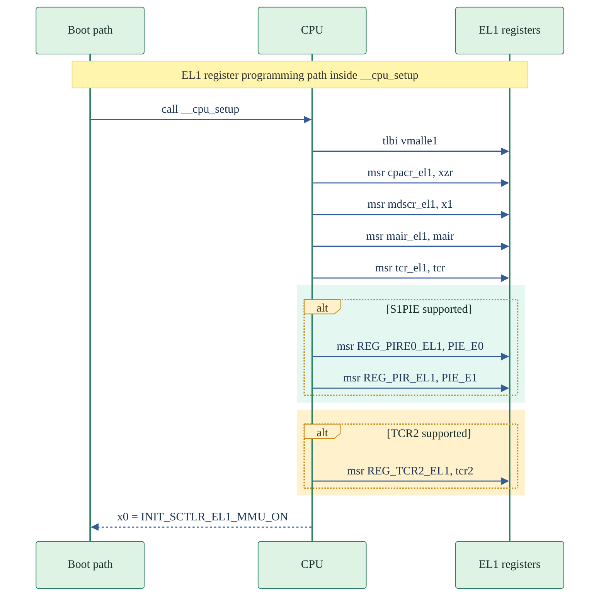

# Register Setup Sequence

```mermaid
%%{init: {'theme': 'base', 'themeVariables': {
  'actorBorder': '#2a7f62',
  'actorBkg': '#dff3e4',
  'actorTextColor': '#16302b',
  'signalColor': '#355c9a',
  'signalTextColor': '#1d3557',
  'labelBoxBkgColor': '#fff1cc',
  'labelBoxBorderColor': '#c58b1b',
  'labelTextColor': '#4e3608',
  'activationBorderColor': '#c05621',
  'activationBkgColor': '#ffd9cc',
  'sequenceNumberColor': '#ffffff',
  'fontFamily': 'Trebuchet MS, Segoe UI, sans-serif'
}}}%%
%% Register programming sequence inside __cpu_setup
sequenceDiagram
    participant Boot as Boot path
    participant CPU as CPU
    participant Regs as EL1 registers

    Note over Boot,Regs: EL1 register programming path inside __cpu_setup
    Boot->>CPU: call __cpu_setup
    CPU->>Regs: tlbi vmalle1
    CPU->>Regs: msr cpacr_el1, xzr
    CPU->>Regs: msr mdscr_el1, x1
    CPU->>Regs: msr mair_el1, mair
    CPU->>Regs: msr tcr_el1, tcr

    rect rgb(228, 247, 241)
    alt S1PIE supported
        CPU->>Regs: msr REG_PIRE0_EL1, PIE_E0
        CPU->>Regs: msr REG_PIR_EL1, PIE_E1
    end
    end

    rect rgb(255, 241, 204)
    alt TCR2 supported
        CPU->>Regs: msr REG_TCR2_EL1, tcr2
    end
    end

    CPU-->>Boot: x0 = INIT_SCTLR_EL1_MMU_ON
```
