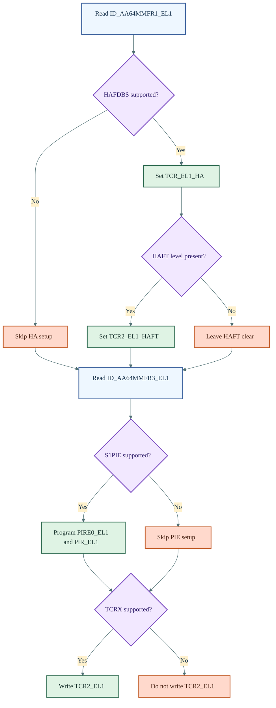

# CPU Feature Detection

```mermaid
%%{init: {'theme': 'base', 'themeVariables': {
    'primaryColor': '#eef7ff',
    'primaryTextColor': '#17324d',
    'primaryBorderColor': '#355c9a',
    'lineColor': '#4f6f73',
    'secondaryColor': '#fff1cc',
    'tertiaryColor': '#ffd9cc',
    'fontFamily': 'Trebuchet MS, Segoe UI, sans-serif'
}}}%%
%% CPU feature detection and optional register setup
flowchart TD
    mmfr1[Read ID_AA64MMFR1_EL1] --> hafdbs{HAFDBS supported?}
    hafdbs -- No --> skip_ha[Skip HA setup]
    hafdbs -- Yes --> set_ha[Set TCR_EL1_HA]
    set_ha --> haft{HAFT level present?}
    haft -- Yes --> set_haft[Set TCR2_EL1_HAFT]
    haft -- No --> no_haft[Leave HAFT clear]
    skip_ha --> mmfr3[Read ID_AA64MMFR3_EL1]
    set_haft --> mmfr3
    no_haft --> mmfr3
    mmfr3 --> pie{S1PIE supported?}
    pie -- Yes --> program_pie[Program PIRE0_EL1<br/>and PIR_EL1]
    pie -- No --> skip_pie[Skip PIE setup]
    program_pie --> tcrx{TCRX supported?}
    skip_pie --> tcrx
    tcrx -- Yes --> write_tcr2[Write TCR2_EL1]
    tcrx -- No --> skip_tcr2[Do not write TCR2_EL1]

    classDef detect fill:#eef7ff,stroke:#355c9a,color:#17324d,stroke-width:2px;
    classDef decision fill:#f2e8ff,stroke:#7b4cc2,color:#2d1b69,stroke-width:2px;
    classDef enabled fill:#dff3e4,stroke:#2d6a4f,color:#16302b,stroke-width:2px;
    classDef skipped fill:#ffd9cc,stroke:#c05621,color:#4a2314,stroke-width:2px;

    class mmfr1,mmfr3 detect;
    class hafdbs,haft,pie,tcrx decision;
    class set_ha,set_haft,program_pie,write_tcr2 enabled;
    class skip_ha,no_haft,skip_pie,skip_tcr2 skipped;
```
