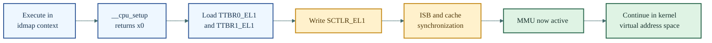

# Idmap To High-Mem Switch

```mermaid
%%{init: {'theme': 'base', 'themeVariables': {
    'primaryColor': '#eef7ff',
    'primaryTextColor': '#17324d',
    'primaryBorderColor': '#355c9a',
    'lineColor': '#426b6d',
    'secondaryColor': '#dff3e4',
    'tertiaryColor': '#ffd9cc',
    'fontFamily': 'Trebuchet MS, Segoe UI, sans-serif'
}}}%%
%% Transition from identity mapping to the kernel virtual map
flowchart LR
    idmap[Execute in<br/>idmap context] --> setup[__cpu_setup<br/>returns x0]
    setup --> ttbr[Load TTBR0_EL1<br/>and TTBR1_EL1]
    ttbr --> sctlr[Write SCTLR_EL1]
    sctlr --> sync[ISB and cache<br/>synchronization]
    sync --> mmu[MMU now active]
    mmu --> kvaddr[Continue in kernel<br/>virtual address space]

    classDef context fill:#eef7ff,stroke:#355c9a,color:#17324d,stroke-width:2px;
    classDef transition fill:#fff1cc,stroke:#c58b1b,color:#4e3608,stroke-width:2px;
    classDef live fill:#dff3e4,stroke:#2d6a4f,color:#16302b,stroke-width:2px;

    class idmap,setup,ttbr context;
    class sctlr,sync transition;
    class mmu,kvaddr live;
```
