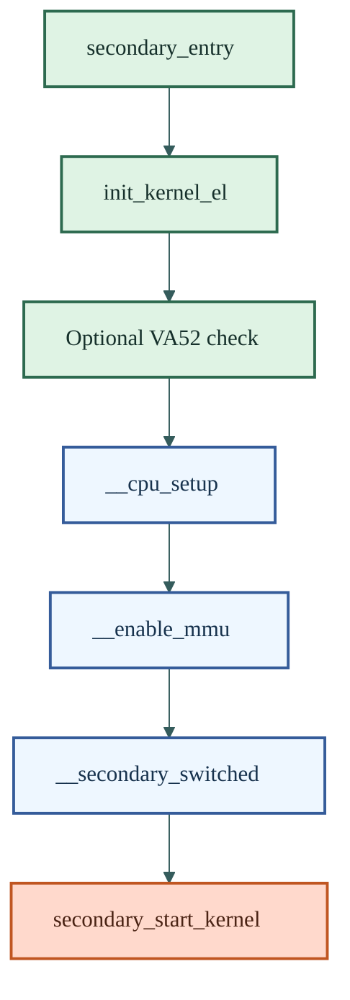

# Secondary CPU Path

```mermaid
%%{init: {'theme': 'base', 'themeVariables': {
    'primaryColor': '#dff3e4',
    'primaryTextColor': '#16302b',
    'primaryBorderColor': '#2d6a4f',
    'lineColor': '#355c5c',
    'secondaryColor': '#eef7ff',
    'tertiaryColor': '#ffd9cc',
    'fontFamily': 'Trebuchet MS, Segoe UI, sans-serif'
}}}%%
%% Secondary CPU boot path up to kernel handoff
flowchart TD
    secondary[secondary_entry] --> init_el[init_kernel_el]
    init_el --> va52[Optional VA52 check]
    va52 --> setup[__cpu_setup]
    setup --> enable[__enable_mmu]
    enable --> switched[__secondary_switched]
    switched --> start[secondary_start_kernel]

    classDef boot fill:#dff3e4,stroke:#2d6a4f,color:#16302b,stroke-width:2px;
    classDef switch fill:#eef7ff,stroke:#355c9a,color:#17324d,stroke-width:2px;
    classDef final fill:#ffd9cc,stroke:#c05621,color:#4a2314,stroke-width:2px;

    class secondary,init_el,va52 boot;
    class setup,enable,switched switch;
    class start final;
```
