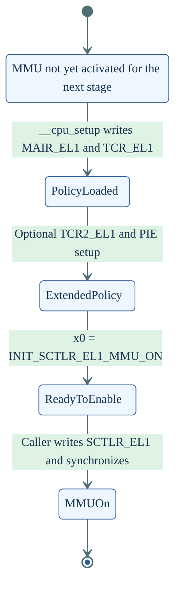

# System Register State Machine

```mermaid
%%{init: {'theme': 'base', 'themeVariables': {
    'primaryColor': '#eef7ff',
    'primaryTextColor': '#17324d',
    'primaryBorderColor': '#355c9a',
    'lineColor': '#4f6f73',
    'secondaryColor': '#dff3e4',
    'tertiaryColor': '#ffd9cc',
    'fontFamily': 'Trebuchet MS, Segoe UI, sans-serif'
}}}%%
%% System register state progression around MMU enable
stateDiagram-v2
    [*] --> EarlyBoot
    EarlyBoot: MMU not yet activated for the next stage
    EarlyBoot --> PolicyLoaded: __cpu_setup writes MAIR_EL1 and TCR_EL1
    PolicyLoaded --> ExtendedPolicy: Optional TCR2_EL1 and PIE setup
    ExtendedPolicy --> ReadyToEnable: x0 = INIT_SCTLR_EL1_MMU_ON
    ReadyToEnable --> MMUOn: Caller writes SCTLR_EL1 and synchronizes
    MMUOn --> [*]

    classDef early fill:#eef7ff,stroke:#355c9a,color:#17324d,stroke-width:2px;
    classDef policy fill:#fff1cc,stroke:#c58b1b,color:#4e3608,stroke-width:2px;
    classDef ready fill:#dff3e4,stroke:#2d6a4f,color:#16302b,stroke-width:2px;
    classDef active fill:#ffd9cc,stroke:#c05621,color:#4a2314,stroke-width:2px;

    class EarlyBoot early;
    class PolicyLoaded,ExtendedPolicy policy;
    class ReadyToEnable ready;
    class MMUOn active;
```
