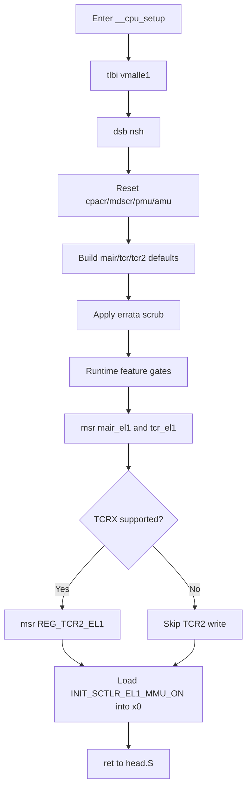
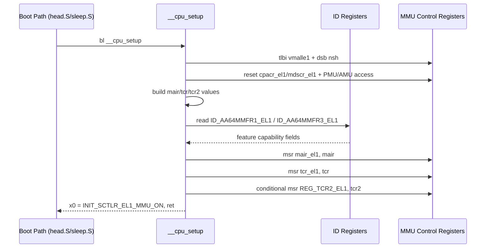

# Mermaid Diagrams (02_Exception_Levels_and_Privilege)

## Flow Diagram

```mermaid
flowchart TD
    A[Enter __cpu_setup] --> B[tlbi vmalle1]
    B --> C[dsb nsh]
    C --> D[Reset cpacr/mdscr/pmu/amu]
    D --> E[Build mair/tcr/tcr2 defaults]
    E --> F[Apply errata scrub]
    F --> G[Runtime feature gates]
    G --> H[msr mair_el1 and tcr_el1]
    H --> I{TCRX supported?}
    I -- Yes --> J[msr REG_TCR2_EL1]
    I -- No --> K[Skip TCR2 write]
    J --> L[Load INIT_SCTLR_EL1_MMU_ON into x0]
    K --> L
    L --> M[ret to head.S]
```

## Sequence Diagram

```mermaid
sequenceDiagram
    participant Boot as Boot Path (head.S/sleep.S)
    participant CPU as __cpu_setup
    participant ID as ID Registers
    participant MMU as MMU Control Registers

    Boot->>CPU: bl __cpu_setup
    CPU->>MMU: tlbi vmalle1 + dsb nsh
    CPU->>MMU: reset cpacr_el1/mdscr_el1 + PMU/AMU access
    CPU->>CPU: build mair/tcr/tcr2 values
    CPU->>ID: read ID_AA64MMFR1_EL1 / ID_AA64MMFR3_EL1
    ID-->>CPU: feature capability fields
    CPU->>MMU: msr mair_el1, mair
    CPU->>MMU: msr tcr_el1, tcr
    CPU->>MMU: conditional msr REG_TCR2_EL1, tcr2
    CPU-->>Boot: x0 = INIT_SCTLR_EL1_MMU_ON, ret
```
