Here is a cleaner, more structured flow. I kept your sequence style, but made the control flow clearer and the stage boundaries more explicit.

```mermaid
flowchart TD
    classDef boot fill:#1e3a8a,stroke:#1e40af,color:#fff,stroke-width:2px
    classDef stage1 fill:#0f766e,stroke:#115e59,color:#fff,stroke-width:2px
    classDef stage2 fill:#7c3aed,stroke:#6d28d9,color:#fff,stroke-width:2px
    classDef stage3 fill:#ea580c,stroke:#c2410c,color:#fff,stroke-width:2px
    classDef stage4 fill:#be123c,stroke:#9f1239,color:#fff,stroke-width:2px
    classDef stage5 fill:#059669,stroke:#047857,color:#fff,stroke-width:2px
    classDef stage6 fill:#0891b2,stroke:#0e7490,color:#fff,stroke-width:2px
    classDef kernel fill:#4338ca,stroke:#3730a3,color:#fff,stroke-width:2px
    classDef decision fill:#fde047,stroke:#ca8a04,color:#111827,stroke-width:2px

    A["Bootloader<br/>x0 = FDT phys addr"]:::boot --> B

    subgraph S1["Stage 1: Early Entry"]
        B["primary_entry"]:::stage1 --> C["record_mmu_state"]:::stage1
        C --> D["preserve_boot_args<br/>x21 = FDT"]:::stage1
        D --> E{"MMU enabled?"}:::decision
    end

    subgraph S2["Stage 2: Cache Handling"]
        F["dcache_inval_poc"]:::stage3
        G["mmu_enabled_at_boot = 1"]:::stage3
    end

    E -->|No| F
    E -->|Yes| G

    subgraph S3["Stage 3: Build Early MMU Tables"]
        H["setup early stack"]:::stage1 --> I["__pi_create_init_idmap"]:::stage2
        I --> J{"x19 == 0 ?"}:::decision
        K["Invalidate idmap tables"]:::stage3
        L["Clean idmap text/tables"]:::stage3
    end

    F --> H
    G --> H
    J -->|Yes| K
    J -->|No| L

    subgraph S4["Stage 4: EL / CPU Setup"]
        M["init_kernel_el"]:::stage4 --> N{"EL1 or EL2?"}:::decision
        O["BOOT_CPU_MODE_EL1"]:::stage4
        P["BOOT_CPU_MODE_EL2"]:::stage4
        Q["x20 = boot mode"]:::stage4
        R["__cpu_setup<br/>MAIR/TCR/errata<br/>x0 = SCTLR_EL1"]:::stage4
    end

    K --> M
    L --> M
    N -->|EL1| O
    N -->|EL2| P
    O --> Q
    P --> Q
    Q --> R

    subgraph S5["Stage 5: MMU Enable + Switch"]
        S["__primary_switch"]:::stage5 --> T["__enable_mmu"]:::stage2
        T --> U{"Granule supported?"}:::decision
        V["Hang in no-granule loop"]:::stage3
        W["Reset temporary state<br/>sp / x29 / x0 / x1"]:::stage5
        X["__pi_early_map_kernel"]:::stage2
        Y["branch to __primary_switched"]:::stage5
    end

    R --> S
    U -->|No| V
    U -->|Yes| W
    W --> X --> Y

    subgraph S6["Stage 6: Virtual Address Space Active"]
        Z["__primary_switched<br/>init_cpu_task / stack / SCS / percpu"]:::stage6
        AA["Install vectors<br/>VBAR_EL1 = vectors"]:::stage6
        AB["Save __fdt_pointer<br/>Save kimage_voffset"]:::stage6
        AC["set_cpu_boot_mode_flag"]:::stage6
        AD["kasan_early_init<br/>(optional)"]:::stage6
        AE["finalise_el2"]:::stage6
    end

    Y --> Z --> AA --> AB --> AC --> AD --> AE --> AF["start_kernel"]:::kernel
```

A simpler logical flow is:

1. Bootloader jumps to `primary_entry` with `x0 = FDT phys`.
2. Kernel records whether MMU was already on.
3. Kernel preserves boot args and FDT pointer.
4. Kernel builds a temporary identity map.
5. Kernel fixes cache visibility for those early page tables.
6. Kernel determines whether it entered at EL1 or EL2.
7. Kernel programs CPU MMU-related system registers via `__cpu_setup`.
8. Kernel enables the MMU in `__primary_switch`.
9. Kernel creates early kernel virtual mappings.
10. Control branches into `__primary_switched` in virtual address space.
11. Kernel installs vectors, saves boot metadata, finalizes EL2 state.
12. Kernel enters `start_kernel`.

A couple of fixes from your original version:

* `__primary_switch` is the real handoff point where MMU-on transition happens.
* `__primary_switched` is already after virtual addressing is live.
* `__pi_early_map_kernel` belongs after MMU enable in this flow.
* `x21` is preserved as the FDT pointer and later stored into `__fdt_pointer`.
* `start_kernel` is the first generic C entry, not part of the assembly-stage boot anymore.

If you want, I can also convert this into a **vertical flowchart** instead of a sequence diagram, which is often easier to present for boot flow.
