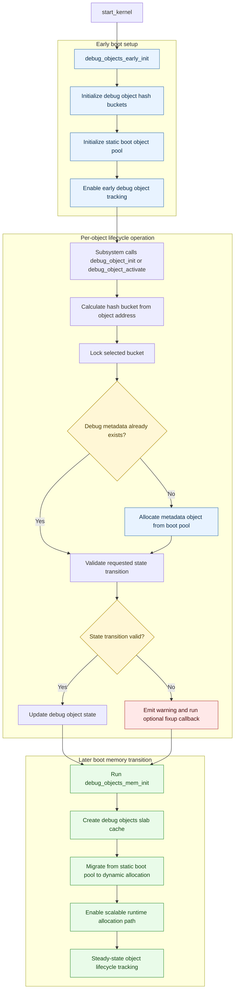

```mermaid
flowchart TD
    A[start_kernel] --> B[debug_objects_early_init]

    subgraph EARLY[Early boot setup]
        B --> C[Initialize debug object hash buckets]
        C --> D[Initialize static boot object pool]
        D --> E[Enable early debug object tracking]
    end

    subgraph TRACK[Per-object lifecycle operation]
        E --> F[Subsystem calls debug_object_init or debug_object_activate]
        F --> G[Calculate hash bucket from object address]
        G --> H[Lock selected bucket]

        H --> I{Debug metadata already exists?}
        I -- Yes --> J[Validate requested state transition]
        I -- No --> K[Allocate metadata object from boot pool]
        K --> J

        J --> L{State transition valid?}
        L -- Yes --> M[Update debug object state]
        L -- No --> N[Emit warning and run optional fixup callback]
    end

    subgraph LATE[Later boot memory transition]
        M --> O[Run debug_objects_mem_init]
        N --> O
        O --> P[Create debug objects slab cache]
        P --> Q[Migrate from static boot pool to dynamic allocation]
        Q --> R[Enable scalable runtime allocation path]
        R --> S[Steady-state object lifecycle tracking]
    end

    classDef early fill:#e8f3ff,stroke:#3572b0,color:#0b2e4f;
    classDef runtime fill:#e9fbe9,stroke:#2f8f2f,color:#134b13;
    classDef decision fill:#fff7d6,stroke:#b08a00,color:#4f3b00;
    classDef error fill:#ffe8e8,stroke:#b03535,color:#4f0b0b;

    class B,C,D,E,K early;
    class O,P,Q,R,S runtime;
    class I,L decision;
    class N error;
```
