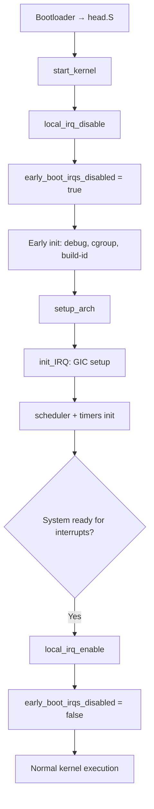

# **`early_boot_irqs_disabled = true;` — Deep Explanation (ARM64 / Kernel / Interview Ready)**

---

## 🏷️ Technical Document Name

**Early Boot Interrupt State Declaration and Control Flag Initialization (EBISCFI)**

### Suggested file name

```text
08-early-boot-irqs-disabled.md
```

---

## 1. One-line Interview Answer

> `early_boot_irqs_disabled = true;` is a global kernel state flag indicating that interrupts are currently disabled during early boot, allowing the kernel to enforce correctness checks and prevent improper interrupt enabling before the system is fully initialized.

---

## 2. What is this variable?

```c
bool early_boot_irqs_disabled;
```

Set in early boot:

```c
early_boot_irqs_disabled = true;
```

This is **NOT a hardware operation**.

👉 It does **not disable interrupts**.

👉 It is a **software state flag** used by the kernel.

---

## 3. Important distinction (INTERVIEW GOLD)

| Operation                         | Type     | Effect                 |
| --------------------------------- | -------- | ---------------------- |
| `local_irq_disable()`             | Hardware | Masks IRQ at CPU level |
| `early_boot_irqs_disabled = true` | Software | Records kernel state   |

So:

> One controls hardware, the other tracks system correctness.

---

## 4. Why this flag exists

During early boot:

```text
- Interrupts are disabled
- Kernel is initializing core subsystems
- Interrupt handlers are NOT ready
- Interrupt controller may not be initialized
```

So kernel needs to enforce:

> ❗ “Interrupts must remain disabled until we explicitly allow them”

---

## 5. Where it is used

Kernel has checks like:

```c
WARN_ON_ONCE(!early_boot_irqs_disabled);
```

or:

```c
if (!early_boot_irqs_disabled)
    /* illegal state */
```

Meaning:

> If interrupts get enabled too early → kernel detects a bug

---

## 6. Boot sequence context

Inside `start_kernel()`:

```c
local_irq_disable();
early_boot_irqs_disabled = true;
```

Flow:

```text
Disable interrupts at CPU level
        ↓
Record that interrupts are disabled
        ↓
Kernel proceeds with early initialization
```

---

## 7. Why tracking is necessary

### Problem without flag

```text
Developer mistakenly enables interrupts early
        ↓
Interrupt fires
        ↓
Handler runs with uninitialized subsystems
        ↓
Crash / corruption
```

---

### With flag

```text
Interrupts enabled early
        ↓
Kernel checks early_boot_irqs_disabled
        ↓
Detects violation
        ↓
WARN / BUG / crash early
```

---

## 8. ARM64 + CPU perspective

At hardware level:

```text
local_irq_disable()
    ↓
PSTATE.I = 1 (IRQ masked)
```

At software level:

```text
early_boot_irqs_disabled = true
```

So system state becomes:

```text
CPU: IRQ disabled
Kernel: knows IRQ must remain disabled
```

---

## 9. Memory + concurrency perspective

This variable:

```c
bool early_boot_irqs_disabled;
```

is:

* Global kernel variable
* Accessed during early boot
* No need for locking because:

  * Only one CPU is active
  * SMP not fully initialized

So:

> It is safe without locks because boot is single-threaded.

---

## 10. Lifecycle of this flag

```text
Boot starts
    ↓
Set = true
    ↓
Kernel initialization continues
    ↓
Interrupt subsystem initialized
    ↓
Interrupts enabled
    ↓
Set = false
```

---

## 11. When does it become false?

Later in boot:

```c
early_boot_irqs_disabled = false;
```

This indicates:

```text
Interrupts are now allowed
System is ready to handle IRQs
```

---

## 12. What can go wrong (important for interviews)

### ❗ If flag is wrong

Case 1:

```text
Flag = false but IRQs still disabled
→ Debug checks fail
```

Case 2:

```text
Flag = true but IRQs enabled
→ Interrupt handler runs too early
→ Kernel crash
```

So:

> Flag must always match real interrupt state

---

## 13. Real-world analogy

Think of it like:

```text
Construction site
```

* `local_irq_disable()` → physically locks the gate
* `early_boot_irqs_disabled` → signboard saying “DO NOT ENTER”

Both are needed:

```text
Gate locked + sign present = safe
```

---

## 14. NVIDIA interview perspective

They expect:

### 🧠 Understanding:

* Hardware vs software control
* State tracking vs enforcement
* Debugging mechanisms
* Safety in early system initialization

### Strong answer:

> This variable is part of defensive kernel design. It ensures that early boot assumptions—like interrupts being disabled—are explicitly tracked and validated. In complex systems like GPU drivers or firmware bring-up, similar state flags are used to ensure hardware events are not processed before initialization is complete.

---

## 15. Google system design perspective

Explain like this:

> This is a correctness invariant flag. In large-scale systems, especially during initialization phases, we maintain explicit state variables to enforce sequencing guarantees. Here, the kernel ensures that no asynchronous interrupt-driven execution occurs before all required subsystems are initialized. It’s similar to guarding critical initialization phases in distributed systems before accepting external events.

---

## 16. Flow diagram

```mermaid
flowchart TD
    A[start_kernel] --> B[local_irq_disable]
    B --> C[CPU IRQ masked (PSTATE.I = 1)]
    C --> D[early_boot_irqs_disabled = true]

    D --> E[Kernel early initialization]

    E --> F{Interrupt enabled too early?}
    F -- Yes --> G[Kernel detects violation via flag]
    G --> H[WARN / BUG]

    F -- No --> I[Continue initialization]

    I --> J[Interrupt subsystem ready]
    J --> K[local_irq_enable]
    K --> L[early_boot_irqs_disabled = false]
```

---

## 17. Key differences (INTERVIEW TABLE)

| Feature     | `local_irq_disable()` | `early_boot_irqs_disabled` |
| ----------- | --------------------- | -------------------------- |
| Type        | Hardware control      | Software flag              |
| Scope       | Current CPU           | Global kernel              |
| Purpose     | Stop interrupts       | Track state                |
| Enforcement | CPU                   | Kernel checks              |
| Risk        | Latency               | Logical bugs               |

---

## 18. Best Interview Answer

> `early_boot_irqs_disabled` is a kernel state variable used during early boot to explicitly track that interrupts are expected to be disabled. Unlike `local_irq_disable()`, which masks interrupts at the CPU level, this flag is used for correctness validation. It helps the kernel detect bugs where interrupts might be enabled too early before the interrupt subsystem is initialized. Since early boot runs on a single CPU, it doesn’t require synchronization. It is later cleared once the system is ready to handle interrupts.

---

## 19. One-line definition

**A kernel-level state flag that enforces and validates that interrupts remain disabled during early boot initialization.**

---

## 20. Final insight (high-level)

> This line is about **correctness, safety, and invariants**, not hardware control.

---

Great—let’s go deeper and connect this flag to **real kernel code paths, ARM64 interrupt controller (GIC), and the full boot timeline until interrupts are safely enabled**.

---

# 🧭 **1. Where `early_boot_irqs_disabled` is actually checked**

This flag is mainly used for **sanity validation**, not control.

### Example pattern inside kernel

```c
WARN_ON_ONCE(!irqs_disabled());
```

and conceptually:

```c
if (!early_boot_irqs_disabled)
    /* something is wrong */
```

### Why?

Because during early boot:

```text
Invariant:
Interrupts MUST remain disabled
```

So kernel uses:

* `irqs_disabled()` → actual hardware state
* `early_boot_irqs_disabled` → expected logical state

👉 If they diverge → bug

---

## 🔍 Combined validation logic (conceptual)

```text
Hardware state (CPU PSTATE.I)
        vs
Software expectation (early_boot_irqs_disabled)
```

```text
Expected: both say "disabled"
```

If mismatch:

```text
Kernel warns or crashes early → easier debugging
```

---

# ⚙️ **2. ARM64 Interrupt Controller (GIC) Connection**

## 🧠 What is GIC?

ARM systems use:

👉 **ARM Generic Interrupt Controller (GIC)**

It is responsible for:

```text
- Receiving device interrupts
- Prioritizing them
- Routing to CPUs
- Managing interrupt states
```

---

## 🧩 Interrupt path on ARM64

```text
Device → GIC → CPU interface → CPU (IRQ exception)
```

But:

```text
CPU will ONLY take IRQ if:
PSTATE.I == 0
```

---

## 🔐 During early boot

Even if GIC is initialized:

```text
Device sends interrupt
        ↓
GIC marks it pending
        ↓
CPU checks PSTATE.I
        ↓
PSTATE.I = 1 → IRQ NOT taken
```

So:

> `local_irq_disable()` blocks delivery
> `early_boot_irqs_disabled` ensures kernel knows it must stay blocked

---

# 🚀 **3. Full Boot Timeline (Interrupt Perspective)**

Let’s build the complete sequence.

---

## 🥶 Phase 0: CPU Entry (Assembly)

```text
Bootloader → Kernel entry (head.S)
```

* MMU setup
* Stack setup
* Exception vectors installed
* CPU enters EL1

---

## 🧊 Phase 1: `start_kernel()` begins

```c
start_kernel()
{
    local_irq_disable();
    early_boot_irqs_disabled = true;
```

### System state:

```text
CPU: IRQ masked (PSTATE.I = 1)
Kernel: knows IRQ must remain disabled
Other CPUs: not online
```

---

## 🧪 Phase 2: Core early init

```c
debug_objects_early_init();
init_vmlinux_build_id();
cgroup_init_early();
```

Still:

```text
Interrupts disabled
```

---

## ⚙️ Phase 3: Architecture setup

```c
setup_arch();
```

On ARM64:

* Memory map
* Device tree parsing
* CPU topology
* GIC base addresses discovered

---

## 🔌 Phase 4: Interrupt subsystem init

```c
init_IRQ();
```

This is critical.

### On ARM64:

* GIC Distributor initialized
* GIC CPU interface initialized
* Interrupt vectors ready
* Interrupt handlers registered

Now system is capable of handling interrupts—but they are still disabled.

---

## 🧠 Phase 5: Scheduler + timers

```c
sched_init();
tick_init();
```

Now:

```text
Timer interrupt handler exists
Scheduler ready
Per-CPU data initialized
```

---

## 🔓 Phase 6: Enable interrupts

```c
local_irq_enable();
early_boot_irqs_disabled = false;
```

### System state becomes:

```text
CPU: IRQ enabled (PSTATE.I = 0)
Kernel: allows interrupts
System: fully interrupt-driven
```

---

# 📊 Timeline summary



---

# ⚠️ **4. What happens if interrupts enabled too early**

## ❌ Scenario

```text
Interrupt enabled before init_IRQ()
```

Then:

```text
IRQ fires
        ↓
CPU jumps to handler
        ↓
Handler not initialized
        ↓
NULL pointer / crash / undefined behavior
```

---

## ✅ Protection

```text
early_boot_irqs_disabled = true
        ↓
Kernel checks detect illegal enable
        ↓
WARN / BUG
```

---

# 🧠 **5. NVIDIA Perspective (Driver / GPU)**

In GPU driver bring-up:

```text
GPU may generate interrupts very early:
- firmware ready
- engine idle
- error conditions
```

If kernel enables interrupts too early:

```text
GPU IRQ fires
        ↓
Driver not initialized
        ↓
Invalid memory access
        ↓
Crash
```

So:

> This flag enforces a **safe bring-up boundary**

---

### Strong NVIDIA-style answer

> This flag acts as a correctness invariant during early boot, ensuring that no hardware interrupt-driven execution happens before subsystems like the interrupt controller, scheduler, and device drivers are ready. In GPU systems, enabling interrupts too early can lead to undefined behavior because hardware may generate events before the driver is initialized.

---

# 🌍 **6. Google System Design Perspective**

Translate this concept to large systems:

```text
System startup phase
        ↓
Do not accept external events yet
        ↓
Initialize internal state
        ↓
Open system for events
```

Equivalent patterns:

* Load balancer warming up before accepting traffic
* Distributed system initializing nodes before joining cluster
* Database recovery before accepting queries

---

### Strong Google-style answer

> This is an example of enforcing a system invariant during initialization. The kernel delays handling asynchronous external events—interrupts—until all required subsystems are initialized. This is analogous to gating external traffic in distributed systems until internal state is consistent.

---

# 🔬 **7. Deep insight (what most people miss)**

This line:

```c
early_boot_irqs_disabled = true;
```

is part of a **design pattern**:

### 👉 “Explicit State + Hardware Enforcement”

```text
Hardware control → local_irq_disable()
Software invariant → early_boot_irqs_disabled
```

Together they ensure:

```text
Correctness + debuggability + safety
```

---

# 🎯 **8. Final Interview Answer (Perfect)**

> `early_boot_irqs_disabled` is a kernel state variable used during early boot to enforce the invariant that interrupts must remain disabled. While `local_irq_disable()` masks IRQs at the CPU level by setting the ARM64 PSTATE.I bit, this flag tracks the expected system state and allows the kernel to detect incorrect early enabling of interrupts. This is critical because before the interrupt controller (GIC), scheduler, and handlers are initialized, any interrupt could lead to undefined behavior. Once the system is fully ready, interrupts are enabled and the flag is cleared. This pattern reflects a broader system design principle of delaying external event handling until internal initialization is complete.

---


