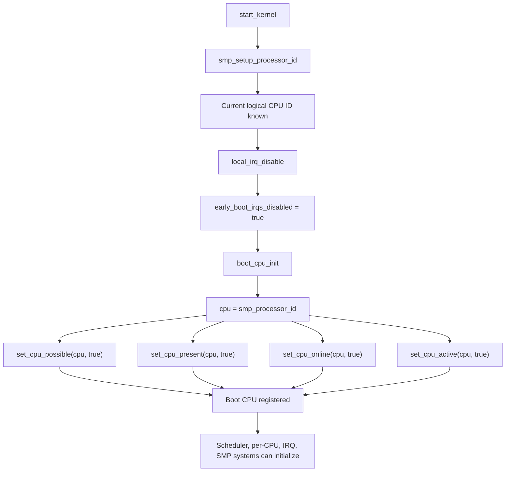

# `boot_cpu_init();` — ARM64 / Kernel / Interview Deep Explanation

## Technical document name

**Bootstrap CPU Mask Registration and Early CPU State Publication**

## 1. Interview one-liner

```c
boot_cpu_init();
```

means:

> Mark the current boot CPU as **possible**, **present**, **online**, and **active** in Linux CPU masks so the kernel can safely treat it as the first valid CPU for scheduling, per-CPU data, interrupts, and later SMP bring-up.

The Linux source defines it conceptually like this:

```c
void __init boot_cpu_init(void)
{
    int cpu = smp_processor_id();

    set_cpu_online(cpu, true);
    set_cpu_active(cpu, true);
    set_cpu_present(cpu, true);
    set_cpu_possible(cpu, true);
}
```

The upstream Linux source describes this as marking the boot CPU “present”, “online”, etc. for both SMP and UP cases. ([GitHub][1])

---

# 2. Start from scratch: why does Linux need CPU masks?

Linux supports systems with:

```text
1 CPU
4 CPUs
64 CPUs
256 CPUs
big.LITTLE ARM cores
hotplug CPUs
disabled CPUs
virtual CPUs
```

So the kernel cannot assume:

```text
CPU0, CPU1, CPU2, CPU3 all exist and are usable
```

Instead, Linux tracks CPU availability using **bitmaps** called **CPU masks**.

Example with 4 CPUs:

```text
CPU ID:      0 1 2 3
mask bits:   1 0 0 0
```

This means:

```text
Only CPU0 is currently marked in that mask.
```

---

# 3. What happens before `boot_cpu_init()`

Before this call, the kernel has already done:

```c
smp_setup_processor_id();
```

That answers:

```text
Which logical CPU am I currently running on?
```

Then `boot_cpu_init()` answers:

```text
Now that I know I am CPU X, publish CPU X into the kernel CPU state masks.
```

So the sequence is:

```text
smp_setup_processor_id()
        ↓
current CPU logical ID becomes known
        ↓
boot_cpu_init()
        ↓
that CPU is marked usable in Linux masks
```

---

# 4. CPU masks involved

`boot_cpu_init()` updates four important masks:

```c
set_cpu_possible(cpu, true);
set_cpu_present(cpu, true);
set_cpu_online(cpu, true);
set_cpu_active(cpu, true);
```

Kernel CPU-hotplug documentation defines these masks as follows: `cpu_possible_mask` is the set of CPUs that can ever be available and is used for boot-time per-CPU allocation; it is static after boot discovery. ([Kernel][2])

---

## 4.1 `cpu_possible_mask`

Meaning:

> CPUs that the kernel believes could ever exist in this system.

Example:

```text
System supports max 8 CPUs
cpu_possible_mask = 11111111
```

Why important?

Linux uses this to allocate per-CPU memory:

```text
per_cpu(variable, CPU0)
per_cpu(variable, CPU1)
...
```

For the boot CPU:

```text
CPU0 must be possible
```

because the kernel is already running on it.

---

## 4.2 `cpu_present_mask`

Meaning:

> CPUs physically or logically present in the machine right now.

On ARM64, this may come from:

```text
Device Tree
ACPI MADT
Firmware CPU topology
```

Example:

```text
possible: 11111111
present:  00001111
```

This means:

```text
System could support 8 CPUs, but only 4 are present.
```

For boot CPU:

```text
CPU0 present = true
```

---

## 4.3 `cpu_online_mask`

Meaning:

> CPUs currently online and available to run kernel code.

At early boot:

```text
online: 0001
```

Only boot CPU is online.

Later, after SMP bring-up:

```text
online: 1111
```

---

## 4.4 `cpu_active_mask`

Meaning:

> CPUs that can actively participate in task migration/load balancing.

At boot:

```text
active: 0001
```

Later:

```text
active: 1111
```

During CPU hotplug removal, a CPU may be online but not active while tasks are migrated away.

---

# 5. Visual example: 4-core ARM64 boot

Assume a 4-core ARMv8 system:

```text
CPU0 = boot CPU
CPU1 = secondary
CPU2 = secondary
CPU3 = secondary
```

Before `boot_cpu_init()`:

```text
possible: 0000
present:  0000
online:   0000
active:   0000
```

After `boot_cpu_init()`:

```text
possible: 0001
present:  0001
online:   0001
active:   0001
```

Later, after secondary CPUs are brought up:

```text
possible: 1111
present:  1111
online:   1111
active:   1111
```

---

# 6. ARM64 CPU identity from hardware

On ARM64, each CPU has hardware identity information.

Important register:

```text
MPIDR_EL1
```

It contains affinity fields describing CPU topology:

```text
Aff3 Aff2 Aff1 Aff0
```

Example conceptual topology:

```text
socket / cluster / core / thread
```

ARM64 kernel maps this hardware identity into a Linux logical CPU number:

```text
MPIDR_EL1 value → logical CPU ID
```

So:

```text
Hardware CPU identity: MPIDR_EL1
Linux CPU identity: logical CPU number
```

`boot_cpu_init()` does not do the hardware discovery itself. It uses:

```c
smp_processor_id()
```

which depends on earlier setup.

---

# 7. Memory perspective: why masks matter for per-CPU memory

Linux has per-CPU variables:

```c
DEFINE_PER_CPU(int, counter);
```

Conceptually:

```text
counter for CPU0
counter for CPU1
counter for CPU2
counter for CPU3
```

To access the correct copy:

```c
this_cpu_inc(counter);
```

The kernel must know:

```text
Which CPUs exist?
Which CPUs may need per-CPU storage?
Which CPU am I running on?
```

`boot_cpu_init()` makes the boot CPU visible to those systems.

Without it, early per-CPU logic could see:

```text
No CPUs online
```

which is impossible because the kernel is already executing.

---

# 8. Scheduler perspective

The scheduler needs at least one runnable CPU.

Before secondary CPUs come online:

```text
Boot CPU is the only scheduler CPU
```

`boot_cpu_init()` marks it:

```text
online = can run tasks
active = can receive/migrate tasks
```

Without this, scheduler initialization would not have a valid CPU target.

---

# 9. Interrupt perspective

Interrupt routing also depends on CPU state.

On ARM64 with GIC:

```text
Device interrupt → GIC → target CPU
```

The kernel must know which CPUs are valid interrupt targets.

Early boot:

```text
Only boot CPU can receive interrupts
```

So marking boot CPU online/present matters for later interrupt setup.

---

# 10. SMP perspective

SMP means:

```text
Symmetric Multiprocessing
```

Multiple CPUs can run kernel code.

But at `boot_cpu_init()` time:

```text
Only one CPU is executing Linux C code
```

Secondary CPUs are still parked/offline.

Later flow:

```text
boot_cpu_init()
        ↓
setup_arch()
        ↓
parse CPU topology
        ↓
smp_prepare_cpus()
        ↓
bringup secondary CPUs
        ↓
secondary CPUs enter kernel
        ↓
mark each secondary CPU online
```

---

# 11. CPU hotplug perspective

CPU masks are also used later for CPU hotplug.

A CPU can move through states:

```text
possible → present → online → active
```

And on removal:

```text
active false
online false
present maybe false
possible usually remains true
```

This design lets Linux support:

```text
CPU offline/online
power management
thermal throttling
big.LITTLE scheduling
virtual CPU hotplug
```

---

# 12. Why `boot_cpu_init()` is safe without locks

At this point in early boot:

```text
Only boot CPU is running
Interrupts are disabled
Scheduler is not fully active
Other CPUs are not online
```

So updating global CPU masks does not need normal runtime locking.

This is a key boot-time assumption:

> Single-threaded initialization allows direct mutation of global kernel state.

---

# 13. Difference from `smp_setup_processor_id()`

| Function                   | Meaning                       |
| -------------------------- | ----------------------------- |
| `smp_setup_processor_id()` | Identify current CPU          |
| `boot_cpu_init()`          | Mark current CPU in CPU masks |

Analogy:

```text
smp_setup_processor_id():
    “Who am I?”

boot_cpu_init():
    “Register me as present, possible, online, and active.”
```

---

# 14. Difference between `present`, `possible`, `online`, `active`

Interview table:

| Mask       | Meaning                                 | Boot CPU after `boot_cpu_init()` |
| ---------- | --------------------------------------- | -------------------------------- |
| `possible` | May ever exist                          | Yes                              |
| `present`  | Exists in system                        | Yes                              |
| `online`   | Currently usable                        | Yes                              |
| `active`   | Can participate in scheduling/migration | Yes                              |

A Linux kernel CPU-hotplug doc says `cpu_possible_mask` is used for boot-time per-CPU allocations and remains static after boot discovery. ([Kernel][2])

---

# 15. What if `boot_cpu_init()` did not run?

Then the kernel may believe:

```text
No CPU is online
No CPU is active
No CPU is present
```

That would break:

```text
scheduler initialization
per-CPU data access
interrupt routing
CPU topology setup
SMP bring-up
CPU hotplug state machine
boot-time sanity checks
```

The boot CPU must be registered before those systems initialize.

---

# 16. NVIDIA interview perspective

For NVIDIA systems, connect it to GPU driver and platform bring-up.

GPU drivers run on CPUs, but their interrupt handling, DMA mapping, command submission, and scheduling depend on CPU state.

A strong NVIDIA explanation:

> `boot_cpu_init()` publishes the bootstrap CPU into Linux’s CPU topology masks. This matters because early driver and interrupt subsystems need at least one valid CPU target. On ARM64 platforms, GPU interrupts often route through GIC to a CPU, and CPU-local/per-CPU structures are used for interrupt accounting, scheduling, softirq handling, and workqueues. Before secondary CPUs are online, the boot CPU is the only valid execution and interrupt-handling context.

---

# 17. Google system design perspective

Translate it into system-design language:

> `boot_cpu_init()` is service registration for the first execution node in the system. Before distributed work can be scheduled, the system must know at least one worker exists and is healthy.

Analogy:

```text
Distributed system:
    Node discovers its identity
    Node registers as alive
    Scheduler can assign work

Linux boot:
    CPU discovers logical ID
    CPU registers online/active
    Kernel scheduler can assign work
```

This is the same pattern as:

```text
node identity → node registration → node readiness → workload scheduling
```

---

# 18. ARM64 boot flow around this function

```text
start_kernel()
    ↓
set_task_stack_end_magic(&init_task)
    ↓
smp_setup_processor_id()
    ↓
debug_objects_early_init()
    ↓
init_vmlinux_build_id()
    ↓
cgroup_init_early()
    ↓
local_irq_disable()
    ↓
early_boot_irqs_disabled = true
    ↓
boot_cpu_init()
```

At `boot_cpu_init()`:

```text
Current CPU identity is known
IRQs are disabled
Boot CPU is executing alone
CPU masks are updated
```

---

# 19. Flow diagram



---

# 20. Best interview answer

Use this answer:

> `boot_cpu_init()` is an early kernel initialization function that registers the currently executing bootstrap CPU into Linux CPU masks. It gets the logical CPU ID using `smp_processor_id()` and marks that CPU as possible, present, online, and active. On ARM64, the logical CPU identity ultimately comes from architecture-specific CPU identification such as MPIDR-based topology mapping. This function does not start secondary CPUs; it only publishes the boot CPU as the first valid CPU. This is required before scheduler, per-CPU memory, interrupt routing, and SMP bring-up can rely on CPU masks. Since early boot is single-CPU and interrupts are disabled, the mask updates are safe without normal runtime locking.

---

# 21. Ultra-short answer for NVIDIA / Google

> `boot_cpu_init()` is the kernel’s way of saying: “the boot CPU is real and usable.” It marks the current CPU in `possible`, `present`, `online`, and `active` masks, enabling later scheduler, interrupt, per-CPU, and SMP initialization. On ARM64, this sits after CPU identity setup and before full SMP bring-up, making the boot CPU the first registered execution resource in the kernel.

