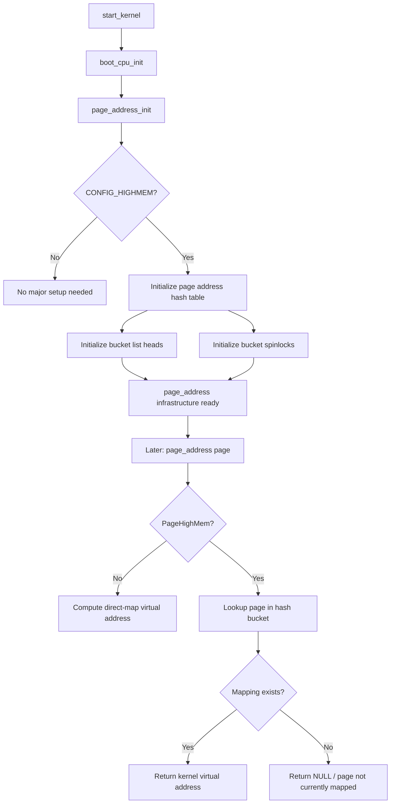

# `page_address_init();` — Deep Interview Explanation

## Technical document name

**High Memory Page Address Mapping Infrastructure Initialization**

Suggested file name:

```text
10-page-address-init-highmem.md
```

---

## 1. Interview one-liner

```c
page_address_init();
```

means:

> Initialize the kernel’s lookup infrastructure used by `page_address()` to find the kernel virtual address associated with a `struct page`, mainly for **high memory** pages that are not permanently direct-mapped.

In many modern 64-bit systems, especially typical ARM64 server systems, this function may effectively do little or nothing because RAM is usually directly mapped in the kernel virtual address space. But historically and on highmem systems, it is important. Linux initialization guides also describe it as mostly relevant when all RAM cannot be directly mapped. ([0xax GitBooks][1])

---

# 2. Start from scratch: what problem is this solving?

Linux tracks physical memory using metadata objects called:

```c
struct page
```

A `struct page` is **not the memory page itself**.

It is metadata describing a physical page frame.

Think:

```text
Physical RAM page:
    actual 4 KB / 16 KB / 64 KB memory frame

struct page:
    kernel metadata describing that frame
```

Example:

```text
Physical page frame 12345
        ↓ represented by
struct page object
```

So when the kernel has:

```c
struct page *page;
```

it may want to ask:

```text
What kernel virtual address maps this physical page?
```

That is what:

```c
page_address(page)
```

tries to answer.

A common explanation is: `page_address()` returns the **kernel virtual address**, not the physical address, associated with a `struct page`. ([Stack Overflow][2])

---

# 3. Physical address vs virtual address

The CPU does not normally use raw physical addresses directly after the MMU is enabled.

It uses virtual addresses:

```text
CPU instruction uses virtual address
        ↓
MMU translates
        ↓
Physical RAM address
```

Example:

```text
Kernel virtual address: 0xffff000012340000
Physical address:       0x0000000082340000
```

The kernel often needs a virtual address to access memory.

---

# 4. Direct-mapped memory

Many kernel pages are permanently mapped into the kernel virtual address space.

This is called the **linear map** or **direct map**.

Conceptually:

```text
physical address X
        ↓ fixed offset translation
kernel virtual address X + PAGE_OFFSET
```

For direct-mapped memory:

```c
page_address(page)
```

can be simple:

```text
struct page → PFN → physical address → kernel virtual address
```

No hash table needed.

---

# 5. What is high memory?

Historically, 32-bit systems had a problem.

Example:

```text
Physical RAM: 4 GB or more
Kernel virtual address space: limited
```

The kernel could not permanently map all physical RAM at once.

So memory was split conceptually:

```text
Low memory:
    permanently mapped into kernel address space

High memory:
    not permanently mapped
    must be temporarily mapped when kernel wants to access it
```

This is the “highmem” problem.

Several Linux kernel sources describe `mm/highmem.c` as common code for high memory handling, originally designed for systems where all RAM could not be directly mapped. ([Kernel Git Repositories][3])

---

# 6. Why highmem needs `page_address_init()`

For low memory:

```text
page → address
```

is easy.

For high memory:

```text
page → address
```

is not always available.

A highmem page may be:

```text
not currently mapped
temporarily mapped
permanently kmap-mapped
```

So Linux needs a data structure to remember:

```text
This highmem struct page is currently mapped at this virtual address.
```

That mapping metadata is maintained using a hash table.

`page_address_init()` initializes that hash table.

---

# 7. Conceptual implementation

On highmem-enabled systems, `page_address_init()` conceptually initializes:

```text
page_address_htable[]
```

Each bucket has:

```text
spinlock
linked list of mappings
```

Each mapping says:

```text
struct page *page
void *virtual
list node
```

Conceptual structures:

```c
struct page_address_slot {
    struct list_head lh;
    spinlock_t lock;
};

struct page_address_map {
    struct page *page;
    void *virtual;
    struct list_head list;
};
```

The idea is:

```text
page address hash table
        ↓
bucket selected by page pointer
        ↓
list entries mapping page → virtual address
```

---

# 8. What `page_address_init()` does internally

Conceptually:

```c
void __init page_address_init(void)
{
    int i;

    for (i = 0; i < ARRAY_SIZE(page_address_htable); i++) {
        INIT_LIST_HEAD(&page_address_htable[i].lh);
        spin_lock_init(&page_address_htable[i].lock);
    }
}
```

So it prepares:

```text
empty hash buckets
initialized spinlocks
ready lookup lists
```

This must happen early because later memory code may call:

```c
page_address(page)
```

or install highmem mappings.

---

# 9. How `page_address()` uses this

Conceptual flow:

```c
void *page_address(const struct page *page)
{
    if (!PageHighMem(page))
        return lowmem_page_address(page);

    bucket = page_slot(page);

    spin_lock_irqsave(&bucket->lock, flags);

    search bucket list for page;

    if found:
        return mapped virtual address;
    else:
        return NULL;

    spin_unlock_irqrestore(&bucket->lock, flags);
}
```

Important:

```text
Lowmem page:
    address calculated directly

Highmem page:
    address found through mapping table if currently mapped
```

A historical kernel snippet shows this same idea: if the page is not highmem, return the lowmem address; otherwise lock a page-address slot, search mappings, and return the stored virtual address if present. ([Stack Overflow][2])

---

# 10. Where it appears in boot

In `start_kernel()` sequence:

```c
boot_cpu_init();
page_address_init();
pr_notice("%s", linux_banner);
setup_arch(&command_line);
```

So it happens very early.

Why?

Because memory initialization code is coming soon.

The kernel is about to:

```text
parse physical memory layout
initialize zones
set up page allocator
set up architecture memory mappings
initialize highmem support
```

The page-address mapping infrastructure must be ready before highmem mappings are used.

---

# 11. ARM64 perspective

Now the key point:

## On normal ARM64 systems

Most ARM64 Linux configurations do **not** use classic highmem in the same way 32-bit ARM did.

Why?

Because ARM64 has a much larger virtual address space.

Typical ARM64 kernel can create a large linear map for RAM:

```text
RAM → kernel linear map
```

So most physical memory has a stable kernel virtual address.

Therefore, on many ARM64 systems:

```c
page_address_init();
```

is effectively a no-op or minimal.

Linux-insides says the function may do nothing in cases where all RAM can be directly mapped. ([0xax GitBooks][1])

---

# 12. ARM32 vs ARM64 comparison

| Topic                     | ARM32 highmem system   | ARM64 typical system |
| ------------------------- | ---------------------- | -------------------- |
| Kernel virtual space      | Limited                | Large                |
| Can map all RAM directly? | Often no               | Usually yes          |
| Highmem important?        | Yes                    | Usually no           |
| `page_address_init()`     | Initializes hash table | Often no-op/minimal  |
| `page_address()` for RAM  | May need lookup        | Usually direct map   |

This is excellent interview material.

Say:

> On ARM64, the concept still exists in generic memory code, but classic highmem pressure is mostly a 32-bit problem. ARM64 usually relies on the linear map, so `page_address_init()` is often not a major runtime mechanism.

---

# 13. Memory zones connection

Linux groups memory into zones:

```text
ZONE_DMA
ZONE_DMA32
ZONE_NORMAL
ZONE_HIGHMEM
ZONE_MOVABLE
```

Highmem systems have:

```text
ZONE_HIGHMEM
```

Pages in `ZONE_HIGHMEM` are not permanently mapped into kernel virtual space.

`page_address_init()` supports address lookup for these highmem mappings.

On typical ARM64:

```text
ZONE_HIGHMEM absent
RAM usually in direct map
```

---

# 14. CPU perspective

From CPU/MMU perspective:

For lowmem/direct-map page:

```text
CPU virtual address
        ↓ MMU translation
physical page
```

Stable mapping exists.

For highmem page:

```text
struct page exists
physical page exists
but no permanent kernel virtual mapping
```

Before CPU can access it, kernel must create a temporary mapping:

```text
kmap/page mapping
        ↓
virtual address exists temporarily
        ↓
CPU can access memory
```

The hash table initialized by `page_address_init()` helps track such mappings.

---

# 15. Kernel API perspective

Related APIs:

```c
page_address(page)
kmap(page)
kunmap(page)
kmap_local_page(page)
```

Modern kernels prefer local temporary mapping APIs like:

```c
kmap_local_page()
```

over older global kmap patterns, but the conceptual issue remains:

> A `struct page` does not always imply a permanently usable kernel virtual address.

---

# 16. Concurrency perspective

Why each hash bucket has a spinlock?

Because multiple CPUs may later map/unmap/query pages concurrently.

Example:

```text
CPU0 maps highmem page A
CPU1 queries page_address(A)
CPU2 unmaps page A
```

So the mapping table needs protection.

But during `page_address_init()` itself:

```text
Only boot CPU active
IRQs disabled
no concurrent access
```

Still, the locks must be initialized for later runtime use.

---

# 17. Why this is called after `boot_cpu_init()`

`boot_cpu_init()` registers the boot CPU.

Then `page_address_init()` initializes memory-address lookup support.

This order makes sense:

```text
First:
    kernel has a valid CPU identity and online boot CPU

Then:
    initialize memory infrastructure needed by later boot
```

---

# 18. What if `page_address_init()` was missing?

On a highmem system:

```text
hash lists uninitialized
spinlocks uninitialized
page_address() may crash or return garbage
kmap tracking broken
highmem page access unreliable
```

On a typical ARM64 system:

```text
may have no visible effect
```

But generic boot code still calls it so the kernel works across architectures/configurations.

---

# 19. NVIDIA interview perspective

In NVIDIA or GPU-driver interviews, connect it to DMA and page access:

> A GPU driver often receives memory as pages, scatter-gather lists, DMA buffers, or pinned user pages. A `struct page` is metadata, not directly CPU-accessible memory. To touch the contents, the kernel needs a CPU virtual mapping. On systems where memory is not permanently mapped, highmem infrastructure tracks page-to-virtual mappings. `page_address_init()` prepares that lookup path early. On ARM64, most RAM is direct-mapped, but the distinction between physical pages, `struct page`, kernel virtual mappings, and DMA addresses is still crucial for driver correctness.

Important GPU point:

```text
CPU virtual address != physical address != DMA/I/O virtual address
```

For a GPU:

```text
CPU virtual address: used by CPU
Physical address: RAM address
DMA address / IOVA: address device uses through IOMMU/SMMU
GPU virtual address: address GPU engine uses
```

This distinction is critical at NVIDIA.

---

# 20. Google system design perspective

Explain as a mapping/registry problem:

> `page_address_init()` initializes a registry that lets the kernel answer “given this memory object, where is it currently mapped?” In large systems, this is like initializing a service-discovery table or object-to-location index before components start using it. Without this registry, consumers may have an object identifier but no safe way to access the object.

System design analogy:

```text
struct page = object ID / metadata
kernel virtual address = current endpoint/location
page_address table = registry/index
```

---

# 21. Strong interview answer

Use this:

> `page_address_init()` initializes the data structures used by the kernel to map from `struct page` metadata to a kernel virtual address, mainly for highmem pages. In lowmem or directly mapped memory, the kernel can compute the virtual address directly from the physical frame. But in highmem systems, not every physical page is permanently mapped, so the kernel maintains a hash table of active page-to-virtual mappings protected by spinlocks. This function initializes those buckets and locks early in `start_kernel()`. On ARM64, because the kernel usually has a large linear map and no classic highmem, this function is often a no-op or minimal, but the concept remains essential for understanding memory management and driver work: `struct page`, CPU virtual address, physical address, and DMA address are different things.

---

# 22. Ultra-short version

```c
page_address_init();
```

means:

> Prepare the kernel’s page-to-virtual-address lookup mechanism, primarily for highmem pages that are not permanently mapped.

---

# 23. Mermaid flow



---

# 24. Final mental model

Remember this hierarchy:

```text
struct page
    metadata about physical memory

physical address
    real RAM location

kernel virtual address
    CPU-accessible address used by kernel

DMA address / IOVA
    device-visible address

GPU virtual address
    GPU engine-visible address
```

`page_address_init()` is about preparing one specific bridge:

```text
struct page → kernel virtual address
```


