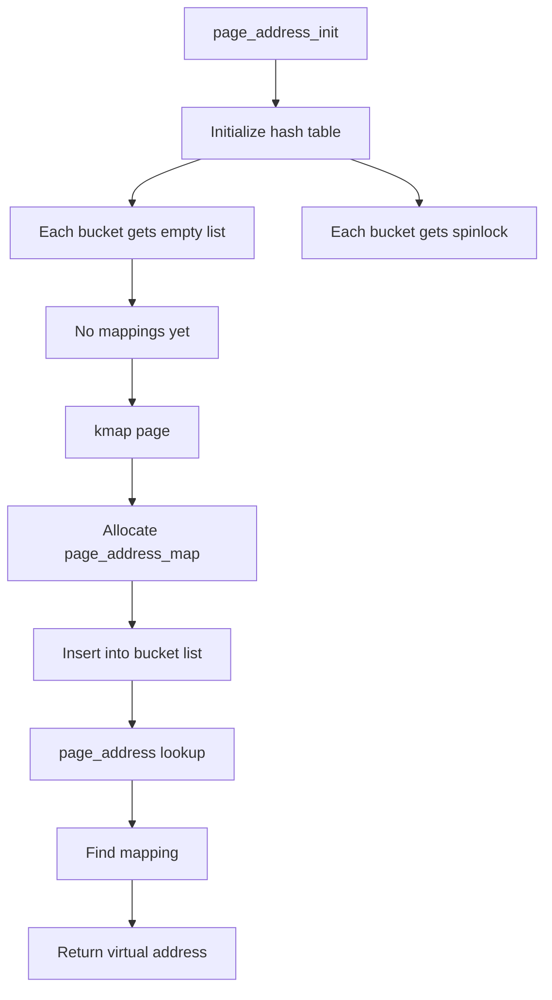

Let’s zoom in strictly on **what happens in memory** when the kernel executes:

```c
page_address_init();
```

No fluff—this is the **memory-level reality** behind that call.

---

# 🧠 1. The core problem (memory perspective)

The kernel has:

```c
struct page *page;
```

But memory access requires:

```text
kernel virtual address (VA)
```

So kernel needs a way to answer:

```text
"struct page → where is its VA mapping (if any)?"
```

---

## Two cases

### ✅ Case 1: Direct-mapped memory (common on ARM64)

```text
Physical memory is linearly mapped
```

So:

```text
VA = PA + PAGE_OFFSET
```

No extra structure needed.

---

### ❌ Case 2: High memory (important concept)

```text
Physical page exists
BUT no permanent VA mapping
```

So kernel must maintain:

```text
(struct page) ↔ (temporary VA mapping)
```

👉 This is where `page_address_init()` matters.

---

# 🔬 2. What `page_address_init()` allocates/initializes

It initializes a **global hash table in memory**:

```text
page_address_htable[]
```

---

## Structure in memory

Conceptually:

```c
struct page_address_slot {
    struct list_head list;
    spinlock_t lock;
};
```

And:

```c
struct page_address_map {
    struct page *page;
    void *virtual;
    struct list_head list;
};
```

---

## Actual memory layout (conceptual)

```text
Kernel memory:

+----------------------------------+
| page_address_htable[0]           |
|  - list head (empty)             |
|  - spinlock (initialized)        |
+----------------------------------+

+----------------------------------+
| page_address_htable[1]           |
|  - list head (empty)             |
|  - spinlock                      |
+----------------------------------+

...

+----------------------------------+
| page_address_htable[N]           |
+----------------------------------+
```

👉 No mappings yet — just empty buckets

---

# ⚙️ 3. What exactly happens step-by-step

## Step 1: Loop over hash buckets

```c
for each bucket in page_address_htable:
```

---

## Step 2: Initialize linked list

```c
INIT_LIST_HEAD(&bucket->list);
```

### Memory effect

```text
bucket->list.next = &bucket->list
bucket->list.prev = &bucket->list
```

👉 This creates an **empty circular list**

---

## Step 3: Initialize spinlock

```c
spin_lock_init(&bucket->lock);
```

### Memory effect

```text
bucket->lock = unlocked state
```

👉 Now safe for concurrent access later

---

# 🧠 4. What does NOT happen

Very important:

```text
❌ No physical memory allocation
❌ No page mapping created
❌ No struct page modified
❌ No VA assigned to pages
```

It only prepares **metadata infrastructure**

---

# 🔗 5. How this is used later (critical)

Later, when kernel maps a highmem page:

```c
vaddr = kmap(page);
```

Kernel will:

---

## Step A: Compute hash bucket

```text
bucket = hash(page pointer)
```

---

## Step B: Allocate mapping object

```text
page_address_map
```

Memory:

```text
+---------------------------+
| page_address_map          |
| page = struct page*       |
| virtual = VA              |
+---------------------------+
```

---

## Step C: Insert into bucket list

```text
bucket->list → [mapping1] → [mapping2] → ...
```

---

## Step D: Lookup

When:

```c
page_address(page);
```

Kernel:

```text
hash(page)
→ find bucket
→ walk list
→ match page
→ return VA
```

---

# 📦 6. Memory flow diagram



---

# 🧠 7. Why hash table?

Because lookup must be fast:

```text
O(1) average time
```

Instead of:

```text
Scanning all pages (O(n)) ❌
```

---

# ⚠️ 8. Concurrency (memory correctness)

Later runtime:

```text
CPU0 → mapping insert
CPU1 → lookup
CPU2 → removal
```

So each bucket:

```text
protected by spinlock
```

But during init:

```text
Only CPU0 active → no race
```

---

# 🧠 9. ARM64 reality (important)

On ARM64:

```text
Most memory is direct-mapped
```

So:

```text
page_address(page) → direct calculation
```

👉 Hash table often unused

---

## But still needed because:

```text
Kernel is generic
Supports:
- 32-bit systems
- HIGHMEM configs
- special mappings
```

---

# 🧠 10. Deep memory insight (INTERVIEW GOLD)

This function establishes:

```text
A dynamic mapping registry:
    struct page → virtual address
```

---

## Think of it like:

```text
struct page = object ID
virtual address = location
hash table = index
```

---

# 🎯 11. Perfect interview answer

> `page_address_init()` initializes the kernel’s internal hash table used to map from `struct page` metadata to a kernel virtual address for pages that are not permanently mapped. In memory, it sets up an array of buckets, each containing an empty linked list and a spinlock. No actual mappings are created at this stage. Later, when highmem pages are temporarily mapped, entries are inserted into this table so that `page_address()` can resolve a `struct page` to its current virtual address efficiently. On ARM64, most memory is directly mapped, so this mechanism is often unused, but it remains part of the generic memory subsystem.

---

# 🧠 12. One-line memory view

**Initializes a hash-table-based lookup structure in kernel memory for tracking temporary page → virtual address mappings.**

---

