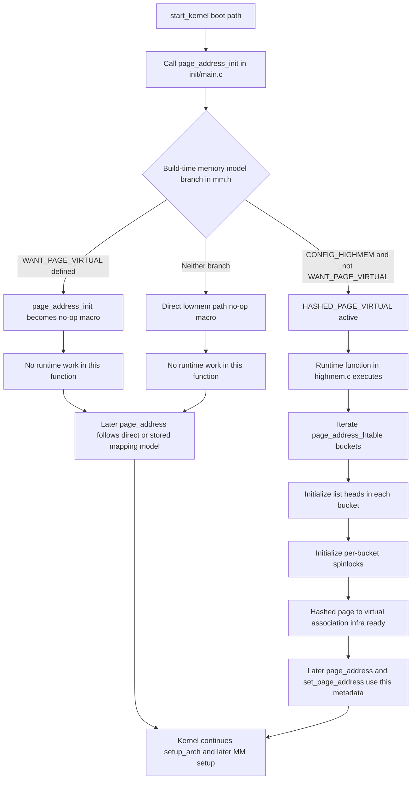
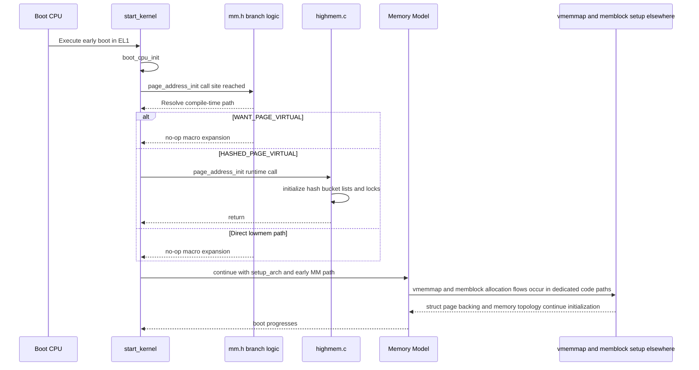

# `page_address_init()` — Reformatted Notes (001–005)

## 001) Mermaid Flow + Sequence

### A) Flowchart (compile-time + runtime)

### B) Sequence Diagram (boot-time interaction)

---

## 002) Detailed Flow Points of `page_address_init()`

1. Call site is in `init/main.c` inside `start_kernel`, right after `boot_cpu_init`.
2. `page_address_init` is compile-time selected in `include/linux/mm.h`.
3. Branch A: `WANT_PAGE_VIRTUAL`.
4. In Branch A, `page_address_init` is a no-op macro.
5. Branch B: `HASHED_PAGE_VIRTUAL` when `CONFIG_HIGHMEM && !WANT_PAGE_VIRTUAL`.
6. In Branch B, declaration appears in `mm.h` and runtime implementation is in `mm/highmem.c`.
7. Branch C: neither model; `page_address_init` is again no-op.
8. Hashed runtime path initializes static metadata arrays/tables.
9. Loop initializes every hash bucket list head and spinlock.
10. No direct allocator API call exists in this function body.
11. `page_address()` for highmem pages depends on hash lookup logic.
12. `set_page_address()` manages add/remove association records.
13. In direct lowmem models, translation uses direct helper logic.
14. On common ARM64 configs, practical runtime effect is usually minimal.
15. Boot still calls this hook for portability and stable ordering.
16. The call appears early to establish invariants before wider MM usage.
17. This is metadata-invariant setup, not allocator bring-up.
18. Main risk if wrong is model mismatch/corrupt lookup semantics.
19. Design pattern: one generic hook with compile-time backend selection.

---

## 003) Deep Explanation: Memory Creation, Address Origin, Model

1. **Hardware baseline**: CPU runs with virtual addresses under MMU translation.
2. **Linux page identity**: each physical frame has a `struct page` metadata object.
3. **Need for translation**: `struct page*` must map to a usable kernel virtual address for data access.
4. **Three strategies Linux supports**:
   - **Direct map**: arithmetic conversion to linear kernel mapping.
   - **Stored virtual pointer**: pointer kept in metadata (config dependent).
   - **Hashed association**: page↔virtual mappings tracked in hash structures.
5. **Where this function fits**: early normalization hook for the selected strategy.
6. **Why ARM64 is often light/no-op**: direct map usually covers normal RAM sufficiently.
7. **Address origin by model**:
   - Direct map: deterministic transform from PFN/page to kernel VA range.
   - Hashed mode: association records maintained in mapping workflows.
   - Stored field: per-page virtual field when configured.
8. **What is created here**:
   - Hashed path: only bucket metadata initialized.
   - No-op paths: nothing created at runtime in this call.
9. **Source anchors**:
   - Call site: `init/main.c`
   - Branch logic: `include/linux/mm.h`
   - Hashed runtime: `mm/highmem.c`
   - `struct page` virtual field: `include/linux/mm_types.h`

---

## 004) Allocation Reality: What This Function Does and Does Not Do

### Direct answer
- On common ARM64/direct-map builds, `page_address_init()` does **not** allocate pages.
- Even in hashed path, function body does **not** allocate pages; it initializes static metadata.

### Actual execution in hashed path
1. Iterate pre-existing static hash buckets.
2. Initialize list heads.
3. Initialize spinlocks.
4. No buddy call, no slab call, no memblock call in this body.

### Where memory for these structures comes from
- Statically linked kernel image sections (`mm/highmem.c` definitions).

### Where real memory allocation happens instead
- vmemmap backing paths (e.g., sparse-vmemmap logic)
- early architecture memory setup/reservation paths
- later buddy/slab allocator bring-up

### Timeline summary
1. `start_kernel` invokes `page_address_init` early.
2. Function establishes mapping-metadata invariants.
3. `setup_arch` and later MM phases do major topology/allocation setup.

**Interview-grade conclusion**: this is a correctness/abstraction gate, not a page allocator step.

---

## 005) Interview Q&A (Strong, Short)

1. **Core problem solved?**
   Ensure valid `struct page` → kernel virtual translation semantics for selected model.

2. **Generic or architecture-specific?**
   Generic call site; behavior selected by compile-time memory-model config.

3. **Does it allocate memory pages?**
   Usually no. Hashed path initializes static metadata only.

4. **Why called this early?**
   To establish page-address invariants before broader MM assumptions spread.

5. **Typical ARM64 behavior?**
   Usually minimal/no-op runtime effect due to broad direct mapping.

6. **What is `HASHED_PAGE_VIRTUAL` conceptually?**
   A fallback association model when universal permanent direct mapping is constrained.

7. **What structures are initialized in hashed path?**
   Per-bucket list heads and spinlocks.

8. **`struct page` vs page contents?**
   Metadata descriptor vs actual bytes in physical frame.

9. **Risk if skipped in hashed model?**
   Uninitialized lookup metadata can cause invalid mapping behavior.

10. **Compile-time branching evidence location?**
    `include/linux/mm.h`

11. **Runtime implementation evidence location?**
    `mm/highmem.c`

12. **`struct page` virtual field location?**
    `include/linux/mm_types.h`

13. **If not here, where does real memory metadata allocation occur?**
    In vmemmap + early memory setup flows (not inside `page_address_init`).

14. **Systems-design style explanation?**
    One generic boot hook, multiple compile-time backends, early invariant setup.

15. **Best one-line answer?**
    `page_address_init()` prepares page-to-virtual translation semantics for the configured memory model; it is usually not a page allocation step (especially on ARM64).
