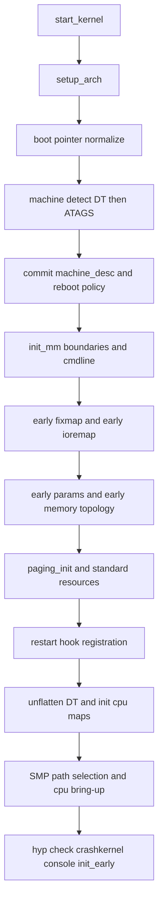
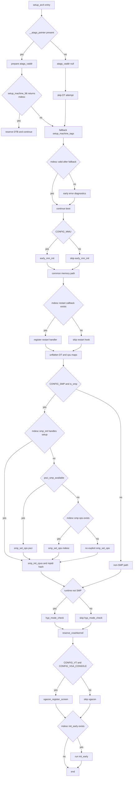

# ARM32 setup_arch() - Flow-Wise Mermaid

Reference implementation: arch/arm/kernel/setup.c (setup_arch)

```mermaid
flowchart TD
	A[start_kernel] --> B[setup_arch cmdline_p]

	subgraph P1[Phase 1 - Boot Input and Machine Detection]
		B --> C{__atags_pointer present}
		C -->|yes| D[atags_vaddr = FDT_VIRT_BASE __atags_pointer]
		C -->|no| E[atags_vaddr = NULL]

		D --> F[setup_processor]
		E --> F

		F --> G{atags_vaddr present}
		G -->|yes| H[mdesc = setup_machine_fdt atags_vaddr]
		G -->|no| K[skip DT attempt]

		H --> I{mdesc valid}
		I -->|yes| J[memblock_reserve __atags_pointer fdt_totalsize]
		I -->|no| K

		J --> L
		K --> L[if not mdesc -> setup_machine_tags atags_vaddr machine_type]

		L --> M{mdesc valid}
		M -->|no| N[early_print diagnostics and dump_machine_table]
		M -->|yes| O[continue]
		N --> O
	end

	subgraph P2[Phase 2 - Commit Machine State]
		O --> P[machine_desc = mdesc]
		P --> Q[machine_name = mdesc name]
		Q --> R[dump_stack_set_arch_desc]
		R --> S{mdesc reboot_mode != REBOOT_HARD}
		S -->|yes| T[reboot_mode = mdesc reboot_mode]
		S -->|no| U[keep default reboot mode]
	end

	subgraph P3[Phase 3 - Init MM Metadata and Cmdline]
		T --> V
		U --> V
		V[setup_initial_init_mm text etext edata end] --> W[strscpy cmd_line boot_command_line]
		W --> X[cmdline_p points to cmd_line]
	end

	subgraph P4[Phase 4 - Early Mapping and Early Params]
		X --> Y[early_fixmap_init]
		Y --> Z[early_ioremap_init]
		Z --> AA[parse_early_param]
	end

	subgraph P5[Phase 5 - Early Memory Topology]
		AA --> AB{CONFIG_MMU}
		AB -->|yes| AC[early_mm_init mdesc]
		AB -->|no| AD[skip early_mm_init]
		AC --> AE
		AD --> AE[setup_dma_zone mdesc]
		AE --> AF[xen_early_init]
		AF --> AG[arm_efi_init]
		AG --> AH[adjust_lowmem_bounds]
		AH --> AI[arm_memblock_init mdesc]
		AI --> AJ[adjust_lowmem_bounds again]
		AJ --> AK[early_ioremap_reset]
	end

	subgraph P6[Phase 6 - Final Paging and Core Resources]
		AK --> AL[paging_init mdesc]
		AL --> AM[kasan_init]
		AM --> AN[request_standard_resources mdesc]
	end

	subgraph P7[Phase 7 - Restart Hook]
		AN --> AO{mdesc restart exists}
		AO -->|yes| AP[set __arm_pm_restart and register_restart_handler]
		AO -->|no| AQ[skip restart hook]
	end

	subgraph P8[Phase 8 - Device Tree Materialization]
		AP --> AR
		AQ --> AR
		AR[unflatten_device_tree] --> AS[arm_dt_init_cpu_maps]
		AS --> AT[psci_dt_init]
	end

	subgraph P9[Phase 9 - SMP Selection and CPU Map]
		AT --> AU{CONFIG_SMP and is_smp}
		AU -->|yes| AV{mdesc smp_init absent or returns false}
		AV -->|yes| AW{psci_smp_available}
		AW -->|yes| AX[smp_set_ops psci_smp_ops]
		AW -->|no| AY{mdesc smp exists}
		AY -->|yes| AZ[smp_set_ops mdesc smp]
		AY -->|no| BA[no explicit smp_set_ops]
		AV -->|no| BB[mdesc smp_init handled setup]
		AX --> BC[smp_init_cpus]
		AZ --> BC
		BA --> BC
		BB --> BC
		BC --> BD[smp_build_mpidr_hash]
		AU -->|no| BE[skip SMP path]
	end

	subgraph P10[Phase 10 - Final Early Arch Hooks]
		BD --> BF
		BE --> BF
		BF{not SMP runtime} -->|yes| BG[hyp_mode_check]
		BF -->|no| BH[skip hyp_mode_check]
		BG --> BI[reserve_crashkernel]
		BH --> BI

		BI --> BJ{CONFIG_VT and CONFIG_VGA_CONSOLE}
		BJ -->|yes| BK[vgacon_register_screen]
		BJ -->|no| BL[skip vgacon]
		BK --> BM
		BL --> BM{mdesc init_early exists}
		BM -->|yes| BN[mdesc init_early]
		BM -->|no| BO[end setup_arch]
		BN --> BO
	end
```

## Fast Recall

1. Detect machine: DT first, then ATAGS fallback.
2. Commit machine descriptor and reboot policy.
3. Setup init_mm metadata and command line.
4. Build early mappings and parse early params.
5. Build memory topology with memblock, then paging.
6. Register restart hook and materialize device tree.
7. Setup SMP ops and CPU maps.
8. Run final early hooks: hyp check, crashkernel, vgacon, init_early.

## Compact Version A - Whiteboard (12 Nodes)

## Compact Version B - Decision-Only Flow

