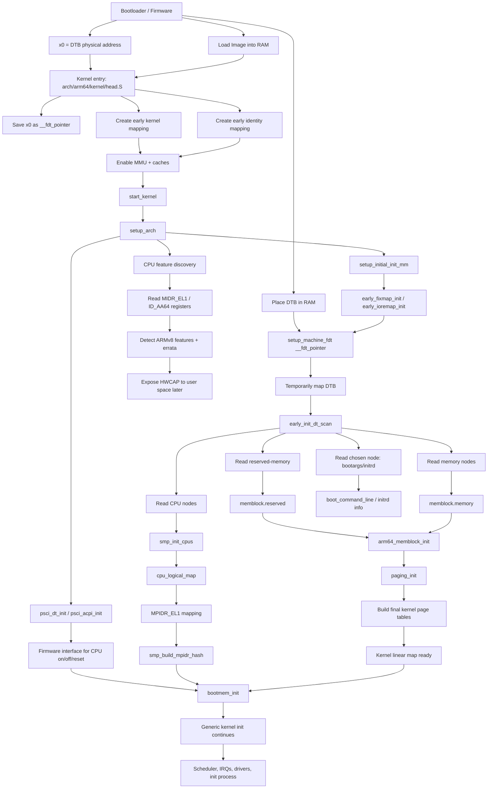

# ARMv8 / ARM64 full boot big-picture diagram

Your ARM64 `setup_arch()` note already captured the key stages: bootloader provides DTB, kernel sets early mappings, parses FDT, initializes memblock, paging, PSCI, CPU topology, and MPIDR mapping .



## Interview one-liner

```text
ARM64 boot converts bootloader-provided raw facts — kernel image, DTB pointer in x0, RAM layout, CPU nodes, and firmware interface — into kernel-ready state: virtual memory, memblock, page tables, CPU topology, PSCI operations, and user-visible CPU capabilities.
```

## Best mental model

```text
Bootloader gives raw physical world
        ↓
head.S creates minimal executable virtual world
        ↓
setup_arch parses DTB and discovers memory/CPU topology
        ↓
memblock + paging create real kernel memory world
        ↓
PSCI + CPU maps prepare SMP world
        ↓
generic kernel continues
```
