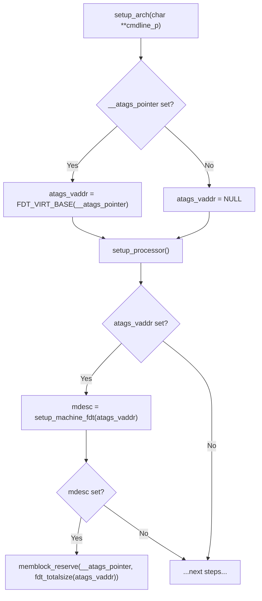

Certainly! Here’s a **detailed flowchart and in-depth explanation** of the code path from the start of `setup_arch()` up to and including the `memblock_reserve()` call, tailored for a kernel engineer interview at NVIDIA (or similar companies).

---

## **Flowchart (Step-by-Step)**



---

## **In-Depth Explanation (for Interview)**

### **1. Function Entry: `setup_arch(char **cmdline_p)`**
- This is the main architecture-specific initialization function for ARM platforms, called very early in the Linux boot process.
- Its job is to detect the hardware, set up memory, and prepare the kernel for further initialization.

---

### **2. ATAGs Pointer Check**
- `__atags_pointer` is a global variable set by the bootloader, pointing to the location of ATAGs (ARM Tag structures) or, in modern systems, the device tree blob (DTB).
- **Why?**  
  - ARM platforms historically used ATAGs for passing boot parameters, but now mostly use Flattened Device Tree (FDT).
- **Code:**  
  ```c
  if (__atags_pointer)
      atags_vaddr = FDT_VIRT_BASE(__atags_pointer);
  else
      atags_vaddr = NULL;
  ```
- **What happens here?**  
  - If the pointer is set, convert the physical address to a virtual address using `FDT_VIRT_BASE()`.
  - If not, set `atags_vaddr` to NULL.

---

### **3. Processor Setup**
- **Call:**  
  ```c
  setup_processor();
  ```
- **What does this do?**  
  - Detects the CPU type and revision (using CP15 registers).
  - Initializes CPU-specific function tables and features (e.g., cache, TLB, user operations).
  - Sets up the CPU architecture version, hardware capabilities, and per-CPU data.
  - Prepares the kernel for platform-specific quirks and errata.
- **Why is this important?**  
  - The kernel must know the exact CPU type to apply the correct workarounds and optimizations, especially on SoCs like NVIDIA Tegra.

---

### **4. Device Tree (FDT) Machine Detection**
- **Check:**  
  ```c
  if (atags_vaddr) {
      mdesc = setup_machine_fdt(atags_vaddr);
      if (mdesc)
          memblock_reserve(__atags_pointer, fdt_totalsize(atags_vaddr));
  }
  ```
- **What happens here?**
  - If a device tree is present (`atags_vaddr` is set), call `setup_machine_fdt()`:
    - This function parses the FDT to identify the platform (board/machine).
    - It matches the "compatible" string in the FDT against known machine descriptions (`struct machine_desc`).
    - If a match is found, it returns a pointer to the matching `machine_desc` structure.
  - If a valid machine is found (`mdesc` is not NULL):
    - **Reserve the memory region containing the FDT** using `memblock_reserve()`, so the kernel does not overwrite it during early memory allocation.
    - The size is determined by `fdt_totalsize(atags_vaddr)`.
- **Why is this important?**
  - The device tree is critical for describing the hardware layout (CPUs, memory, devices) on modern ARM SoCs.
  - Reserving the FDT memory ensures the kernel can safely access hardware configuration data throughout boot.

---

## **Key Technical Points for NVIDIA Interview**

- **Why is `setup_processor()` called before FDT parsing?**  
  - The kernel must know the CPU type and features before parsing the device tree, as some device tree parsing or platform setup may depend on CPU capabilities or errata.

- **What is the role of `setup_machine_fdt()`?**  
  - It matches the device tree's "compatible" property to a known platform, allowing the kernel to select the correct initialization routines for the board/SoC.

- **Why is `memblock_reserve()` used?**  
  - The kernel uses the memblock allocator for early memory management before the full memory subsystem is up.
  - Reserving the FDT region prevents accidental overwrites, which could corrupt the hardware description and cause boot failures.

- **What happens if no valid machine is found?**  
  - The kernel will fall back to other detection methods (e.g., ATAGs), and if still unsuccessful, it will print an error and halt.

- **How does this relate to NVIDIA SoCs?**  
  - NVIDIA Tegra platforms use device trees extensively. Understanding this flow is crucial for debugging bring-up issues, porting to new boards, or working on bootloaders.

---

## **Summary Table**

| Step                        | Purpose                                                      | Key Functions/Concepts         |
|-----------------------------|--------------------------------------------------------------|-------------------------------|
| ATAGs/DTB pointer check     | Find hardware description                                    | `__atags_pointer`, FDT         |
| Virtual address conversion  | Access FDT in virtual memory                                 | `FDT_VIRT_BASE()`              |
| Processor setup             | Detect CPU, set up features and quirks                       | `setup_processor()`            |
| FDT machine detection       | Identify board/platform, match to machine_desc               | `setup_machine_fdt()`          |
| FDT memory reservation      | Protect FDT from early memory allocations                    | `memblock_reserve()`           |

---

**In an interview, focus on:**
- The importance of early platform and CPU detection for SoC bring-up.
- The transition from ATAGs to device tree in ARM Linux.
- The use of memblock for safe early memory management.
- How this flow is foundational for all further kernel initialization on ARM SoCs, including NVIDIA Tegra.

Let me know if you want a deeper dive into any specific function or a visual diagram!