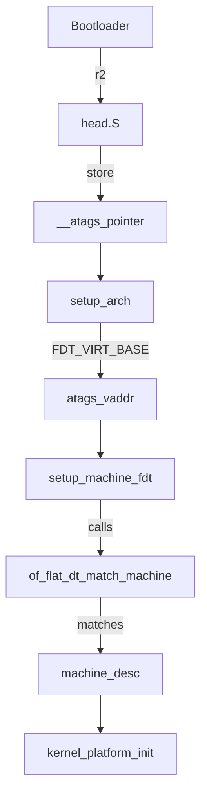

# ARM Linux Early Boot: DTB Platform Detection Internals

## 1. How `__atags_pointer` is Set in Assembly

### Background
- The bootloader loads the kernel and passes a pointer to either ATAGs (legacy) or a Device Tree Blob (DTB) in a CPU register (typically r2).
- The kernel’s earliest assembly code (in `arch/arm/kernel/head.S`) is responsible for capturing this pointer and storing it in the global variable `__atags_pointer`.

### Key Code Path
- **File:** `arch/arm/kernel/head.S`
- **Relevant Section:**
  ```assembly
  ENTRY(stext)
      ...
      mov r9, r2              @ Save atags/DTB pointer in r9
      ...
      bl  __lookup_machine_type
      ...
      ldr r8, =__atags_pointer
      str r9, [r8]            @ Store atags/DTB pointer in __atags_pointer
      ...
  ```
- **Explanation:**
  - The bootloader places the physical address of the ATAGs or DTB in r2.
  - The kernel saves r2 into r9 for temporary use.
  - After some setup, the kernel stores r9 into the global variable `__atags_pointer`.
  - This makes the boot information pointer available to C code in `setup_arch()`.

### Summary Table
| Step | Register/Variable | Description |
|------|-------------------|-------------|
| Bootloader | r2 | Physical address of ATAGs or DTB |
| Early asm | r9 | Temporary storage |
| Early asm | `__atags_pointer` | Global variable for C code |

---

## 2. How `of_flat_dt_match_machine` Works

### Purpose
- Matches the "compatible" strings in the DTB’s root node against the kernel’s list of supported platforms (`machine_desc` structures).

### Key Code Path
- **File:** `arch/arm/kernel/devtree.c` (and core DT code)
- **Prototype:**
  ```c
  const struct machine_desc *of_flat_dt_match_machine(
      const struct machine_desc *default_mdesc,
      const void * (*get_next_compat)(const char **))
  ```
- **How it Works:**
  1. **Extract "compatible" Strings:**
     - Reads the "compatible" property from the root node of the DTB.
     - This is a list of null-terminated strings describing the hardware (e.g., `"nvidia,tegra210"`).
  2. **Iterate Over `machine_desc` Table:**
     - The kernel maintains a table of all supported platforms, each with a list of compatible strings.
  3. **Compare:**
     - For each `machine_desc`, compare its compatible strings to those in the DTB.
     - If a match is found, return the matching `machine_desc`.
     - If no match, return the default (usually a generic fallback).
  4. **Error Handling:**
     - If no match is found, the kernel prints an error and halts.

### Pseudo-Code
```c
for each machine_desc in kernel:
    for each compat_string in machine_desc:
        if compat_string matches any in DTB:
            return machine_desc
return default_mdesc
```

### Summary Table
| Step | Function | Description |
|------|----------|-------------|
| 1 | Extract "compatible" | Read from DTB root node |
| 2 | Iterate | For each `machine_desc` in kernel |
| 3 | Compare | Match DTB string to `machine_desc` string |
| 4 | Return | Return matching `machine_desc` or default |

---

## 3. Design Diagram



---

## 4. References

- `arch/arm/kernel/head.S` (assembly boot code)
- `arch/arm/kernel/setup.c` (C early boot logic)
- `arch/arm/kernel/devtree.c` (DTB parsing and matching)
- `include/linux/of_fdt.h` (Device Tree core APIs)

---

## 5. Summary

- The bootloader provides the DTB address in r2.
- Early assembly saves this in `__atags_pointer`.
- C code in `setup_arch` translates and passes it to `setup_machine_fdt`.
- `setup_machine_fdt` calls `of_flat_dt_match_machine` to match the DTB’s "compatible" string to a supported platform.
- The matched `machine_desc` is used for all further platform-specific initialization.
