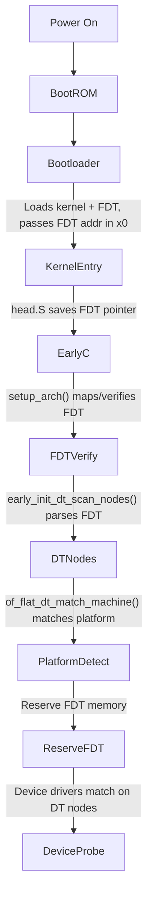

# ARM64 Linux Boot: Device Tree (FDT) Flow from Power-On to Platform Detection

---

## 1. Power-On to Kernel Entry

- **Power-On Reset:**
  - SoC hardware resets, CPU starts executing from a fixed address (e.g., ROM/boot ROM).
- **Boot ROM:**
  - Initializes minimal hardware, loads the next-stage bootloader (e.g., U-Boot, TF-A, UEFI).
- **Bootloader:**
  - Initializes DRAM, loads the Linux kernel image and the Device Tree Blob (DTB/FDT) into RAM.
  - Passes the physical address of the DTB to the kernel via a register (x0 for ARM64, r2 for ARM32).

---

## 2. Kernel Entry and Early Setup

- **Entry Point:**
  - Kernel entry is in `arch/arm64/kernel/head.S`.
  - The bootloader provides:
    - x0: Physical address of the FDT (DTB)
    - x1: Reserved (may be used for other boot info)
- **Early Assembly:**
  - Saves x0 (FDT address) into a global variable (e.g., `__fdt_pointer`).
  - Sets up minimal page tables and enables the MMU.

---

## 3. Early C Code: `setup_arch()`

- **File:** `arch/arm64/kernel/setup.c`
- **Key Steps:**
  1. **Get FDT Address:**
     - Reads the FDT physical address from `__fdt_pointer`.
  2. **Map FDT:**
     - Converts the physical address to a virtual address for kernel access.
  3. **Verify FDT:**
     - Calls `early_init_dt_verify()` to check FDT validity.
  4. **Parse FDT:**
     - Calls `early_init_dt_scan_nodes()` to parse the FDT and build in-memory data structures.
  5. **Platform Detection:**
     - Calls `of_flat_dt_match_machine()` to match the FDT's root "compatible" string to a `machine_desc` (on ARM32) or to set up platform-specific data (on ARM64, platform code is more generic).

---

## 4. Device Tree (FDT) Parsing and Node Creation

- **FDT Format:**
  - The FDT is a binary blob with a header, structure block (nodes/properties), and string block.
- **Parsing:**
  - `early_init_dt_scan_nodes()` walks the FDT structure, creating in-memory representations (flattened device tree nodes, then later expanded to `struct device_node` trees).
  - Each node/property is parsed and stored in kernel memory.
- **Node Creation:**
  - The kernel creates a tree of `struct device_node` objects, mirroring the FDT structure.
  - These are used for all device matching and driver binding.

---

## 5. Device Matching (How Devices Are Matched)

- **Compatible Property:**
  - Each device node in the FDT has a `compatible` property (e.g., `"nvidia,tegra210-i2c"`).
- **Driver Probing:**
  - When a driver is loaded, it registers a table of compatible strings.
  - The kernel walks the device tree, and for each node, tries to match the node's `compatible` string to a driver's table.
  - If a match is found, the driver is bound to that device node.
- **Platform Detection:**
  - The root node's `compatible` property is used to select the SoC/platform code (e.g., `"nvidia,tegra210"`).
  - On ARM64, this is used to select platform-specific quirks, CPU bring-up, and other early init.

---

## 6. How FDT Data is Saved and Used

- **FDT Blob:**
  - The original FDT blob is kept in memory (reserved by the kernel, not overwritten).
  - The parsed device tree (`struct device_node` tree) is used throughout boot and runtime.
- **Memory Reservation:**
  - The kernel reserves the memory region containing the FDT to prevent it from being used for other allocations.
- **Access:**
  - Subsystems (e.g., CPU, memory, devices) query the device tree for configuration and hardware description.

---

## 7. Full Flow: Power-On to Device Probing

1. **Power-on**
2. **Bootloader loads kernel and FDT, passes FDT address in x0**
3. **Kernel entry in head.S, saves FDT address**
4. **setup_arch() maps and verifies FDT**
5. **early_init_dt_scan_nodes() parses FDT, creates device_node tree**
6. **of_flat_dt_match_machine() matches platform**
7. **Memory region for FDT is reserved**
8. **Device drivers match on device tree nodes by compatible string**
9. **Drivers are probed and bound to devices**

---

## 8. Key Source Files

- `arch/arm64/kernel/head.S` (entry, FDT pointer save)
- `arch/arm64/kernel/setup.c` (setup_arch, FDT mapping)
- `drivers/of/fdt.c` (FDT parsing)
- `drivers/of/base.c` (device_node creation, matching)
- `include/linux/of.h` (device tree APIs)

---

## 9. Interview Points (NVIDIA/ARM64)

- ARM64 always boots with a Device Tree (no ATAGs, no board files).
- The FDT is passed by the bootloader and never generated by the kernel.
- The kernel reserves the FDT memory and parses it very early.
- Device matching is done by compatible string, not by hardcoded board/platform code.
- The device tree enables a single kernel image to support many boards/SoCs.
- Platform detection and quirks are handled by matching the root node's compatible string.
- All device drivers use the device tree for configuration and resource discovery.

---

## 10. Diagram: ARM64 FDT Boot Flow

---

## 11. Summary Table

| Step | Code Location | Description |
|------|--------------|-------------|
| FDT pointer saved | head.S | x0 register to global var |
| FDT mapped/verified | setup.c | FDT physical to virtual, check header |
| FDT parsed | of/fdt.c | Build device_node tree |
| Platform matched | devtree.c | Root compatible string |
| FDT memory reserved | setup.c | memblock_reserve |
| Device match/probe | of/base.c | compatible string matching |

---

## 12. References
- ARM64 Linux kernel source: `arch/arm64/kernel/head.S`, `setup.c`, `drivers/of/`
- Device Tree specification: https://www.devicetree.org/
- NVIDIA Tegra Linux kernel sources (for SoC-specific examples)

---