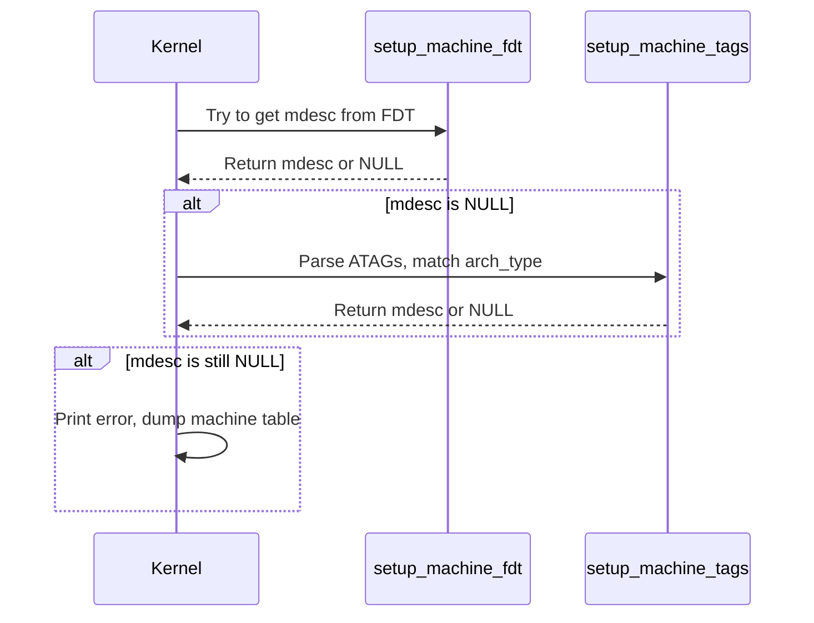

# Design: Fallback to `setup_machine_tags` for Machine Description

## Context

In ARM Linux kernel initialization, the machine description (`mdesc`) is essential for platform-specific setup. The code:

```c
if (!mdesc)
    mdesc = setup_machine_tags(atags_vaddr, __machine_arch_type);
```

is a fallback mechanism to identify the machine using ATAGs if the device tree (`setup_machine_fdt`) did not yield a valid description.

## Design Details

### 1. Inputs

- `mdesc`: Pointer to the current machine description (may be `NULL` if not found yet).
- `atags_vaddr`: Virtual address of the ATAGs (ARM bootloader-provided tags).
- `__machine_arch_type`: Architecture type identifier (integer, set by bootloader).

### 2. Flow

- If `mdesc` is `NULL` (i.e., not found via device tree), call `setup_machine_tags`.
- `setup_machine_tags` parses the ATAGs at `atags_vaddr` and matches the machine type against `__machine_arch_type`.
- If a match is found, it returns a pointer to the corresponding `struct machine_desc`.
- If not, it returns `NULL`, and further error handling is triggered.

### 3. Functions Involved

- `setup_machine_tags(void *atags, unsigned int arch_type)`
  - Parses ATAGs for `ATAG_CORE`, `ATAG_MEM`, `ATAG_CMDLINE`, etc.
  - Looks for `ATAG_MACHINE` or equivalent to match `arch_type`.
  - Returns pointer to `struct machine_desc` if found.

### 4. Error Handling

- If `mdesc` is still `NULL` after this call, print an error and dump the machine table for debugging.

### 5. Data Structures

- `struct machine_desc`
  - Contains platform-specific callbacks, memory map, name, and other metadata.

### 6. Sequence Diagram



### 7. Pseudocode

```c
if (!mdesc) {
    mdesc = setup_machine_tags(atags_vaddr, __machine_arch_type);
    if (!mdesc) {
        // Error: unknown machine
        early_print("Error: invalid dtb and unrecognized/unsupported machine ID\n");
        dump_machine_table();
    }
}
```

### 8. Rationale

- Ensures compatibility with older bootloaders that use ATAGs instead of device trees.
- Provides robust fallback for platform detection.

---
