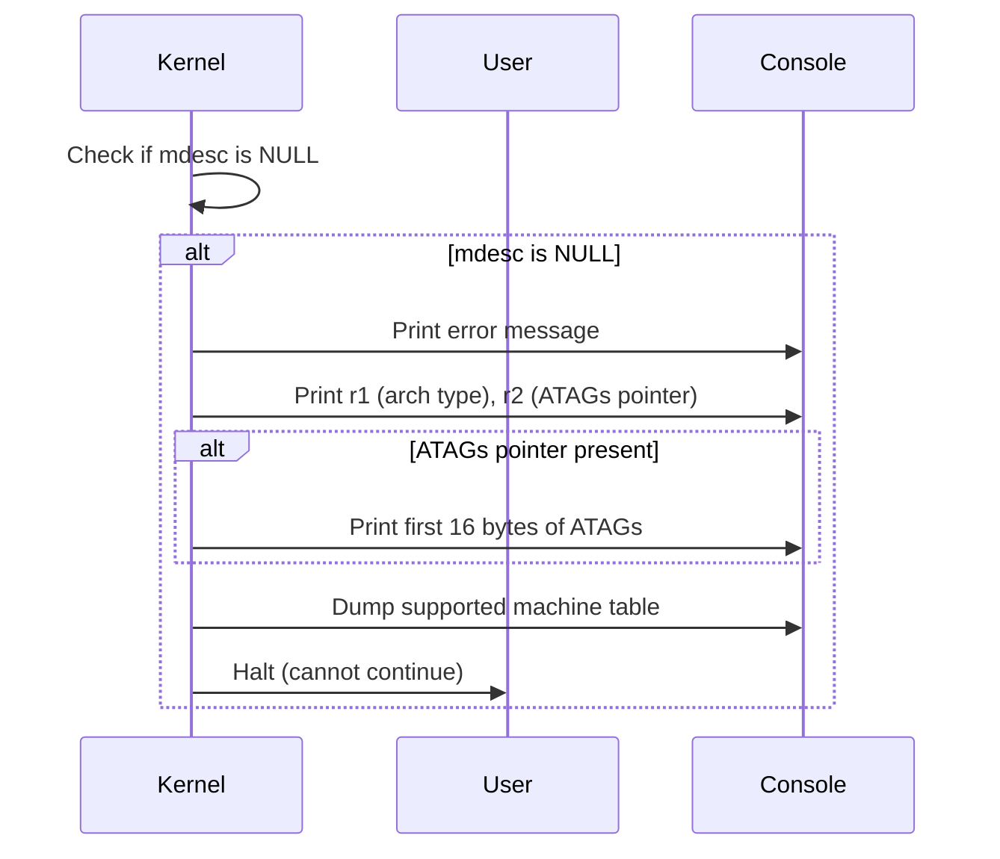

# Design: Error Handling for Unrecognized/Unsupported Machine ID

## Context

During ARM Linux kernel initialization, after attempting to detect the machine description (`mdesc`) using both device tree and ATAGs, the following code handles the case where no valid machine description is found:

```c
if (!mdesc) {
    early_print("\nError: invalid dtb and unrecognized/unsupported machine ID\n");
    early_print("  r1=0x%08x, r2=0x%08x\n", __machine_arch_type, __atags_pointer);
    if (__atags_pointer)
        early_print("  r2[]=%*ph\n", 16, atags_vaddr);
    dump_machine_table();
}
```

## Design Details

### 1. Inputs
- `mdesc`: Pointer to the machine description (NULL if not found).
- `__machine_arch_type`: Architecture type identifier (set by bootloader).
- `__atags_pointer`: Physical address of ATAGs (if provided by bootloader).
- `atags_vaddr`: Virtual address of ATAGs.

### 2. Flow
- If `mdesc` is NULL after all detection attempts:
  - Print an error message indicating both device tree and ATAGs failed.
  - Print the values of `__machine_arch_type` and `__atags_pointer` for debugging.
  - If ATAGs are present, print the first 16 bytes of the ATAGs for further analysis.
  - Call `dump_machine_table()` to print all supported machine IDs and names, helping the user identify the correct configuration or bootloader issue.

### 3. Functions Involved
- `early_print(const char *fmt, ...)`: Prints early boot messages to the console.
- `dump_machine_table(void)`: Prints a table of all supported machine types.

### 4. Error Handling
- The kernel halts after dumping the machine table, as it cannot proceed without a valid machine description.
- The printed information is intended to help developers or users debug bootloader or configuration issues.

### 5. Data Structures
- `struct machine_desc`: Describes supported machines (not found in this error case).

### 6. Sequence Diagram



### 7. Pseudocode

```c
if (!mdesc) {
    early_print("\nError: invalid dtb and unrecognized/unsupported machine ID\n");
    early_print("  r1=0x%08x, r2=0x%08x\n", __machine_arch_type, __atags_pointer);
    if (__atags_pointer)
        early_print("  r2[]=%*ph\n", 16, atags_vaddr);
    dump_machine_table();
    // Kernel halts in dump_machine_table()
}
```

### 8. Rationale
- Provides clear diagnostics for platform detection failures.
- Helps users and developers quickly identify misconfiguration or unsupported hardware.
- Ensures the kernel does not proceed in an undefined state.

---
