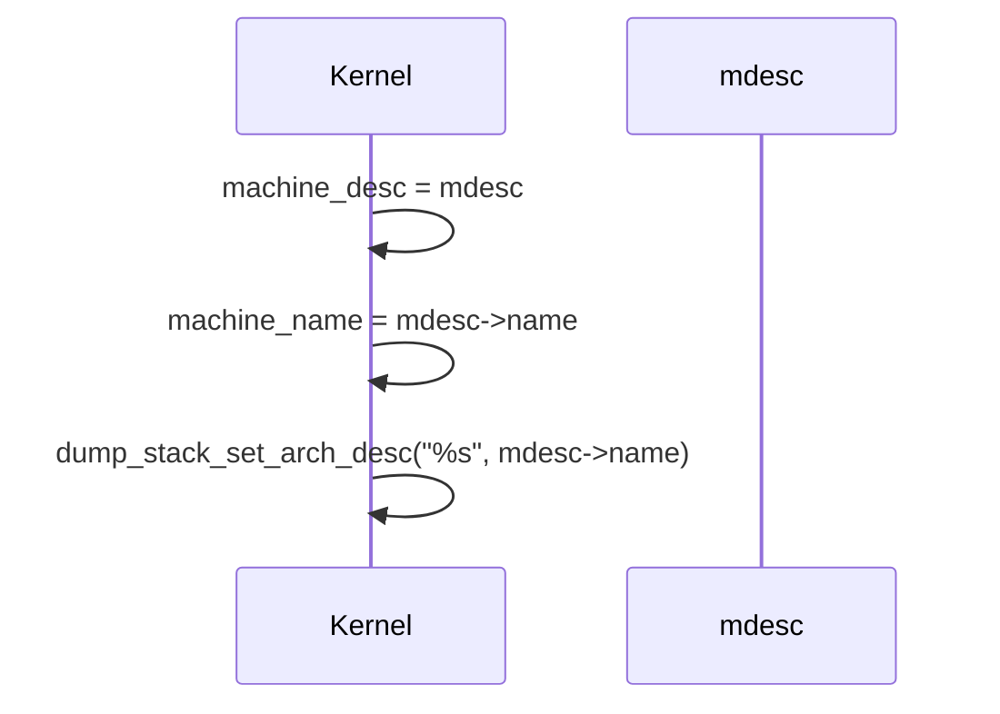

# Design: Setting Machine Description and Architecture Name

## Context

After successfully detecting the machine description (`mdesc`), the kernel must store this information for later use and update the architecture description for debugging and reporting. The code:

```c
machine_desc = mdesc;
machine_name = mdesc->name;
dump_stack_set_arch_desc("%s", mdesc->name);
```

performs these tasks during ARM Linux kernel initialization.

## Design Details

### 1. Inputs
- `mdesc`: Pointer to the detected `struct machine_desc` for the current platform.

### 2. Flow
- Assign the detected machine description to the global pointer `machine_desc` for use throughout the kernel.
- Assign the machine's name (from `mdesc->name`) to the global `machine_name` for reporting and /proc/cpuinfo.
- Call `dump_stack_set_arch_desc` to set the architecture description string for stack traces and debugging output.

### 3. Functions and Variables Involved
- `machine_desc`: Global pointer to the current machine's description.
- `machine_name`: Global pointer to the current machine's name string.
- `dump_stack_set_arch_desc(const char *fmt, ...)`: Sets the architecture description string for stack traces and debugging.
- `mdesc->name`: Name of the detected machine/platform.

### 4. Purpose and Rationale
- **`machine_desc = mdesc;`**
  - Makes the detected machine description available globally for all platform-specific operations and callbacks.
- **`machine_name = mdesc->name;`**
  - Makes the machine name available for reporting in /proc/cpuinfo and other user/kernel interfaces.
- **`dump_stack_set_arch_desc("%s", mdesc->name);`**
  - Ensures that stack traces and kernel logs include the platform name, aiding in debugging and support.

### 5. Sequence Diagram



### 6. Pseudocode

```c
machine_desc = mdesc;
machine_name = mdesc->name;
dump_stack_set_arch_desc("%s", mdesc->name);
```

### 7. Interview Explanation
- **Why is this step important?**
  - It registers the detected platform so that all subsequent kernel code can use platform-specific callbacks and data.
  - It sets the platform name for user and developer visibility (e.g., in /proc/cpuinfo, stack traces, and logs).
- **What does `dump_stack_set_arch_desc` do?**
  - It sets a string that will be included in kernel stack traces and oops messages, making it easier to identify the running hardware platform during debugging.
- **What would happen if this step was skipped?**
  - The kernel would not know which platform-specific code to use, and stack traces/logs would lack platform identification, making debugging and support much harder.

---
