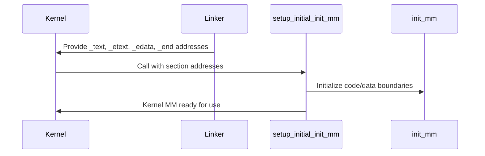

# Design & Deep Explanation: `setup_initial_init_mm(_text, _etext, _edata, _end)`

## Context

During ARM Linux kernel initialization, the function call:

```c
setup_initial_init_mm(_text, _etext, _edata, _end);
```

is used to set up the initial memory management (MM) structures for the kernel. This is a critical step for establishing the kernel's view of its own code and data in virtual memory.

---

## Function Purpose

- **`setup_initial_init_mm`** initializes the `init_mm` structure, which represents the initial memory mapping for the kernel (the kernel's "process").
- It defines the boundaries of the kernel's code and data segments in memory, which are essential for memory management, paging, and later process creation.

---

## Arguments Explained

The arguments are linker symbols defined in the kernel's linker script, representing the boundaries of various kernel sections:

| Argument   | Meaning                                 | Set By           | Typical Content/Section         |
|------------|-----------------------------------------|------------------|---------------------------------|
| `_text`    | Start address of kernel code             | Linker script    | Start of .text (code) section   |
| `_etext`   | End address of kernel code               | Linker script    | End of .text section            |
| `_edata`   | End address of kernel data               | Linker script    | End of .data section            |
| `_end`     | End address of kernel BSS/uninitialized  | Linker script    | End of .bss section             |

- These symbols are defined in `arch/arm/kernel/vmlinux.lds.S` (the linker script) and are available as global variables in the kernel.
- They are set at link time, not runtime, and represent physical or virtual addresses depending on the architecture and configuration.

---

## Where Do These Addresses Come From?

- **Linker Script**: The kernel's linker script (`vmlinux.lds.S`) defines these symbols at the boundaries of the code, data, and bss sections.
- **Example (from linker script):**
  ```ld
  _text = .;
  ...
  _etext = .;
  ...
  _edata = .;
  ...
  _end = .;
  ```
- **Usage in C:**
  ```c
  extern char _text[], _etext[], _edata[], _end[];
  ```

---

## What Does `setup_initial_init_mm` Do?

- It initializes the `init_mm` structure (the kernel's initial memory descriptor).
- Sets up the start and end addresses for the code and data segments.
- Prepares the kernel's memory map for use by the rest of the kernel and for process creation.
- Ensures that memory management code knows the exact layout of the kernel in memory.

---

## Sequence Diagram



---

## Pseudocode

```c
// Addresses provided by linker
extern char _text[], _etext[], _edata[], _end[];

// Setup initial memory management structure
setup_initial_init_mm(_text, _etext, _edata, _end);
```

---

## Interview Deep Explanation

- **What is `init_mm`?**
  - It is the kernel's initial memory descriptor, representing the address space of the kernel itself (like a process's mm_struct).
- **Why do we need to set it up?**
  - The kernel must know where its code and data reside in memory to manage paging, memory protection, and to create new processes.
- **Where do the arguments come from?**
  - They are linker symbols, set at build time, marking the boundaries of the kernel's code, data, and bss sections.
- **What would happen if this step was skipped?**
  - The kernel would not have a valid memory map for itself, leading to crashes or undefined behavior when managing memory or creating processes.
- **How does this relate to user processes?**
  - The `init_mm` structure is used as a template for creating the memory maps of user processes.

---
