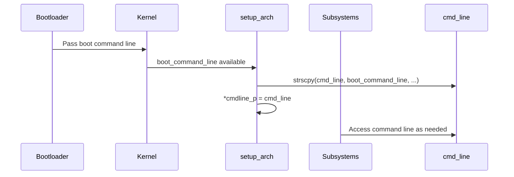

# Design & Deep Explanation: Kernel Command Line Setup (`cmd_line`)

## Context

During ARM Linux kernel initialization, the following code is used to set up the kernel command line for later use:

```c
/* populate cmd_line too for later use, preserving boot_command_line */
strscpy(cmd_line, boot_command_line, COMMAND_LINE_SIZE);
*cmdline_p = cmd_line;
```

This ensures that the kernel's command line arguments are safely stored and accessible throughout the boot and runtime.

---

## Step-by-Step Deep Explanation

### 1. What is the Kernel Command Line?
- The kernel command line is a string of parameters passed to the Linux kernel at boot time by the bootloader (e.g., U-Boot, GRUB).
- It controls kernel behavior, hardware configuration, root filesystem, debug options, and more.
- Example: `console=ttyAMA0 root=/dev/mmcblk0p2 rw earlyprintk`

### 2. Where Does `boot_command_line` Come From?
- `boot_command_line` is a global variable populated early in the boot process.
- It is set from ATAGs (legacy ARM), device tree (`chosen` node's `bootargs`), or directly by the bootloader.
- It contains the full command line as received by the kernel.

### 3. What is `cmd_line`?
- `cmd_line` is a static buffer (usually `char cmd_line[COMMAND_LINE_SIZE]`) used to store a copy of the command line for later use.
- It is used by various kernel subsystems and drivers that need to parse or reference the command line after early boot.

### 4. What Does `strscpy(cmd_line, boot_command_line, COMMAND_LINE_SIZE);` Do?
- `strscpy` is a safe string copy function (preferred over `strncpy` or `strlcpy`).
- It copies up to `COMMAND_LINE_SIZE` characters from `boot_command_line` to `cmd_line`, ensuring null-termination and no buffer overflows.
- This preserves the original command line for later use, even if `boot_command_line` is modified or freed.

### 5. What is `*cmdline_p = cmd_line;`?
- `cmdline_p` is a pointer to a pointer to the command line (usually passed as an argument to `setup_arch`).
- By setting `*cmdline_p = cmd_line;`, the kernel ensures that the rest of the initialization code and any interested subsystems have access to the preserved command line buffer.

---

## Sequence Diagram



---

## Pseudocode

```c
// boot_command_line is set from bootloader/ATAGs/DT
extern char boot_command_line[];
static char cmd_line[COMMAND_LINE_SIZE];

// Copy and preserve command line
strscpy(cmd_line, boot_command_line, COMMAND_LINE_SIZE);
*cmdline_p = cmd_line;
```

---

## Interview Deep Explanation

- **Why do we copy the command line?**
  - To ensure the kernel always has a safe, persistent copy of the boot parameters, even if the original is overwritten or freed.
- **Why use `strscpy`?**
  - It is robust against buffer overflows and guarantees null-termination, which is critical for security and stability.
- **What happens if this step is skipped?**
  - Later kernel code or drivers may not be able to access the command line, leading to misconfiguration or failure to boot.
- **How is the command line used later?**
  - Subsystems parse it for options (e.g., `root=`, `console=`, `init=`), and it is exposed to userspace via `/proc/cmdline`.
- **What is `COMMAND_LINE_SIZE`?**
  - A constant (e.g., 1024 or 2048) defining the maximum allowed length for the kernel command line.

---

## Summary
- This step is essential for robust kernel configuration and for passing parameters to both the kernel and userspace.
- It is a foundational part of the Linux boot process on all architectures.

---
