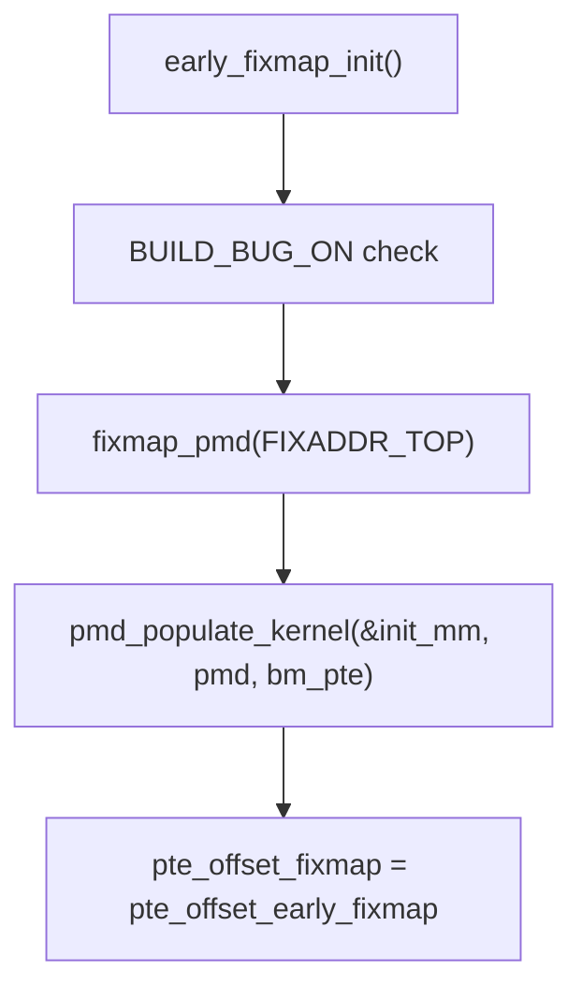

# Detailed Design: `early_fixmap_init()` in ARM Linux Kernel

## 1. Flowchart / Call Flow

---

## 2. Function Purpose

`early_fixmap_init()` sets up the early fixmap region in the ARM kernel's virtual memory system. The fixmap is a reserved virtual address range used for early I/O remapping and other critical mappings before the full paging system is up.

---

## 3. Step-by-Step Deep Explanation

### a. `BUILD_BUG_ON((__fix_to_virt(__end_of_early_ioremap_region) >> PMD_SHIFT) != FIXADDR_TOP >> PMD_SHIFT);`
- **Purpose:** Compile-time assertion to ensure the early fixmap region does not cross multiple Page Middle Directories (PMDs).
- **Why?** The kernel's early fixmap code assumes the region fits within a single PMD. If not, the logic would break.
- **How?**
  - `__fix_to_virt(x)`: Converts a fixmap index to a virtual address.
  - `__end_of_early_ioremap_region`: Marks the end of the early ioremap fixmap region (macro, see below).
  - `PMD_SHIFT`: Number of bits to shift to get the PMD index (architecture-specific, e.g., 21 for 2MB PMDs).
  - `FIXADDR_TOP`: The top virtual address of the fixmap region.
- **Check:** Both the end of the region and the top must be in the same PMD.

### b. `pmd = fixmap_pmd(FIXADDR_TOP);`
- **Purpose:** Get the PMD pointer for the fixmap region.
- **How?**
  - `fixmap_pmd(addr)`: Macro/function to get the PMD entry for a given virtual address.
  - `FIXADDR_TOP`: The top of the fixmap virtual address range.
- **Result:** `pmd` now points to the PMD entry for the fixmap.

### c. `pmd_populate_kernel(&init_mm, pmd, bm_pte);`
- **Purpose:** Populate the PMD with a page table for the fixmap.
- **How?**
  - `pmd_populate_kernel(mm, pmd, pte)`: Sets the PMD to point to the page table (`bm_pte`).
  - `&init_mm`: The initial memory management structure for the kernel.
  - `bm_pte`: The base page table for the fixmap (set up earlier in boot).
- **Result:** The fixmap PMD now points to a valid PTE table.

### d. `pte_offset_fixmap = pte_offset_early_fixmap;`
- **Purpose:** Set the global function pointer for fixmap PTE lookup.
- **How?**
  - `pte_offset_fixmap`: Function pointer used to get the PTE for a fixmap address.
  - `pte_offset_early_fixmap`: Early boot version of the function.
- **Result:** All fixmap PTE lookups use the early boot function.

---

## 4. Macro/Constant Origins and Values

- `__fix_to_virt(x)`: Macro in `arch/arm/include/asm/fixmap.h`. Converts fixmap index to virtual address.
- `__end_of_early_ioremap_region`: Macro in `arch/arm/include/asm/fixmap.h`. Marks the end index of early ioremap fixmap slots.
- `PMD_SHIFT`: Defined in `arch/arm/include/asm/pgtable-*.h`. Number of bits for PMD index (e.g., 21 for 2MB).
- `FIXADDR_TOP`: Defined in `arch/arm/include/asm/fixmap.h`. The highest virtual address in the fixmap region.
- `fixmap_pmd(addr)`: Macro/function in `arch/arm/include/asm/fixmap.h` or `pgtable.h`. Gets PMD pointer for address.
- `pmd_populate_kernel`: Function in `arch/arm/include/asm/pgtable.h`. Populates PMD with PTE table.
- `init_mm`: Global struct in `mm/init-mm.c`. The kernel's initial memory map.
- `bm_pte`: Early boot page table for fixmap, set up in early memory init code.
- `pte_offset_fixmap`: Global function pointer for fixmap PTE lookup.
- `pte_offset_early_fixmap`: Early boot version of the PTE lookup function.

---

## 5. How It Works (Detailed Design)

1. **Compile-Time Safety:**
   - The `BUILD_BUG_ON` ensures the early fixmap region is contained within a single PMD. This is critical for the fixmap logic to work correctly during early boot.
2. **PMD Setup:**
   - The code retrieves the PMD entry for the fixmap region and populates it with a page table (`bm_pte`). This enables the kernel to map/unmap fixmap slots during early boot.
3. **PTE Lookup Function:**
   - The function pointer for fixmap PTE lookup is set to the early boot version, ensuring correct address translation before the full paging system is up.
4. **Result:**
   - The fixmap region is now ready for use in early I/O remapping and other critical kernel operations.

---

## 6. Interview-Ready Insights

- **Why is the fixmap needed?**
  - For mapping critical hardware or memory regions at known virtual addresses before the full paging system is initialized.
- **What would happen if the region spanned multiple PMDs?**
  - The kernel's fixmap logic would break, possibly leading to memory corruption or early boot failure.
- **Why use function pointers for PTE lookup?**
  - Allows switching between early and late paging implementations as the kernel transitions from early boot to full MMU operation.
- **Where are the macros defined?**
  - All macros/constants are in `arch/arm/include/asm/fixmap.h` and `pgtable.h`.
- **What is the role of `bm_pte`?**
  - It is the base page table for the fixmap, set up very early in boot, before normal memory allocators are available.

---

## 7. Summary
- `early_fixmap_init()` is a foundational step in ARM kernel memory management, ensuring the fixmap region is safely and correctly set up for early boot operations.
- It uses compile-time checks, careful page table setup, and function pointer indirection to provide robust early memory mapping.

---
