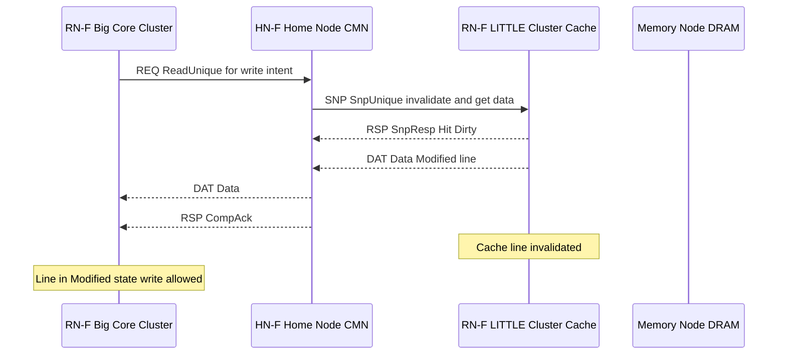

```mermaid
sequenceDiagram
    participant RN as RN-F Big Core Cluster
    participant HN as HN-F Home Node CMN
    participant SN as RN-F LITTLE Cluster Cache
    participant MN as Memory Node DRAM

    %% Step 1: Big core issues request
    RN->>HN: REQ ReadUnique for write intent

    %% Step 2: HN checks directory and finds line in LITTLE cluster
    HN->>SN: SNP SnpUnique invalidate and get data

    %% Step 3: LITTLE cluster responds
    SN-->>HN: RSP SnpResp Hit Dirty
    SN-->>HN: DAT Data Modified line

    %% Step 4: HN forwards data to Big core
    HN-->>RN: DAT Data
    HN-->>RN: RSP CompAck

    %% Step 5: LITTLE cluster invalidates its copy
    Note over SN: Cache line invalidated

    %% Step 6: Big cluster now owns line
    Note over RN: Line in Modified state write allowed
```
