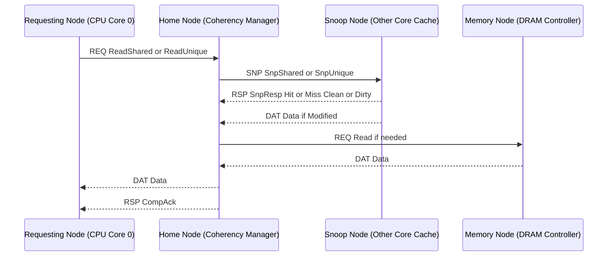

```mermaid
sequenceDiagram
    participant RN as Requesting Node (CPU Core 0)
    participant HN as Home Node (Coherency Manager)
    participant SN as Snoop Node (Other Core Cache)
    participant MN as Memory Node (DRAM Controller)

    %% Step 1: Request
    RN->>HN: REQ ReadShared or ReadUnique

    %% Step 2: HN checks directory and issues snoop
    HN->>SN: SNP SnpShared or SnpUnique

    %% Step 3: Snoop response from other cache
    SN-->>HN: RSP SnpResp Hit or Miss Clean or Dirty

    %% Step 4a: If line is dirty, data comes from snooped cache
    SN-->>HN: DAT Data if Modified

    %% Step 4b: If not present or clean, fetch from memory
    HN->>MN: REQ Read if needed
    MN-->>HN: DAT Data

    %% Step 5: Forward data to requesting core
    HN-->>RN: DAT Data

    %% Step 6: Completion response
    HN-->>RN: RSP CompAck
```
