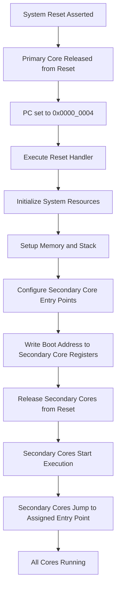

## Boot Flow Diagram (Primary → Secondary Core Bring-up)

```mermaid
flowchart TD
    A[System Reset Asserted] --> B[Primary Core Released from Reset]
    
    B --> C[PC set to 0x0000_0004]
    C --> D[Execute Reset Handler]
    
    D --> E[Initialize System Resources]
    E --> F[Setup Memory and Stack]
    
    F --> G[Configure Secondary Core Entry Points]
    
    G --> H[Write Boot Address to Secondary Core Registers]
    H --> I[Release Secondary Cores from Reset]
    
    I --> J[Secondary Cores Start Execution]
    J --> K[Secondary Cores Jump to Assigned Entry Point]
    
    K --> L[All Cores Running]
```
