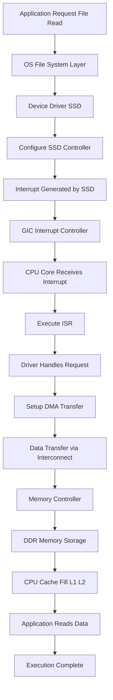

## Full SoC Execution Flow (SSD Read Example)

```mermaid
flowchart TD
    A[Application Request File Read] --> B[OS File System Layer]
    B --> C[Device Driver SSD]

    C --> D[Configure SSD Controller]
    D --> E[Interrupt Generated by SSD]

    E --> F[GIC Interrupt Controller]
    F --> G[CPU Core Receives Interrupt]

    G --> H[Execute ISR]
    H --> I[Driver Handles Request]

    I --> J[Setup DMA Transfer]
    J --> K[Data Transfer via Interconnect]

    K --> L[Memory Controller]
    L --> M[DDR Memory Storage]

    M --> N[CPU Cache Fill L1 L2]
    N --> O[Application Reads Data]

    O --> P[Execution Complete]
```
