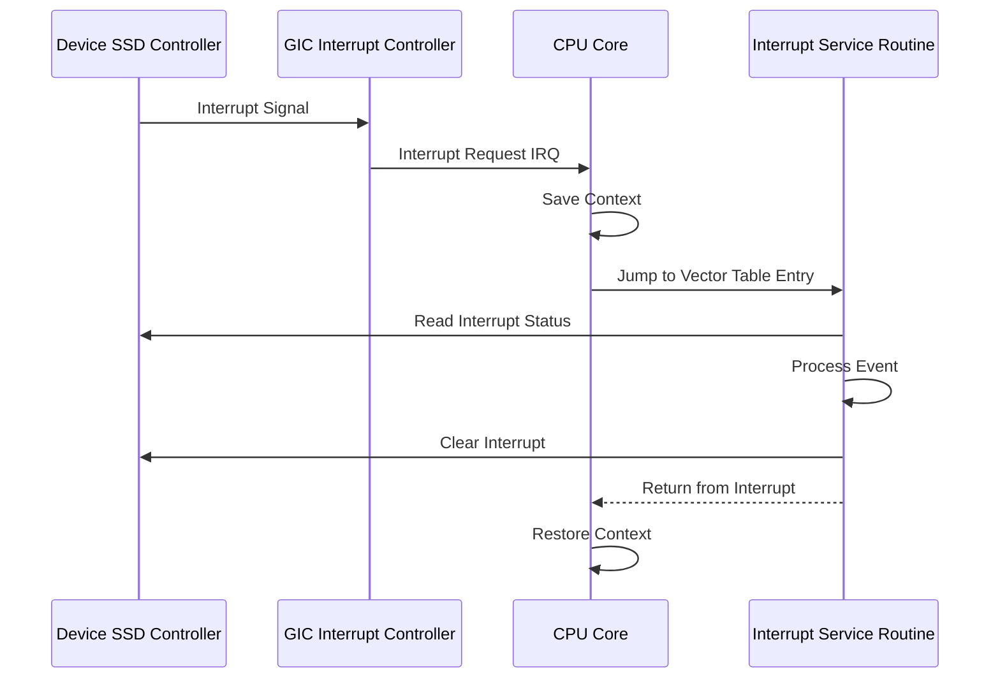

## Interrupt Handling Sequence

```mermaid
sequenceDiagram
    participant DEV as Device SSD Controller
    participant GIC as GIC Interrupt Controller
    participant CPU as CPU Core
    participant ISR as Interrupt Service Routine

    DEV->>GIC: Interrupt Signal
    GIC->>CPU: Interrupt Request IRQ

    CPU->>CPU: Save Context
    CPU->>ISR: Jump to Vector Table Entry

    ISR->>DEV: Read Interrupt Status
    ISR->>ISR: Process Event

    ISR->>DEV: Clear Interrupt
    ISR-->>CPU: Return from Interrupt

    CPU->>CPU: Restore Context
```
