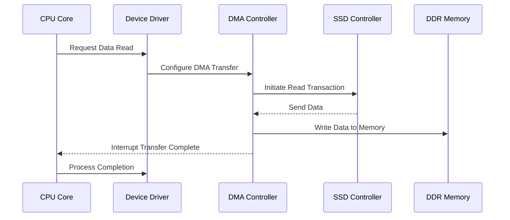

## DMA Transfer Flow

```mermaid
sequenceDiagram
    participant CPU as CPU Core
    participant DRV as Device Driver
    participant DMA as DMA Controller
    participant DEV as SSD Controller
    participant MEM as DDR Memory

    CPU->>DRV: Request Data Read
    DRV->>DMA: Configure DMA Transfer

    DMA->>DEV: Initiate Read Transaction
    DEV-->>DMA: Send Data

    DMA->>MEM: Write Data to Memory

    DMA-->>CPU: Interrupt Transfer Complete
    CPU->>DRV: Process Completion
```
