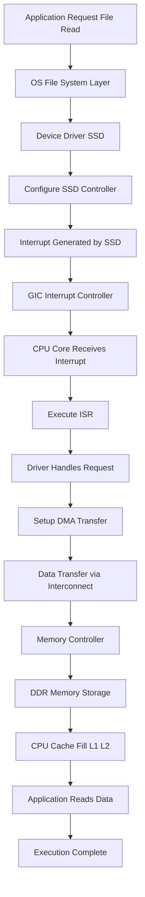
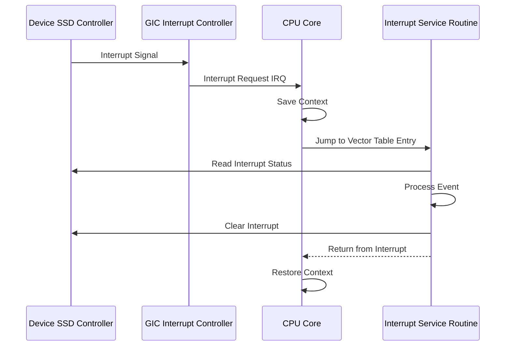
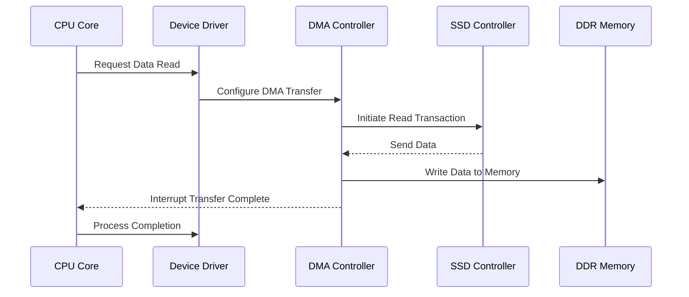
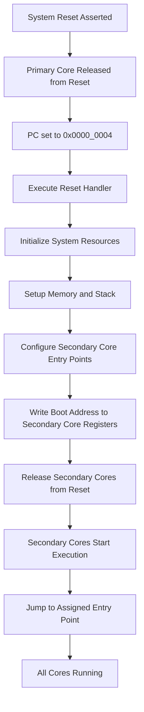

# ARMv8 SoC Architecture & Execution Flow

## 📌 Overview
This document describes the **execution flow in an ARMv8 SoC**, covering:
- Software to hardware interaction
- Interrupt (control path)
- Data movement (DMA + AXI)
- Multi-core CPU subsystem behavior

---

# 🧱 System Components

## CPU Subsystem
- Cortex-A cores (e.g., A53, A57)
- L1 / L2 caches
- Primary core handles boot

## Interconnect
- CCI / CMN / FlexNoC
- Enables communication between:
  - CPU
  - Memory
  - Peripherals

## Memory Subsystem
- DDR (LPDDR / DDR3 / DDR4)
- Memory controller + scheduler

## Interrupt Controller
- GIC (Generic Interrupt Controller)

## Peripheral Subsystem
- PCIe / SATA controllers
- SSD / USB / Ethernet devices

---

# 🔄 Full SoC Execution Flow

---

# ⚡ Interrupt Handling (Control Path)

---

# 🚀 DMA Transfer Flow (Data Path)

---

# 🔁 Boot Flow (Primary → Secondary Cores)

---

# 🧠 Execution Model Breakdown

## 1. Software → Hardware Interaction
- Application → OS → Driver → Hardware
- Uses memory-mapped I/O
- Drivers abstract hardware complexity

---

## 2. Control Path (Interrupts)
- Device signals CPU via interrupt
- Managed by GIC
- CPU executes ISR and resumes execution

---

## 3. Data Path (DMA + AXI)
- DMA handles bulk data transfer
- Data flows through AXI interconnect
- Stored in DDR memory
- CPU accesses via cache

---

# 🔗 How Everything Works Together

1. Application initiates request  
2. Driver configures hardware  
3. Device performs operation  
4. Interrupt notifies CPU  
5. DMA transfers data  
6. Data stored in memory  
7. CPU processes results  

---

# 🔑 Key Architectural Concepts

## Interrupt-driven Execution
- Eliminates polling
- Improves efficiency

## DMA (Direct Memory Access)
- Offloads CPU
- Enables high throughput

## Cache Coherency
- Maintains consistency across cores
- Uses ACE / CHI protocols

## AXI Interconnect
- High-speed communication backbone
- Supports parallel transactions

---

# 📊 Summary Table

| Path Type | Purpose | Components |
|----------|--------|-----------|
| Software → Hardware | Control and commands | App, OS, Driver |
| Control Path | Event signaling | GIC, ISR |
| Data Path | Data movement | DMA, AXI, Memory |

---

# 💡 Key Insights

- Control path handles **events**
- Data path handles **data movement**
- Both operate in parallel for performance
- Critical for:
  - Storage systems
  - Networking
  - High-performance computing

---

# 🚀 Real-World Relevance

Used in:
- Mobile SoCs (Qualcomm, Apple, Exynos)
- Embedded systems
- ARM server platforms (Neoverse)

Performance depends on:
- Interconnect efficiency
- DMA usage
- Cache coherency design
