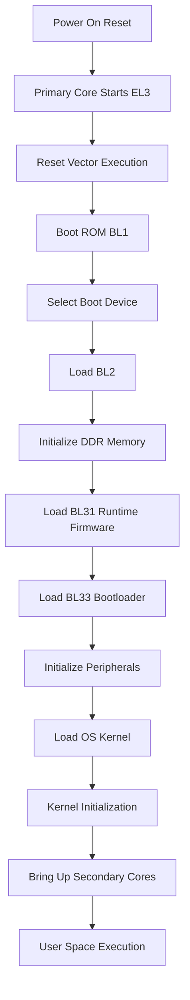
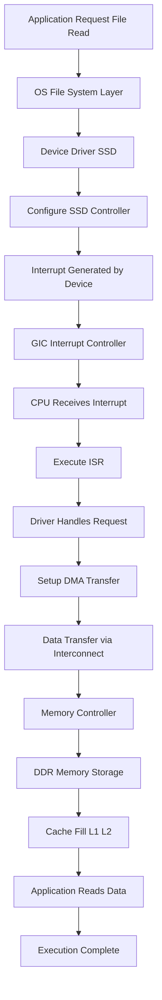
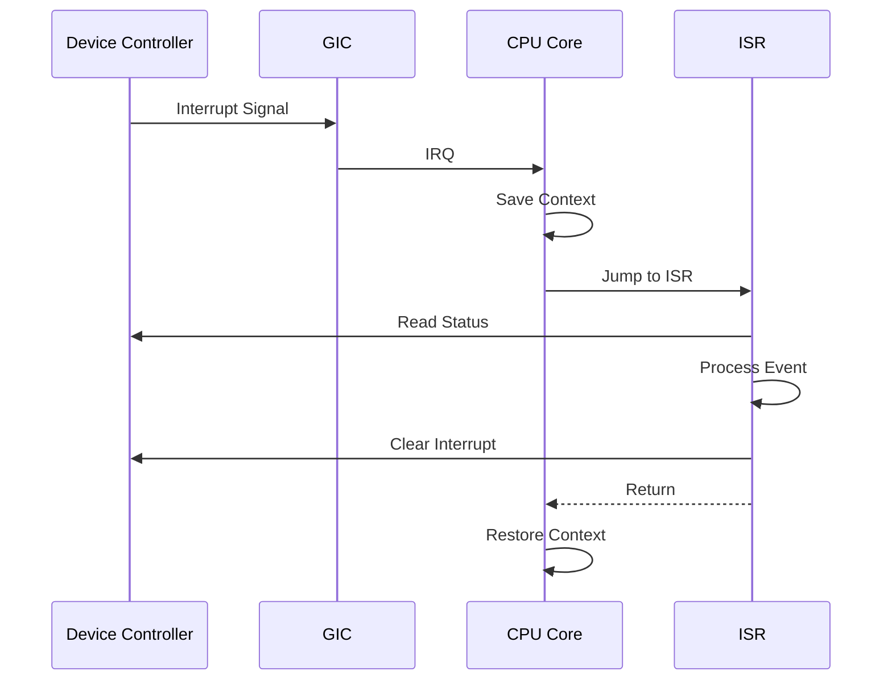
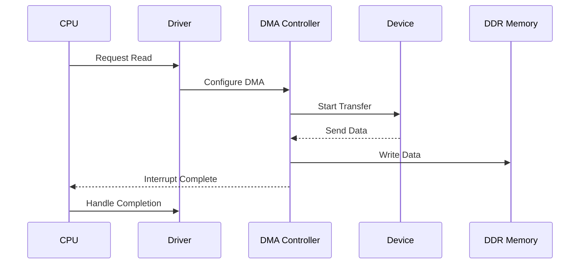
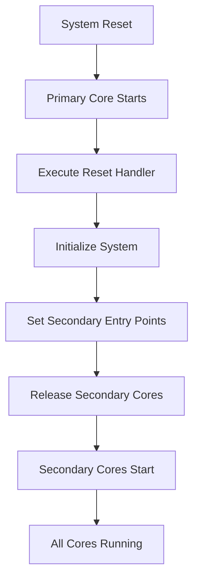

# ARMv8 SoC Architecture, Boot Flow & Execution Model

---

## 📌 Overview
This document provides a **complete understanding of ARMv8 SoC behavior**, including:
- Boot flow (from reset to OS)
- Software to hardware interaction
- Interrupt handling (control path)
- Data movement (DMA + AXI)
- Multi-core bring-up (big.LITTLE systems)

---

# 🧱 System Architecture

## CPU Subsystem
- ARM Cortex-A cores (A53, A57, etc.)
- L1 / L2 caches
- Big.LITTLE architecture
- One **primary core**, multiple **secondary cores**

## Interconnect
- CCI / CMN / NoC
- Connects CPU, memory, and peripherals

## Memory Subsystem
- DDR (LPDDR / DDR3 / DDR4)
- Memory controller + scheduler

## Interrupt Controller
- GIC (Generic Interrupt Controller)

## Peripheral Subsystem
- PCIe, SATA, USB, Ethernet
- Example: SSD controller

---

# ⚡ ARMv8 Boot Flow (Deep Dive)

## 1. Reset Event
- System reset asserted
- Only **primary core active**
- CPU starts in:
  - **EL3 (secure mode)**

### Initial State
- PC → Reset vector (0x0000_0000 or 0x0000_0004)
- Secondary cores held in reset

---

## 2. Boot ROM (BL1)
- First code executed (immutable)
- Responsibilities:
  - Basic hardware init (clock, SRAM)
  - Boot source selection
  - Load BL2

---

## 3. BL2 (Secondary Bootloader)
- Initializes:
  - DDR memory
  - Memory controller
- Loads:
  - BL31 (runtime firmware)
  - BL33 (bootloader)

---

## 4. BL31 (Runtime Firmware - EL3)
- Runs in EL3
- Responsibilities:
  - Secure monitor setup
  - GIC initialization
  - Power management (PSCI)

---

## 5. BL33 (Bootloader - e.g., U-Boot)
- Runs in non-secure world
- Responsibilities:
  - Initialize peripherals
  - Load OS kernel
  - Pass device tree

---

## 6. OS Kernel Boot
- Kernel initializes:
  - MMU
  - Scheduler
  - Drivers
- Mounts root filesystem

---

## 7. Secondary Core Bring-Up
- Primary core:
  - Sets entry point
  - Uses PSCI to wake cores
- Secondary cores join execution

---

# 🔄 Boot Flow Diagram

---

# 🔄 Full SoC Execution Flow

---

# ⚡ Interrupt Handling (Control Path)

---

# 🚀 DMA Transfer (Data Path)

---

# 🔁 Boot Flow (Primary → Secondary Cores)

---

# 🧠 Execution Model

## 1. Software → Hardware Interaction
- Application → OS → Driver → Hardware
- Uses memory-mapped I/O

---

## 2. Control Path (Interrupts)
- Device signals CPU via interrupt
- Managed by GIC
- CPU executes ISR

---

## 3. Data Path (DMA + AXI)
- DMA moves data
- AXI interconnect transfers data
- Stored in DDR

---

# 🔗 Combined Flow

1. Application initiates request  
2. Driver configures hardware  
3. Device performs operation  
4. Interrupt notifies CPU  
5. DMA transfers data  
6. Data stored in memory  
7. CPU processes results  

---

# 🔑 Key ARMv8 Concepts

## Exception Levels
| Level | Role |
|------|------|
| EL3 | Secure Monitor |
| EL2 | Hypervisor |
| EL1 | OS Kernel |
| EL0 | Applications |

---

## Important Mechanisms

### TrustZone
- Secure vs non-secure execution

### PSCI
- CPU power management and bring-up

### DMA
- Offloads CPU for data transfer

### Cache Coherency
- Maintains consistency across cores

---

# 💡 Key Insights

- Control path handles **events**
- Data path handles **data movement**
- Boot flow initializes entire system
- All operate together for performance

---

# 🚀 Real-World Usage

Used in:
- Mobile SoCs (Qualcomm, Apple, Exynos)
- Embedded systems
- ARM servers (Neoverse)

Performance depends on:
- Interconnect efficiency
- DMA usage
- Cache coherency
- Boot optimization
