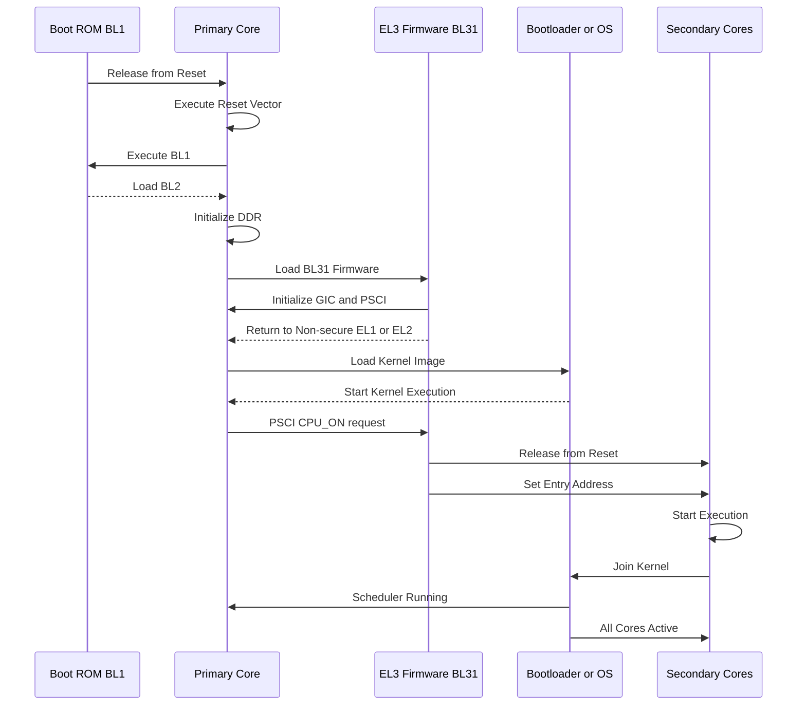

# ARMv8 Multi-Core Boot Flow (Detailed)

---

## 📌 Overview
This section explains how **multiple CPU cores boot in an ARMv8 system**, starting from reset to full multi-core (SMP) operation.

- Only the **primary core boots initially**
- Secondary cores are **held in reset or low-power state**
- Firmware uses **PSCI** to bring up other cores

---

# 🔰 Boot Phases

## 1. Reset Phase
- System reset is asserted
- Only **primary core (Core 0)** is released
- Secondary cores remain:
  - In reset OR
  - In WFI (Wait For Interrupt)

### Initial CPU State
- Execution starts at:
  - Reset vector (`0x0000_0000` or `0x0000_0004`)
- CPU runs in:
  - **EL3 (Secure state)**

---

## 🧱 2. Boot ROM (BL1)
- First code executed by primary core
- Responsibilities:
  - Minimal hardware initialization
  - Boot device selection
  - Load BL2

---

## 🧠 3. BL2 (Secondary Bootloader)
- Initializes:
  - DDR memory
  - Memory controller
- Loads:
  - BL31 (runtime firmware)
  - BL33 (bootloader or OS loader)

---

## 🔐 4. BL31 (EL3 Runtime Firmware)
- Runs in **EL3**
- Responsibilities:
  - Initialize **GIC (interrupt controller)**
  - Setup **PSCI interface**
  - Configure secure environment

---

## 🌍 5. BL33 (Bootloader / OS Loader)
- Runs in **non-secure EL1 or EL2**
- Responsibilities:
  - Load OS kernel
  - Setup device tree
  - Start kernel execution

---

## 🐧 6. OS Boot (Primary Core)
- Kernel initializes:
  - MMU
  - Scheduler
  - Drivers
- Runs only on **primary core initially**

---

## 🔁 7. Secondary Core Bring-Up (SMP Initialization)

### Step-by-step:

#### Step 1: Prepare Secondary Core Entry
- Primary core sets:
  - Entry address for secondary cores
  - Typically kernel secondary startup routine

#### Step 2: PSCI Call
- Primary core issues:
  - `PSCI_CPU_ON` request

#### Step 3: Firmware Action
- EL3 firmware:
  - Powers on secondary core
  - Releases it from reset
  - Sets program counter

#### Step 4: Secondary Core Start
- Secondary core:
  - Starts execution from given entry point
  - Initializes its local state

#### Step 5: Join OS
- Secondary cores:
  - Join scheduler
  - Participate in SMP execution

---

# 🔄 Multi-Core Boot Sequence Diagram

---

# 🔑 Key Concepts

## PSCI (Power State Coordination Interface)
- Standard ARM interface for:
  - CPU_ON
  - CPU_OFF
  - Power management

---

## Exception Levels
| Level | Role |
|------|------|
| EL3 | Secure Monitor |
| EL2 | Hypervisor |
| EL1 | OS Kernel |
| EL0 | Applications |

---

## Important Behavior
- Secondary cores **do not boot automatically**
- They require:
  - Software trigger (PSCI)
  - Entry address setup

---

# 💡 Key Insights

- Boot is **sequential for primary core**
- Multi-core enable is **software controlled**
- EL3 firmware plays a **critical role**
- Proper initialization ensures:
  - Cache coherency
  - Interrupt handling
  - SMP operation

---

# 🚀 Real-World Relevance

Used in:
- Mobile SoCs (big.LITTLE systems)
- Embedded platforms
- ARM servers (Neoverse)

Performance depends on:
- Boot efficiency
- Core bring-up latency
- Firmware design
