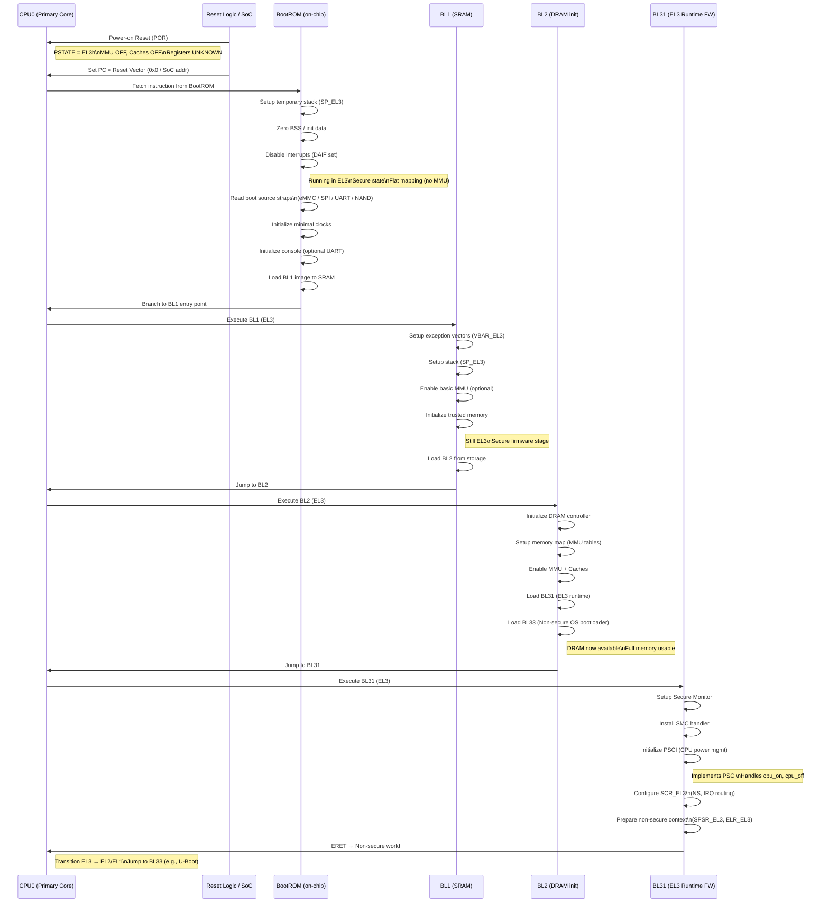

```mermaid
sequenceDiagram
    participant CPU0 as CPU0 (Primary Core)
    participant SoC as Reset Logic / SoC
    participant ROM as BootROM (on-chip)
    participant BL1 as BL1 (SRAM)
    participant BL2 as BL2 (DRAM init)
    participant BL31 as BL31 (EL3 Runtime FW)

    %% ================= RESET =================
    SoC->>CPU0: Power-on Reset (POR)
    Note right of CPU0: PSTATE = EL3h\nMMU OFF, Caches OFF\nRegisters UNKNOWN

    SoC->>CPU0: Set PC = Reset Vector (0x0 / SoC addr)
    CPU0->>ROM: Fetch instruction from BootROM

    %% ================= BOOT ROM =================
    ROM->>ROM: Setup temporary stack (SP_EL3)
    ROM->>ROM: Zero BSS / init data
    ROM->>ROM: Disable interrupts (DAIF set)

    Note right of ROM: Running in EL3\nSecure state\nFlat mapping (no MMU)

    ROM->>ROM: Read boot source straps\n(eMMC / SPI / UART / NAND)
    ROM->>ROM: Initialize minimal clocks
    ROM->>ROM: Initialize console (optional UART)

    %% ================= LOAD BL1 =================
    ROM->>ROM: Load BL1 image to SRAM
    ROM->>CPU0: Branch to BL1 entry point

    %% ================= BL1 =================
    CPU0->>BL1: Execute BL1 (EL3)
    BL1->>BL1: Setup exception vectors (VBAR_EL3)
    BL1->>BL1: Setup stack (SP_EL3)
    BL1->>BL1: Enable basic MMU (optional)
    BL1->>BL1: Initialize trusted memory

    Note right of BL1: Still EL3\nSecure firmware stage

    BL1->>BL1: Load BL2 from storage
    BL1->>CPU0: Jump to BL2

    %% ================= BL2 =================
    CPU0->>BL2: Execute BL2 (EL3)
    BL2->>BL2: Initialize DRAM controller
    BL2->>BL2: Setup memory map (MMU tables)
    BL2->>BL2: Enable MMU + Caches

    BL2->>BL2: Load BL31 (EL3 runtime)
    BL2->>BL2: Load BL33 (Non-secure OS bootloader)

    Note right of BL2: DRAM now available\nFull memory usable

    BL2->>CPU0: Jump to BL31

    %% ================= BL31 =================
    CPU0->>BL31: Execute BL31 (EL3)
    BL31->>BL31: Setup Secure Monitor
    BL31->>BL31: Install SMC handler

    BL31->>BL31: Initialize PSCI (CPU power mgmt)
    Note right of BL31: Implements PSCI\nHandles cpu_on, cpu_off

    BL31->>BL31: Configure SCR_EL3\n(NS, IRQ routing)

    BL31->>BL31: Prepare non-secure context\n(SPSR_EL3, ELR_EL3)

    %% ================= HANDOFF =================
    BL31->>CPU0: ERET → Non-secure world
    Note right of CPU0: Transition EL3 → EL2/EL1\nJump to BL33 (e.g., U-Boot)
```
