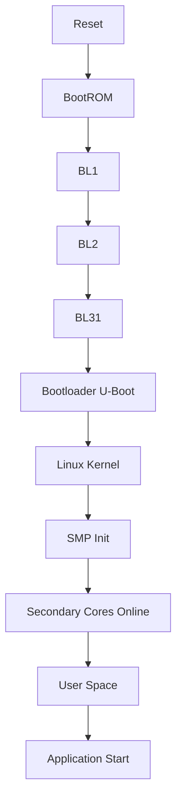
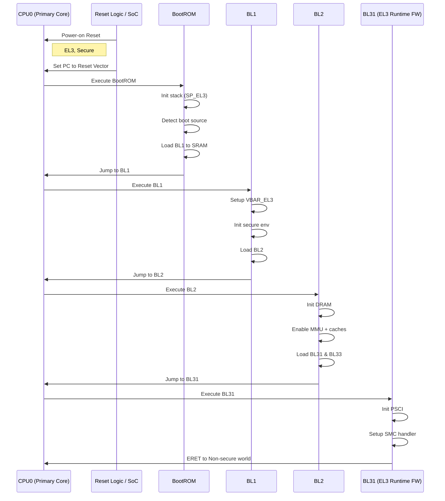
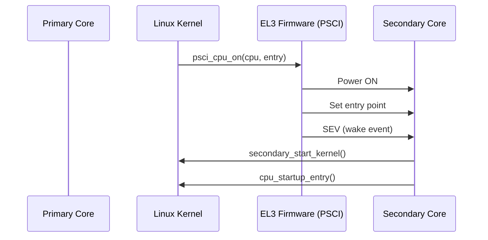
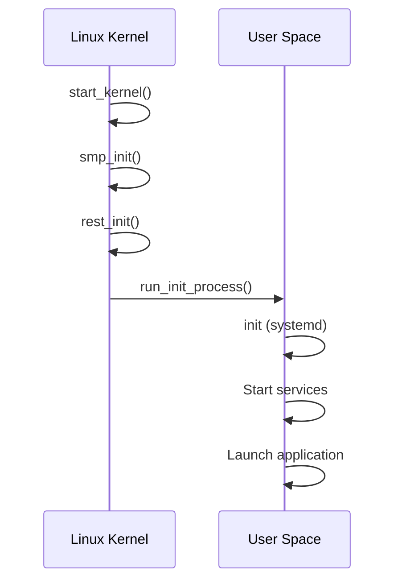

# ARMv8 Boot Flow – Primary Core to Application (Detailed Guide)

This document explains the complete boot flow in ARMv8-A architecture, starting from reset on the primary core (CPU0) all the way to application start, including firmware stages and multi-core bring-up.

---

# 🧭 1. Overview

* Architecture: ARMv8-A
* Initial execution level: EL3 (Secure)
* Only **primary core (CPU0)** starts execution after reset
* Secondary cores remain in reset or low-power state (WFE)

---

# 🔁 2. High-Level Boot Flow

---

# 🔬 3. Detailed Sequence Diagram (Primary Core → Firmware)

---

# 🧠 4. Key Concepts

## Exception Levels

| Level | Description               |
| ----- | ------------------------- |
| EL3   | Secure Monitor (Firmware) |
| EL2   | Hypervisor (optional)     |
| EL1   | OS Kernel                 |
| EL0   | User Applications         |

---

## Important Registers (EL3)

* `VBAR_EL3` – Exception vector base
* `SCR_EL3` – Secure configuration
* `SPSR_EL3` – Saved program state
* `ELR_EL3` – Return address after ERET

---

# 🔥 5. Secondary Core Bring-Up (SMP)

---

# 🐧 6. Kernel to User Space

---

# ⚡ 7. Summary

* Boot starts in EL3 on primary core
* Firmware initializes system and loads next stages
* Kernel boots on CPU0 first
* Secondary CPUs are brought up using PSCI
* System becomes SMP
* User space starts and applications run

---

# 🎯 Mental Model

* CPU0 = Boot orchestrator
* EL3 firmware = Power & security controller
* Kernel = System manager
* Secondary CPUs = Workers
* User space = Applications

---

# 📌 Notes

* Some systems may use spin-table instead of PSCI
* EL2 is optional (used for virtualization)
* Boot flow may vary slightly by SoC vendor

---

End of Document
