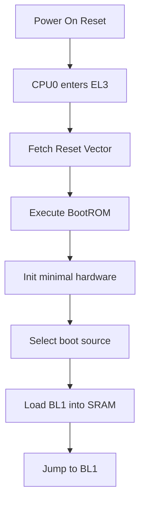
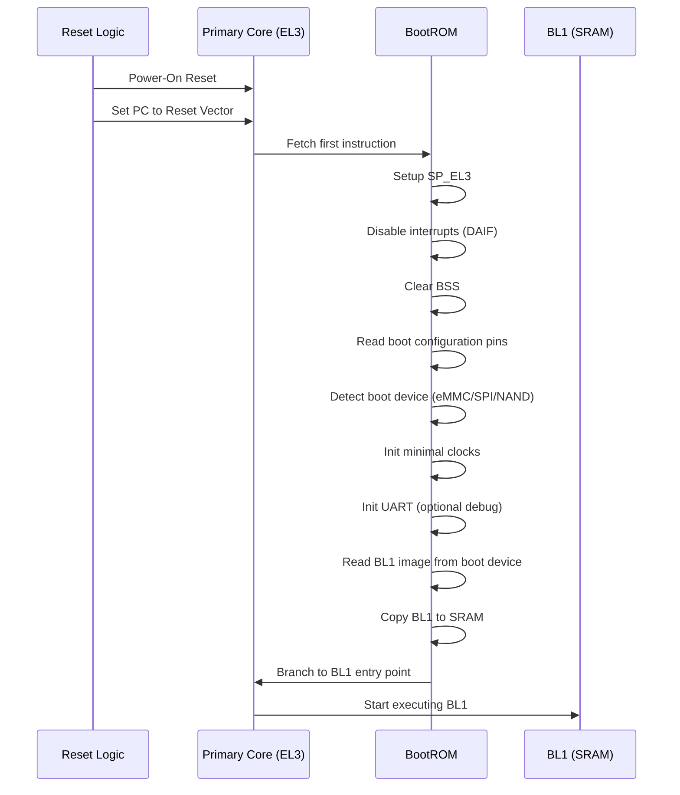
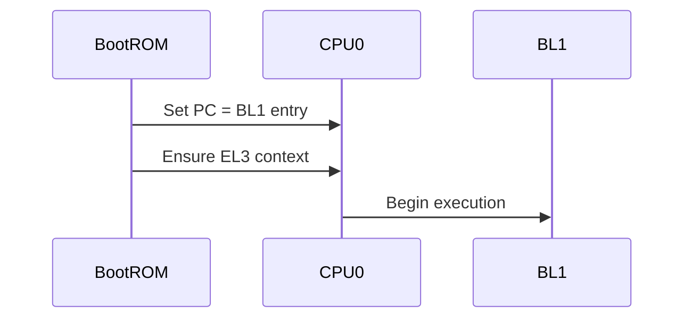

# ARMv8 Boot Flow: BootROM → BL1 (Deep Dive)

This document explains in detail how the Primary Core (CPU0) boots from reset through BootROM and transitions into BL1 in ARMv8-A systems.

---

# 🧭 1. Initial Conditions (After Reset)

* Only CPU0 (primary core) is active
* Execution starts in EL3 (Secure state)
* MMU: OFF
* Caches: OFF
* Stack pointer: Undefined

Key registers state:

* PC → Reset Vector (platform-specific address)
* PSTATE → EL3h
* SCR_EL3 → default reset value

---

# 🔁 2. High-Level Flow

---

# 🔬 3. Detailed Sequence Diagram

---

# 🧠 4. BootROM Responsibilities (In Depth)

BootROM is immutable code inside the SoC.

### Responsibilities:

1. Establish minimal execution environment
2. Determine boot source
3. Load first-stage firmware (BL1)

---

## 🔧 4.1 Stack Initialization

* BootROM sets SP_EL3
* Uses on-chip SRAM or internal memory

---

## 🔌 4.2 Boot Source Selection

BootROM reads:

* Hardware straps (pins)
* eFuses (configuration)

Common boot sources:

* eMMC
* SPI NOR/NAND
* SD Card
* UART (fallback recovery)

---

## ⚙️ 4.3 Minimal Hardware Init

BootROM typically initializes:

* Clock system (basic)
* Pin multiplexing (minimal)
* Debug UART (optional)

---

## 📦 4.4 Loading BL1

Steps:

1. Read BL1 image from boot device
2. Validate image (optional signature check)
3. Copy to SRAM
4. Prepare entry address

---

# 🔥 5. Transition to BL1

---

# 🧩 6. BL1 Entry State

When BL1 starts:

* Running in EL3
* Secure state
* Stack initialized
* MMU usually OFF (platform dependent)

BL1 responsibilities:

* Setup exception vectors (VBAR_EL3)
* Initialize secure memory
* Load BL2

---

# ⚡ 7. Key Registers Involved

| Register | Purpose                |
| -------- | ---------------------- |
| SP_EL3   | Stack pointer for EL3  |
| VBAR_EL3 | Exception vector base  |
| SCR_EL3  | Secure config register |
| SPSR_EL3 | Saved state for ERET   |
| ELR_EL3  | Return address         |

---

# 🎯 8. Summary

* CPU0 starts execution in EL3 from reset vector
* BootROM initializes minimal environment
* BootROM selects boot source and loads BL1 into SRAM
* Control is transferred to BL1

---

# 🧠 Mental Model

RESET → BootROM → Load BL1 → Jump to BL1

* BootROM = immutable loader
* BL1 = first programmable firmware stage

---

End of Document
